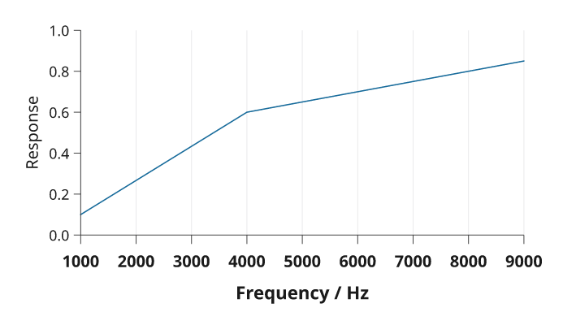

# Axes, scales and text

Scales map your values into physical plot coordinates. Axes use those same
scales, then reserve space for tick labels and axis names. Cartesian y increases
upward. Plot dimensions and text sizes are in millimetres; strings such as
`'8pt'` work for physical lengths too.

## Choose coordinates

| Data | Scale |
| --- | --- |
| Numeric values | `x=(0, 10)` or `i.linear((0, 10))` |
| Positive values spanning orders of magnitude | `i.log((1, 1000))` |
| Values on either side of zero with a compressed outer range | `i.symlog((-100, 100))` |
| Named categories | `x=['Control', 'Treatment']` or a shared category scale |
| Dates and times | `i.dates((start, end))` |
| A deliberate omission in a numeric range | `i.broken(...)`; disclose the break in the caption |

Numeric domain limits do not clip marks automatically. Set `clip=True` on the
plot when marks should stop at its boundary. A categorical y scale starts at the
bottom; reverse the category order for top-to-bottom reading.

## Tick labels

`count=5` requests approximately five intervals. `ticks=[...]` specifies values
explicitly. `format` accepts a callable, a format string such as `'{:.1f}'`, or a
suffix. `si=True` formats a shared SI prefix. Date axes can include an offset
label such as the year; `offset=False` suppresses it.

Continuous scales thin labels when needed. Category labels remain visible by
default. Pass `thin=False` to keep every requested tick, or `thin=True` to allow
thinning. `rotate=45` rotates tick labels anticlockwise; it does not rotate the
axis name. `labels=False` keeps rules and ticks on an interior shared axis.

## Measured typography

The development branch measures font overrides before thinning and layout.
`font_size` sets the base size for text and spacing; `tick_font_size` and
`label_font_size` control those roles independently. `font_family`, `font_weight`
and `font_style` select the measured face. Explicit prebuilt axis-label diagrams
keep their authored size.

```python
import inklet as i

p = i.plot_spec(x=(1000, 9000), y=(0, 1), height=40)
p.line([(1000, .1), (4000, .6), (9000, .85)], stroke='#176b9b')
x_ticks = {'count': 8, 'font_size': '9pt', 'font_weight': 'bold'}
p.grid(y=False, x_options=x_ticks)
p.axis('bottom', label='Frequency / Hz', label_font_size='10pt', **x_ticks)
p.axis('left', label='Response', tick_font_size='8pt', label_font_size='9pt')
doc = i.document(width=110)
doc.add('response', p)
doc.save('axes.svg', 'axes.pdf')
```



*Rendered from the code above.*

Pass the same tick-selection options to `grid(x_options=..., y_options=...)`
and the corresponding axis to keep gridlines aligned with the ticks that remain
visible. These dictionaries accept `tick_values()` options; axis-only settings
such as `label` or `tick_size` do not belong in them. Grid styling, for example
`stroke`, remains a separate keyword.

Colorbars accept the same font sizes and face overrides. A large tick label can
cause fewer values to be shown; use a longer bar or explicit ticks if needed.
Text is never reduced to make the labels fit.

## More than one scale

Use shared scales for panels that should be compared directly. A secondary axis
from `twin_y()` or `twin_x()` has an independent scale; colour it to identify its
series and label its units. See [plotting](plotting.md) for a complete example,
[layout](layout.md) for shared axes, and [advanced controls](publication-plots.md)
for categorical groups and external insets.
