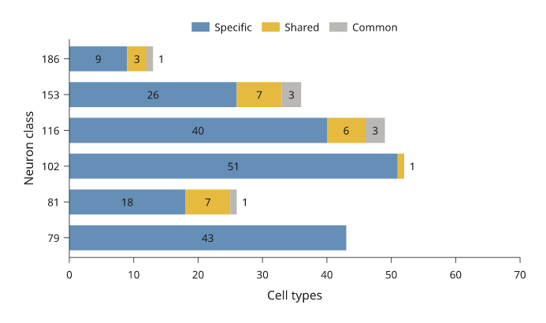
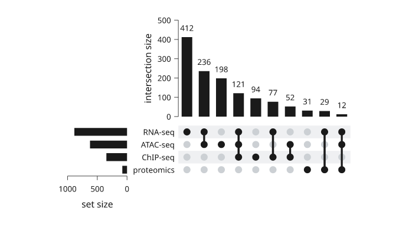

# Bars and areas

Bars compare values at category or numeric positions. Areas show the extent
between a curve and a baseline or between two curves. Use stacked displays only
when adding the contributions has a stated meaning.

All values below are illustrative. Each snippet can be run independently with
core Inklet; PNG preview generation additionally uses the `render` extra.
Run a block from the repository root with `.venv/bin/python`; each block writes
an SVG and PDF that can be opened without a notebook.

Choose bars when a common baseline makes lengths comparable. For many
categories or small differences, a dot or line often preserves comparisons
more clearly.

## Categorical bars

Compare values across named categories.
`bar_colors` maps colours to individual bars; `colors` maps colours to series
in grouped or stacked bars. Declare a suitable baseline explicitly.

```python
import inklet as i

conditions = ['Baseline', 'Filter', 'Tune', 'Combined']
p = i.plot_spec(x=conditions, y=(0, 100), height=45)
p.grid(x=False, count=4, stroke='#e1e7e4', stroke_width=.15)
p.bars(conditions, [42, 53, 61, 78], width=.62,
       bar_colors=['#a7c1ca', '#a7c1ca', '#a7c1ca', '#288675'], stroke='none')
p.axes(y='Recovery / %', y_options={'ticks': [0, 25, 50, 75, 100]})
doc = i.document(width=110)
doc.add('bars', p)
doc.save('bars.svg', 'bars.pdf')
```


*Four illustrative processing variants, with the combined variant highlighted. Every bar starts at zero.*

## Grouped bars

Grouped bars compare several series within each category.
The outer list of heights is series-major. Keep the same category order across
series and use the legend to identify them.

```python
import inklet as i

days = ['Mon', 'Tue', 'Wed', 'Thu']
p = i.plot_spec(x=days, y=(0, 80), height=45)
p.grid(x=False, count=4, stroke='#e1e7e4', stroke_width=.15)
p.bars(days, [[32, 40, 36, 46], [45, 54, 51, 65]], grouped=True,
       width=.7, gap=.18, colors=['#24698c', '#288675'],
       names=['Control', 'Treated'], stroke='none')
p.axes(y='Yield / mg').legend(side='bottom')
doc = i.document(width=110)
doc.add('grouped-bars', p)
doc.save('grouped-bars.svg', 'grouped-bars.pdf')
```


*Control and Treated compared within four days. The same series colours are used throughout the plotting guides.*

## Stacked bars

Stacked bars show each contribution and the total at each category.
Values are supplied per series. For contributions that are difficult to compare
without a common baseline, consider grouped bars instead.

```python
import inklet as i

periods = ['Q1', 'Q2', 'Q3', 'Q4']
p = i.plot_spec(x=periods, y=(0, 110), height=45)
p.grid(x=False, count=4, stroke='#e1e7e4', stroke_width=.15)
p.bars(periods, [[38, 30, 20, 15], [24, 22, 28, 32], [18, 26, 36, 45]],
       stacked=True, width=.6, colors=['#24698c', '#288675', '#b86443'],
       names=['Grid', 'Wind', 'Solar'], stroke='none')
p.axes(y='Energy / kWh').legend(side='bottom')
doc = i.document(width=110)
doc.add('stacked-bars', p)
doc.save('stacked-bars.svg', 'stacked-bars.pdf')
```


*Illustrative quarterly energy contributions. The stacked height is the total; the legend identifies each source.*

## Horizontal bars

Horizontal bars give category labels more room.
The first categorical y value is at the bottom. Reverse the category order
when the first label should appear at the top.

```python
import inklet as i

sites = ['South site', 'Hilltop', 'Riverside', 'Central site', 'North site']
p = i.plot_spec(x=(0, 100), y=sites, height=48)
p.grid(y=False, count=4, stroke='#e1e7e4', stroke_width=.15)
p.bars(sites, [46, 58, 67, 74, 86], orient='h', width=.55,
       bar_colors=['#a7c1ca'] * 4 + ['#288675'], stroke='none')
p.axes(x='Coverage / %', x_options={'ticks': [0, 25, 50, 75, 100]})
doc = i.document(width=115)
doc.add('horizontal-bars', p)
doc.save('horizontal-bars.svg', 'horizontal-bars.pdf')
```


*Five illustrative sites ordered by coverage, with the largest value at the top. Horizontal bars leave room for the full site names.*

## Filled areas

Fill the region between a curve and a stated baseline.
Declare the area before an overlaid line so the outline remains visible.

```python
import math
import inklet as i

points = [(t := n / 4, 1.5 + 6 * math.exp(-((t - 14) / 4.5) ** 2))
          for n in range(97)]
p = i.plot_spec(x=(0, 24), y=(0, 9), height=45)
p.grid(x=False, count=4, stroke='#e1e7e4', stroke_width=.15)
p.fill(points, baseline=0, fill='#c8dfd7', stroke='none')
p.line(points, stroke='#288675', stroke_width=.45)
p.axes(x='Time / h', y='Demand / kW', x_options={'ticks': [0, 6, 12, 18, 24]})
doc = i.document(width=110)
doc.add('fill', p)
doc.save('fill.svg', 'fill.pdf')
```


*An illustrative daily demand profile filled down to zero. The line traces the supplied samples.*

## Between curves

Fill a region between two supplied curves.
`fill_between` takes absolute y coordinates. A coloured region alone does not
imply uncertainty; describe the meaning of the two boundaries.
The x values must be shared by both boundaries. Sort them before drawing so the
polygon does not fold back over itself.

```python
import math
import inklet as i

x = [n / 4 for n in range(49)]
lower = [1 + .12 * t + .3 * math.sin(t / 2) for t in x]
upper = [a + 2 + .5 * math.cos(t / 3) for t, a in zip(x, lower)]
p = i.plot_spec(x=(0, 12), y=(0, 6), height=45)
p.grid(x=False, count=4, stroke='#e1e7e4', stroke_width=.15)
p.fill_between(x, lower, upper, fill='#dae6e7', stroke='none')
p.line(list(zip(x, lower)), name='Floor', stroke='#24698c', stroke_width=.4)
p.line(list(zip(x, upper)), name='Ceiling', stroke='#288675', stroke_width=.4)
p.axes(x='Position / mm', y='Height / mm').legend(side='bottom')
doc = i.document(width=110)
doc.add('fill-between', p)
doc.save('fill-between.svg', 'fill-between.pdf')
```


*The region between a channel floor and ceiling. These are geometric boundaries, not an uncertainty band.*

## Stacked areas

Stacked areas accumulate nonnegative series over x.
Values are series-major; each series must contain one value per x coordinate.
For signed regions, calculate the boundaries and use `fill_between` explicitly.
Stacking makes the total easy to read but makes interior series hard to compare;
use a common baseline when comparing a component across x or groups.

```python
import math
import inklet as i

hours = [n / 2 for n in range(49)]
grid = [2.4 + .4 * math.cos(t / 4) for t in hours]
wind = [1.6 + .6 * math.sin(t / 3) for t in hours]
solar = [4 * max(0, math.sin(math.pi * (t - 6) / 12)) if 6 < t < 18 else 0
         for t in hours]
p = i.plot_spec(x=(0, 24), y=(0, 10), height=45)
p.grid(x=False, count=4, stroke='#e1e7e4', stroke_width=.15)
p.stackarea(hours, [grid, wind, solar],
            colors=['#24698c', '#288675', '#b86443'],
            names=['Grid', 'Wind', 'Solar'], stroke='none')
p.axes(x='Time / h', y='Power / kW', x_options={'ticks': [0, 6, 12, 18, 24]})
p.legend(side='bottom')
doc = i.document(width=110)
doc.add('stackarea', p)
doc.save('stackarea.svg', 'stackarea.pdf')
```


*Illustrative grid, wind and solar power over one day. The total height is their sum; the colour mapping matches the stacked-bar example.*

## Bar value labels

`labels=` writes each value on its bar. `True` writes the number; a format
string such as `"{:.0f}%"`, a function or a list of strings in the shape of
the heights sets the text. With the default `label_position="auto"` a label
goes inside its bar when it fits and past the end of the bar when it does
not. Inside labels are set in the ink or paper colour, whichever has more
contrast with the bar.

In a stacked bar only the last segment has a free end. A segment label that
does not fit inside its segment is left out, not shrunk; the omitted labels
are listed in the label node's `bar_labels` note.

```python
import inklet as i

cells = ['79', '81', '102', '116', '153', '186']
specific = [43, 18, 51, 40, 26, 9]
shared = [0, 7, 1, 6, 7, 3]
common = [0, 1, 0, 3, 3, 1]
p = i.plot_spec(x=(0, 70), y=cells, height=44)
p.bars(cells, [specific, shared, common], stacked=True, orient='h',
       width=.7, colors=['#668fb8', '#e6b93f', '#b9b8b4'],
       names=['Specific', 'Shared', 'Common'], labels=True, stroke='none')
p.axes(x='Cell types', y='Neuron class').legend(side='top')
doc = i.document(width=110)
doc.add('bar-labels', p)
doc.save('bar-labels.svg', 'bar-labels.pdf')
```



*Illustrative counts. Segments too short for their count carry no label;
the last segment of each bar may place its label past the bar end.*

## Set intersections (UpSet)

`i.upset` draws an UpSet plot. Each column is one exclusive intersection:
the elements that are in exactly the marked sets. The bar above a column is
the size of that intersection. In the matrix below, a dark dot marks a set
in the intersection and a pale dot a set outside it, and a line joins the
dark dots. The bars at the left are the set sizes, counted over all the data.

Pass a mapping of set name to members, `{'RNA-seq': genes_a, 'ATAC-seq':
genes_b}`, or a list of `(members, count)` records as below. `sort='size'`
(default) puts the largest intersection first; `sort='degree'` puts the
intersections of fewer sets first. `min_size=` drops smaller intersections
and `max_intersections=` keeps only the first ones after sorting. The dropped
intersections are listed in the diagram's `upset` note, and
`inklet.plot.upset_layout` returns the same counts without drawing.

The result is one diagram built from three panels on shared band scales, so
each bar stands over its matrix column. Add it to a figure or a document like
a panel.

```python
import inklet as i

hits = [(('RNA-seq',), 412), (('RNA-seq', 'ATAC-seq'), 236), (('ATAC-seq',), 198),
        (('RNA-seq', 'ATAC-seq', 'ChIP-seq'), 121), (('ChIP-seq',), 94),
        (('RNA-seq', 'ChIP-seq'), 77), (('ATAC-seq', 'ChIP-seq'), 52),
        (('proteomics',), 31), (('RNA-seq', 'proteomics'), 29),
        (('RNA-seq', 'ATAC-seq', 'proteomics'), 12), (('ChIP-seq', 'proteomics'), 4),
        (('ATAC-seq', 'proteomics'), 3)]
plot = i.upset(hits, min_size=5, labels=True)
doc = i.document(width=110)
doc.add('upset', plot)
doc.save('upset.svg', 'upset.pdf')
```



*Illustrative gene counts. The two intersections smaller than 5 are
dropped; the set sizes at the left still count them.*

## Next steps

[Compare plot types](plot-types.md), configure [axes and scales](axes-and-scales.md),
or [arrange several panels](layout.md). For exact options, see the [API](api.md).
