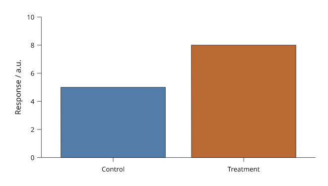
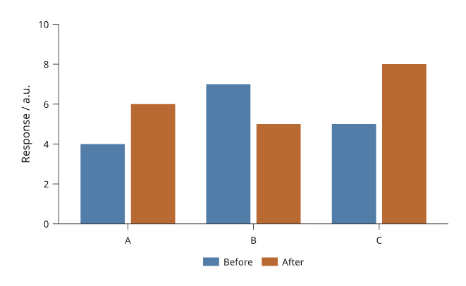
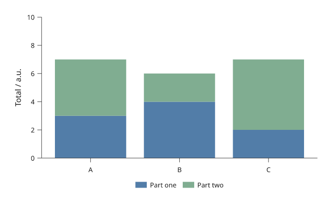
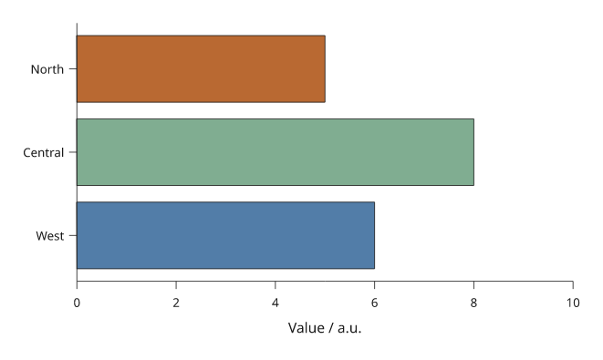
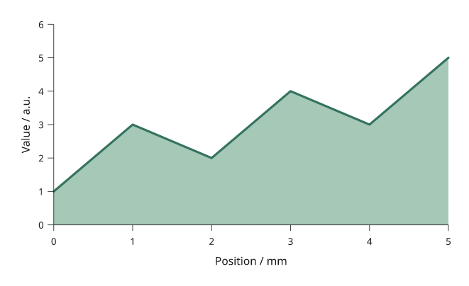
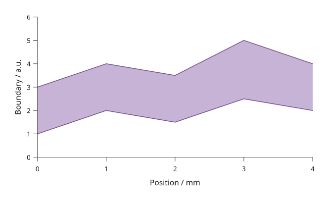
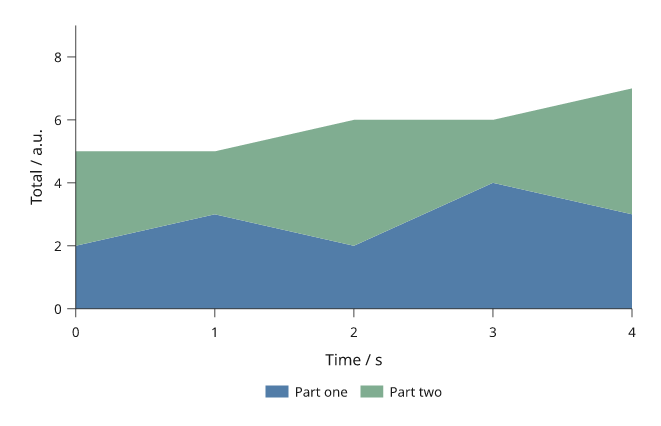

# Bars and areas

Bars compare values at category or numeric positions. Areas show the extent
between a curve and a baseline or between two curves. Use stacked displays only
when adding the contributions has a stated meaning.

All values below are illustrative. Each snippet can be run independently with
core Inklet; PNG preview generation additionally uses the `render` extra.

## Categorical bars

Compare values across named categories.
`bar_colors` maps colours to individual bars; `colors` maps colours to series
in grouped or stacked bars. Declare a suitable baseline explicitly.

```python
import inklet as i
p = i.plot_spec(x=['Control', 'Treatment'], y=(0, 10), height=45)
p.bars(['Control', 'Treatment'], [5, 8],
       bar_colors=['#527da8', '#b96932'])
p.axes(y='Response / a.u.')
doc = i.document(width=105)
doc.add('bars', p)
doc.save('bars.svg', 'bars.pdf')
```



*Rendered from the code above.*

## Grouped bars

Grouped bars compare several series within each category.
The outer list of heights is series-major. Keep the same category order across
series and use the legend to identify them.

```python
import inklet as i
p = i.plot_spec(x=['A', 'B', 'C'], y=(0, 10), height=45)
p.bars(['A', 'B', 'C'], [[4, 7, 5], [6, 5, 8]], grouped=True,
       colors=['#527da8', '#b96932'], names=['Before', 'After'])
p.axes(y='Response / a.u.').legend(side='bottom')
doc = i.document(width=105)
doc.add('grouped-bars', p)
doc.save('grouped-bars.svg', 'grouped-bars.pdf')
```



*Rendered from the code above.*

## Stacked bars

Stacked bars show each contribution and the total at each category.
Values are supplied per series. For contributions that are difficult to compare
without a common baseline, consider grouped bars instead.

```python
import inklet as i
p = i.plot_spec(x=['A', 'B', 'C'], y=(0, 10), height=45)
p.bars(['A', 'B', 'C'], [[3, 4, 2], [4, 2, 5]], stacked=True,
       colors=['#527da8', '#80ad91'], names=['Part one', 'Part two'])
p.axes(y='Total / a.u.').legend(side='bottom')
doc = i.document(width=105)
doc.add('stacked-bars', p)
doc.save('stacked-bars.svg', 'stacked-bars.pdf')
```



*Rendered from the code above.*

## Horizontal bars

Horizontal bars give category labels more room.
The first categorical y value is at the bottom. Reverse the category order
when the first label should appear at the top.

```python
import inklet as i
p = i.plot_spec(x=(0, 10), y=['West', 'Central', 'North'], height=45)
p.bars(['West', 'Central', 'North'], [6, 8, 5], orient='h',
       bar_colors=['#527da8', '#80ad91', '#b96932'])
p.axes(x='Value / a.u.')
doc = i.document(width=105)
doc.add('horizontal-bars', p)
doc.save('horizontal-bars.svg', 'horizontal-bars.pdf')
```



*Rendered from the code above.*

## Filled areas

Fill the region between a curve and a stated baseline.
Declare the area before an overlaid line so the outline remains visible.

```python
import inklet as i
p = i.plot_spec(x=(0, 5), y=(0, 6), height=45)
points = [(0, 1), (1, 3), (2, 2), (3, 4), (4, 3), (5, 5)]
p.fill(points, baseline=0, fill='#a5c8b7', stroke='none')
p.line(points, stroke='#34735f', stroke_width=.5)
p.axes(x='Position / mm', y='Value / a.u.')
doc = i.document(width=105)
doc.add('fill', p)
doc.save('fill.svg', 'fill.pdf')
```



*Rendered from the code above.*

## Between curves

Fill a region between two supplied curves.
`fill_between` takes absolute y coordinates. A coloured region alone does not
imply uncertainty; describe the meaning of the two boundaries.

```python
import inklet as i
p = i.plot_spec(x=(0, 4), y=(0, 6), height=45)
x = [0, 1, 2, 3, 4]
lower, upper = [1, 2, 1.5, 2.5, 2], [3, 4, 3.5, 5, 4]
p.fill_between(x, lower, upper, fill='#c6b3d6', stroke='none')
p.line(list(zip(x, lower)), stroke='#76578f')
p.line(list(zip(x, upper)), stroke='#76578f')
p.axes(x='Position / mm', y='Boundary / a.u.')
doc = i.document(width=105)
doc.add('fill-between', p)
doc.save('fill-between.svg', 'fill-between.pdf')
```



*Rendered from the code above.*

## Stacked areas

Stacked areas accumulate nonnegative series over x.
Values are series-major; each series must contain one value per x coordinate.
For signed regions, calculate the boundaries and use `fill_between` explicitly.

```python
import inklet as i
p = i.plot_spec(x=(0, 4), y=(0, 9), height=45)
p.stackarea([0, 1, 2, 3, 4], [[2, 3, 2, 4, 3], [3, 2, 4, 2, 4]],
            colors=['#527da8', '#80ad91'], names=['Part one', 'Part two'],
            stroke='none')
p.axes(x='Time / s', y='Total / a.u.').legend(side='bottom')
doc = i.document(width=105)
doc.add('stackarea', p)
doc.save('stackarea.svg', 'stackarea.pdf')
```



*Rendered from the code above.*

## Next steps

[Compare plot types](plot-types.md), configure [axes and scales](axes-and-scales.md),
or [arrange several panels](layout.md). For exact options, see the [API](api.md).
