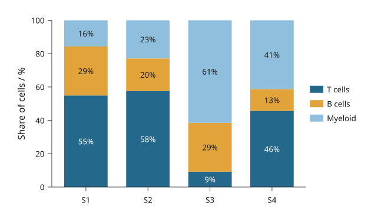
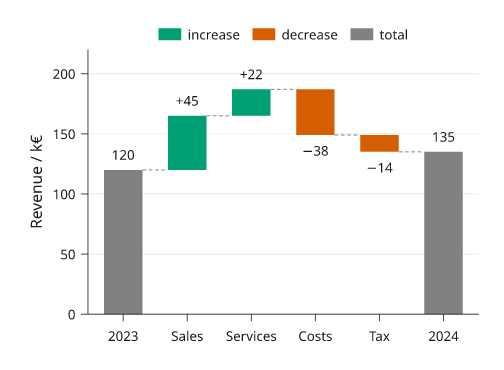
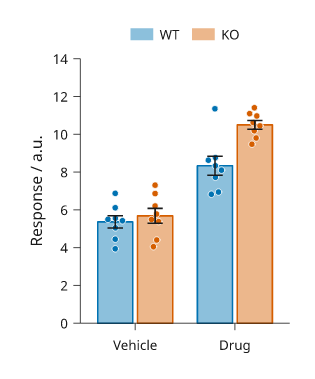
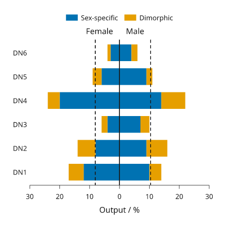
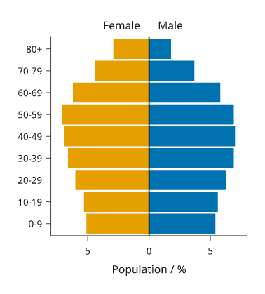
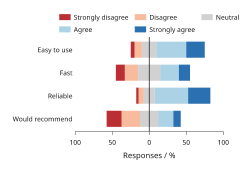
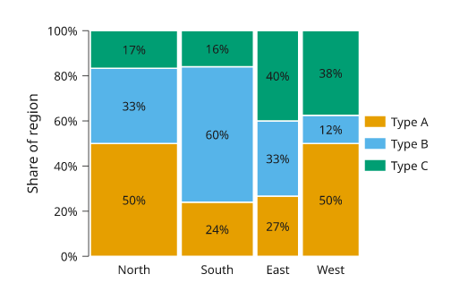
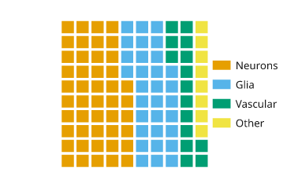
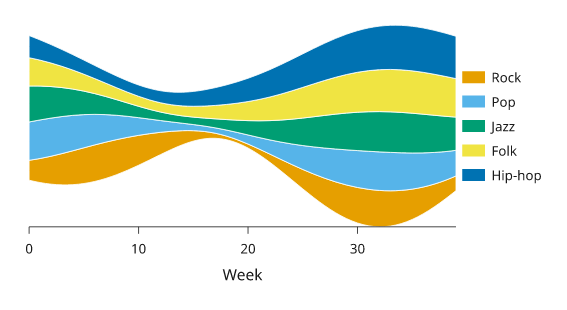
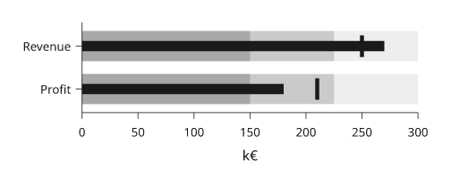

# Bars and areas

Bars compare values at category or numeric positions. Areas show the extent
between a curve and a baseline or between two curves. Use stacked displays only
when adding the contributions has a stated meaning.

All values below are illustrative. Each snippet can be run independently with
core Inklet; PNG preview generation additionally uses the `render` extra.
Run a block from the repository root with `.venv/bin/python`; each block writes
an SVG and PDF that can be opened without a notebook.

Choose bars when a common baseline makes lengths comparable. For many
categories or small differences, a dot or line often preserves comparisons
more clearly.

## Categorical bars

Compare values across named categories.
`bar_colors` maps colours to individual bars; `colors` maps colours to series
in grouped or stacked bars. Declare a suitable baseline explicitly.

```python
import inklet as i

conditions = ['Baseline', 'Filter', 'Tune', 'Combined']
p = i.plot_spec(x=conditions, y=(0, 100), height=45)
p.grid(x=False, count=4, stroke='#e1e7e4', stroke_width=.15)
p.bars(conditions, [42, 53, 61, 78], width=.62,
       bar_colors=['#a7c1ca', '#a7c1ca', '#a7c1ca', '#288675'], stroke='none')
p.axes(y='Recovery / %', y_options={'ticks': [0, 25, 50, 75, 100]})
doc = i.document(width=110)
doc.add('bars', p)
doc.save('bars.svg', 'bars.pdf')
```


*Four illustrative processing variants, with the combined variant highlighted. Every bar starts at zero.*

## Grouped bars

Grouped bars compare several series within each category.
The outer list of heights is series-major. Keep the same category order across
series and use the legend to identify them.

```python
import inklet as i

days = ['Mon', 'Tue', 'Wed', 'Thu']
p = i.plot_spec(x=days, y=(0, 80), height=45)
p.grid(x=False, count=4, stroke='#e1e7e4', stroke_width=.15)
p.bars(days, [[32, 40, 36, 46], [45, 54, 51, 65]], grouped=True,
       width=.7, gap=.18, color=['#24698c', '#288675'],
       name=['Control', 'Treated'], stroke='none')
p.axes(y='Yield / mg').legend(side='bottom')
doc = i.document(width=110)
doc.add('grouped-bars', p)
doc.save('grouped-bars.svg', 'grouped-bars.pdf')
```


*Control and Treated compared within four days. The same series colours are used throughout the plotting guides.*

## Stacked bars

Stacked bars show each contribution and the total at each category.
Values are supplied per series. For contributions that are difficult to compare
without a common baseline, consider grouped bars instead.

```python
import inklet as i

periods = ['Q1', 'Q2', 'Q3', 'Q4']
p = i.plot_spec(x=periods, y=(0, 110), height=45)
p.grid(x=False, count=4, stroke='#e1e7e4', stroke_width=.15)
p.bars(periods, [[38, 30, 20, 15], [24, 22, 28, 32], [18, 26, 36, 45]],
       stacked=True, width=.6, color=['#24698c', '#288675', '#b86443'],
       name=['Grid', 'Wind', 'Solar'], stroke='none')
p.axes(y='Energy / kWh').legend(side='bottom')
doc = i.document(width=110)
doc.add('stacked-bars', p)
doc.save('stacked-bars.svg', 'stacked-bars.pdf')
```


*Illustrative quarterly energy contributions. The stacked height is the total; the legend identifies each source.*

## Horizontal bars

Horizontal bars give category labels more room.
The first categorical y value is at the bottom. Reverse the category order
when the first label should appear at the top.

```python
import inklet as i

sites = ['South site', 'Hilltop', 'Riverside', 'Central site', 'North site']
p = i.plot_spec(x=(0, 100), y=sites, height=48)
p.grid(y=False, count=4, stroke='#e1e7e4', stroke_width=.15)
p.bars(sites, [46, 58, 67, 74, 86], orient='h', width=.55,
       bar_colors=['#a7c1ca'] * 4 + ['#288675'], stroke='none')
p.axes(x='Coverage / %', x_options={'ticks': [0, 25, 50, 75, 100]})
doc = i.document(width=115)
doc.add('horizontal-bars', p)
doc.save('horizontal-bars.svg', 'horizontal-bars.pdf')
```


*Five illustrative sites ordered by coverage, with the largest value at the top. Horizontal bars leave room for the full site names.*

## Filled areas

Fill the region between a curve and a stated baseline.
Declare the area before an overlaid line so the outline remains visible.

```python
import math
import inklet as i

points = [(t := n / 4, 1.5 + 6 * math.exp(-((t - 14) / 4.5) ** 2))
          for n in range(97)]
p = i.plot_spec(x=(0, 24), y=(0, 9), height=45)
p.grid(x=False, count=4, stroke='#e1e7e4', stroke_width=.15)
p.fill(points, baseline=0, fill='#c8dfd7', stroke='none')
p.line(points, stroke='#288675', stroke_width=.45)
p.axes(x='Time / h', y='Demand / kW', x_options={'ticks': [0, 6, 12, 18, 24]})
doc = i.document(width=110)
doc.add('fill', p)
doc.save('fill.svg', 'fill.pdf')
```


*An illustrative daily demand profile filled down to zero. The line traces the supplied samples.*

## Between curves

Fill a region between two supplied curves.
`fill_between` takes absolute y coordinates. A coloured region alone does not
imply uncertainty; describe the meaning of the two boundaries.
The x values must be shared by both boundaries. Sort them before drawing so the
polygon does not fold back over itself.

```python
import math
import inklet as i

x = [n / 4 for n in range(49)]
lower = [1 + .12 * t + .3 * math.sin(t / 2) for t in x]
upper = [a + 2 + .5 * math.cos(t / 3) for t, a in zip(x, lower)]
p = i.plot_spec(x=(0, 12), y=(0, 6), height=45)
p.grid(x=False, count=4, stroke='#e1e7e4', stroke_width=.15)
p.fill_between(x, lower, upper, fill='#dae6e7', stroke='none')
p.line(list(zip(x, lower)), name='Floor', stroke='#24698c', stroke_width=.4)
p.line(list(zip(x, upper)), name='Ceiling', stroke='#288675', stroke_width=.4)
p.axes(x='Position / mm', y='Height / mm').legend(side='bottom')
doc = i.document(width=110)
doc.add('fill-between', p)
doc.save('fill-between.svg', 'fill-between.pdf')
```


*The region between a channel floor and ceiling. These are geometric boundaries, not an uncertainty band.*

## Stacked areas

Stacked areas accumulate nonnegative series over x.
Values are series-major; each series must contain one value per x coordinate.
For signed regions, calculate the boundaries and use `fill_between` explicitly.
Stacking makes the total easy to read but makes interior series hard to compare;
use a common baseline when comparing a component across x or groups.

```python
import math
import inklet as i

hours = [n / 2 for n in range(49)]
grid = [2.4 + .4 * math.cos(t / 4) for t in hours]
wind = [1.6 + .6 * math.sin(t / 3) for t in hours]
solar = [4 * max(0, math.sin(math.pi * (t - 6) / 12)) if 6 < t < 18 else 0
         for t in hours]
p = i.plot_spec(x=(0, 24), y=(0, 10), height=45)
p.grid(x=False, count=4, stroke='#e1e7e4', stroke_width=.15)
p.stackarea(hours, [grid, wind, solar],
            color=['#24698c', '#288675', '#b86443'],
            name=['Grid', 'Wind', 'Solar'], stroke='none')
p.axes(x='Time / h', y='Power / kW', x_options={'ticks': [0, 6, 12, 18, 24]})
p.legend(side='bottom')
doc = i.document(width=110)
doc.add('stackarea', p)
doc.save('stackarea.svg', 'stackarea.pdf')
```


*Illustrative grid, wind and solar power over one day. The total height is their sum; the colour mapping matches the stacked-bar example.*

## Bar value labels

`labels=` writes each value on its bar. `True` writes the number; a format
string such as `"{:.0f}%"`, a function or a list of strings in the shape of
the heights sets the text. With the default `label_position="auto"` a label
goes inside its bar when it fits and past the end of the bar when it does
not. Inside labels are set in the ink or paper colour, whichever has more
contrast with the bar.

In a stacked bar only the last segment has a free end. A segment label that
does not fit inside its segment is left out, not shrunk; the omitted labels
are listed in the label node's `bar_labels` note.

```python
import inklet as i

cells = ['79', '81', '102', '116', '153', '186']
specific = [43, 18, 51, 40, 26, 9]
shared = [0, 7, 1, 6, 7, 3]
common = [0, 1, 0, 3, 3, 1]
p = i.plot_spec(x=(0, 70), y=cells, height=44)
p.bars(cells, [specific, shared, common], stacked=True, orient='h',
       width=.7, color=['#668fb8', '#e6b93f', '#b9b8b4'],
       name=['Specific', 'Shared', 'Common'], labels=True, stroke='none')
p.axes(x='Cell types', y='Neuron class').legend(side='top')
doc = i.document(width=110)
doc.add('bar-labels', p)
doc.save('bar-labels.svg', 'bar-labels.pdf')
```


*Illustrative counts. Segments too short for their count carry no label;
the last segment of each bar may place its label past the bar end.*

## Set intersections (UpSet)

`i.upset` draws an UpSet plot. Each column is one exclusive intersection:
the elements that are in exactly the marked sets. The bar above a column is
the size of that intersection. In the matrix below, a dark dot marks a set
in the intersection and a pale dot a set outside it, and a line joins the
dark dots. The bars at the left are the set sizes, counted over all the data.

Pass a mapping of set name to members, `{'RNA-seq': genes_a, 'ATAC-seq':
genes_b}`, or a list of `(members, count)` records as below. `sort='size'`
(default) puts the largest intersection first; `sort='degree'` puts the
intersections of fewer sets first. `min_size=` drops smaller intersections
and `max_intersections=` keeps only the first ones after sorting. The dropped
intersections are listed in the diagram's `upset` note, and
`inklet.plot.upset_layout` returns the same counts without drawing.

The result is one diagram built from three panels on shared band scales, so
each bar stands over its matrix column. Add it to a figure or a document like
a panel.

```python
import inklet as i

hits = [(('RNA-seq',), 412), (('RNA-seq', 'ATAC-seq'), 236), (('ATAC-seq',), 198),
        (('RNA-seq', 'ATAC-seq', 'ChIP-seq'), 121), (('ChIP-seq',), 94),
        (('RNA-seq', 'ChIP-seq'), 77), (('ATAC-seq', 'ChIP-seq'), 52),
        (('proteomics',), 31), (('RNA-seq', 'proteomics'), 29),
        (('RNA-seq', 'ATAC-seq', 'proteomics'), 12), (('ChIP-seq', 'proteomics'), 4),
        (('ATAC-seq', 'proteomics'), 3)]
plot = i.upset(hits, min_size=5, labels=True)
doc = i.document(width=110)
doc.add('upset', plot)
doc.save('upset.svg', 'upset.pdf')
```


*Illustrative gene counts. The two intersections smaller than 5 are
dropped; the set sizes at the left still count them.*

## 100% stacked bars

`normalize=True` turns each category's series into percentages of its total
and stacks them, so composition compares across categories whose totals
differ. The value axis runs from 0 to 100, and `labels=True` writes each
share as a whole percentage, omitting any that do not fit their segment. The
totals are no longer visible, so give them in the caption or beside the
axis. A category whose values are all zero draws no bar.

```python
import inklet as i

samples = ['S1', 'S2', 'S3', 'S4']
cells = [[412, 530, 96, 210], [220, 180, 305, 60], [118, 210, 640, 190]]
p = i.plot_spec(x=samples, y=(0, 100), height=45)
p.bars(samples, cells, normalize=True, labels=True, width=.7,
       color=['#24698c', '#e3a33b', '#8fbfdc'],
       name=['T cells', 'B cells', 'Myeloid'], stroke='none')
p.axes(y='Share of cells / %').legend(side='right')
doc = i.document(width=100)
doc.add('bars-percent', p)
doc.save('bars-percent.svg', 'bars-percent.pdf')
```



*Illustrative cell counts; each bar is scaled to its own total, which
ranges from 460 to 1,041 cells.*

## Waterfalls

A waterfall shows how a starting value becomes a final one through signed
changes. Each change floats from the running total; increases and decreases
take different colours. Name the positions in `totals=` that are totals: a
total given `None` shows the running total, and a total given a number resets
it. `labels=True` writes each change past the end of its bar.

```python
import inklet as i

steps = ['2023', 'Sales', 'Services', 'Costs', 'Tax', '2024']
p = i.plot_spec(x=steps, y=(0, 220), height=42)
p.grid(x=False, count=4)
p.waterfall(steps, [120, 45, 22, -38, -14, None], totals=['2023', '2024'],
            labels=True, names=['increase', 'decrease', 'total'])
p.axes(y='Revenue / k€').legend(side='top')
doc = i.document(width=80)
doc.add('waterfall', p)
doc.save('waterfall.svg', 'waterfall.pdf')
```



*Illustrative figures. Dashed connectors carry the running total from bar
to bar; `connectors=False` leaves them out.*

## Bars with points and error bars

`barplot` draws, in one call, a bar at the mean of each sample, an error bar
and every observation as a dot swarmed inside its bar at its exact value.
`error=` is `"sem"` (default), `"sd"`, `"ci95"`, `"iqr"`, `None` or a
function of the sample. Several series are dodged within each category.

```python
import inklet as i
import random

rng = random.Random(4)
def sample(mean, sd, n=8):
    return [rng.gauss(mean, sd) for _ in range(n)]

conditions = ['Vehicle', 'Drug']
data = [[sample(5, 1.2), sample(8, 1.5)], [sample(6, 1.0), sample(11, 1.3)]]
p = i.plot_spec(x=conditions, y=(0, 14), height=42)
p.barplot(conditions, data, names=['WT', 'KO'])
p.axes(y='Response / a.u.').legend(side='top')
doc = i.document(width=50)
doc.add('barplot', p)
doc.save('barplot.svg', 'barplot.pdf')
```



*Simulated data, n = 8 per bar. The node's `barplot` note holds each bar's
mean, error extent and n.*

## Diverging bars

`diverging_bars` puts two quantities per category back to back: the left one
runs from zero to the left, the right one to the right. Each side may be
several series, stacked outward from zero. `reference=` adds a dashed line on
each side, such as the mean over all categories, and `titles=` names the two
sides. Format the axis with `inklet.plot.unsigned` so both sides read as
positive.

```python
import inklet as i

types = ['DN1', 'DN2', 'DN3', 'DN4', 'DN5', 'DN6']
female = [[12, 8, 4, 20, 6, 3], [5, 6, 2, 4, 3, 1]]
male = [[10, 9, 7, 14, 9, 4], [4, 7, 3, 8, 2, 2]]
p = i.plot_spec(x=(-30, 30), y=types, height=45)
p.diverging_bars(types, female, male, names=['Sex-specific', 'Dimorphic'],
                 reference=(8.1, 10.4), titles=('Female', 'Male'))
p.axis('bottom', format=i.plot.unsigned, label='Output / %')
p.axis('left', spine=False, tick_size=0)
p.legend(side='top')
doc = i.document(width=70)
doc.add('diverging-bars', p)
doc.save('diverging-bars.svg', 'diverging-bars.pdf')
```



*Illustrative percentages. The dashed lines are the means over all types.*

## Population pyramids

`pyramid` is `diverging_bars` with touching bars: age groups on the band y
scale, one group to each side.

```python
import inklet as i

ages = ['0-9', '10-19', '20-29', '30-39', '40-49', '50-59', '60-69', '70-79', '80+']
female = [5.1, 5.3, 6.0, 6.6, 6.9, 7.1, 6.2, 4.4, 2.9]
male = [5.4, 5.6, 6.3, 6.9, 7.0, 6.9, 5.8, 3.7, 1.8]
p = i.plot_spec(x=(-8, 8), y=ages, height=45)
p.pyramid(ages, female, male, titles=('Female', 'Male'))
p.axes(x='Population / %', x_options={'format': i.plot.unsigned})
doc = i.document(width=60)
doc.add('pyramid', p)
doc.save('pyramid.svg', 'pyramid.pdf')
```



*Illustrative population shares.*

## Likert scales

`likert` draws survey responses as diverging stacked bars centred on the
neutral level: disagreement to the left of zero, agreement to the right. Each
row is normalised to percentages. Levels are ordered from the most negative to
the most positive; the default colours run from red through a grey neutral to
blue.

```python
import inklet as i

levels = ['Strongly disagree', 'Disagree', 'Neutral', 'Agree', 'Strongly agree']
questions = ['Would recommend', 'Reliable', 'Fast', 'Easy to use']
counts = [[20, 25, 25, 20, 10], [3, 7, 15, 45, 30],
          [12, 18, 30, 25, 15], [5, 10, 20, 40, 25]]
p = i.plot_spec(x=(-100, 100), y=questions, height=30)
p.likert(questions, counts, names=levels)
p.axis('bottom', format=i.plot.unsigned, label='Responses / %')
p.axis('left', spine=False, tick_size=0)
p.legend(side='top', columns=3)
doc = i.document(width=80)
doc.add('likert', p)
doc.save('likert.svg', 'likert.pdf')
```



*Illustrative responses. `inklet.plot.likert_spans` returns the segments
without drawing them.*

## Mosaic plots

A mosaic (Marimekko) plot is a stacked bar chart whose column widths are the
category totals, so every cell's area is its value. Columns run across the x
domain and each column's cells stack up the y domain as shares of it.

```python
import inklet as i

regions = ['North', 'South', 'East', 'West']
p = i.plot_spec(x=(0, 100), y=(0, 100), height=40)
p.mosaic(regions, [[30, 12, 8, 20], [20, 30, 10, 5], [10, 8, 12, 15]],
         names=['Type A', 'Type B', 'Type C'], labels=True)
p.axis('left', format='{:.0f}%', label='Share of region')
p.legend(side='right')
doc = i.document(width=80)
doc.add('mosaic', p)
doc.save('mosaic.svg', 'mosaic.pdf')
```



*Illustrative counts. A column's width is its share of the grand total.*

## Waffle charts

A waffle shows shares of a whole as whole cells of a grid, 100 by default,
rounded so the counts add up. `total=` larger than the sum leaves the
remaining cells empty.

```python
import inklet as i

p = i.plot_spec(height=30, width=30)
p.waffle([46, 31, 15, 8], names=['Neurons', 'Glia', 'Vascular', 'Other'])
p.legend(side='right')
doc = i.document(width=60)
doc.add('waffle', p)
doc.save('waffle.svg', 'waffle.pdf')
```



*Illustrative composition. Each cell is one percent.*

## Streamgraphs

A streamgraph stacks areas around a moving baseline. `offset="wiggle"`
(default) minimises the change in slope of the layers, `"silhouette"` centres
the stack on zero, `"zero"` stacks from zero and `"expand"` normalises each x to
a total of 1. Compute the extent with `stream_layers` to size the y scale.

```python
import inklet as i
import math

weeks = list(range(40))
genres = ['Rock', 'Pop', 'Jazz', 'Folk', 'Hip-hop']
counts = [[max(0.0, 3 + 2.5 * math.sin((w + 7 * g) / (4 + g)) + g * .3) for w in weeks]
          for g in range(5)]
layers = i.plot.stream_layers(counts, offset='wiggle')
low = min(min(lower) for lower, _ in layers)
high = max(max(upper) for _, upper in layers)
p = i.plot_spec(x=(0, 39), y=(low, high), height=32)
p.streamgraph(weeks, counts, names=genres)
p.axis('bottom', label='Week')
p.legend(side='right')
doc = i.document(width=90)
doc.add('streamgraph', p)
doc.save('streamgraph.svg', 'streamgraph.pdf')
```



*Illustrative plays per week. A wiggle stream has no meaningful zero, so
the y axis is omitted.*

## Bullet charts

A bullet chart shows a measure as a narrow bar against a target rule and grey
qualitative ranges behind it, darkest for the lowest range.

```python
import inklet as i

rows = ['Profit', 'Revenue']
p = i.plot_spec(x=(0, 300), y=rows, height=16)
p.bullet(['Revenue', 'Profit'], [270, 180], targets=[250, 210],
         ranges=[150, 225, 300])
p.axes(x='k€')
doc = i.document(width=80)
doc.add('bullet', p)
doc.save('bullet.svg', 'bullet.pdf')
```



*Illustrative figures. Rows with different units belong in separate
panels.*

## Next steps

[Compare plot types](plot-types.md), configure [axes and scales](axes-and-scales.md),
or [arrange several panels](layout.md). For exact options, see the [API](api.md).
