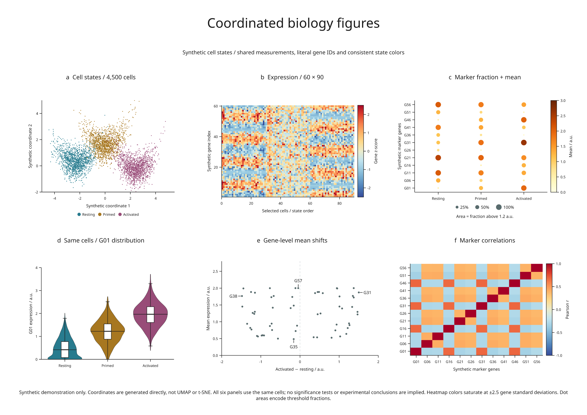

# Coordinated biology figures

A six-panel example built from **4,500 synthetic cells and 60 synthetic genes**.
It exercises dense scatter, expression heatmaps, marker dot plots, distributions,
annotations and correlations, all derived from one set of measurements.



[Full-size figure](../gallery/biology-panels.png) ·
[Executable recipe](../examples/biology_panels.py) ·
[Recorded summary](assets/research-preview/biology.json)

## Reproduce it

From the release checkout with the render extra installed:

```sh
python -m pip install -e '.[render]'
python examples/biology_panels.py
```

No Blender, external dataset or statistical-analysis package is required. Output
in `out/biology-panels/` includes SVG, PDF, PNG, review HTML, full generated cell
records in `data.json`, and the compact `summary.json`. The fixed seed is 20260907.

## What each panel encodes

| Panel | Measurements and encoding |
| --- | --- |
| a · Cell states | 1,500 cells in each of three states; generated coordinates and shared state colors |
| b · Expression | Every 50th cell in each state, giving 90 columns; 60 gene rows, standardized using all 4,500 cells |
| c · Marker dot plot | Every fifth gene; color is mean expression, circle area is the fraction above 1.2 a.u. |
| d · Distribution | G01 values from all cells, with violin density, median and boxplot summaries |
| e · Mean shifts | Activated minus resting mean versus overall mean; labels identify the four coordinate extrema |
| f · Correlations | Pearson correlations between the same twelve marker genes across all cells |

The heatmap saturates at ±2.5 standard deviations. Explicit row coordinates keep
gene identity aligned with the y-axis. Correlation axes show the same literal
gene IDs as the dot plot. Circle **diameters** use the square root of each fraction,
so their **areas** represent fractions; a size key states the mapping.

These are synthetic latent-state measurements. Coordinates are generated directly,
not produced by UMAP or t-SNE. Gene IDs are placeholders, with no claim that they
represent real genes or pathways. Cells are not donor-level replicates. The example
performs no significance testing, and its correlations do not establish causality.

## Rendering and review

Dense cell marks and the large heatmap are embedded raster layers. Axes, labels,
legends, dot plots, distributions, gene marks and the small correlation matrix
remain vectors in SVG/PDF. The source also preserves the data used to compute
every panel, rather than storing unrelated illustrative values for each chart.

The recorded figure has no diagnostic errors or warnings. It retains one
informational crowding finding where an invisible annotation target lies close
to another gene point. Inspecting the exported figure is still necessary; a
clean warning count is not a substitute for scientific or visual review.

## Biology as a development target

This example establishes a reproducible starting point. More demanding cases
should combine microscopy with calibrated scale bars, spatial cell maps, genomic
tracks, clustered matrices and annotated molecular or cellular 3D structures.
Those capabilities need explicit identities, units, data provenance and honest
visibility handling. A biological-looking image alone does not establish them.

The [real microscopy example](real-biology.md) now connects calibrated sections,
annotated organelle surfaces and volume charts from openly licensed COSEM data.
The [calibrated volume API](calibrated-volumes.md) preserves physical coordinates
and measurement identities. The [revision preview](research-revision.md)
constrains label movement in 3D figure plans; coordinated revision across scenes
and data panels remains a further experiment.
