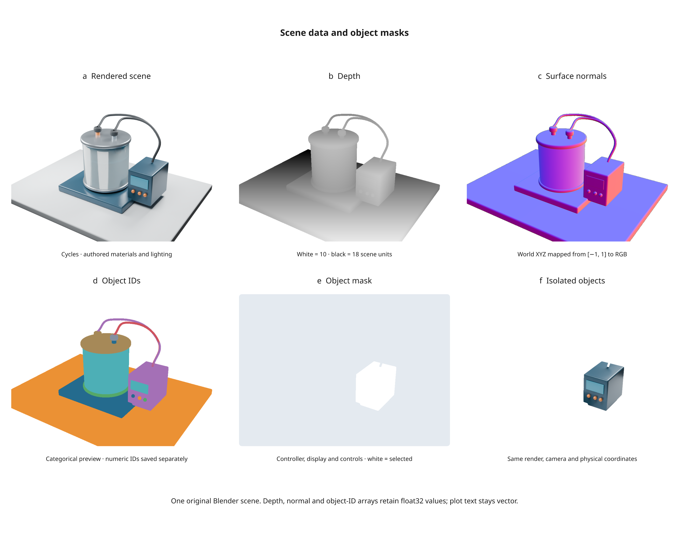

# Complete Blender scenes

Available in **3.0 development**. Use an existing `.blend` scene as a figure
panel while keeping Inklet annotations, axes and plots vector.

## Setup

Install [Blender 4.2 LTS or newer](https://www.blender.org/download/) separately,
then install the optional Python dependencies from an Inklet checkout:

```sh
python -m pip install -e '.[render]'
inklet doctor
```

`doctor` reports the Blender executable and version, plus resvg and other
optional tools. If Blender is not discovered automatically, set
`INKLET_BLENDER` to its executable, or pass `blender='/path/to/blender'` to the
render function. Blender remains optional for ordinary plots and vector output.
The complete-scene integration is tested with Blender 4.2.23 LTS and Cycles CPU.

## Render an authored scene

This example requires your own `apparatus.blend` with a camera named `Overview`:

```python
import inklet as i

result = i.render_blend('apparatus.blend', width=90, camera='Overview',
                        engine='CYCLES', samples=64, dpi=300,
                        landmarks={'electrode': 'Electrode'})
art = i.annotate(result.diagram.at('electrode'), 'Electrode',
                 side='n', clear=15, through=[result.diagram])
doc = i.document(width=110)
doc.add('apparatus', art)
doc.save('apparatus.svg', 'apparatus.pdf')
```

`blend_scene(...)` returns the Diagram directly. `render_blend(...)` additionally
returns `metadata` and `cache_hit`. Width/height are millimetres; omitting height
preserves the authored render aspect ratio. Specify `scene=` to select a named
scene and `frame=` for an animation frame. A named camera must belong to that
scene. Perspective and orthographic cameras are supported.
Use `view_layer='Experiment'` to select a view layer and preserve its collection
exclusions, holdouts and material override. Otherwise Inklet uses the active
view layer. Only the selected layer is rendered.

Authored materials, lights and colour-management settings are preserved.
`transparent=True` removes the world background while retaining lighting.
`engine=None` uses the authored engine; supported engines are `CYCLES` and
`BLENDER_EEVEE_NEXT`. Cycles uses CPU rendering with an explicit seed and sample
count. EEVEE depends on a working graphics context and is not tested on every
headless environment. `threads=` defaults to 4; `timeout=` defaults to 300 seconds.
A render may contain at most 40 million pixels unless `max_pixels=` is changed.

## Project object landmarks

Landmarks accept three forms:

```python
landmarks = {
    'object_origin': 'Electrode',
    'local_tip': {'object': 'Electrode', 'point': [0, 0, 1.5]},
    'world_point': [1.2, -0.3, 2.0],
}
```

Object-local points follow the object's evaluated world transform. Projection
uses Blender's [camera projection helper](https://docs.blender.org/api/current/bpy_extras.object_utils.html).
Coordinates in `metadata['landmarks']` use millimetres from the image's top-left;
Diagram anchors use Inklet's centred local frame. Placement and scaling then
transform those anchors with the image.

Each landmark records depth, whether it is inside the camera frame, and a
geometric occlusion result. Occlusion is a surface ray test, not an optical
transmission calculation: glass can count as an occluder. Object-origin
landmarks ignore a hit on their own object. Off-frame points are recorded and
are not automatically labelled or moved into view.
The ray test uses Blender's evaluated viewport geometry; render-only visibility
flags and renderer-specific geometry can differ. Treat it as annotation guidance.

## Select objects and bind data

`objects=['Chamber', 'Electrode']` or `collections=['Apparatus']` restricts visible
geometry while retaining scene lights and cameras. Existing hidden objects stay
hidden unless explicitly overridden. Collection names refer to Blender data
collections; selected objects still need to be present in the rendered scene.

Supported object bindings are `color`, `location`, `rotation_euler`, `scale`
and `hide_render`. Coordinate values are three numbers in Blender's native
units; rotations are radians. Colour overrides replace Principled BSDF base
colour inputs on copied materials, including linked texture inputs, without
changing another object's material or the saved `.blend` file.

For live data, use `blend_scene_spec`:

```python
positions = i.dataset({'x': [0.0]}, name='electrode position')
location = i.derive(lambda x: [x[0], 0, 0], positions.column('x'))
panel = i.blend_scene_spec('apparatus.blend', camera='Overview',
    dpi=300, samples=64, engine='CYCLES',
    bindings={'Electrode': {'location': location}})
doc = i.document(width=100)
doc.add('apparatus', panel)
first = doc.compile()
positions.update(x=[0.5])
second = doc.compile()
```

The deferred panel uses its document cell dimensions. Data updates and changed
scene assets invalidate affected renders. A previously compiled figure retains
its original pixels and metadata. For arbitrary material node groups, simulations
or geometry-node controls, author those changes in Blender; bindings deliberately
support a defined property set.

## Depth, normal and object-ID passes

Cycles can return numeric passes alongside the rendered image:

```python
result = i.render_blend('apparatus.blend', width=90, camera='Overview',
    engine='CYCLES', dpi=300, samples=64,
    passes=('depth', 'normal', 'object_id'))
depth = result.passes['depth']
print(depth.value(100, 80))
```

`ScenePass.value(x, y)` reads one pixel with no additional Python dependencies.
Passes contain immutable float32 bytes, with rows starting at the **top-left**.
They have exactly the same pixel dimensions and physical bounds as the scene.
Data passes currently require Cycles; they are not display-colour transformed.

| Pass | Values | Background |
| --- | --- | --- |
| `depth` | Blender Z distance in scene units | `1e10` |
| `normal` | Signed world-space XYZ surface normal | `(0, 0, 0)` |
| `object_id` | Integer-valued object index | `0` |

With `inklet[images]` installed, `depth.to_numpy()` returns a read-only `H × W`
array; normals return `H × W × 3`. `depth.save('depth.npy')` saves the numeric
array without changing precision or axes. A `SceneRender` retains the pass
bytes even if its original scene or cache files disappear.

Pass visualizations are ordinary image panels:

```python
depth_panel = depth.to_diagram(value_range=(5, 20))
normal_panel = result.passes['normal'].to_diagram()
id_panel = result.passes['object_id'].to_diagram()
```

Depth maps near to white and far to black; use the same explicit `value_range`
when comparing views. Without it, Inklet derives and records each image's
foreground range. Normals map `[-1, 1]` to RGB. Object IDs use a repeating
eight-colour preview palette; read numeric values to distinguish every object.
Background pixels are transparent. Visualizations retain the source-data hash
and chosen range in figure manifests.

### Select objects from a rendered image

```python
stencil = result.object_mask('Electrode', 'Controller')
cutout = i.mask(result.diagram, stencil, mode='alpha', dpi=300)
```

The stencil uses white opaque pixels for selected objects and transparent pixels
elsewhere. It preserves the scene's bounds and registered anchors. Apply it in
the same coordinates as the original render before placing or scaling the cutout.
Request `object_id` before calling `object_mask`; unknown names raise an error.

Inklet assigns IDs in sorted object-name order and records the mapping in
`result.metadata['object_ids']`. Adding or renaming objects can change IDs, so
use this mapping rather than assuming an ID is stable between different scenes.
The source `.blend` file and its authored indices are not saved or changed.

Blender's Z and object-index passes are not antialiased. Hard masks can therefore
have jagged edges and do not recover hidden geometry. Transparency follows the
selected view layer's pass alpha threshold; these masks are not Cryptomatte or
optical transmission masks. See Blender's [render-pass reference](https://docs.blender.org/manual/en/4.2/render/layers/passes.html).



Run the [six-panel example](../examples/v3_scene_passes.py) after creating the
laboratory scene with `python tools/v3_showcase.py`:

```sh
python examples/v3_scene_passes.py
```

It exports SVG/PDF/PNG, an HTML review, and all three numeric `.npy` arrays.
Regular figure bundles record pass hashes and properties; save `.npy` files
explicitly when you also need the numeric data outside Python.

## Dependencies, caching and limits

The disk cache records the source scene, referenced external files, Blender
version/path, worker version, camera/frame, render settings and bindings.
The selected view layer and requested passes are part of the cache key. Every
cached pass is checked against its recorded hash; a missing or damaged pass
causes a fresh render. Passes add roughly 4 bytes per scalar pixel and 12 bytes
per normal pixel, in addition to Blender's own render memory.
Changed or missing dependencies invalidate a cached render. Changed inputs
during rendering cause a failure, and incomplete renders are not reused.
Specify `assets=[...]` for additional simulation caches, image-sequence frames
or dependencies that Blender's file inventory does not list. UDIM texture
patterns are expanded into existing tiles.

The manifest records dependency hashes, output-image hash, camera/frame,
colour management and landmarks. Identical input requests reuse cached pixels;
byte-identical rendering across different Blender builds or hardware is not
guaranteed. `cache=` changes the cache directory, or set `INKLET_CACHE_DIR`.

Source `.blend` files are never saved by the renderer. Automatic embedded Python
execution is disabled. The authored compositor and video sequencer are bypassed,
so file-output nodes cannot write to the scene's original output locations.
When passes are requested, Inklet creates a fresh compositor in the subprocess
that writes only to its temporary directory. It extracts full-precision EXR
channels there; no EXR reader is needed in the host Python environment.
Scenes requiring scripted drivers or compositor effects need adaptation. This
is a rendered scene image, not a general Blender-to-vector conversion.
Animation/video export and Cryptomatte are not included in this development build.

After the first successful bundle, `inklet watch` includes scene dependencies
from its manifest. Use `--watch` for additional dependencies and
`--build-timeout` for longer scene builds. See [the CLI reference](cli.md).
