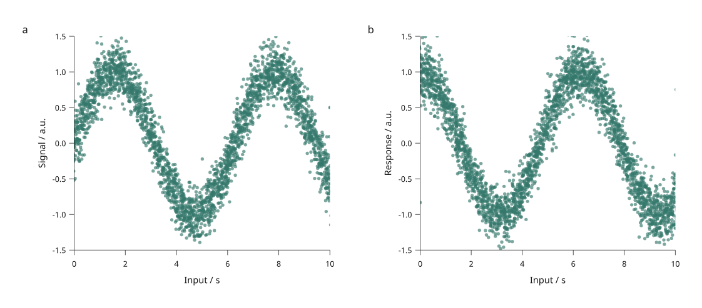

# Offline browser rendering

This development preview adds direct picking, linked selection, filtering and
page navigation to measured scatter plots. It lives in
`inklet.experimental.browser` in the development checkout and is **not included
in PyPI 3.1.0**. The API and state schema may change.



[Open the interactive example](assets/v4/browser-scatter.html) ·
[Python source](../examples/v4/browser_scatter.py) ·
[Backend decision and measurements](design/browser-backends.md)

The example contains 3,000 original simulated observations. Each row connects a
signal point and a response point. One missing signal coordinate is omitted in
that panel. Points at and just outside the domain edges exercise clipping.
Captions and controls remain outside the scientific artwork.

## Try the complete workflow

1. Open the example and click a point. Both panels select the same row.
   Shift-click adds or removes rows; table buttons provide keyboard selection.
2. Enter part of a row ID to filter observations. A hidden selection remains
   selected and is counted in the status text.
3. Drag to pan, or focus the plot and use arrow keys. Use **Zoom in**, **Zoom
   out** and **Fit page**, or the `+`, `-` and `0` keys.
4. Choose **Save view**, change the selection, then **Open saved view** to
   restore the filter, selection and viewport.
5. Choose **Download vector SVG**. All three display backends export clipped
   vector points with the same measured axes and outlined text.

Page zoom enlarges or moves the existing drawing. It does not change data
domains, generate ticks or recompile the layout. Hover values and table numbers
use six significant digits for display; embedded source values retain their
precision. The HTML includes its data, runtime and glyph outlines and works
without a server, remote fonts or network requests.

## Build and reconstruct in Python

From a development checkout:

```sh
python examples/v4/browser_scatter.py --count 3000 --output out/v4-browser
# Open index.html, select/filter/zoom, and download view.json.
python examples/v4/browser_scatter.py --count 3000 --state /path/to/view.json --output out/v4-restored
```

The second command reconstructs `figure.svg` and copies the validated state to
`view.json`. Its HTML starts with the full dataset; open the saved view there to
restore it interactively. Use the same row count, source data and scene layout.
Changed revisions are rejected rather than silently applied to different rows.

A minimal scene can be built without the optional raster or numerical packages:

```python
from inklet.experimental.selection import KeyedTable
from inklet.experimental.browser import BrowserScatter, ScatterView

table = KeyedTable("measurements", {
    "id": ["sample-a", "sample-b", "sample-c"],
    "time": [0, 1, 2],
    "value": [1, 3, 2],
})
scene = BrowserScatter(table, [
    ScatterView("response", "time", "value", (0, 2), (0, 4),
                x_label="Time / s", y_label="Response / a.u.")
])
from pathlib import Path
Path("figure.html").write_text(scene.to_html(backend="svg"))
Path("figure.svg").write_text(scene.to_svg())
```

`BrowserScatter` supports one to four views with explicit finite linear domains,
circular markers and numeric or null coordinate columns. Reversed domains work.
The input is an immutable keyed table. Browser visibility accepts arbitrary ID
subsets; the example supplies a simple ID text filter. It does not offer data
upload, brushing, domain rescaling or arbitrary plot types.

## Display backends

| Backend | Point layer | Axes and text | Use in this preview |
| --- | --- | --- | --- |
| SVG | Vector SVG circles | Outlined SVG | API default; small figures and inspection |
| Canvas | Canvas 2D circles | Rasterized measured SVG frame | Comparison backend; text softens under zoom |
| Hybrid | Canvas 2D circles | Outlined SVG, with vector selection rings | Explicit default in the 3,000-row example |

A local two-panel study measured median redraw submission times of 22.0 ms for
SVG and 8.2 ms for hybrid at 3,000 rows; at 20,000 rows, 156.1 ms and 47.9 ms.
These are CPU submission timings on one browser/environment, not complete
interaction latency or universal crossover thresholds. See the
[methods, raw records and limitations](design/browser-backends.md).

## Fidelity and state checks

Picking uses a spatial index in physical page coordinates and respects each
panel's clip rectangle and visible IDs. It chooses the nearest eligible center;
exact-distance ties follow later source paint order. Pointer handling adds a
four-CSS-pixel tolerance. A center outside the domain can contribute a clipped
edge, but clicks outside the plot rectangle never select it.

Saved views include a schema version, scene digest, keyed-table revision,
selected/visible IDs and viewport. Invalid revisions, unknown or duplicate IDs,
and invalid viewports fail before changing the selected/visible state. Null
visibility means all rows; an empty list means no rows. Page zoom is bounded
from 0.01× to 100×. An old scene cannot be rebased implicitly.

The browser tests cover device pixel ratios 1 and 2, clipping, hidden selections,
coordinate conversion, invalid loads and multiple renderer instances. The
indexed picker matched an independent exhaustive query for all 1,800 sampled
queries in the backend study. Browser SVG downloads and Python reconstruction
produced identical pixels at 150 dpi for the checked fit-page and zoomed/panned
states. Their XML serialization differs. These bounded checks do not establish
pixel identity between canvas and SVG; their edge antialiasing differs.
