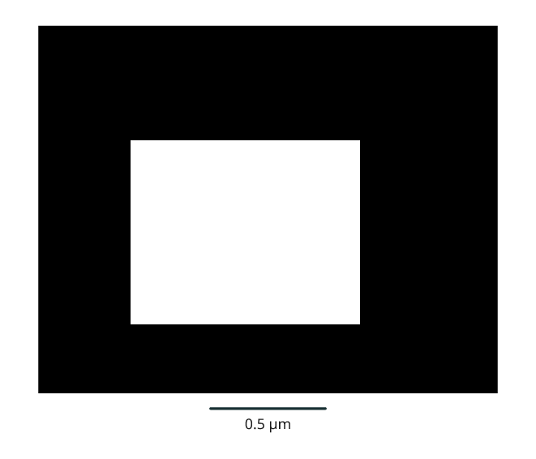

# Calibrated microscopy volumes

The experimental `Volume` API keeps voxel spacing, coordinate origin and source
identity attached to microscopy and segmentation arrays. Cropping, slices,
scale bars, measured volumes and 3D surfaces use the same physical coordinates.
It is available in the 3.1 development preview, not stable 3.0.

```sh
python -m pip install -e '.[volume,render]'
```

The optional `volume` extra supplies NumPy, Pillow and scikit-image. Importing
the module does not load these dependencies. The core Inklet install still
requires none of them. This API accepts arrays; it does not claim to parse every
microscopy file format or infer missing calibration.

## Declare calibration explicitly

```python
import numpy as np
from inklet.experimental.volume import Volume

labels = np.zeros((12, 16, 20), dtype=np.uint16)
labels[2:8, 3:11, 4:14] = 7
volume = Volume(labels, spacing_zyx=(0.2, 0.1, 0.1), unit='um',
                origin_xyz=(10, 20, 30), source_id='example:segmentation')
measurement = volume.measure(7)
assert measurement['voxel_count'] == 480
assert abs(measurement['volume'] - 0.96) < 1e-12
```

Arrays are ordered **Z, Y, X**. World positions are **X, Y, Z**. Units must be
`m`, `mm`, `um` or `nm`. Spacing must be finite and positive. The declared origin
is the **centre of voxel [0, 0, 0]**. Outer voxel edges extend half a spacing
beyond the first and last centres. Convert source corner-based origins before
constructing a volume. The array is copied into an immutable snapshot, so edits
to the input cannot silently change a figure or its recorded measurements.

`volume.world((z, y, x))` maps fractional indices to physical coordinates.
`volume.report()` records shape, spacing, origin, unit and bounds. A crop uses
half-open voxel bounds and retains its position in the original world frame:

```python
crop = volume.crop((1, 2, 3), (10, 14, 18))
assert crop.world((0, 0, 0)) == volume.world((1, 2, 3))
```

## Slices and scale bars

```python
import inklet as i

section = volume.slice('z', 4)
picture = section.diagram(width=90, window=(0, 7))
key = section.scalebar(0.5, width=90)
doc = i.document(width=105, margin=5)
doc.add('section', i.vstack([picture, key], gap=3))
figure = doc.compile()
```



*Rendered from the code above.*

The width is in **page millimetres**; the scale-bar length is in **volume units**.
Physical spacing determines image aspect ratio. The second displayed axis points
up: Z sections show XY, Y sections show XZ, and X sections show YZ. The PNG pixel
orientation and `section.project(world_xyz, width=90)` use that same convention.
Projection returns image-centred millimetres with +y down, and rejects points
outside the selected voxel slab or field of view.

The display window is explicit, so different sections can share the same contrast
mapping. Intensities outside it are clipped for display; source values are not
changed. Images request nearest-neighbour sampling. The volume API does not
claim that magnification creates additional spatial detail. Place the separate
scale bar beside its image; apply any later scaling to both together.

## Measurements and surfaces

```python
measured = volume.measure(7)
mesh = volume.surface(7)
```

Measurements require an integer segmentation array and a positive label ID.
They report voxel count, voxel-count volume, physical centroid and whether any
voxel of that label touches a volume boundary. Disconnected voxels with the same
ID remain one label. These are measurements of the supplied segmentation, not
proof of a segmentation's biological correctness or independent cell membership.

The surface uses scikit-image's [marching cubes](https://scikit-image.org/docs/0.25.x/api/skimage.measure.html#skimage.measure.marching_cubes)
and returns an Inklet `Mesh` in the declared world units. Its vertices preserve
anisotropic spacing and origin; faces have outward winding. A background pad
closes voxel-edge surfaces. If the label touches the boundary, extraction fails
unless `allow_clipped=True` explicitly permits artificial caps at that boundary.
Such a surface must not be interpreted as a complete observed organelle.

`step_size=2` subsamples the grid for display. It can omit thin structures and
small components; it does **not** change `measure()`, which counts all supplied
voxels. Mesh-enclosed volume is a different estimator from voxel-count volume.
Neither is automatically a measurement at the acquisition's original resolution
when the supplied volume is already a downsampled pyramid level.

The [real-biology example](real-biology.md) applies these contracts to an actual
calibrated FIB-SEM volume, source segmentations and a GPU-rendered 3D scene.

For angled sections, use the [oblique-plane API](oblique-sections.md). It samples
one physical plane across image and label volumes and supplies matching 3D
corners, page projection and scale bars, with explicit interpolation and coverage.
