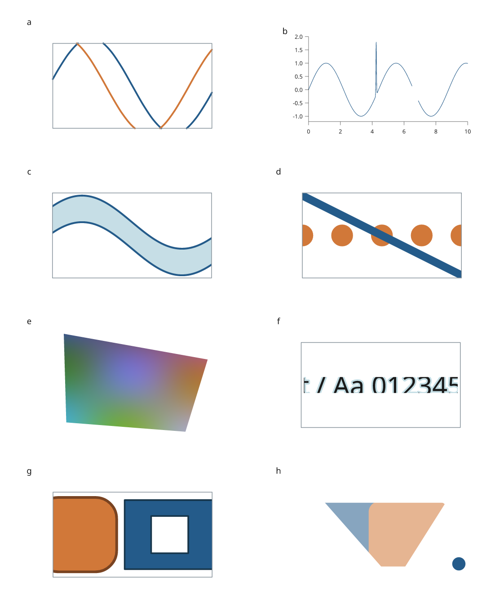

# Clipping curves and painted content

Use `clip()` when the remaining geometry should determine layout. Use
`window()` when a fixed region should crop all painted content, including
images, glyphs, markers, stroke widths and rounded corners. Both take a `Rect`
or a convex polygon in the coordinate frame of the supplied drawings.



The [complete recipe](../examples/clipping_review.py) builds all eight panels.
The [separate caption](assets/research-preview/clipping-caption.tex) describes
the simulated data, explicit gap and rendering checks. There are no titles or
captions inside the figure. Panel f deliberately cuts through glyphs to test
paint clipping; it is not a recommended label layout.

## Geometric clipping

```python
import inklet as i

line = i.curve([(-20, 0), (-7, 14), (7, -14), (20, 0)],
               stroke="#245b8a", stroke_width=0.5)
cut = i.clip(line, i.Rect(-12, -8, 12, 8))
i.save_svg(cut, "curve.svg", margin=2)
```

Open cubic paths retain exact subdivided Bézier controls. Intersections with
each boundary are isolated between derivative roots and refined by bisection.
Repeated exits and reentries remain separate runs; no line joins a removed
interval. Rotation, reflection and nonuniform scaling are included when finding
intersections in the region's frame.

The accompanying measurement polyline is adaptively flattened to a control
polygon/chord tolerance of **0.0001 mm in the clip frame**, with a maximum of
65,536 segments per retained cubic. This is not a relative tolerance in data
units. Later scaling also scales that measurement tolerance. SVG and PDF use
the retained controls, rather than this polyline.

Filled paths are clipped as polygon rings. Their measurement samples determine
the cut, and geometric rectangle cuts do not preserve rounded corners. Use
`window()` for faithful painted clipping of filled curves or rounded shapes.
Text, images and ellipses in `clip()` remain whole if they touch the boundary;
`strict=True` drops partially outside instances. A geometric cut also creates
new stroke endpoints and can change dash phase. Use a window when the original
stroke appearance must remain intact.

## Painted windows

```python
import inklet as i

markers = [i.marker("circle", 8, fill="#d17839").translated(x, 0)
           for x in (-15, 0, 15)]
view = i.window(markers, i.Rect(-15, -10, 15, 10))
i.save_svg(view, "window.svg", margin=2)
i.save_pdf(view, "window.pdf", margin=2)
```

Windows preserve the source drawings and their handles. SVG uses a reusable
local `clipPath`; PDF uses the same polygon transformed into page coordinates.
PNG follows the SVG renderer. Windows can be nested and transformed. They crop
paint after stroke construction and preserve fill rules, holes and group
opacity. No rasterization is introduced for vector content.

A window reserves its **complete region's bounding box for layout**, even if
empty. Its connector trace follows the polygon boundary. Child anchors and
geometry still describe the authored content. Painted bounds are separate and
intersect the content bounds with the transformed window bounds; they remain
conservative for rotated polygons. Page-bound and crossing diagnostics account
for inherited windows.

`resolve()` placements and `core.flatten()` items expose `clip_regions` in
world millimetres and `visible_at(Vec2(...))`. The latter only tests clip
visibility; combine it with a shape's own hit test. These APIs do not filter
source rows or create linked-browser selections. Custom renderers consuming
flattened items must honor the supplied clip regions.

## Performance evidence

Three fresh Python processes per case, on the same Linux/WSL2 Python 3.12.3
machine, comparing commit `67a72ed` with this implementation. These are local
measurements, not universal speed guarantees.

| Workload | Clipping before → after | SVG bytes before → after | PDF bytes before → after |
| --- | --- | --- | --- |
| 50,001-point line crossing the bounds | 0.205 → 0.099 s | 76,870 → 76,870 | 36,176 → 36,176 |
| 100,002-point filled band | 0.579 → 0.627 s | 316,513 → 316,513 | 145,203 → 145,203 |
| 1,001-knot smooth curve | 0.0383 → 0.0296 s | 13,575 → 5,248 | 7,041 → 3,319 |

The dense-line change hoists half-plane coefficients out of the segment loop
and avoids intermediate point allocations. Filled-ring reconstruction remains
unchanged. The existing 100,001-point full plotting workload was also measured
with and without 0.02 mm simplification: retained point counts and export sizes
were unchanged, with 347 retained points in simplified mode. Full compilation
includes layout and diagnostics, so isolated clipping gains do not translate
directly to the whole figure.

Run [`tools/benchmark_clipping.py`](../tools/benchmark_clipping.py) and
[`tools/benchmark_lines.py`](../tools/benchmark_lines.py) to repeat the checks.
Raw measurements: [clipping before](assets/research-preview/clipping-before.json),
[clipping after](assets/research-preview/clipping-after.json),
[full lines before](assets/research-preview/clipping-lines-before.json),
[full lines after](assets/research-preview/clipping-lines-after.json).

Tests compare independent SVG and Poppler PDF rasterizations for images, text
halos, rounded rectangles, boundary markers, holes, nested windows and opacity,
including reflection and shear. Geometry tests cover tangencies, three boundary
crossings, sparse source envelopes, exact subcurve evaluation and 2,000 seeded
segment comparisons against the scalar reference algorithm.
