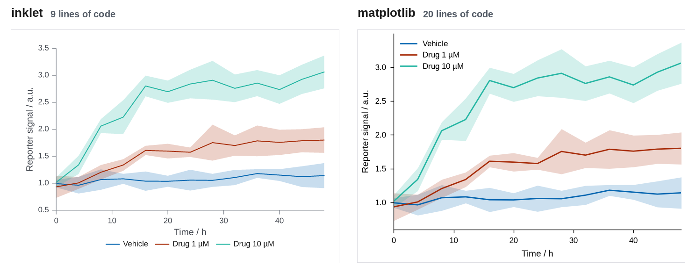
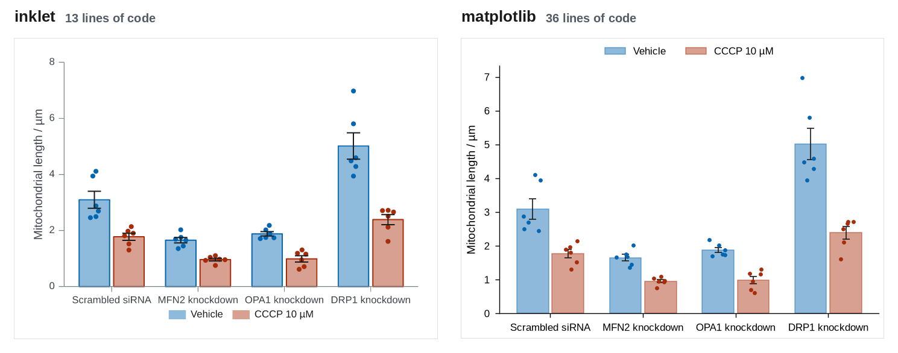
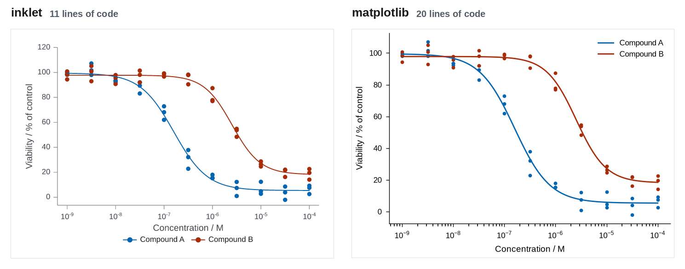
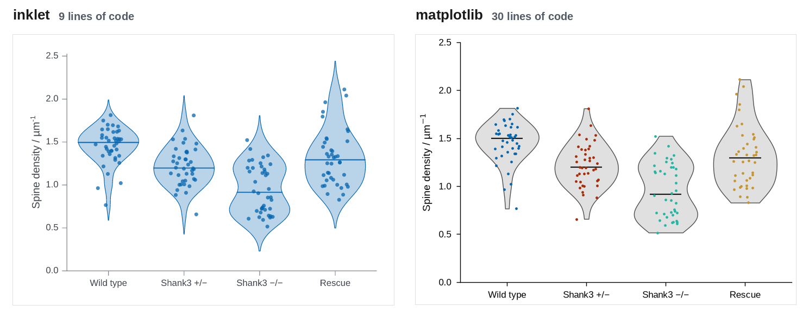
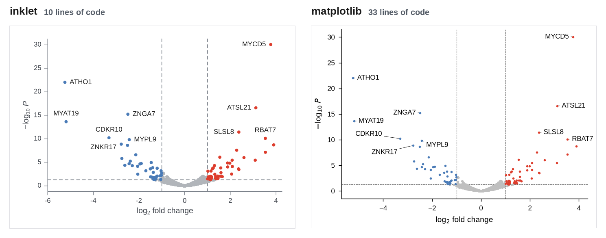
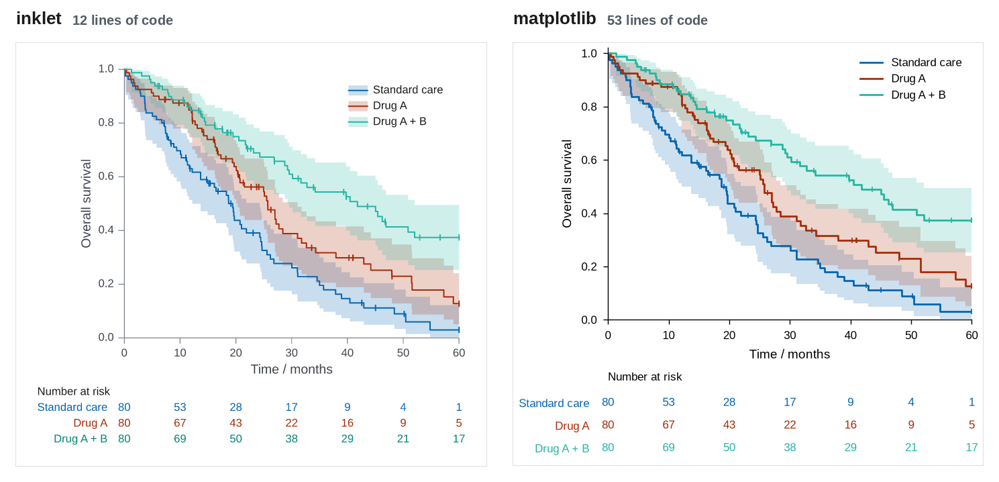
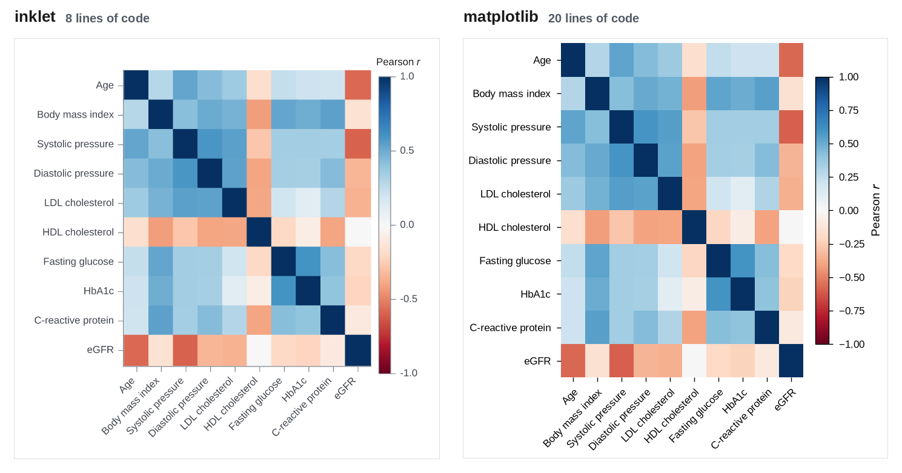
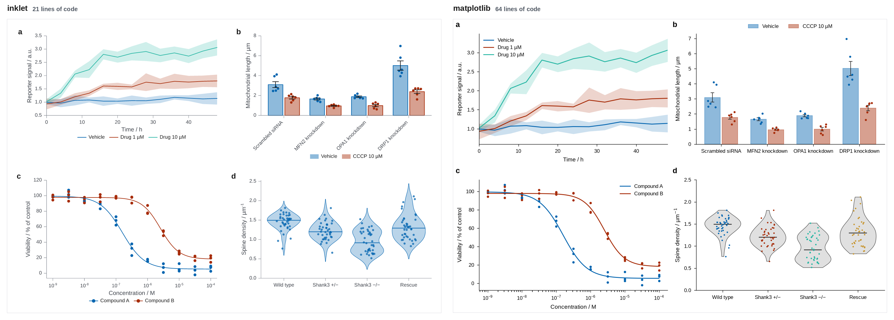

# inklet and matplotlib, side by side

This page puts inklet's one-call chart API next to matplotlib for eight figure
types that come up often in journal papers. Each pair plots the same simulated
data from [`examples/compare/data.py`](../examples/compare/data.py), which uses
fixed seeds. Both versions are rendered at the same physical size: 89 mm wide
for a single column and 183 mm for a double column, with matching heights,
saved as 200 dpi PNG and PDF.

The matplotlib versions are written the way an experienced user would write
them. They use `constrained_layout`, a shared
[`journal.mplstyle`](../examples/compare/journal.mplstyle) (7 pt Arial or
Liberation Sans, thin spines, and the same `inklet-vivid` colours as inklet's default)
and no third-party helpers beyond pandas and NumPy. Where a helper package
(lifelines, adjustText) would shorten the matplotlib code, the notes say so.
Problems found in inklet while building the gallery are listed with repro
snippets in [`examples/compare/ISSUES.md`](../examples/compare/ISSUES.md). The
fixed ones are kept there as regression cases. The open ones are pointed out
in the notes below, and none of the inklet scripts contains a workaround.

Rebuild everything with:

```sh
python tools/compare_gallery.py
```

That command runs all sixteen scripts and writes `gallery/compare/*-side-by-side.png`
and `gallery/compare/summary.json`.

Line counts are non-blank, non-comment lines of each script. Each script
has about nine lines of boilerplate: imports, the path to `data.py`, the style
file (matplotlib only) and saving. The inklet scripts also print
`figure.report()`, the layout check that inklet recommends after every save.

## Time course with 95% CI bands



89 × 63.2 mm · inklet 9 lines, matplotlib 20 lines · inklet report: `inklet lint: clean, 0 diagnostics`

**Where inklet helps:** One call draws the means, translucent bands in the series colours, the axis titles and a legend under the plot.

**Where matplotlib is better, or inklet needed a workaround:** The two scripts are close. matplotlib needs a loop, `fill_between` and colour matching, about five more lines. The legend placement differs: inklet puts the key under the axes, and matplotlib's `legend()` places it inside, at the spot with least overlap.

inklet ([`time_course/inklet_version.py`](../examples/compare/time_course/inklet_version.py)):

```python
import sys
from pathlib import Path

sys.path.insert(0, str(Path(__file__).resolve().parents[1]))

import inklet as i

from data import outputs, time_course

chart = i.line(time_course(), x='time', y='mean', color='condition', error_y='ci',
               xlabel='Time / h', ylabel='Reporter signal / a.u.', xlim=(0, 48))
figure = chart.save(*outputs('time_course', 'inklet'), dpi=200)
print(figure.report())
```

matplotlib ([`time_course/matplotlib_version.py`](../examples/compare/time_course/matplotlib_version.py)):

```python
import sys
from pathlib import Path

sys.path.insert(0, str(Path(__file__).resolve().parents[1]))

import matplotlib
matplotlib.use('Agg')
import matplotlib.pyplot as plt

from data import MM, outputs, time_course

plt.style.use(Path(__file__).resolve().parents[1] / 'journal.mplstyle')
df = time_course()

fig, ax = plt.subplots(figsize=(89 * MM, 63.2 * MM))
for condition, group in df.groupby('condition', sort=False):
    line, = ax.plot(group['time'], group['mean'], label=condition)
    ax.fill_between(group['time'], group['mean'] - group['ci'], group['mean'] + group['ci'],
                    color=line.get_color(), alpha=0.2, linewidth=0)
ax.set_xlim(0, 48)
ax.set_xlabel('Time / h')
ax.set_ylabel('Reporter signal / a.u.')
ax.legend()
for path in outputs('time_course', 'matplotlib'):
    fig.savefig(path)
```

## Grouped bars with error bars and points



89 × 63.2 mm · inklet 13 lines, matplotlib 36 lines · inklet report: `inklet lint: clean, 0 diagnostics`

**Where inklet helps:** `barplot` computes the means and SEMs, dodges the two series, places every observation inside its bar without random jitter, and adds the legend. matplotlib needs manual bar offsets, a `groupby` for the statistics and a jitter loop.

**Where matplotlib is better, or inklet needed a workaround:** matplotlib exposes bar width, cap size and point placement directly, and inklet's swarm layout inside each bar has fewer controls.

inklet ([`grouped_bars/inklet_version.py`](../examples/compare/grouped_bars/inklet_version.py)):

```python
import sys
from pathlib import Path

sys.path.insert(0, str(Path(__file__).resolve().parents[1]))

import inklet as i

from data import mitochondria, outputs

df = mitochondria()
genotypes = list(df['genotype'].unique())
samples = [[df.length[(df.genotype == g) & (df.treatment == t)].tolist() for g in genotypes]
           for t in ('Vehicle', 'CCCP')]

chart = i.chart(ylabel='Mitochondrial length / µm')
chart.barplot(genotypes, samples, name=['Vehicle', 'CCCP 10 µM'])
figure = chart.save(*outputs('grouped_bars', 'inklet'), dpi=200)
print(figure.report())
```

matplotlib ([`grouped_bars/matplotlib_version.py`](../examples/compare/grouped_bars/matplotlib_version.py)):

```python
import sys
from pathlib import Path

sys.path.insert(0, str(Path(__file__).resolve().parents[1]))

import matplotlib
matplotlib.use('Agg')
import matplotlib.pyplot as plt
import numpy as np

from data import MM, mitochondria, outputs

plt.style.use(Path(__file__).resolve().parents[1] / 'journal.mplstyle')
df = mitochondria()
genotypes = list(df['genotype'].unique())
treatments = {'Vehicle': 'Vehicle', 'CCCP': 'CCCP 10 µM'}
stats = df.groupby(['genotype', 'treatment'])['length'].agg(['mean', 'sem'])
rng = np.random.default_rng(0)

fig, ax = plt.subplots(figsize=(89 * MM, 63.2 * MM))
x = np.arange(len(genotypes))
width = 0.38
for k, (treatment, label) in enumerate(treatments.items()):
    color = f'C{k}'
    offset = (k - 0.5) * width
    means = [stats.loc[(g, treatment), 'mean'] for g in genotypes]
    sems = [stats.loc[(g, treatment), 'sem'] for g in genotypes]
    ax.bar(x + offset, means, width * 0.9, color=color, alpha=0.45, edgecolor=color,
           linewidth=0.6, label=label)
    ax.errorbar(x + offset, means, yerr=sems, fmt='none', ecolor='0.1', elinewidth=0.6,
                capsize=2, capthick=0.6)
    for j, g in enumerate(genotypes):
        values = df.length[(df.genotype == g) & (df.treatment == treatment)]
        jitter = rng.uniform(-0.1, 0.1, len(values))
        ax.scatter(x[j] + offset + jitter, values, s=6, color=color, zorder=3, linewidth=0)
ax.set_xticks(x, genotypes)
ax.set_ylabel('Mitochondrial length / µm')
ax.set_ylim(bottom=0)
ax.legend(ncols=2, loc='lower center', bbox_to_anchor=(0.5, 1.0))
for path in outputs('grouped_bars', 'matplotlib'):
    fig.savefig(path)
```

## Dose-response with fitted curves



89 × 63.2 mm · inklet 11 lines, matplotlib 20 lines · inklet report: `inklet lint: clean, 0 diagnostics`

**Where inklet helps:** Points and fitted curves of the same compound share a colour and one legend entry without extra code. Both libraries label the log axis as powers of ten.

**Where matplotlib is better, or inklet needed a workaround:** The two scripts are similar in length, and matplotlib is equally direct. The four-parameter fit is in `data.py` (no SciPy here), so neither script contains it.

inklet ([`dose_response/inklet_version.py`](../examples/compare/dose_response/inklet_version.py)):

```python
import sys
from pathlib import Path

sys.path.insert(0, str(Path(__file__).resolve().parents[1]))

import inklet as i

from data import dose_response, outputs

points, curves, ec50 = dose_response()
chart = i.scatter(points, x='conc', y='viability', color='compound', size=1.2, xscale='log',
                  xlabel='Concentration / M', ylabel='Viability / % of control')
chart.line(curves, x='conc', y='fit', color='compound')
figure = chart.save(*outputs('dose_response', 'inklet'), dpi=200)
print(figure.report())
```

matplotlib ([`dose_response/matplotlib_version.py`](../examples/compare/dose_response/matplotlib_version.py)):

```python
import sys
from pathlib import Path

sys.path.insert(0, str(Path(__file__).resolve().parents[1]))

import matplotlib
matplotlib.use('Agg')
import matplotlib.pyplot as plt

from data import MM, dose_response, outputs

plt.style.use(Path(__file__).resolve().parents[1] / 'journal.mplstyle')
points, curves, ec50 = dose_response()

fig, ax = plt.subplots(figsize=(89 * MM, 63.2 * MM))
for k, (compound, group) in enumerate(points.groupby('compound')):
    fit = curves[curves.compound == compound]
    ax.scatter(group['conc'], group['viability'], s=8, color=f'C{k}', linewidth=0)
    ax.plot(fit['conc'], fit['fit'], color=f'C{k}', label=compound)
ax.set_xscale('log')
ax.set_xlabel('Concentration / M')
ax.set_ylabel('Viability / % of control')
ax.legend()
for path in outputs('dose_response', 'matplotlib'):
    fig.savefig(path)
```

## Violin and strip, four groups



89 × 63.2 mm · inklet 9 lines, matplotlib 30 lines · inklet report: `inklet lint: clean, 0 diagnostics`

**Where inklet helps:** `violin(points=True)` gives the violins, medians and coloured points in one call. matplotlib's `violinplot` needs seven lines to restyle its bodies and medians, and a loop for the points.

**Where matplotlib is better, or inklet needed a workaround:** The default density extent differs. inklet extends each violin two bandwidths past the data, like seaborn, and matplotlib stops at the data range. Neither is wrong, but the shapes differ, and inklet's tails can suggest values that were never observed (the Rescue violin reaches 2.45, while the largest observation is 2.11).

inklet ([`distributions/inklet_version.py`](../examples/compare/distributions/inklet_version.py)):

```python
import sys
from pathlib import Path

sys.path.insert(0, str(Path(__file__).resolve().parents[1]))

import inklet as i

from data import distributions, outputs

chart = i.violin(distributions(), x='genotype', y='density', points=True,
                 xlabel='', ylabel='Spine density / µm^{-1}')
figure = chart.save(*outputs('distributions', 'inklet'), dpi=200)
print(figure.report())
```

matplotlib ([`distributions/matplotlib_version.py`](../examples/compare/distributions/matplotlib_version.py)):

```python
import sys
from pathlib import Path

sys.path.insert(0, str(Path(__file__).resolve().parents[1]))

import matplotlib
matplotlib.use('Agg')
import matplotlib.pyplot as plt
import numpy as np

from data import MM, distributions, outputs

plt.style.use(Path(__file__).resolve().parents[1] / 'journal.mplstyle')
df = distributions()
groups = list(df['genotype'].unique())
samples = [df.density[df.genotype == g].to_numpy() for g in groups]
rng = np.random.default_rng(0)

fig, ax = plt.subplots(figsize=(89 * MM, 63.2 * MM))
parts = ax.violinplot(samples, showmedians=True, showextrema=False, widths=0.8)
for body in parts['bodies']:
    body.set_facecolor('0.88')
    body.set_edgecolor('0.3')
    body.set_linewidth(0.5)
    body.set_alpha(1)
parts['cmedians'].set_color('0.1')
parts['cmedians'].set_linewidth(0.8)
for k, values in enumerate(samples, start=1):
    ax.scatter(k + rng.uniform(-0.15, 0.15, len(values)), values, s=3, color=f'C{k - 1}',
               linewidth=0, zorder=3)
ax.set_xticks(range(1, len(groups) + 1), groups)
ax.set_ylabel('Spine density / µm$^{-1}$')
ax.set_ylim(0, 2.5)
for path in outputs('distributions', 'matplotlib'):
    fig.savefig(path)
```

## Volcano plot with labelled hits



89 × 63.2 mm · inklet 10 lines, matplotlib 33 lines · inklet report: `inklet lint: 1 info`

**Where inklet helps:** `Panel.volcano` classifies the genes, draws the threshold rules and labels the ten smallest p-values clear of the points and of each other. In matplotlib, six of the ten labels needed hand-tuned offsets. `adjustText`, a third-party package, would automate that step but is not installed here.

**Where matplotlib is better, or inklet needed a workaround:** matplotlib's hand-placed labels can be tuned label by label, but they have to be re-tuned for new data; inklet places them automatically and adds a leader when a neighbour is nearly as close as the labelled point.

inklet ([`volcano/inklet_version.py`](../examples/compare/volcano/inklet_version.py)):

```python
import sys
from pathlib import Path

sys.path.insert(0, str(Path(__file__).resolve().parents[1]))

import inklet as i

from data import outputs, volcano

df = volcano()
chart = i.chart(xlabel='log_{2} fold change', ylabel='−log_{10} //P//')
chart.volcano(df['log2fc'], df['p'], labels=df['gene'], top=10, size=1.0)
figure = chart.save(*outputs('volcano', 'inklet'), dpi=200)
print(figure.report())
```

matplotlib ([`volcano/matplotlib_version.py`](../examples/compare/volcano/matplotlib_version.py)):

```python
import sys
from pathlib import Path

sys.path.insert(0, str(Path(__file__).resolve().parents[1]))

import matplotlib
matplotlib.use('Agg')
import matplotlib.pyplot as plt
import numpy as np

from data import MM, outputs, volcano

plt.style.use(Path(__file__).resolve().parents[1] / 'journal.mplstyle')
df = volcano()
df['y'] = -np.log10(df['p'])
significant = (df['p'] < 0.05) & (df['log2fc'].abs() >= 1)
classes = {'ns': (~significant, '0.75'),
           'down': (significant & (df['log2fc'] < 0), '#4a7bb7'),
           'up': (significant & (df['log2fc'] > 0), '#dd3d2d')}

fig, ax = plt.subplots(figsize=(89 * MM, 63.2 * MM))
for mask, color in classes.values():
    ax.scatter(df.log2fc[mask], df.y[mask], s=4, color=color, linewidth=0)
for x in (-1, 1):
    ax.axvline(x, color='0.4', linewidth=0.4, linestyle='--', zorder=0)
ax.axhline(-np.log10(0.05), color='0.4', linewidth=0.4, linestyle='--', zorder=0)
nudge = {'ZNKR17': (-14, -6), 'CDKR10': (-16, 4), 'MYPL9': (4, -4), 'ATHO1': (4, 0),
         'MYAT19': (4, 0), 'MYCD5': (-4, 0)}
for _, row in df[significant].nsmallest(10, 'p').iterrows():
    default = (4, 0) if row.log2fc > 0 else (-4, 0)
    offset = nudge.get(row.gene, default)
    ax.annotate(row.gene, (row.log2fc, row.y), xytext=offset, textcoords='offset points',
                ha='left' if offset[0] > 0 else 'right', va='center', fontsize=6,
                arrowprops=dict(arrowstyle='-', linewidth=0.3, shrinkA=0, shrinkB=1))
ax.set_xlabel('log$_2$ fold change')
ax.set_ylabel('$-$log$_{10}$ $P$')
for path in outputs('volcano', 'matplotlib'):
    fig.savefig(path)
```

## Kaplan-Meier curves with number at risk



89 × 80 mm · inklet 12 lines, matplotlib 53 lines · inklet report: `inklet lint: 2 infos`

**Where inklet helps:** `kaplan_meier` computes the estimate, the log-log confidence band and the censor ticks, and `at_risk()` adds a number-at-risk table aligned with the x ticks. matplotlib has no Kaplan-Meier support. 12 of its 53 lines are a hand-written estimator, and the table needs a second axes. With `lifelines` (not installed here), `KaplanMeierFitter` and `add_at_risk_counts` would shorten it considerably.

**Where matplotlib is better, or inklet needed a workaround:** Both versions blend overlapping confidence bands. matplotlib needs a hand-written estimator (or lifelines) and a second axes for the at-risk table.

inklet ([`survival/inklet_version.py`](../examples/compare/survival/inklet_version.py)):

```python
import sys
from pathlib import Path

sys.path.insert(0, str(Path(__file__).resolve().parents[1]))

import inklet as i

from data import outputs, survival

df = survival()
arms = {arm: (group['months'], group['event']) for arm, group in df.groupby('arm', sort=False)}
chart = i.chart(xlabel='Time / months', ylabel='Overall survival', xlim=(0, 60), ylim=(0, 1),
                height=72)
chart.kaplan_meier(arms).legend(corner='ne').at_risk()
figure = chart.save(*outputs('survival', 'inklet'), dpi=200)
print(figure.report())
```

matplotlib ([`survival/matplotlib_version.py`](../examples/compare/survival/matplotlib_version.py)):

```python
import sys
from pathlib import Path

sys.path.insert(0, str(Path(__file__).resolve().parents[1]))

import matplotlib
matplotlib.use('Agg')
import matplotlib.pyplot as plt
import numpy as np

from data import MM, outputs, survival


def kaplan_meier(time, event, z=1.96):
    """Survival steps with a log-log Greenwood confidence band."""
    times = np.unique(time[event == 1])
    at_risk = np.array([(time >= t).sum() for t in times])
    deaths = np.array([((time == t) & (event == 1)).sum() for t in times])
    s = np.cumprod(1 - deaths / at_risk)
    with np.errstate(divide='ignore', invalid='ignore'):
        var = np.cumsum(deaths / (at_risk * (at_risk - deaths))) / np.log(s) ** 2
        lo, hi = (s ** np.exp(sign * z * np.sqrt(var)) for sign in (1, -1))
    pad = lambda v: np.r_[1.0, v, v[-1]]
    steps = np.r_[0, times, time.max()]
    return steps, pad(s), pad(np.nan_to_num(lo)), pad(np.nan_to_num(hi, nan=1.0))


plt.style.use(Path(__file__).resolve().parents[1] / 'journal.mplstyle')
df = survival()
ticks = np.arange(0, 61, 10)

fig, (ax, risk) = plt.subplots(2, 1, figsize=(89 * MM, 80 * MM), sharex=True,
                               height_ratios=[4, 1])
arms = []
for k, (arm, group) in enumerate(df.groupby('arm', sort=False)):
    time, event = group['months'].to_numpy(), group['event'].to_numpy()
    t, s, lo, hi = kaplan_meier(time, event)
    ax.step(t, s, where='post', color=f'C{k}', label=arm)
    ax.fill_between(t, lo, hi, step='post', color=f'C{k}', alpha=0.2, linewidth=0)
    censored = np.sort(time[event == 0])
    ax.plot(censored, s[np.searchsorted(t, censored, side='right') - 1], '|', color=f'C{k}',
            markersize=3, markeredgewidth=0.6)
    for tick in ticks:
        risk.text(tick, k, (time >= tick).sum(), ha='center', va='center', color=f'C{k}', fontsize=6)
    arms.append(arm)
ax.set_xlim(0, 60)
ax.set_ylim(0, 1.02)
ax.set_xticks(ticks)
ax.tick_params(labelbottom=True)
ax.set_xlabel('Time / months')
ax.set_ylabel('Overall survival')
ax.legend(loc='upper right')
risk.set_ylim(len(arms) - 0.5, -0.5)
risk.set_yticks(range(len(arms)), arms)
for label, k in zip(risk.get_yticklabels(), range(len(arms))):
    label.set_color(f'C{k}')
risk.tick_params(length=0, pad=10, labelbottom=False)
risk.spines[:].set_visible(False)
risk.set_title('Number at risk', loc='left', fontsize=6)
for path in outputs('survival', 'matplotlib'):
    fig.savefig(path)
```

## Correlation heatmap



89 × 88 mm · inklet 8 lines, matplotlib 20 lines · inklet report: `inklet lint: clean, 0 diagnostics`

**Where inklet helps:** Row and column labels come from the DataFrame, the rotated x labels are chosen automatically, and `colorbar='Pearson //r//'` titles the colour bar in the same call.

**Where matplotlib is better, or inklet needed a workaround:** matplotlib's `imshow` plus `colorbar` is about as direct, and most of its extra lines are tick setup.

inklet ([`heatmap/inklet_version.py`](../examples/compare/heatmap/inklet_version.py)):

```python
import sys
from pathlib import Path

sys.path.insert(0, str(Path(__file__).resolve().parents[1]))

import inklet as i

from data import correlation, outputs

chart = i.heatmap(correlation(), palette='rdbu', center=0, height=80, colorbar='Pearson //r//')
figure = chart.save(*outputs('heatmap', 'inklet'), dpi=200)
print(figure.report())
```

matplotlib ([`heatmap/matplotlib_version.py`](../examples/compare/heatmap/matplotlib_version.py)):

```python
import sys
from pathlib import Path

sys.path.insert(0, str(Path(__file__).resolve().parents[1]))

import matplotlib
matplotlib.use('Agg')
import matplotlib.pyplot as plt

from data import MM, correlation, outputs

plt.style.use(Path(__file__).resolve().parents[1] / 'journal.mplstyle')
corr = correlation()

fig, ax = plt.subplots(figsize=(89 * MM, 88 * MM))
image = ax.imshow(corr, cmap='RdBu', vmin=-1, vmax=1, aspect='auto')
ax.set_xticks(range(len(corr.columns)), corr.columns, rotation=45, ha='right',
              rotation_mode='anchor')
ax.set_yticks(range(len(corr.index)), corr.index)
ax.spines[:].set_visible(False)
colorbar = fig.colorbar(image, ax=ax, shrink=0.8)
colorbar.set_label('Pearson $r$')
colorbar.outline.set_linewidth(0.5)
for path in outputs('heatmap', 'matplotlib'):
    fig.savefig(path)
```

## Four-panel double-column figure



183 × 123.8 mm · inklet 21 lines, matplotlib 64 lines · inklet report: `inklet lint: clean, 0 diagnostics`

**Where inklet helps:** The four single-panel chart definitions combine with `(a | b) / (c | d)` at double-column width, with letters, the same type sizes and aligned axes. The crowded bar labels in panel b are turned automatically.

**Where matplotlib is better, or inklet needed a workaround:** matplotlib's constrained layout and `fig.align_labels()` also align the axes. Measured on the PNGs, the y-axis spines of both columns line up in both versions. Panel letters take a `ScaledTranslation` per axes. The matplotlib line count includes code copied from the single figures. Factoring that into shared functions, as a real project would, makes the composite itself much shorter.

inklet ([`multi_panel/inklet_version.py`](../examples/compare/multi_panel/inklet_version.py)):

```python
import sys
from pathlib import Path

sys.path.insert(0, str(Path(__file__).resolve().parents[1]))

import inklet as i

from data import distributions, dose_response, mitochondria, outputs, time_course

course = i.line(time_course(), x='time', y='mean', color='condition', error_y='ci',
                xlabel='Time / h', ylabel='Reporter signal / a.u.', xlim=(0, 48))

cells = mitochondria()
genotypes = list(cells['genotype'].unique())
samples = [[cells.length[(cells.genotype == g) & (cells.treatment == t)].tolist() for g in genotypes]
           for t in ('Vehicle', 'CCCP')]
bars = i.chart(ylabel='Mitochondrial length / µm')
bars.barplot(genotypes, samples, name=['Vehicle', 'CCCP 10 µM'])

points, curves, ec50 = dose_response()
dose = i.scatter(points, x='conc', y='viability', color='compound', size=1.2, xscale='log',
                 xlabel='Concentration / M', ylabel='Viability / % of control')
dose.line(curves, x='conc', y='fit', color='compound')

spread = i.violin(distributions(), x='genotype', y='density', points=True,
                  xlabel='', ylabel='Spine density / µm^{-1}')

figure = ((course | bars) / (dose | spread)).save(*outputs('multi_panel', 'inklet'), dpi=200)
print(figure.report())
```

matplotlib ([`multi_panel/matplotlib_version.py`](../examples/compare/multi_panel/matplotlib_version.py)):

```python
import sys
from pathlib import Path

sys.path.insert(0, str(Path(__file__).resolve().parents[1]))

import matplotlib
matplotlib.use('Agg')
import matplotlib.pyplot as plt
import numpy as np
from matplotlib.transforms import ScaledTranslation

from data import MM, distributions, dose_response, mitochondria, outputs, time_course

plt.style.use(Path(__file__).resolve().parents[1] / 'journal.mplstyle')
rng = np.random.default_rng(0)
fig, axes = plt.subplots(2, 2, figsize=(183 * MM, 123.8 * MM))
(ax_a, ax_b), (ax_c, ax_d) = axes

course = time_course()
for condition, group in course.groupby('condition', sort=False):
    line, = ax_a.plot(group['time'], group['mean'], label=condition)
    ax_a.fill_between(group['time'], group['mean'] - group['ci'], group['mean'] + group['ci'],
                      color=line.get_color(), alpha=0.2, linewidth=0)
ax_a.set(xlim=(0, 48), xlabel='Time / h', ylabel='Reporter signal / a.u.')
ax_a.legend()

cells = mitochondria()
genotypes = list(cells['genotype'].unique())
stats = cells.groupby(['genotype', 'treatment'])['length'].agg(['mean', 'sem'])
x = np.arange(len(genotypes))
for k, (treatment, label) in enumerate({'Vehicle': 'Vehicle', 'CCCP': 'CCCP 10 µM'}.items()):
    offset = (k - 0.5) * 0.38
    means = [stats.loc[(g, treatment), 'mean'] for g in genotypes]
    sems = [stats.loc[(g, treatment), 'sem'] for g in genotypes]
    ax_b.bar(x + offset, means, 0.34, color=f'C{k}', alpha=0.45, edgecolor=f'C{k}',
             linewidth=0.6, label=label)
    ax_b.errorbar(x + offset, means, yerr=sems, fmt='none', ecolor='0.1', elinewidth=0.6,
                  capsize=2, capthick=0.6)
    for j, g in enumerate(genotypes):
        values = cells.length[(cells.genotype == g) & (cells.treatment == treatment)]
        ax_b.scatter(x[j] + offset + rng.uniform(-0.1, 0.1, len(values)), values, s=6,
                     color=f'C{k}', zorder=3, linewidth=0)
ax_b.set_xticks(x, genotypes)
ax_b.set(ylabel='Mitochondrial length / µm', ylim=(0, None))
ax_b.legend(ncols=2, loc='lower center', bbox_to_anchor=(0.5, 1.0))

points, curves, ec50 = dose_response()
for k, (compound, group) in enumerate(points.groupby('compound')):
    fit = curves[curves.compound == compound]
    ax_c.scatter(group['conc'], group['viability'], s=8, color=f'C{k}', linewidth=0)
    ax_c.plot(fit['conc'], fit['fit'], color=f'C{k}', label=compound)
ax_c.set(xscale='log', xlabel='Concentration / M', ylabel='Viability / % of control')
ax_c.legend()

spread = distributions()
groups = list(spread['genotype'].unique())
samples = [spread.density[spread.genotype == g].to_numpy() for g in groups]
parts = ax_d.violinplot(samples, showmedians=True, showextrema=False, widths=0.8)
for body in parts['bodies']:
    body.set(facecolor='0.88', edgecolor='0.3', linewidth=0.5, alpha=1)
parts['cmedians'].set(color='0.1', linewidth=0.8)
for k, values in enumerate(samples, start=1):
    ax_d.scatter(k + rng.uniform(-0.15, 0.15, len(values)), values, s=3, color=f'C{k - 1}',
                 linewidth=0, zorder=3)
ax_d.set_xticks(range(1, len(groups) + 1), groups)
ax_d.set(ylabel='Spine density / µm$^{-1}$', ylim=(0, 2.5))

for ax, letter in zip(axes.flat, 'abcd'):
    ax.text(0, 1, letter, transform=ax.transAxes + ScaledTranslation(-28 / 72, 6 / 72, fig.dpi_scale_trans),
            fontsize=9, fontweight='bold', va='bottom')
fig.align_labels()
for path in outputs('multi_panel', 'matplotlib'):
    fig.savefig(path)
```

## Lines of code

| Figure | inklet | matplotlib | inklet report |
|---|---:|---:|---|
| Time course with 95% CI bands | 9 | 20 | `inklet lint: clean, 0 diagnostics` |
| Grouped bars with error bars and points | 13 | 36 | `inklet lint: clean, 0 diagnostics` |
| Dose-response with fitted curves | 11 | 20 | `inklet lint: clean, 0 diagnostics` |
| Violin and strip, four groups | 9 | 30 | `inklet lint: clean, 0 diagnostics` |
| Volcano plot with labelled hits | 10 | 33 | `inklet lint: 1 info` |
| Kaplan-Meier curves with number at risk | 12 | 53 | `inklet lint: 2 infos` |
| Correlation heatmap | 8 | 20 | `inklet lint: clean, 0 diagnostics` |
| Four-panel double-column figure | 21 | 64 | `inklet lint: clean, 0 diagnostics` |
| **Total** | **93** | **276** | |

Shared files are not counted above: `data.py` (135 lines, used by
both) and `journal.mplstyle` (23 lines, matplotlib only).

Line counts measure typing, not quality. The bigger differences are in the
domain plots. matplotlib needed a hand-written Kaplan-Meier estimator and
hand-placed volcano labels, and inklet has both built in. For the plain
charts (lines, scatter, heatmap) the matplotlib code is short and direct, and
both libraries produce clean figures at print size.
