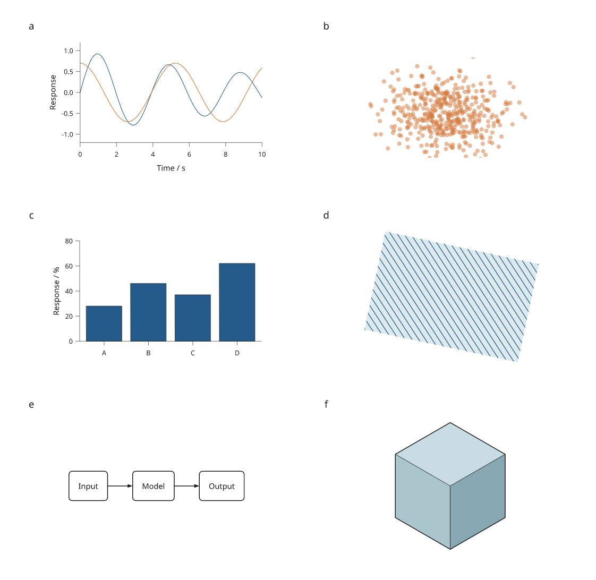

# Shared compiled scenes

This is the first engine increment **after 4.0.0.dev2**. SVG, PDF and native
PNG now consume one resolved scene. Compiled documents retain that scene across
exports and reuse geometry and unchanged nodes across revisions. The next
increment adds [packed vector markers](marker-batches.md) for dense scatter.
The [browser viewer](compiled-viewer.md) consumes these snapshots offline.



[Complete recipe](../examples/render_scene_review.py) ·
[Initial figure](../gallery/render-scene-initial.png) ·
[Data revision](../gallery/render-scene-data.png) ·
[LaTeX caption](assets/research-preview/render-scene-caption.tex)

The artwork uses simulated inputs. The displayed revision changes only the
cloud colour. The recipe also changes the category values and verifies that
reusing a previous scene produces the same SVG as fresh compilation.

## Compile once, export several formats

```python
import inklet as i

points = i.place([((x, x / 3), i.marker("circle", 2, fill="#245b8a"))
                  for x in range(-12, 13, 3)])
view = i.window(points, i.Rect(-10, -6, 10, 6))
scene = i.compile_scene(view)
svg = scene.to_svg(margin=2)
pdf = scene.to_pdf(margin=2)
```

`compile_scene()` resolves world transforms, inherited styles, local and
inherited clips, placement identity and compositing groups. Backends consume
those resolved values instead of repeating source-tree resolution. Geometry
bounds and paint counts are evaluated lazily and retained by the snapshot.
The page sizing contract is shared by SVG, PDF and PNG.

`document.compile()` provides the same object as `compiled.scene` and uses it
for `to_svg()`, `to_pdf()`, `to_png()`, `save()` and bundle export. The original
`compiled.root` remains available for diagnostics and inspection. Changing
mutable notes on that tree cannot change the scene's recorded blend mode.

## Revise a drawing

```python
import inklet as i

shape = i.marker("circle", 8, fill="#245b8a")
first = i.compile_scene(shape)
second = i.compile_scene(shape.styled(fill="#d17839"), previous=first)
assert second.stats["new_geometry"] == 0
assert first.to_svg() != second.to_svg()
print(dict(second.stats))
```

For documents, `document.replace()` retains the previous rendering snapshot
for reuse during the next compilation. Changes to inherited paint, transforms,
clips, geometry and child structure are recorded separately. A node is reused
only if its own resolved state and its children are unchanged.

Small immutable shapes and shaped text are shared by value. Dense path
primitives are shared by object identity, avoiding a fresh hash of every point
on every edit. Reuse is scoped to the current compilation and its supplied
previous snapshot; there is no unbounded process-wide scene cache.

| Revision in the complete example | Visited nodes | Reused nodes | New geometry resources |
| --- | ---: | ---: | ---: |
| Initial compilation | 1,089 | 0 | 76 |
| Cloud colour change | 1,089 | 182 | 0 |
| Category values change | 1,089 | 1,047 | 15 |

The scene has 526 primitive placements. Its repeated markers share geometry.
Changing their inherited colour still updates their resolved placement records.

`scene.stats` distinguishes visited, rebuilt and reused nodes, unique new and
reused geometry resources, primitive placements, and retained file-image bytes.
`scene.changes` records affected structural keys, source node IDs and reasons.
`scene.damage_bounds(previous)` returns conservative old/new redraw coverage;
compositing groups and page-size changes can enlarge it.

**This is incremental render compilation, not incremental document layout or
partial export.** Changed documents still run the layout pipeline, scene
compilation still visits the source tree, and exporters still write complete
files. Damage bounds describe coverage for a future interactive renderer.
They are not an exact object hit test or a GPU implementation.

## Snapshot resources

Missing image files and explicitly referenced font files now fail before
export. This intentionally replaces the previous SVG behavior of emitting
broken image links or falling back to viewer fonts when a file was missing.

File-backed images are read once per source path during scene compilation and
retained as bytes. Replacing or deleting the file does not alter an existing
snapshot. A subsequent document compilation detects changed image bytes and
creates a new snapshot. Low-level exports of an ordinary `Diagram` compile a
fresh scene, so they continue to read its current image files.

Font files must remain stable during an authoring process. Scenes fingerprint
their referenced fonts and verify them before and after export. Changed or
missing fonts fail explicitly; restart the process and rebuild the figure
rather than mixing cached shaping with a different font file. Live SVG font-name
mode still depends on the viewer's installed fonts; use embedded or outlined
text for controlled exports.

## Complete-figure measurements

Three fresh processes per workload on the same Linux/WSL2 Python 3.12.3 machine.
The comparison source is release commit `f444a3d`; raw reports include source
hashes and all repeats. Numbers are local measurements, not speed guarantees.

| Workload / phase | Before | Compiled scenes |
| --- | ---: | ---: |
| 64 plots: document compilation | 0.681 s | 0.772 s |
| 64 plots: first SVG export | 0.176 s | 0.116 s |
| 64 plots: first PDF export | 0.0610 s | 0.0504 s |
| 64 plots: repeated SVG + PDF | 0.0976 s | 0.0828 s |
| 32 nested opacity groups: repeated SVG + PDF | 0.0894 s | 0.0642 s |
| 64 images: repeated SVG + PDF | 0.00769 s | 0.00734 s |

Compilation has additional work and storage: the 64-plot case rose from
95.35 to 98.98 MiB peak process memory. Its first compile-plus-SVG-plus-PDF total
was approximately 0.918 s before and 0.939 s after. Repeated exports benefit
from retained resolution and analysis; this increment does not improve every
phase. SVG and PDF byte counts are unchanged for all three workloads.

[Before measurements](assets/research-preview/scenes-before.json) ·
[After measurements](assets/research-preview/scenes-after.json) ·
[Benchmark script](../tools/benchmark_engine.py)

## Next engine stages

The shared scene is the first part of the [4.0 engine plan](design/v4.md).
The remaining stages are:

1. Extend the [packed vector markers](marker-batches.md) increment to paths
   and meshes, indexed queries and partial buffer updates.
2. Extend the [compiled browser viewer](compiled-viewer.md) beyond its WebGL2
   filled markers, Canvas fallback and native vector artwork.
3. Depth-aware 3D rendering, camera changes and object selection, with explicit
   annotation occlusion rules and a separate boundary for Blender jobs.
4. Finer dependency invalidation and measured layout constraints, so changing
   one component avoids unrelated work and explains conflicting requirements.

Acceptance will use a 20-panel figure containing a million-point cloud, a
detailed map, an annotated mesh, images and ordinary charts. Measure edit,
resize and export behavior separately, including memory and visual agreement.
Point batching and the WebGL2 filled-marker path are implemented by the
[marker-buffer](marker-batches.md) and [browser-viewer](compiled-viewer.md)
increments. Interactive camera control and broader GPU primitives remain open.
