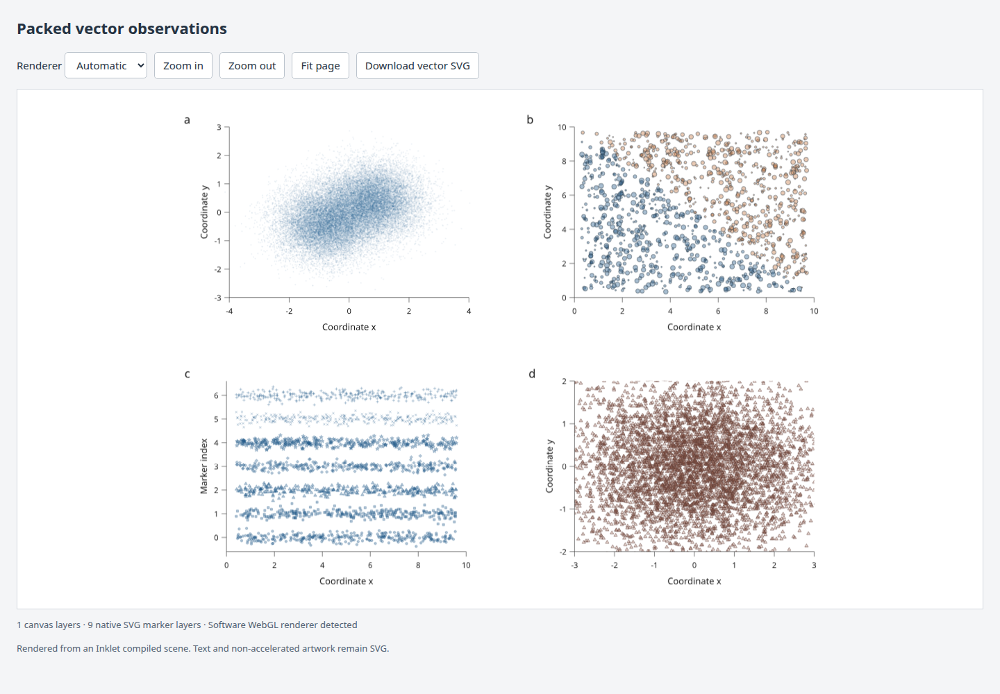
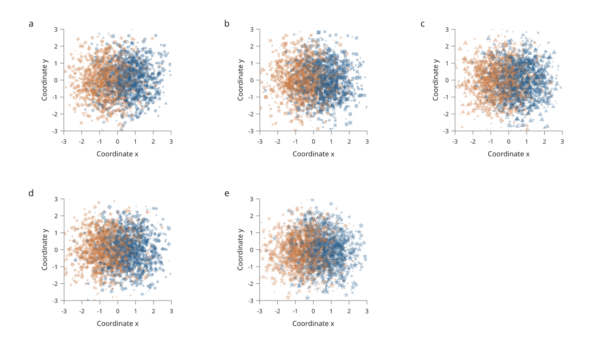
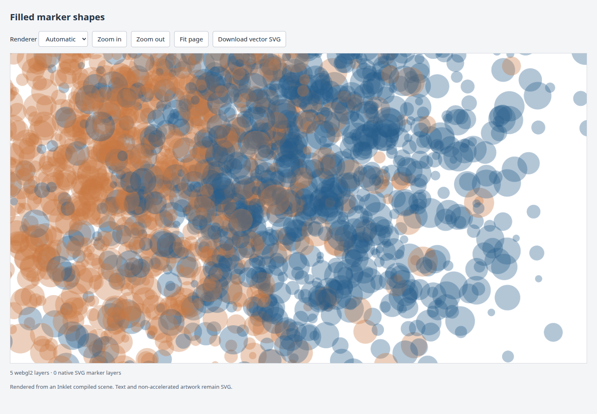

# Compiled-scene browser viewer

Available in **4.0.0.dev3**. `RenderScene.to_html()` is an offline viewer for
ordinary native figures, using the same compiled geometry, text, transforms,
clipping and paint order as SVG/PDF export.



[Open the interactive figure](assets/research-preview/compiled-scene-viewer.html) ·
[Complete Python recipe](../examples/compiled_scene_viewer.py) ·
[Figure caption](assets/research-preview/dense-scatter-caption.tex)

The example has 38,300 vector markers. Its 30,000 filled circles use the browser
buffer path; the other markers in this figure have outlines and use native SVG.
All inputs are simulated. Titles and controls belong to the viewer page;
the exported figure contains no added title or description.

## Filled marker shapes



[Open the five-panel figure](assets/research-preview/compiled-marker-shapes.html) ·
[Complete Python recipe](../examples/compiled_marker_shapes.py) ·
[Figure caption](assets/research-preview/compiled-marker-shapes-caption.tex)

This figure has 12,500 simulated observations. Every data layer can use WebGL2,
including concave stars. Each panel preserves per-point sizes, two overlapping
colours, transparency and clipping. The panel order is circle, square, triangle,
diamond and star; axes and panel letters stay native SVG.

## Export an existing compiled scene

```python
from pathlib import Path
import inklet as i

p = i.panel(80, 50, x=(0, 1), y=(0, 1))
p.scatter([((k * 0.61803398875) % 1, (k * 0.41421356237) % 1)
           for k in range(10_000)],
          size=0.5, color="#245b8a", fill_opacity=0.3, stroke="none")
p.axes(x="Coordinate x", y="Coordinate y")
f = i.figure(width=100)
f.add(p.build())
scene = i.compile_scene(f.build()[0])
Path("figure.html").write_text(scene.to_html(), encoding="utf-8")
```

A compiled document already supplies `compiled.scene`. The HTML contains its
runtime, marker buffers, outlined text and image resources; no server, CDN or
JavaScript package installation is required. Native SVG, PDF and PNG export
continue to use that same snapshot.

This viewer handles native compiled figures. The
[linked-plot viewer](linked-plots.md) can now use its shared executor with
`BrowserFigure.to_html(renderer='compiled', backend='auto')`. This opt-in bridge
retains keyed-row filtering, selection, saved views and atomic data revisions.
The [regional report](regional-report.md#shared-compiled-renderer) exercises the
complete workflow. Arbitrary native `RenderScene` objects still need explicit
semantic mappings before they can participate in those linked interactions.

## Rendering modes and fallback

| Mode | Behaviour |
| --- | --- |
| `auto` (default) | Try WebGL2; use Canvas for unavailable contexts or recognized software renderers. |
| `webgl2` | Try WebGL2 even on software implementations; fall back if initialization or drawing fails. |
| `canvas` | Draw eligible filled markers with Canvas 2D. |
| `svg` | Draw every marker as native vector elements. |

The GPU path supports packed circles, squares, triangles, diamonds and stars
with literal colours, per-point sizes and fill opacity, without visible outlines.
It also accepts a single simple closed polygon with 3–16 vertices, preserving nonzero
and even-odd fill rules. Open markers, rounded rectangles, curved or compound
paths, self-intersections, larger polygons, outlines and unsupported paint remain SVG. Text, curves, maps, images,
hatching, diagram content and native 3D projections keep their existing SVG
representation. This does not introduce live 3D camera manipulation.

The viewer reports the actual backend per layer, fallback reasons, optional
browser-reported renderer identity, buffer uploads and WebGL draw submissions through
`inkletScene.report()`. Browser privacy settings can hide renderer identity;
context availability alone does not prove that a physical GPU is being used.
`surfacePaints`, `surfaceResizes` and `reusedSurfaces` are cumulative counters
for actual surface paints, dimension changes and reused layers. Each layer also
reports its current `surfacePixels`, `visible` flag and `displayBox` in local
marker coordinates. Visibility is a conservative intersection with the SVG
viewport; native clip paths still decide the final visible ink. SVG-only layers
report `null` for visibility and display boxes. These are work and pixel counts, not GPU
memory or execution-time measurements.

At most eight WebGL contexts are allocated per viewer. Additional eligible
layers use Canvas. Each backing surface is capped at four million pixels and
4,096 pixels per dimension, or the lower WebGL limit. Surfaces grow in 128-pixel
steps where the pixel budget permits. A sufficient backing buffer is retained
until the requested area falls to one quarter of its allocated pixels; larger
zoom-outs shrink it. Local geometry is repainted when its surface resolution or retained display
region changes. Pan within the retained region and small zoom changes reuse the rendered layer while
SVG applies the view transform. The status reports when
zoom requires reduced display resolution. Context loss switches the affected
layer to Canvas; choosing a renderer again can retry initialization.

## Fidelity and resource ownership

A browser surface occupies the marker's original position in the SVG tree via
[`foreignObject`](https://developer.mozilla.org/en-US/docs/Web/SVG/Reference/Element/foreignObject).
The native ancestors continue to apply clipping, rotation, scaling, group
opacity and compositing. This keeps foreground annotations above the data and
preserves the order of overlapping layers.

WebGL uses [instanced triangles](https://developer.mozilla.org/en-US/docs/Web/API/WebGL2RenderingContext/drawArraysInstanced)
with distance-based circle or polygon coverage and premultiplied-alpha blending.
Polygon coverage uses the original vertices and winding rule, including concave
shapes; it needs neither a texture atlas nor per-point triangulation. Canvas paints
markers separately in source order. Display antialiasing differs between these
backends. Device-pixel scaling follows the SVG screen transform.

Original records remain 64-bit in the browser, and repeated placements share a
serialized source buffer. GPU record textures use 32-bit floats. View changes
redraw existing buffers without uploading geometry again. `dispose()` removes
DOM surfaces, observers, callbacks and GPU resources owned by the viewer.

**Download vector SVG** rebuilds marker shapes from the original records, retains
source indices without JavaScript integer rounding, and preserves native text,
clips and paint. It does not embed the GPU or Canvas image. The exported
viewport follows the current pan/zoom; PDF export remains in Python.

## Validation and measurements

Automated Chrome checks exercise forced WebGL2, Canvas and SVG, device-pixel
ratios 1 and 2, unavailable contexts, context loss, disposal, repeated instances,
invalid viewports, marker order and vector export. GPU alpha coverage is checked
against independent Canvas painting. Complete WebGL2 and Canvas screenshots
also agree with SVG under rotated clipping and group opacity; these checks
guard against browser layout rounding displacing the surface.
Exported vectors are rasterized separately
and compared with native Python SVG, including rotated clipping and group alpha.

The complete example's browser-exported SVG differs from its native reference
by less than 0.0003 mean RGB units on a 0–255 scale at 1,122 × 845 pixels.
That measures vector reconstruction, not GPU display equivalence.

The original circle-only study used **ANGLE/SwiftShader**, a software WebGL renderer.
Forced WebGL2 has lower JavaScript submission cost in the recorded study but
slower completed frames than Canvas. This is why automatic mode avoids known
software WebGL renderers. These results do not establish hardware-GPU speed or
cross-browser fidelity.

[Raw browser study](assets/research-preview/compiled-viewer-study.json) ·
[Export comparison](assets/research-preview/compiled-viewer-export.json) ·
[Composited display comparison](assets/research-preview/compiled-viewer-display.json) ·
[Measurement script](../tools/benchmark_scene_viewer.js)

The study reports seven warm viewport changes, synchronous submission time,
time through two animation-frame callbacks, renderer identity and uploaded
bytes. It does not isolate GPU execution time. No marker buffers were uploaded
during the measured view changes. To reproduce:

```bash
python examples/compiled_scene_viewer.py --output out/compiled-scene-viewer
agent-browser open file://$PWD/out/compiled-scene-viewer/index.html
agent-browser eval --stdin < tools/benchmark_scene_viewer.js
```

## Hardware marker study

The five-panel example also runs on an **NVIDIA GeForce RTX 5090 Laptop GPU**,
reported by Chrome as ANGLE → D3D12 → OpenGL 4.6 under WSL. All five layers use
WebGL2 in automatic mode. The comparison uses 12,500 markers, a 1,392 × 750
pixel stage and device-pixel ratio 1. A composited hardware screenshot differs
from SVG mode by at most 1.15 mean RGB units on the 0–255 scale; dense marker
edges use different antialiasing. The downloadable SVG remains vector.

Before surface retention, seven warm viewport changes measured:

| Backend | Median synchronous submission | Median time through two frame callbacks | New uploads |
| --- | ---: | ---: | ---: |
| WebGL2 on RTX 5090 | 47.1 ms | 52.5 ms | 0 bytes |
| Canvas | 8.5 ms | 37.3 ms | 0 bytes |

The frame-callback measurement does not isolate GPU execution time.
That implementation was **slower with WebGL2 than Canvas** on this machine.
The follow-up profile found canvas dimension setters responsible for about
310 ms across seven zoom changes. Error polling took about 21 ms and SVG
transform reads about 7 ms. Instrumentation adds overhead; these totals identify
where time was spent rather than providing independent GPU execution timings.

[Hardware samples and renderer report](assets/research-preview/compiled-markers-hardware.json) ·
[Hardware display comparison](assets/research-preview/compiled-markers-display.json)

The browser was launched with `--use-gl=angle --use-angle=gl
--ignore-gpu-blocklist`, and process-local `GALLIUM_DRIVER=d3d12` and
`MESA_D3D12_DEFAULT_ADAPTER_NAME=NVIDIA`. These are test-environment settings,
not requirements for exported figures. WSL's OpenGL path is described in
[Microsoft's GPU selection guide](https://github.com/microsoft/wslg/wiki/GPU-selection-in-WSLg)
and the [Mesa D3D12 documentation](https://docs.mesa3d.org/drivers/d3d12.html).

## Redraw reuse measurements

The updated viewer reads layer transforms before writing surface dimensions,
retains sufficient backing resolution and skips painting unchanged local
geometry. Clipping, transforms and compositing continue to follow the SVG tree.
GPU allocation and draw-error checks remain on actual paints, and context loss
still switches cached layers to Canvas.

Nine warm changes per workload on the same hardware and five-panel figure:

| Backend and workload | Previous median submission | Updated median submission |
| --- | ---: | ---: |
| WebGL2, alternating 1× / 1.15× zoom | 47.8 ms | 0.5 ms |
| WebGL2, pan | 4.3 ms | 0.3 ms |
| WebGL2, unchanged viewport | 4.5 ms | 0.3 ms |
| Canvas, alternating zoom | 7.6 ms | 0.4 ms |
| Canvas, pan | 6.6 ms | 0.3 ms |
| Canvas, unchanged viewport | 7.3 ms | 0.3 ms |

These are **warm surface reuse** results, excluding startup and initial growth.
There were no surface paints, resizes or geometry uploads during the updated
measured loops. Time through two frame callbacks was about 33 ms; it is not
an isolated GPU timer or a maximum-frame-rate measurement. Zooming beyond the
retained resolution still allocates and paints, subject to the same size caps.
This does not establish the performance of new data, meshes or shared contexts.

The hardware screenshot after zooming and fitting has less than 0.84 mean RGB
error against SVG mode on a 0–255 scale. Automated checks cover reuse, growth,
shrinkage, pixel limits, context loss, and native alignment at DPR 1 and 2.

[Before samples](assets/research-preview/viewer-redraw-before.json) ·
[After samples](assets/research-preview/viewer-redraw-after.json) ·
[Instrumented profile](assets/research-preview/viewer-redraw-profile.json) ·
[Display comparison](assets/research-preview/viewer-redraw-display.json) ·
[Benchmark script](../tools/benchmark_scene_redraw.js) ·
[Profile script](../tools/profile_scene_redraw.js)

Run the benchmark on a saved figure before and after changing the runtime:

```bash
agent-browser eval --stdin < tools/benchmark_scene_redraw.js
```

## Deep zoom and visible regions



Backing surfaces now cover the visible part of each marker layer, with a 20%
margin on each side for panning. The viewer maps the SVG viewport through each
layer's inverse transform, intersects it with the layer bounds and retains that
region while it remains sufficient. Oversized retained regions shrink as the
view narrows. Rotated regions use conservative rectangular bounds; the native
SVG tree continues to apply exact clipping and paint order.

Layers outside the viewport skip painting. Their cached surfaces and immutable
buffers remain available for returning to the view. Re-entering a layer or
panning beyond its retained region repaints as needed without uploading marker
geometry again. The subsequent [spatial marker culling](marker-culling.md) increment also limits
individual marker submissions within visible batches. The measurements below
record this visible-region stage before per-point culling was added.

At 8× zoom into panel a, the five-panel workload previously allocated about
20.0 million backing pixels and reported reduced resolution on all five layers.
The updated viewer allocates about **3.05 million pixels**, including retained
offscreen surfaces, and the visible region retains full resolution. The same
four-million-pixel and per-dimension limits still apply to each surface. This
reports pixel allocation, not total browser or GPU memory.

Median synchronous submission times from three passes through the same zoom
sequence on the RTX 5090 Laptop GPU, excluding initial viewer creation:

| Backend and zoom-in step | Previous | Visible-region surfaces |
| --- | ---: | ---: |
| WebGL2, 3× | 61.3 ms | 21.4 ms |
| WebGL2, 6× | 53.6 ms | 11.7 ms |
| WebGL2, 8× | 49.0 ms | 13.8 ms |
| Canvas, 3× | 7.3 ms | 2.1 ms |
| Canvas, 6× | 7.7 ms | 2.0 ms |
| Canvas, 8× | 7.2 ms | 2.1 ms |

These measurements include allocation and painting at growing zoom levels.
They describe this workload and machine; Canvas remains faster for these steps.
The 8× hardware screenshot differs from SVG mode by less than 0.74 mean RGB
units on the 0–255 scale. Automated screenshot comparisons cover normal and
8× views of all filled marker shapes, rotated clipping and opacity at DPR 1
and 2. Additional checks cover empty views, returning to offscreen layers,
retained pan margins, oversized viewports and complete vector exports.

[Before samples](assets/research-preview/viewer-window-before.json) ·
[After samples](assets/research-preview/viewer-window-after.json) ·
[Display comparison](assets/research-preview/viewer-window-display.json) ·
[Measurement script](../tools/benchmark_scene_zoom.js)

```bash
agent-browser eval --stdin < tools/benchmark_scene_zoom.js
```

## Next work

[Spatial marker culling](marker-culling.md) now supplies ordered candidates for
Canvas and WebGL2, with separate CPU submission and GPU draw measurements.

Other-browser measurements, accelerated outlines, indexed picking, partial
buffer updates and semantic mappings for arbitrary native scenes remain open.
The linked-figure bridge reuses the existing picking index and state schema;
it does not replace them with GPU picking. Packed maps and meshes are later consumers of the same scene;
this increment does not claim their GPU performance.
