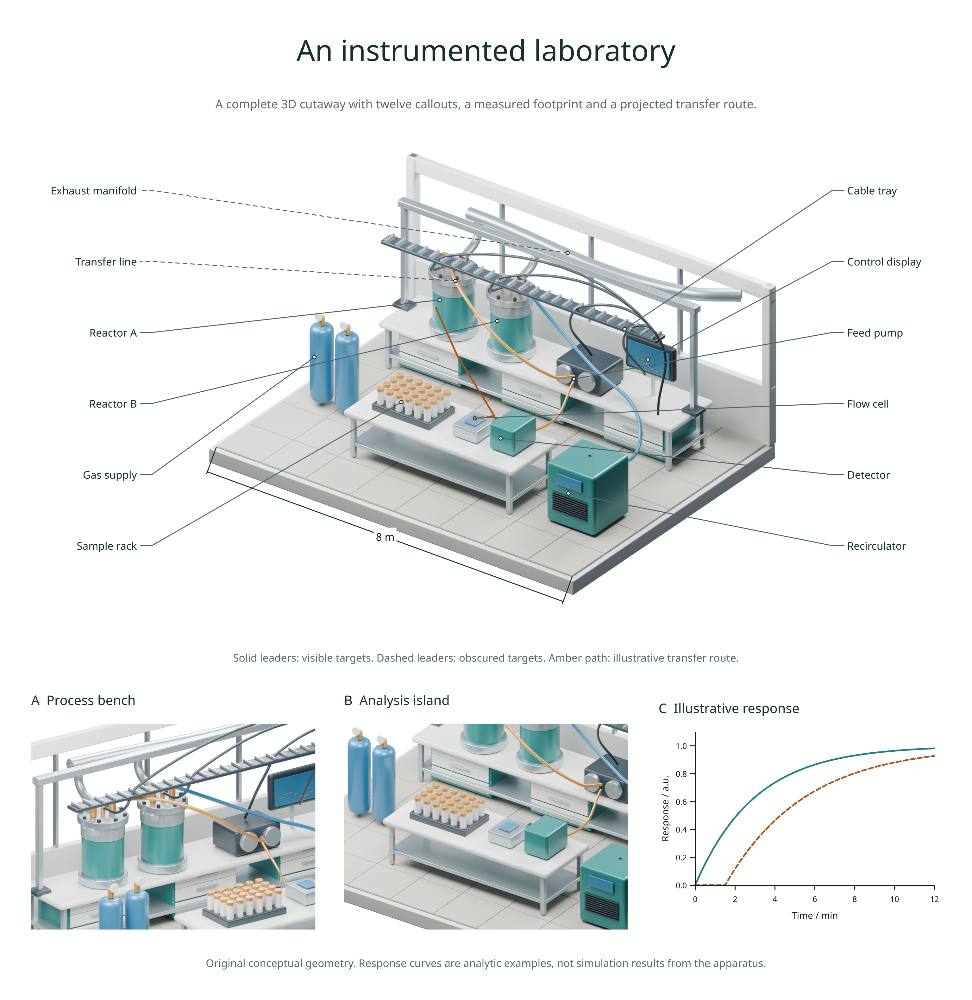

# An annotated laboratory cutaway

A complete **3.0** example combining a detailed 3D scene with vector
annotations, a dimension, a projected transfer route, two detail views and an
analytic response plot. All geometry is original and uses no downloaded assets.



## What the figure contains

The scene has 265 objects: 235 meshes, ten curve objects, fourteen landmark
empties, three cameras and three lights. It includes two reactors, a feed pump,
control display, a rack of 24 sample vials, a flow cell and detector, gas bottles,
a recirculator, overhead extraction and cable services, benches and cabinetry.
The open walls and roof allow the overview camera to show the equipment.

Twelve callouts use two ordered label columns. Their leaders and target markers
are vector geometry; text remains editable in SVG and embedded in PDF.
Solid leaders identify visible targets; dashed leaders identify obscured ones,
based on the saved depth pass. The custom column placement is part of this
example's authoring code, not an automatic scene-label placement API.

The 8 m footprint dimension uses `dimension3d()`. The amber transfer route uses
`path3d(hidden='dash')` so hidden sections remain legible. Two orthographic
detail views show the process bench and the analysis island. The response
curves are analytic illustrations, not simulated or measured outputs of the
rendered apparatus. This is a conceptual laboratory, not a construction plan.

## Build it

From a development checkout with the rendering extras, Blender and Poppler
installed:

```sh
python examples/v3_complex_scene.py --quality final
```

The output directory is `out/v3-complex`. Open `figure.html` for the review;
the folder also contains PNG, SVG, PDF, the editable `laboratory.blend`, its
creation log, a scene inventory and export manifests. The first build creates
the geometry, then renders three camera views using the GPU/CPU policy from
[render jobs](render-jobs.md). Later builds reuse the scene and cached pixels.

Use `--quality preview` for faster review, `--blender /path/to/blender` to select
an installation, or `--rebuild` to replace the generated scene. Changing only
the annotations does not require a fresh Blender render.

[Figure source](../examples/v3_complex_scene.py) ·
[Scene authoring source](../examples/blender/complex_lab_scene.py) ·
[Reusable templates](scene-templates.md) · [Gallery](examples.md)

## Reading the depth annotations

Visibility is sampled at each target point or along the route centreline.
Glass, silhouettes and transparent regions have the same
[depth-pass limitations](scene-paths.md#precision-and-limits) as other scene
annotations. The target dots mark authored landmark positions; they do not
certify a surface measurement. The underlying scene remains a raster image
inside SVG/PDF, while the labels, routes, dimensions and plot remain vector.
