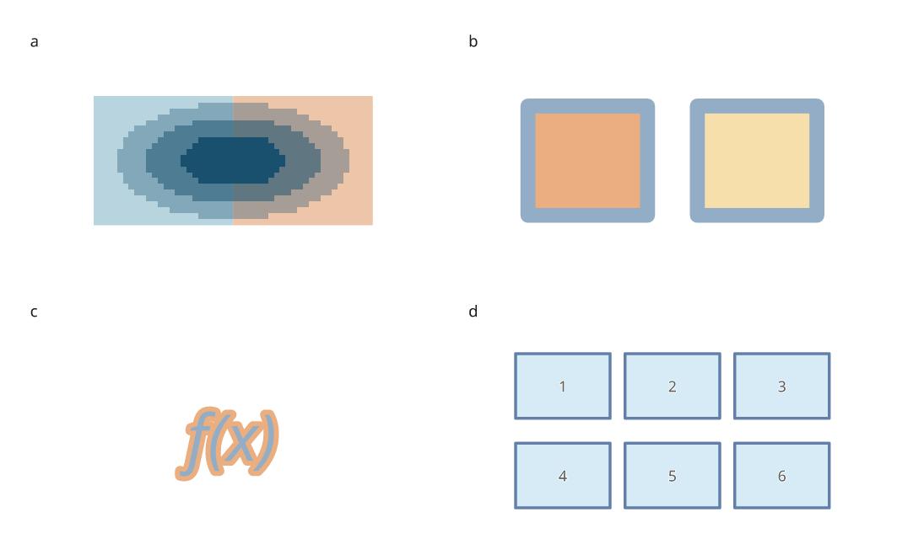
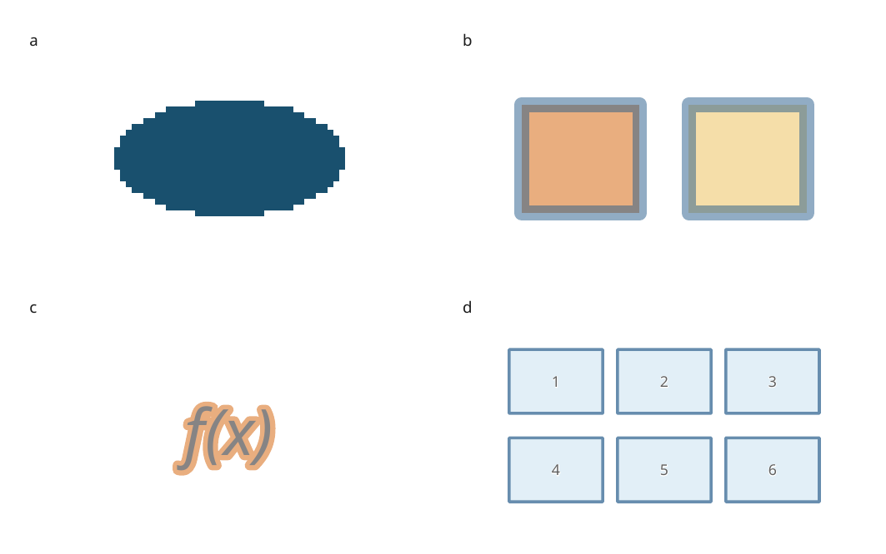
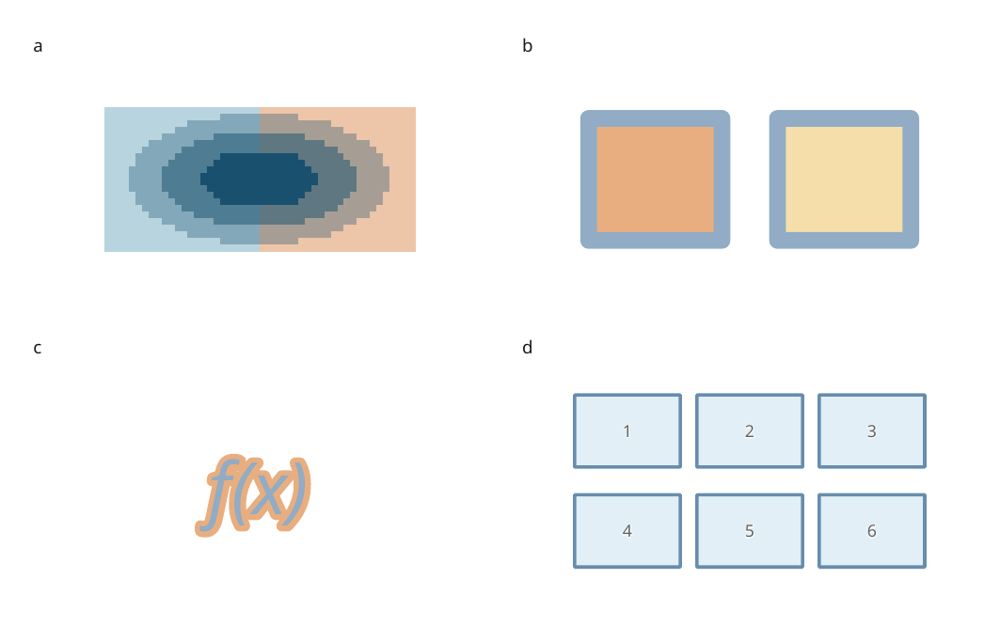

# Transparency and compositing

These engine changes are **unreleased, after 4.0.0.dev1**. They correct native
PDF output and reduce repeated geometry work during export. The SVG output of
the review recipe is unchanged.

[Executable recipe](../examples/compositing_review.py) ·
[Full-size review](../gallery/compositing-review.png) ·
[LaTeX caption](assets/research-preview/compositing-caption.tex)



The artwork is original and contains no measured data. Panel a is an explicitly
pixelated image; the other panels and all text remain vector in SVG and PDF.
Descriptions belong in the separate caption.

## What was wrong

**PNG transparency.** A PNG can record transparency in a palette or a color
key rather than in an alpha channel. The PDF decoder previously checked only
for an alpha channel, so transparent backgrounds became opaque and partial
palette transparency disappeared. This affects both embedded bytes and
file-backed images. Pillow describes these representations in its
[image concepts](https://pillow.readthedocs.io/en/stable/handbook/concepts.html#transparency).

**Opacity inside one primitive.** A filled-and-stroked rectangle paints twice
where its border overlaps its fill. Fading both operations separately darkens
that overlap. Text halos and vector brushes can also perform overlapping paints.
The PDF backend previously decided whether to create a transparency group by
counting primitives, which missed these cases.

**Repeated bounds.** Every nested PDF transparency group walked its complete
subtree to calculate a clipping rectangle. A label inside 32 such groups had
its glyph bounds rebuilt 32 times, despite having the same placement and style.

## Before and after

Both previews below use Poppler at 150 dpi with the same recipe, fonts and
physical dimensions. The previous version is the published `v4.0.0.dev1`.

**Previous PDF:** palette transparency is lost in panel a; borders and halo
overlaps are too dark in panels b and c.



**Corrected PDF:** the background artwork shows through the PNG, and each
shape or text block fades after its internal paints are combined.



The PDF decoder now resolves PNG transparency before discarding the palette.
Opaque images still omit the extra PDF alpha mask, and supported baseline JPEGs
retain their compressed bytes. Ordinary single-paint vector marks continue to
use a direct alpha state; marks with potentially overlapping paints get a
transparency group.

Bounds and paint counts are cached within one page export. Cache entries
distinguish inherited styles and world transforms, and are discarded after
export. They do not alter the document's layout envelope or carry state into
the next export. File edits therefore remain visible on subsequent exports.

## Run the review

Use a checkout containing these changes; the published dev1 package predates
them. Install the render extra and run:

```sh
python -m pip install -e '.[render]'
python examples/compositing_review.py --output out/compositing-review
```

The recipe writes SVG, PDF, PNG, captions and a report. It rejects warning/error
diagnostics. Chrome/Chromium and Poppler are needed only for the independent
preview comparison tools, not for native SVG/PDF export.

## Performance evidence

The new `groups32` workload contains 64 labeled vector blocks inside 32 nested
opacity groups. It tests repeated subtree analysis; it is deliberately deeper
than most ordinary figures. The existing `grid64` workload checks an ordinary
64-plot document alongside it.

Median of three fresh Python 3.12.3 processes on the same Linux WSL2 workstation:

| Workload | Previous PDF export | Current PDF export | Previous / current peak process memory |
| --- | ---: | ---: | ---: |
| 64 labeled blocks, 32 opacity groups | 1.1571 s | 0.0979 s | 55.9 / 55.6 MiB |
| 64 ordinary plots | 0.0619 s | 0.0600 s | 95.1 / 95.2 MiB |

This is about **11.8× faster for the nested-group PDF workload**. It is not a
general rendering speedup claim. The nested workload's SVG and PDF bytes match
the previous engine exactly; its paints already had correct group boundaries.
The defective single-primitive and PNG cases intentionally change PDF output.
All 26 existing SVG/PDF visual baselines pass without replacement.

[Previous measurements](assets/research-preview/compositing-before.json) ·
[Current measurements](assets/research-preview/compositing-after.json)

The reports record each run, compilation/export phases, output size, dependency
versions, source hash and peak process memory. Run the same comparison with:

```sh
python tools/benchmark_engine.py --case groups32 --case grid64 --repeat 3 \
  --output out/compositing-after.json
python tools/benchmark_engine.py --case groups32 --case grid64 --repeat 3 \
  --source /path/to/inklet-dev1 --output out/compositing-before.json
```

Regression checks include exact alpha bytes, independent SVG/Poppler interior
pixel comparisons, embedded/outlined text, transformed bounds, inherited style
changes and once-per-placement bounds evaluation. Rasterizer edge antialiasing
and font hinting are compared separately from uniform interior paint colors.
