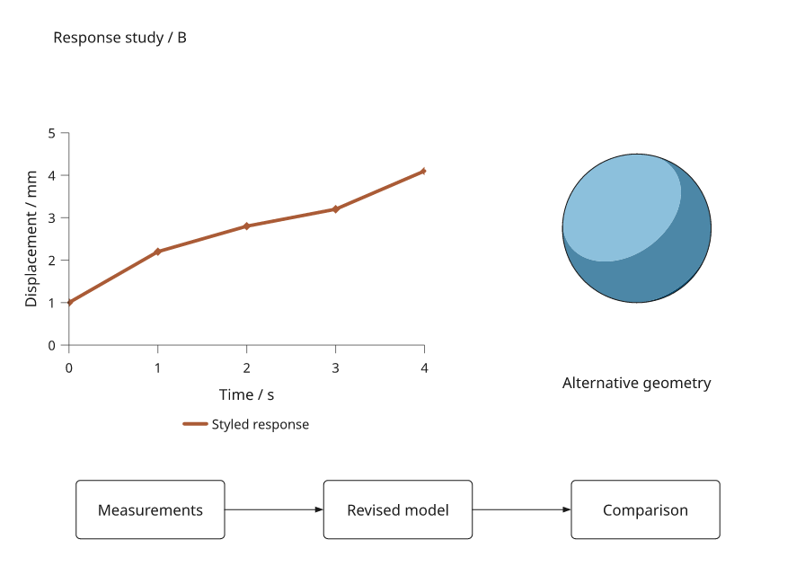

# Reusable compositions

Use a composition when the same figure structure needs different content: a
response plot above a caption, a method diagram beside results, or a report
repeated for several experiments. Define named slots and measured placement
once, then instantiate the layout with plots, diagrams, images or native 3D
components. Each instance keeps its own author choices and shares explicit
live data dependencies.

This tutorial creates two report instances, revises their shared data and
exports one at a second width. It uses the published **4.0.0 release**
and the core installation. Run the Python blocks in order. Start with
[plot recipes](plot-recipes.md) for marks inside one plot, or
[panel layout](layout.md) for document rows and columns.


The [complete example](../examples/composition_recipes.py) instantiates one
layout twice, changes plot styles, geometry and module labels, exports both
at 180 and 150 mm, then updates their shared measurements. The inputs are
illustrative data and generated geometry.

[Open the standalone figure viewer](assets/guides/composition-recipes.html).
The viewer supports exploration; these placement and content edits are made
in Python or through the [local layout inspector](layout-editor.md).

## Declare inputs and defaults

`slot()` accepts the same placement options as `add()`. Slots are required;
ordinary children are defaults that an instance may replace. Dimensions and
expressions use the composition's coordinate unit, one millimetre by default.
Plot width and height describe the data region, keeping text and strokes at
their authored physical size.

```python
import inklet as i

recipe = i.composition(120, 70)
recipe.slot('chart', x=13, y=8, anchor='area-nw',
            width=recipe.page_width - 26, height=30)
recipe.add('caption', i.module('Response', pad=2), x=13, y=55)
recipe.port('output', 'caption:out')
recipe.constrain(recipe.page_width, minimum=80,
                 message='response panel needs at least 80 mm')

data = i.dataset({'x': [0, 1, 2], 'y': [1, 2, 3]})
chart = i.plot_spec(x=(0, 2), y=(0, 5))
chart.line(data.points('x', 'y'), stroke='#34786b', key='response')
chart.axes(x='Time', y='Response')
first = recipe.instantiate(chart=chart)
second = recipe.instantiate(chart=chart, caption=i.module('Comparison', pad=2))
second['chart'].style('response', stroke='#aa5b36')

doc = i.document(width=120, height=70, margin=0)
doc.add('report', first)
before = doc.compile()
before.save('composition.svg', 'composition.pdf')
```

Missing inputs and unknown names raise `LayoutError` before an instance is
created. Compiling an unfilled template identifies its unbound slot. Inputs
name **direct children**; instantiate a nested template before passing it to
its parent. A slot does not impose a content type: the chosen content must
support its placement, such as `area-nw` for a plot or a requested named port.

## Independent edits, live inputs

`instantiate()` copies the template and supplied supported recipes. `copy()`
creates another independent recipe without requiring slots to be filled.
Both copy nested `Composition`, `PlotSpec`, `ModuleSpec` and `ComponentSpec`
definitions, their literal containers and NumPy arrays. Repeated references
to one definition remain shared **within** the copy.

Explicit data references, shared scales, Series, static Diagrams, component
factories and other BuildSpecs retain their original identity. External
objects are not cloned. Use `component()` with explicit arguments for a
reusable factory and `FileRef` for an asset whose file changes should trigger
rebuilding; see [images and 3D](three-images.md) and [live data](data.md).

```python
second['caption'].configure('Independent label')
second.place('caption', x=18)
second.configure(width=140)
# Future changes to the original chart's style do not reach either instance.
chart.style('response', stroke='#000000')
assert doc.compile() is before

old_svg = before.to_svg()
data.update(y=[2, 3, 4])
after = doc.compile()
assert after.to_svg() != old_svg
assert before.to_svg() == old_svg
assert doc.compile() is after
```

`place()` changes placement fields: `x`, `y`, `anchor`, `width`, `height` and
`scale`. Explicit `scale` uniformly scales complete artwork, including
text and strokes; it is separate from fitting a plot to a new width/height.
Set `anchor`, `width` or `height` to `None` to restore their unspecified behavior.
`replace()` replaces content and keeps its placement and named relationships.
Dimension updates through `configure()` validate before mutation; expressions,
minimum-space constraints and referenced anchors are checked at compilation.
The containing document may supply a different render size, so use page
expressions for responsive placement rather than scaling a finished drawing.

## Export a second instance at another width

The template positions its plot using `page_width - 26`: 13 mm of room on each
side. Render the second instance at 140 mm and its data region becomes 114 mm
wide. The 30 mm data-region height, label sizes and stroke widths stay fixed.

```python
wide = i.document(width=140, height=70, margin=0)
wide.add('report', second)
wide_figure = wide.compile()
wide_figure.save('composition-wide.svg', 'composition-wide.pdf')
assert wide_figure.root.width == 140
assert doc.compile().root.width == 120
```

Compare this export with `composition.svg`: the wider plot uses the independently
styled line and revised measurements, and its caption reads “Independent label.”
Changing the available page width recomputes layout expressions. For a template
with longer labels, add minimum-width constraints that reflect those labels.

## Expose attachment points through nested compositions

`port(name, target)` exposes a child's compass point or registered anchor.
Parent compositions can use it in `point()`, `link()`, `annotate()` and
placement anchors just like a module port. Replacing a child or changing its
label or position moves the attachment point when the document rebuilds.

```python
parent = i.composition(180, 80)
parent.add('report', first, x=0, y=0, width=120, height=70)
x, y = parent.point('report', 'output')
parent.add('next', i.module('Next step'), x=x + 12, y=y, anchor='in')
parent.link('report:output', 'next:in')
outer = i.document(width=180, height=80, margin=0)
outer.add('whole', parent)
outer.compile().save('nested-composition.svg')
```

Names are local to each composition. A port target names a direct child,
optionally followed by `:anchor`; omitting the anchor uses its center. Calling
`port()` again with the same name changes its target. Missing child anchors
and cyclic measured dependencies produce errors instead of detached links.
Named ports also account for nested coordinate units and `fit_top` offsets.

## Review at multiple widths



This second instance uses the same layout and data, with a different plot
colour, markers, native 3D style and module label. The chart width and workflow
spacing follow the available page width; the plot height, text and strokes
retain their physical sizes. Templates do not automatically resolve arbitrary
overlap: add measured expressions and constraints for the space your content
needs. The complete example rejects widths below 140 mm.

Run `python examples/composition_recipes.py --render` from the checkout to
produce the SVG/PDF/PNG comparisons, standalone HTML viewers, revised-data
exports and build statistics in `out/composition-recipes/`. PNG requires the
render extras. The [local inspector](layout-editor.md) offers visual editing of
the named content in these Python recipes.

[Save and restore layout choices](layout-overrides.md) separately from the
recipe to preserve measured expressions and report removed targets. Use
[figure projects](project-workflows.md) when you also need to carry input files
and provenance through save, reopen and revision. Those project APIs are
experimental in dev16 and require the Python recipe when reopening.
