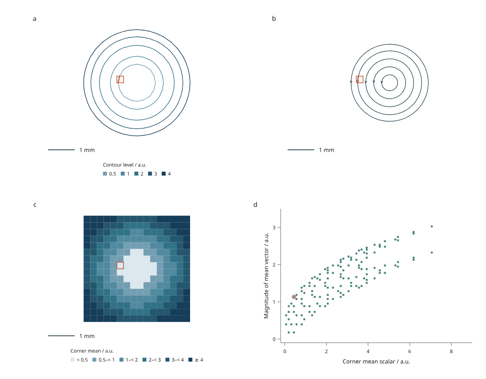
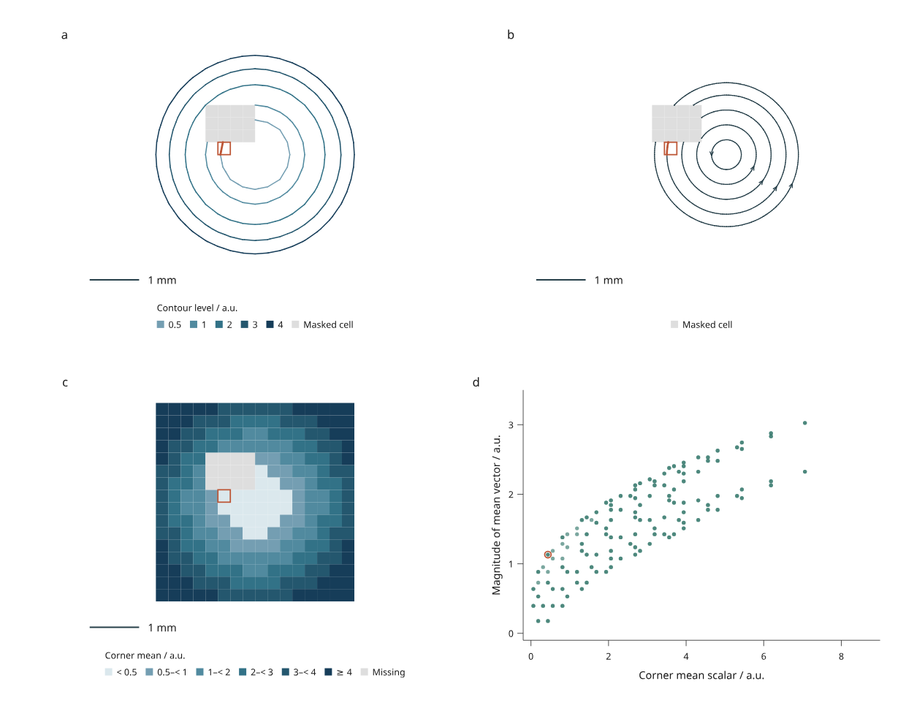

# Contours and streamlines

Draw scalar contours and vector streamlines from values supplied at the vertices
of a rectilinear grid. Link them to cell summaries and a scatter plot, with
explicit interpolation, masks and tracing diagnostics.

These APIs are in the **4.0 research preview**, under `inklet.experimental`.
They are not part of PyPI 3.1.0.



[Open the interactive report](assets/v4/contours-streamlines.html) ·
[Complete Python recipe](../examples/v4/contours_streamlines.py) ·
[170 mm version](assets/v4/contours-streamlines-170mm.png)

Panel **a** shows contours of the interpolated scalar field. Panel **b** shows
streamlines, with arrows indicating vector direction. Panel **c** colors the
arithmetic mean of each cell's four corner scalars. Panel **d** compares that
corner mean with the magnitude of the mean corner vector. Orange identifies one
cell across all four panels. Plans share equal X/Y scale and a 1 mm scale bar.

The example is original simulated MIT material by Mark Marosi. Its scalar
samples are `x² + y²`; its vectors are `(-y, x - 0.5)`. These are independent
analytic fixtures, not results from a fluid simulation. The contour centers and
rotation center intentionally differ. The 17 × 17 nodal grid contains 256 cells.
Straight pieces in the contours reflect the actual interpolation on that grid;
no decorative smoothing is applied.

## Run and revise

```sh
python examples/v4/contours_streamlines.py --render --output out/contours
```

Click a cell in any plan or its scatter point. The selected portions of contours
and streamlines follow the cell identity. Selection uses the full cell rectangle,
including empty space between lines. Arrowheads are decorative and are split
at cell boundaries, so filtering also removes their hidden-cell pieces.

Filtering hides cell-associated geometry. It does **not** recompute contours,
change corner means or integrate a new path around hidden cells. Page zoom also
preserves the compiled geometry.

| Revision | Change | Expected behavior |
| --- | --- | --- |
| Original | Analytic nodal samples | Five closed rotational streamlines and fixed scalar levels |
| Reversed | Negate both vector components | Direction arrows reverse; scalar values and vector magnitudes remain unchanged |
| Masked | Remove scalar/vector samples in a small patch | Gray cells mark missing support; contours break and affected trajectories stop |
| Updated | Multiply scalar samples by 1.25 | Fixed-level contours move inward; streamlines retain the same geometry |

The page embeds four precompiled alternatives and runs without a Python server.
Tracing diagnostics are saved in `field.json`; browser scene metadata also
contains the current source digest, methods, limits and termination report.



## Source and interpolation

```python
from inklet.experimental.grid import GridField
from inklet.experimental.browser import BrowserFigure, GridFieldView

field = GridField(
    x=[0, 2], y=[0, 2], ids=["cell-a"],
    scalars=[[0, 0], [0, 4]],
    vectors=[[(1, 0), (1, 0)], [(1, 0), (1, 0)]],
    unit="mm", scalar_unit="a.u.", vector_unit="a.u.",
)
assert field.sample((1, 1)) == 2.0
assert field.table().columns["scalar"] == (1.0,)
view = GridFieldView("contours", field, levels=(1, 2, 3))
figure = BrowserFigure(field.table(), [view])
```

X and Y must be finite, strictly increasing axes; nonuniform spacing is allowed.
Matrices use `[y][x]` order, with rows increasing in physical Y. IDs identify
rectangular cells in row-major order starting at low Y. Inputs are copied into
immutable snapshots. At most 4,096 cells are supported.

Each cell splits along its lower-left to upper-right diagonal. Scalar values
and both vector components interpolate linearly within each triangle. This is
**not bilinear interpolation**, nor an inferred interpolation of the existing
piecewise-constant [mesh face fields](mesh-fields.md).

The example above deliberately shows the distinction: the interpolated value at
the cell center is 2, while the arithmetic mean of its four scalar samples is 1.
Table columns `scalar`, `vx` and `vy` are corner means. `magnitude` is the norm of
that mean vector, not the mean of corner magnitudes and not a path average.
`area` is the rectangular cell area in squared geometry units.

A missing corner masks the **entire cell** for that field. Scalar and vector
masks are independent. Contours omit cells with missing scalar support;
streamlines stop at missing vector support. Masked cells remain selectable.
Nonfinite inputs fail rather than becoming masks implicitly. Internal grid-line
queries use the cell on the higher-coordinate side; the outer maximum boundary
uses the last cell.

## Numerical methods and limits

`field.contours(levels)` returns cell-associated line segments for 1–16 explicit,
strictly increasing levels. Edge crossings use linear interpolation. Vertices
exactly at a level belong to the high side; duplicate equal-edge segments are
emitted once, in cell source order. An entirely flat plateau at a requested
level emits no isoline. The fixed triangle split resolves saddle configurations
without a marching-squares ambiguity.

```python
traces = field.streamlines(
    [("seed-a", (1, 1))],
    step=0.1, max_length=4, max_steps=1000, min_speed=1e-12,
)
report = traces.report()
```

Tracing uses classical fourth-order Runge–Kutta on the **normalized XY vector**.
`step` and `max_length` are geometry lengths, not time. This follows the
arc-length interpretation described in the
[VTK streamline documentation](https://vtk.org/doc/nightly/html/classvtkStreamTracer.html).
Inklet's implementation is independent and does not require VTK. Linear
interpolation on a triangular grid is also the explicit model used by
[Matplotlib's linear triangle interpolator](https://matplotlib.org/stable/api/tri_api.html#matplotlib.tri.LinearTriInterpolator).

The step must be at most one quarter of the smallest grid interval. RK stages,
endpoints and every cell crossed by an output segment are checked for valid
support. A step that leaves the domain or enters missing data is halved until a
valid step is found; tracing stops if it would require less than `step / 1024`.
This is boundary handling, **not adaptive numerical error control**. Refine the
grid and compare smaller steps when assessing accuracy for your data.

Both forward and backward directions are integrated. Limits apply separately
to each direction: 1–2,000 steps, an explicit maximum path length and a supplied
speed threshold in vector units. There are at most 32 uniquely identified seeds.
Reports distinguish boundary, missing support, sampled stagnation, length limit,
step limit, numeric resolution and a detected loop. Seeds outside the domain or
inside a mask produce a one-point trace and a termination reason.

A loop is detected after at least eight steps of travel when the path returns
within half a step of its seed with an aligned tangent. That final point is
snapped to the seed and the duplicate backward loop is omitted. This bounded
heuristic does not detect every periodic orbit or establish mathematical
periodicity. Streamlines are geometric curves, not particle trajectories in a
time-dependent field.

## Save, replace and export

```sh
python examples/v4/contours_streamlines.py --state /path/to/view.json --render --output out/reopened
python examples/v4/contours_streamlines.py --revision masked --rebase-state /path/to/original-view.json --render --output out/masked
python examples/v4/contours_streamlines.py --json out/contours/input.json --output out/replacement
```

Use `--revision` with `--state` when reopening a state saved after choosing that
revision in the browser. `--rebase-state` reconciles an original state against a
replacement; `--missing drop` explicitly drops IDs absent from replacement JSON.
The recipe uses mm geometry, fixed contour levels, seeds and scatter domains;
adapt `make_views` for other units, extents or ranges.

Outputs include input JSON, source digest, cell summaries, tracing diagnostics,
revision details and state. `figure.svg` preserves the saved viewport. The 210 mm
and 170 mm exports recompile the full page while retaining selection/visibility.
`--render` adds PNG and PDF; lines, cell fills, scales and text stay vector in
SVG/PDF. HTML/SVG generation uses the standard library and Inklet core.

Source-derived traces must have the exact field digest. Measurement joins check
both IDs and values, so stale summaries fail. Replacing a field requires fresh
views and tracing. A view exceeding 40,000 marks fails explicitly: reduce contour
levels, seeds or integration limits. There is no automatic streamline seeding,
3D volume tracing, scalar surface fitting
or simulation solver in this increment.
