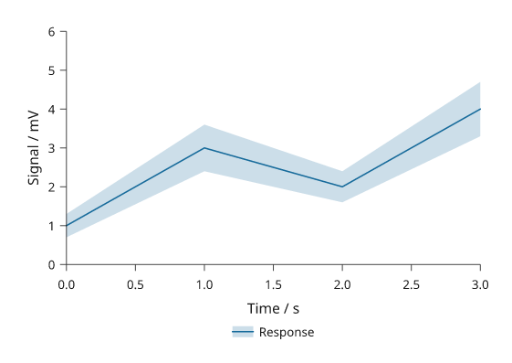

# From CSV to a publication figure

Read a measurement table, plot a response with supplied uncertainty bounds, and
export at two physical widths. Then replace the file and rebuild the figure.
This tutorial uses the core installation (4.0; also compatible with 3.1).
Run the Python blocks in order in a new directory.



## Prepare a table

The example creates simulated inputs so it runs without a download. For your
own study, use a CSV with the same columns and skip writing the example file.
The bounds below are illustrative values, not confidence intervals computed by
Inklet. State what your bounds represent in the figure caption.

```python
from pathlib import Path
import inklet as i

source = Path('measurements.csv')
source.write_text(
    'time,mean,lower,upper\n'
    '0,1,0.7,1.3\n'
    '1,3,2.4,3.6\n'
    '2,2,1.6,2.4\n'
    '3,4,3.3,4.7\n', encoding='utf-8',
)
```

## Read, check and plot

`read_csv()` converts the declared numeric columns and records a source hash.
Empty or non-finite numeric values fail parsing. The two checks below enforce
this recipe's assumptions: increasing time and bounds around each mean.

```python
def make_document(path=source, width=89):
    data = i.read_csv(
        path, name='response',
        types={name: float for name in ('time', 'mean', 'lower', 'upper')},
        units={'time': 's', 'mean': 'mV', 'lower': 'mV', 'upper': 'mV'},
        citation='CSV tutorial', method='simulated',
    )
    values = data.columns
    if len(values['time']) < 2 or any(
        a >= b for a, b in zip(values['time'], values['time'][1:])
    ):
        raise ValueError('Supply at least two rows in increasing time order')
    if any(not lo <= mean <= hi for lo, mean, hi in zip(
        values['lower'], values['mean'], values['upper']
    )):
        raise ValueError('Each row must satisfy lower <= mean <= upper')
    plot = i.plot_spec(x=(0, 3), y=(0, 6))
    plot.series(i.Series('Response', data.column('time'), data.column('mean'), '#176b9b',
                         data.column('lower'), data.column('upper')))
    plot.axes(x='Time / s', y='Signal / mV').legend(side='bottom')
    doc = i.document(width=width)
    doc.add('response', plot, min_height=55)
    return doc


doc = make_document()
figure = doc.compile()
figure.save('response.svg', 'response.pdf')
print(figure.report())
```

Open `response.svg`: the line joins the means and the band spans the absolute
lower and upper values. Axis limits stay fixed at 0–3 s and 0–6 mV to make later
revisions comparable. Change those domains explicitly for other measurements.
Replace the citation, units and `method` when using your own data.

The recipe reads the file each time it runs. Column references retain the
dataset and its provenance in the document; editing the CSV does not update
an already compiled figure.
See [live data](data.md) when you need in-memory updates to existing plots.

## Export a second width

```python
wide = make_document(width=180).compile()
wide.save('response-wide.svg', 'response-wide.pdf')
assert figure.root.width == 89
assert wide.root.width == 180
```

Compare the exports at actual size. The plot gets wider while type and strokes
retain their physical sizes. Rebuilding at the target width avoids scaling the
finished artwork. For two plots beside each other, continue with
[panel layout](layout.md).

## Rebuild after changing the file

```python
old_svg = figure.to_svg()
source.write_text(
    'time,mean,lower,upper\n'
    '0,1,0.7,1.3\n'
    '1,4,3.4,4.6\n'
    '2,3,2.6,3.4\n'
    '3,5,4.3,5.7\n', encoding='utf-8',
)
revised = make_document().compile()
revised.save('response-revised.svg', 'response-revised.pdf')
assert revised.to_svg() != old_svg
assert figure.to_svg() == old_svg
```

The revised line and band change; the earlier snapshot remains unchanged.
Keep the input file with your Python recipe and exports. A figure alone cannot
reconstruct the table it used.

## Review and continue

Use [export and review](export-review.md#a-review-bundle) to generate PNG previews
and a local HTML review. For CLI builds, save the imports, `source =
Path('measurements.csv')`, and `make_document()` in `csv_figure.py`. The CLI
calls the factory without arguments. Keep the `write_text()` demonstration
steps outside that script so rebuilding does not replace your input file.

Choose [reusable plots](plot-recipes.md) for independently styled variants,
[reusable compositions](composition-recipes.md) for repeated layouts, or the
[six-panel CSV example](general-plots.md) for multiple tables and plot families.
[Figure projects](project-workflows.md) add verified input bundles in dev16.
