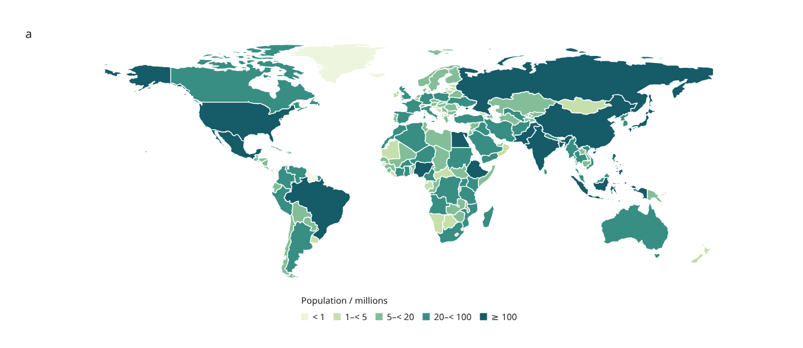

# Replace figure data

Rebuild a linked figure with revised data while retaining valid selections.
`BrowserFigure.replace_data()` compiles a new figure and returns its saved state
and a report of changed rows. It is available in the development checkout under
`inklet.experimental.browser`; the published 3.1.0 package does not include it.



[Open the revised world and Europe maps](assets/v4/world-population-2019.html) ·
[Inspect the revision report](assets/v4/world-population-2019.json) ·
[Python recipe](../examples/v4/world_population.py)

This example restricts the [original Natural Earth map](world-map.md) to the
169 rows whose population year is 2019. The seven omitted country/map units
appear blank. Retained population values, boundaries and color bins are
unchanged. It is a cohort from the pinned historical source, with the same
public-domain attribution and geographic limitations as the original example.

## A revised figure

```python
from pathlib import Path
import json
from inklet.experimental.browser import BrowserFigure, ScatterView
from inklet.experimental.selection import KeyedTable, SelectionState

original = KeyedTable("observations", {
    "id": ["a", "b", "c"], "x": [0, 1, 2], "y": [1, 2, 3],
})
figure = BrowserFigure(original, [
    ScatterView("points", "x", "y", (0, 4), (0, 8)),
])
saved = figure.state(SelectionState.for_table(original, selected=["b"]))
revised = KeyedTable("observations", {
    "id": ["c", "b", "d"], "x": [2, 1, 3], "y": [3, 6, 4],
})

result = figure.replace_data(revised, state=saved)
Path("revised.html").write_text(
    result.figure.to_html(state=result.state()), encoding="utf-8",
)
Path("revised.svg").write_text(
    result.figure.to_svg(result.state()), encoding="utf-8",
)
Path("view.json").write_text(json.dumps(result.state()), encoding="utf-8")
Path("revision.json").write_text(json.dumps(result.report(), indent=2), encoding="utf-8")
```

Row `b` stays selected at its new coordinates. The report lists `a` as removed,
`d` as added and `b` as changed. It also records the changed order of surviving
rows. The original figure and state remain usable, including if replacement
fails. Returned state/report dictionaries are independent copies.

## Identity, filters and layout

- Keep the table name and key column. Correspondence follows explicit row IDs.
- Removing a selected or explicitly visible ID raises an error by default.
  Use `missing="drop"` to remove those references and inspect
  `removed_selected` and `removed_visible` in the report. `removed_ids` lists
  **all** removed rows, including rows with no saved-state references.
- A visibility value of `None` continues to mean all rows, including additions.
  An explicit ID filter retains only surviving IDs; an empty filter stays empty.
  Hidden selections remain selected. Search text is not part of saved state;
  its saved ID subset is retained without rerunning the query on new data.
- Existing view definitions, fixed domains, color bins, width and column count
  are reused. Pass `views=`, `width=` or `columns=` to change them. Geometry is
  rebuilt in the revised source order, including line adjacency and paint order.
- Map feature IDs must still join the table exactly. Supply new `RegionView`
  definitions with matching `GeoRegions` when the cohort changes. Geometry
  changes affect the scene digest even if table values stay the same.
- The viewport resets to the new page. `viewport="preserve"` explicitly retains
  the old rectangle **in page millimetres**, subject to the new page's limits.
  It does not preserve a data-coordinate or geographic extent across a layout
  change. A rejected viewport leaves the original figure untouched.

Reports include old/new data and scene digests, added/removed/changed IDs,
added/removed columns, surviving-row order changes, discarded state references
and the chosen policies. `changed_ids` compares complete serialized rows;
`1` and `1.0` count as different, as in the table digest. Adding or removing a
column changes every surviving row. ID lists are
sorted. The report schema is `inklet.browser-revision/0.1` and remains experimental.

Ordinary state loading still requires the exact scene revision. Use replacement
explicitly to transfer an old state, then save the returned state for the new
figure. Python performs replacement and writes a new offline HTML file; live
CSV upload and scene switching inside an open browser are future work.

## Try it with the real map

```sh
python examples/v4/world_population.py --year 2019 --output out/v4-revision

# Transfer a view saved from the original 176-country map.
python examples/v4/world_population.py --year 2019 \
  --rebase-state /path/to/original-view.json --missing drop \
  --output out/v4-revision

# Reopen a view saved from the revised map with the same target inputs.
python examples/v4/world_population.py --year 2019 \
  --state out/v4-revision/view.json --output out/v4-restored
```

The output includes `index.html`, the two-panel `figure.svg`, an unfiltered
single-panel `world.svg`, `view.json`, the effective `population.csv`, and
`revision.json` with input provenance. Choose `--viewport preserve` only when
you want the old page rectangle. Without an input state, Hungary starts selected.
A year cohort that excludes Hungary therefore requires `--missing drop`.

To supply your own table:

```sh
python examples/v4/world_population.py --csv /path/to/population.csv \
  --rebase-state /path/to/original-view.json --output out/v4-csv
```

The CSV requires `id`, `country`, `continent`, `population` and
`population_year`. IDs must be unique source country codes with known geometry;
this recipe rejects an empty cohort. Population must be finite and nonnegative;
years must be whole numbers from 1 to 9999. No numeric values may be blank.
`population_millions` is recalculated from `population`; a supplied column with
that name is ignored, as are other extra columns. Input order is retained.

The output credit identifies the supplied CSV and its SHA-256 instead of
attributing replacement values to Natural Earth. Geometry retains Natural Earth
credit. To reopen a saved view, supply the same CSV with `--state`; to transfer
an original map view, use `--rebase-state`. Those options are mutually exclusive.

## Checks

Regression tests cover row edits, additions/removals, order changes, schema
changes, hidden/empty filters, layout and viewport changes, failed replacements,
exact region joins and the original snapshot's integrity. The real-map CLI is
checked through replacement, report export and exact SVG reconstruction.
Browser checks at device pixel ratios 1 and 2 verify that all three rendering
backends retain the new selection, reject the old state without mutation, and
export matching polygon geometry and styles.
