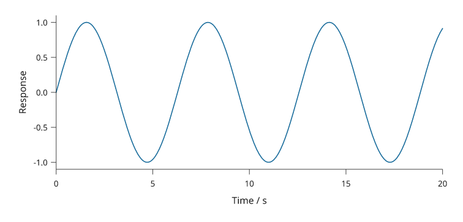

# Dense data

Choose how each data layer is represented. The rest of the figure can retain
vector axes, labels, annotations and legends regardless of that choice.

| Layer | Option | What changes |
| --- | --- | --- |
| Dense point cloud | `scatter(..., raster=True, dpi=300)` | Markers become one raster layer; point order and opacity are retained |
| Regular matrix | `matrix(..., raster=True)` | Cells become an image; the colour scale still supplies a vector colorbar |
| Dense straight line | `line(..., simplify=0.02)` | Optional reduction of vector vertices within a physical tolerance |
| Every authored vector point | Omit `simplify`, or use `simplify=0` | Every line vertex is retained |

Raster scatter and matrices require Pillow (`pip install 'inklet[images]'`).
PNG export additionally needs the `render` extra. Vector line simplification is
part of the core package on the development branch.

## Reduce vector line geometry

```python
import math
import inklet as i

points = [(k/1000, math.sin(k/1000)) for k in range(20001)]
p = i.plot_spec(x=(0, 20), y=(-1.1, 1.1), height=40)
p.line(points, simplify='0.02mm', stroke='#176b9b')
p.axes(x='Time / s', y='Response')
doc = i.document(width=120)
doc.add('signal', p)
doc.save('signal.svg', 'signal.pdf')
```



*Rendered from the code above.*

The tolerance is applied **after mapping through the plot scales**, including
logarithmic scales. Every removed vertex is within that distance of the segment
that replaces it. Endpoints and global x/y extrema are retained. A resized live
plot recomputes the reduction at its new physical size.

This is an explicit rendering approximation. It can remove details smaller than
the chosen tolerance and change the phase of dashed strokes. It does not change
the dataset or perform statistical smoothing. Uncertainty bands and error bars
retain their own complete geometry. Use it for straight, open lines; combining
positive simplification with `smooth` or `closed=True` raises an error.
Coordinates must be finite.

The reducer limits its work on difficult paths by retaining additional vertices.
It does not increase the tolerance to satisfy a point-count target. Each reduced
line records `line_simplification` in its diagram notes, including the input and
output point counts and tolerance.

## Inspect the result

Compare the [plot rendering review](plotting-engine.md) and its zoomed specimen.
The [rendering engine measurements](rendering-engine.md) cover raster scatter,
repeated images and document layout. Measure your own workload: constructing
layers, compiling a document and writing exports have different costs.

Keep manuscript captions outside the artwork. Record any approximation or raster
resolution needed to interpret or reproduce the figure in that caption.
