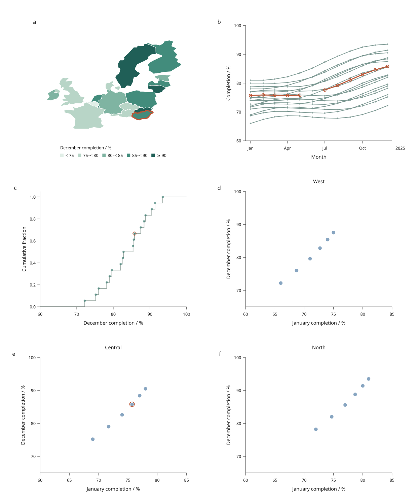

# Inklet 4.0.0.dev1

The first 4.0 development release collects the linked plotting, mapping,
engineering and scientific workflows developed since 3.1.0. It is an installable
snapshot for trying real examples and reporting problems. **3.1.0 remains the
stable release.** The [4.0 roadmap](roadmap.md) still has open work.

```sh
python -m venv .venv
source .venv/bin/activate
python -m pip install "inklet==4.0.0.dev1"
```

On Windows PowerShell, activate with `.venv\Scripts\Activate.ps1` instead.
Python 3.11 or later and an installed TrueType/OpenType font are required.
The exact version pin opts into this development release. Pip otherwise prefers
stable releases; see its [installation documentation](https://pip.pypa.io/en/stable/cli/pip_install/).

Optional extras can be installed with the same pin:

```sh
python -m pip install "inklet[render,pandas,polars]==4.0.0.dev1"
# Add calibrated volumes and TIFF workflows when needed:
python -m pip install "inklet[volume,render]==4.0.0.dev1"
```

The core preview needs no browser server, NumPy, pandas, Polars or Blender.
Opening the generated HTML requires a browser. PNG/PDF exports from browser
figures use separate Chrome/Chromium and Pillow; native Diagram exports retain
their existing requirements. See [installation](installation.md).

## What to try



| Workflow | Included in this preview |
| --- | --- |
| [Regional report](regional-report.md) | A real GeoJSON map, entity histories, distributions and facets; CSV replacement and two-width exports |
| [Engineering report](engineering-report.md) | Linked drawings, explicit box geometry and sections, dimensions, supplied response curves and retained label offsets |
| [Scientific measurements](scientific-report.md) | Calibrated label/intensity images, exact source-pixel region selection, measurements and image revisions |
| [Mesh fields](mesh-fields.md) | Imported mesh correspondence, scalar/vector face fields, plan picking and a fixed-camera native 3D reference |
| [Contours and streamlines](contours-streamlines.md) | Nodal-grid interpolation, contours, RK4 tracing, masks and termination reports |
| [Everyday linked plots](linked-plots.md) | Lines, scatter and signed bars, shared selections, filtering, hover, page zoom/pan and saved-state export |

The preview also includes [category panels](linked-facets.md),
[calendar/UTC axes](time-series.md), [pandas/Polars inputs](table-inputs.md),
[explicit statistical views](statistical-views.md),
[data replacement and reconciliation](data-revisions.md), and
[shared numeric tick improvements](plot-quality.md).

## Run the complete examples

The wheel contains the library. To obtain recipes and fixtures, use the matching
release checkout or source archive:

```sh
git clone --branch v4.0.0.dev1 https://github.com/Mapika/inklet.git
cd inklet
python -m pip install -e '.[render]'
python examples/v4/regional_report.py --output out/regional
python examples/v4/engineering_report.py --output out/engineering
python examples/v4/scientific_report.py --output out/scientific
python examples/v4/mesh_fields.py --output out/mesh-fields
python examples/v4/contours_streamlines.py --output out/fields
```

Open an output folder's `index.html`. Each guide explains its source data,
selection semantics, revision controls and saved-state reconstruction. Add
`--render` for PNG/PDF output after installing the required preview tools.

The real-map example includes source attribution. The engineering responses,
label images and analytic field samples are explicitly simulated fixtures.
Examples do not claim to perform simulation or statistical inference.

## Compatibility and remaining work

New document APIs are under `inklet.experimental`. Signatures, payloads and
saved-state schemas may change between previews. Keep the source data, recipe
and exact package version alongside exported states; states are bound to their
source and compiled scene. Input revisions require explicit reconciliation.

The preview does not complete general browser editing, undo/redo, depth-aware
3D selection, interactive camera control, arbitrary geometry constraints or
large-data backend coverage. Mesh picking is currently in plan views; native
3D reference panels have fixed cameras. Field tracing covers steady 2D nodal
grids. Ordinary SVG/canvas/hybrid controls run locally, but arbitrary Python
callbacks do not execute inside standalone HTML.

Animation and presentation authoring remain a 5.0 direction. Existing 3.1
plotting and native rendering APIs continue to ship; consult
[compatibility](compatibility.md) and [release checks](release-checks.md) for
platform and dependency limits.

Report issues with the example or minimal reproducer, input units, selected
backend, package/Python versions and exported state where applicable. Remove
private data before attaching a reproducer.
