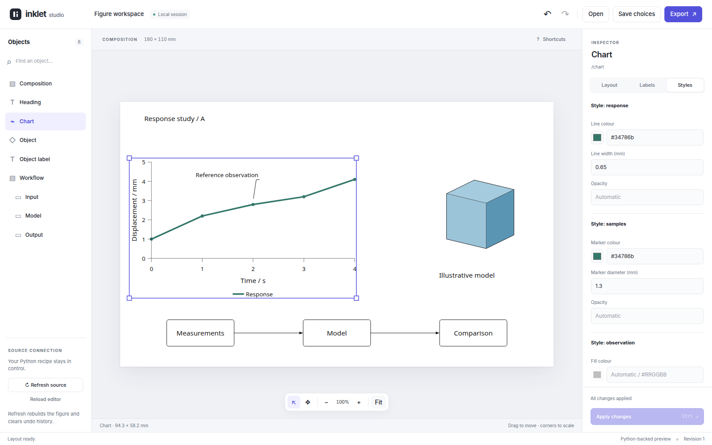
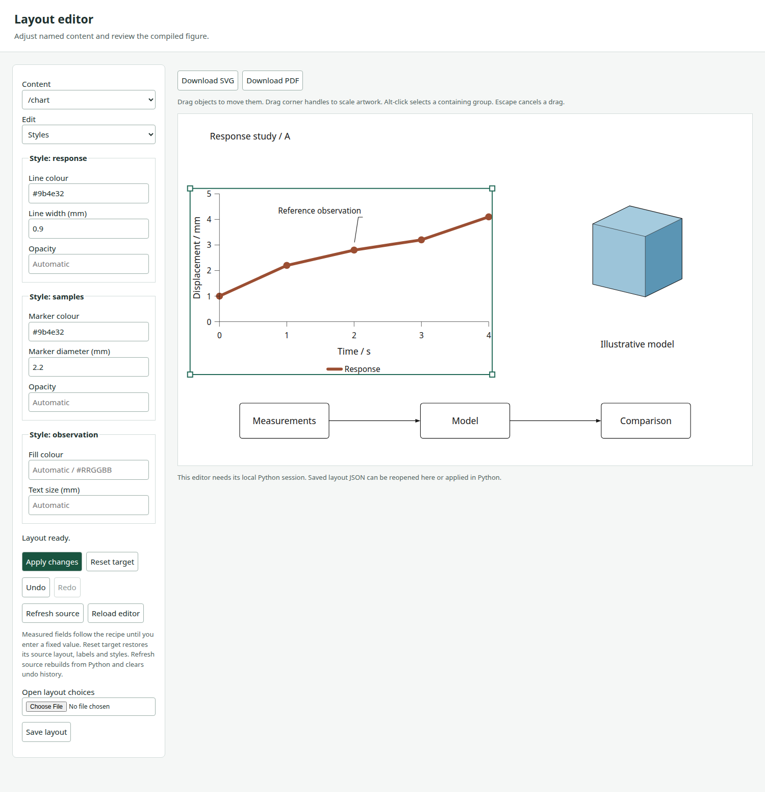
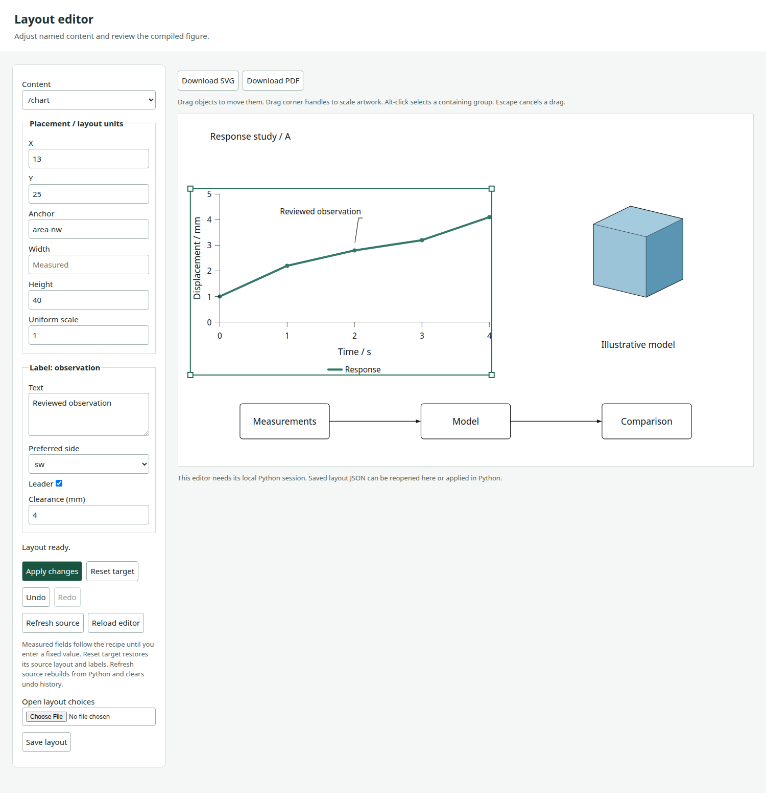
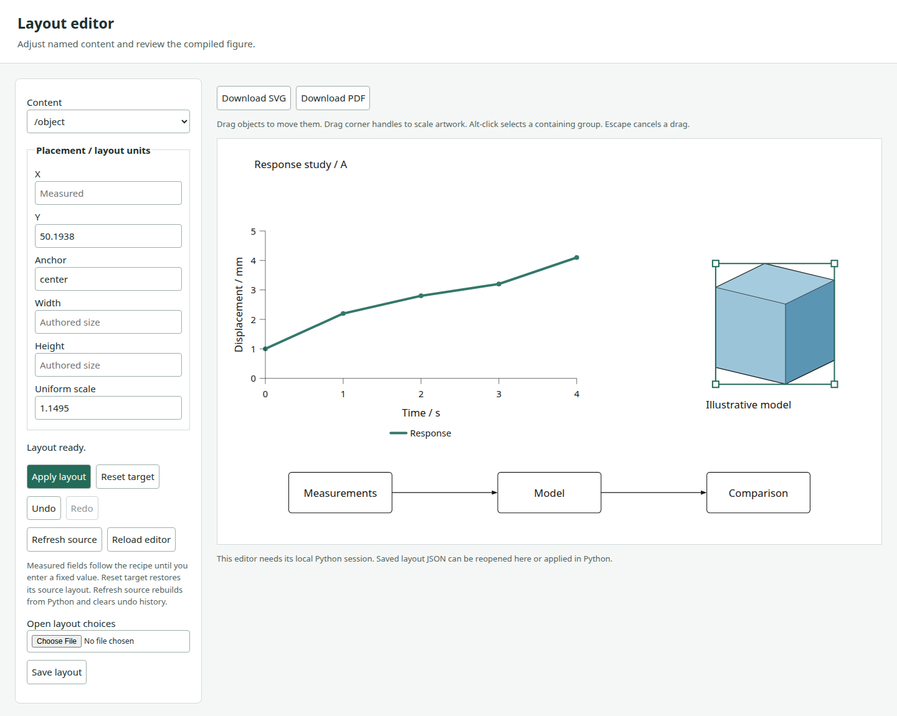
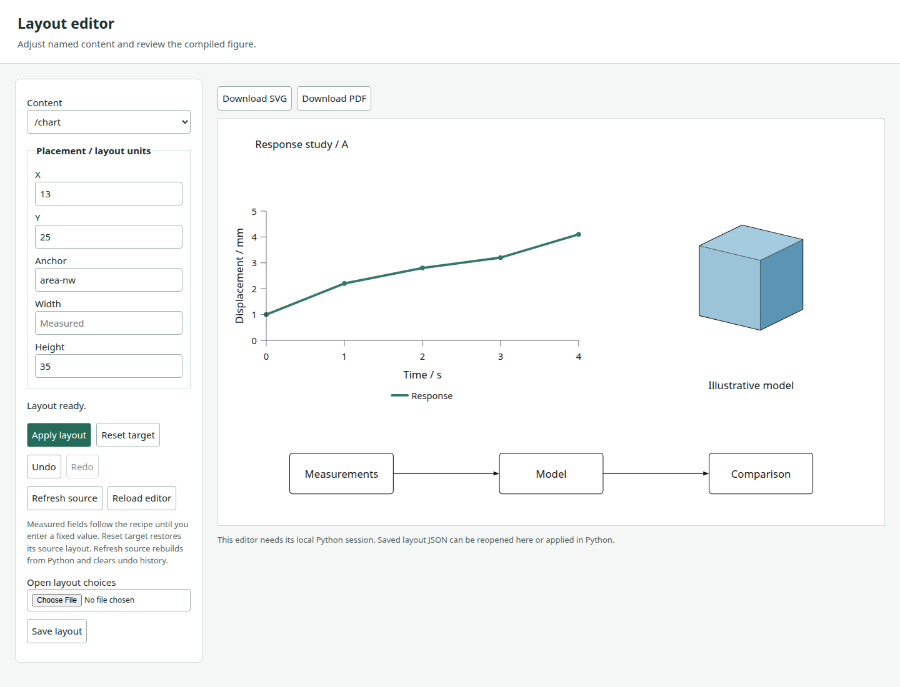
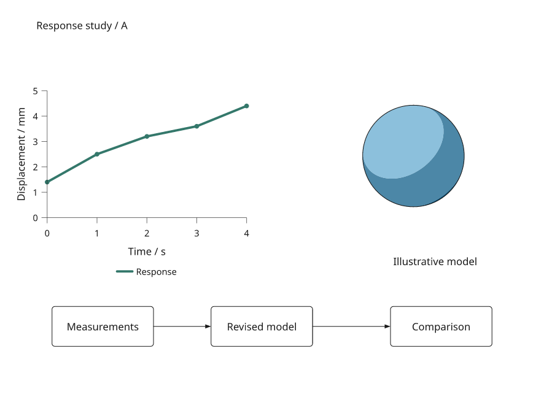
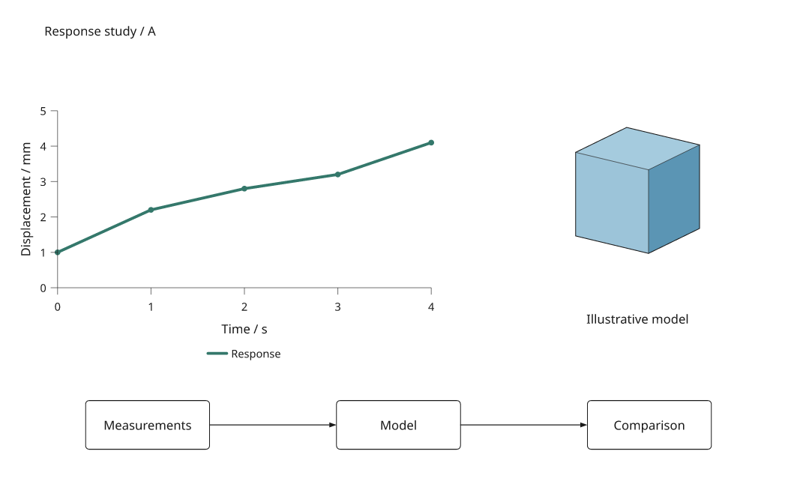
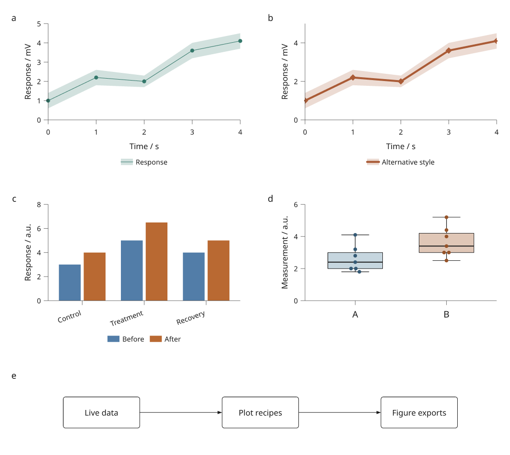
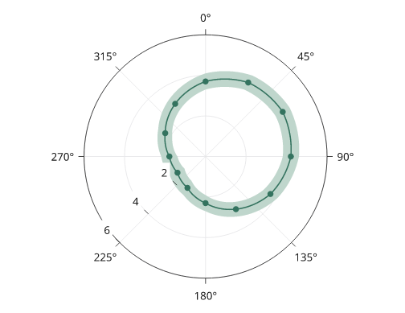

# Inklet 4.0.0.dev12

The twelfth 4.0 development release includes the linked plotting, mapping,
engineering and scientific workflows developed since 3.1.0. It is an installable
snapshot for trying real examples and reporting problems. **3.1.0 remains the
stable release.** The [4.0 roadmap](roadmap.md) still has open work.

```sh
python -m venv .venv
source .venv/bin/activate
python -m pip install "inklet==4.0.0.dev12"
```

On Windows PowerShell, activate with `.venv\Scripts\Activate.ps1` instead.
Python 3.11 or later and an installed TrueType/OpenType font are required.
The exact version pin opts into this development release. Pip otherwise prefers
stable releases; see its [installation documentation](https://pip.pypa.io/en/stable/cli/pip_install/).

Optional extras can be installed with the same pin:

```sh
python -m pip install "inklet[render,pandas,polars]==4.0.0.dev12"
# Add calibrated volumes and TIFF workflows when needed:
python -m pip install "inklet[volume,render]==4.0.0.dev12"
```

The core preview needs no browser server, NumPy, pandas, Polars or Blender.
Opening the generated HTML requires a browser. PNG/PDF exports from browser
figures use separate Chrome/Chromium and Pillow; native Diagram exports retain
their existing requirements. See [installation](installation.md).

## Studio workspace in dev12

The [composition editor](layout-editor.md) now has a searchable object navigator,
a central figure canvas and a focused inspector. Layout, Labels and Styles use
compact tabs, colour swatches and visible pending-change feedback. Apply/discard
controls stay accessible; save/export and undo/redo move to the header.



Zoom, Fit and pan explore the canvas without changing the authored figure.
Object gestures retain their figure coordinates at different zoom levels.
Keyboard shortcuts cover apply, save and undo/redo; the help dialog lists the
full set. Pending edits are protected during selection, source refresh and
file actions. The layout adapts to tablet and phone screens.

This is a UI change: existing schema 0.4 files and the Python compiler remain
the source of saved choices and SVG/PDF exports.

## Unified composition authoring retained from dev11

The [composition editor](layout-editor.md#edit-appearance-alongside-layout) now
combines Layout, Labels and Styles sections. Pending changes across sections
compile together as one undo step, with one saved file and matching SVG/PDF
exports. Supported appearance controls cover keyed lines and markers, text and
callouts, and module boxes. Text sizes remeasure dependent layout and ports.



Only constant marker colours and diameters are editable; data-driven fields
remain attached to their sources. A source revision that changes an edited
constant into a data mapping reports an incompatible style target. Explicit
discard retains compatible layout and labels on the same object.

Schema 0.4 adds typed named style decisions and explicit removal of style
keywords. Schemas 0.1, 0.2 and 0.3 still load. The separate linked-table editor
keeps its own format; arbitrary paint editing and general cross-content object
relationships remain open.

## Named labels and callouts retained from dev10

The [local layout editor](layout-editor.md#edit-labels-and-callouts) now edits
string module captions, text components, keyed plot titles/text/callouts and
named composition annotations. Callouts expose preferred side, physical
clearance and leader visibility. Text changes remeasure content and update
dependent layout and connections through Python.

Saved choices contain explicit label keys and kinds. Reordering instructions
preserves identity; removing a key or changing its kind reports an incompatible
label. Explicit discard retains compatible edits on the same object. Shared
definitions share text decisions, while unedited source fields remain live.



Dev10 introduced layout schema 0.3 for labels; schemas 0.1 and 0.2 still load. Undo/redo,
reopening and matching SVG/PDF export include text edits. Axis labels, individual
callout dragging, camera editing and general object relationships remain open.

## Mouse movement and scaling retained from dev9

The [layout editor](layout-editor.md) now supports direct mouse movement and
proportional corner scaling of named objects and groups. Alt-click selects a
containing group, arrow keys nudge, and Escape cancels. A drag shows an outline;
release compiles the actual figure and updates dependent links.

Moves preserve measured positions by adding offsets. Scaling keeps the opposite
corner fixed, including inside scaled groups with different coordinate units.
Each completed edit participates in undo/redo and saved-layout reconstruction.
Uniform artwork scaling includes text and strokes; plot width/height controls
retain their separate typography-preserving layout behavior.



Dev9 introduced schema 0.2 for explicit artwork scale. Dev7/dev8 schema 0.1
files still load. Named composition objects are editable; individual plot marks,
axis labels, connector segments and camera parameters remain outside this scope.

## Local layout inspector retained from dev8

The [local layout editor](layout-editor.md) turns saved composition choices into
a browser workflow. Edit named placements and dimensions, preview the actual
Python-compiled figure, undo/redo changes, reopen layout JSON and download
matching SVG/PDF exports. The source recipe remains unchanged.

Failed edits retain the last successful preview and history. Explicit source
refresh reapplies choices after data/content changes, reports removed targets
and clears history. Revision checks prevent stale tabs from overwriting newer
edits or silently exporting a different preview. Shared nested definitions
remain consistent across repeated edits and resets.



This inspector requires its local Python session. Named label editing is added
in dev10; individual plot marks and cameras remain separate work.
The existing standalone viewers and linked-plot appearance editor retain their
current scope.

## Saved layout choices retained from dev7

[Layout overrides](layout-overrides.md) capture changed placements and page
settings separately from the Python recipe. Versioned JSON uses named paths,
retains measured expressions and restores onto independent composition copies.
Unedited source decisions remain in control when data or content change.

Missing targets and measured references are errors by default, with an explicit
drop policy and report. Validation rejects malformed fields and contradictory
edits to shared nested definitions. The complete plot/diagram/native-3D example
reopens at two widths with identical vector output and reapplies the layout
after measurements, geometry and labels change.



The saved format covers layout decisions. Label/camera overrides, broader
selection relationships and asset manifests remain open roadmap work.

## Reusable compositions retained from dev6

[Reusable compositions](composition-recipes.md) add required content slots,
independent instances, nested attachment points and placement edits. Copies
retain live data dependencies while isolating supported authoring definitions.
Changing a nested module label or replacing content moves dependent ports
and links when the document rebuilds.

The complete example fills one layout with two independently styled plots,
different native 3D geometry and a nested workflow. Both instances export at
180 and 150 mm and respond to a shared data update while prior compiled
snapshots remain unchanged. Input diagnostics, coordinate units, top alignment,
cache invalidation and guide execution are covered by regression checks.



Serialized project templates and asset manifests remain open roadmap items.
The local inspector above builds on this shared Python composition API.

## Shared plotting and composition retained from dev5

[Reusable plot recipes](plot-recipes.md) add copied/composed instructions and
independent styling while retaining explicit live data dependencies. Per-axis
options make counts, formatting and typography independently configurable;
preset grids use matching label measurements. Local Series colour/name overrides
now work without rebuilding the data definition.

Automatic documents preserve authored data-region heights when legends wrap,
including layouts without globally shared margins. The complete example mixes
four plot panels and a responsive diagram, with two-width exports and a data
revision. Existing visual baselines and performance budgets remain checked.



This snapshot also includes the bounded [mixed GeoJSON adapter](geographic-features.md)
completed after dev4. Further domain-specific expansion is deferred in favour
of shared composition and editing work.

## Plot corrections and visual guides retained from dev4

Closed polar curves now complete the angular turn without retracing the samples,
and closed bands retain their endpoints without a missing wedge. This fixes
incorrect self-crossings in both static exports and their previews.

The [visual plot gallery](plot-types.md) adds 22 rendered examples across six
focused guides. Navigation now separates core plots, interactive documents,
microscopy and development studies. Existing guide URLs remain valid.



## Rendering and authoring retained from dev3

This preview adds shared [native compiled scenes](compiled-scenes.md),
[packed markers](marker-batches.md), [spatial culling](marker-culling.md), and
an offline [compiled viewer](compiled-viewer.md) with reported WebGL2/Canvas
fallback. The [regional report](regional-report.md) connects that executor to
keyed selection, filtering and saved-state revision controls.

The [plot-style inspector](visual-editing.md) supports named colours, marker
sizes and line widths, undo/redo, and saved overrides for Python reconstruction.
It preserves compatible edits across revisions and reports orphaned targets.
This is a bounded start on authoring, not the full 4.0 editor.

## Rendering improvements retained from dev2

The previous preview added [curve-preserving clipping and painted windows](clipping.md),
[shared vector hatching](hatching.md), and [PDF compositing corrections](compositing.md).
It includes the complete eight-panel clipping recipe and local performance
measurements. These rendering improvements also apply to ordinary static plots.

## What to try


| Workflow | Included in this preview |
| --- | --- |
| [Regional report](regional-report.md) | A real GeoJSON map, entity histories, distributions and facets; CSV replacement and two-width exports |
| [Engineering report](engineering-report.md) | Linked drawings, explicit box geometry and sections, dimensions, supplied response curves and retained label offsets |
| [Scientific measurements](scientific-report.md) | Calibrated label/intensity images, exact source-pixel region selection, measurements and image revisions |
| [Mesh fields](mesh-fields.md) | Imported mesh correspondence, scalar/vector face fields, plan picking and a fixed-camera native 3D reference |
| [Contours and streamlines](contours-streamlines.md) | Nodal-grid interpolation, contours, RK4 tracing, masks and termination reports |
| [Everyday linked plots](linked-plots.md) | Lines, scatter and signed bars, shared selections, filtering, hover, page zoom/pan and saved-state export |

The preview also includes [category panels](linked-facets.md),
[calendar/UTC axes](time-series.md), [pandas/Polars inputs](table-inputs.md),
[explicit statistical views](statistical-views.md),
[data replacement and reconciliation](data-revisions.md), and
[shared numeric tick improvements](plot-quality.md).

## Run the complete examples

The wheel contains the library. To obtain recipes and fixtures, use the matching
release checkout or source archive:

```sh
git clone --branch v4.0.0.dev12 https://github.com/Mapika/inklet.git
cd inklet
python -m pip install -e '.[render]'
python examples/v4/regional_report.py --renderer compiled --editor --output out/regional
python examples/v4/engineering_report.py --output out/engineering
python examples/v4/scientific_report.py --output out/scientific
python examples/v4/mesh_fields.py --output out/mesh-fields
python examples/v4/contours_streamlines.py --output out/fields
```

Open an output folder's `index.html`. Each guide explains its source data,
selection semantics, revision controls and saved-state reconstruction. Add
`--render` for PNG/PDF output after installing the required preview tools.

The real-map example includes source attribution. The engineering responses,
label images and analytic field samples are explicitly simulated fixtures.
Examples do not claim to perform simulation or statistical inference.

## Compatibility and remaining work

New document APIs are under `inklet.experimental`. Signatures, payloads and
saved-state schemas may change between previews. Keep the source data, recipe
and exact package version alongside exported states; states are bound to their
source and compiled scene. Input revisions require explicit reconciliation.

The preview does not complete general browser editing, layout constraints, depth-aware
3D selection, interactive camera control, arbitrary geometry constraints or
large-data backend coverage. Mesh picking is currently in plan views; native
3D reference panels have fixed cameras. Field tracing covers steady 2D nodal
grids. Ordinary SVG/canvas/hybrid controls run locally, but arbitrary Python
callbacks do not execute inside standalone HTML.

Animation and presentation authoring remain a 5.0 direction. Existing 3.1
plotting and native rendering APIs continue to ship; consult
[compatibility](compatibility.md) and [release checks](release-checks.md) for
platform and dependency limits.

Report issues with the example or minimal reproducer, input units, selected
backend, package/Python versions and exported state where applicable. Remove
private data before attaching a reproducer.
