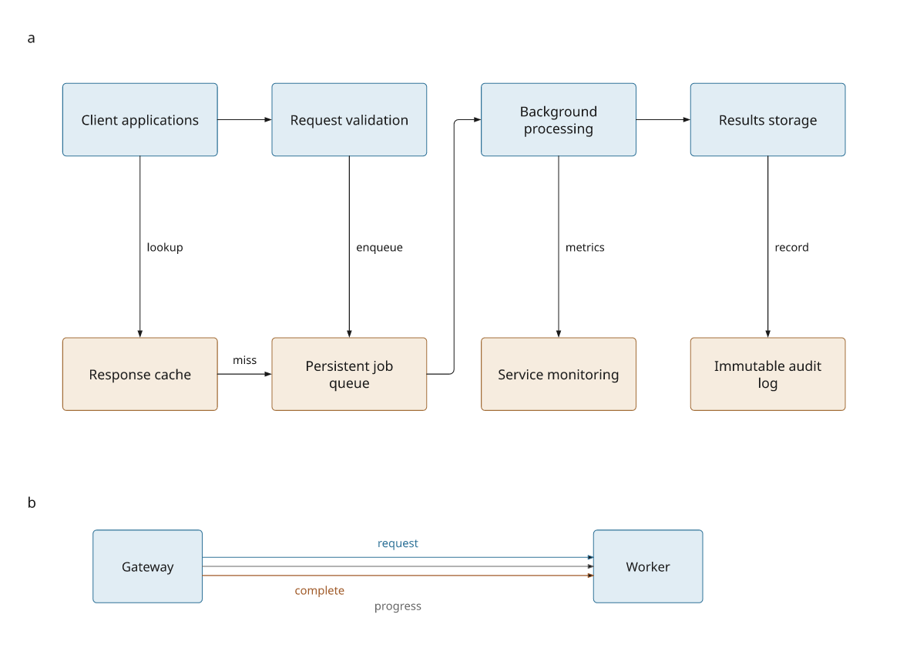
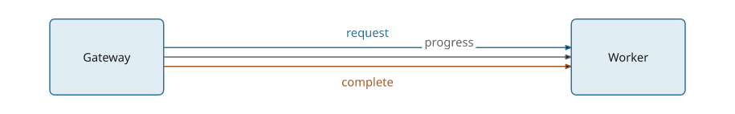
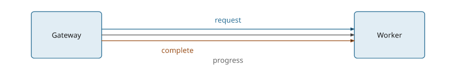

# Diagram engine review

The 3.1.0.dev11 development preview improves measured modules, connector-label
placement and obstacle routing. Text can wrap within a module's maximum width;
labels reserve space against one another; redundant obstacles are removed even
in larger diagrams.

[Full-size figure](../gallery/diagram-review.png) ·
[Executable recipe](../examples/diagram_review.py) ·
[LaTeX caption](assets/research-preview/diagram-review-caption.tex)



This original example depicts an illustrative service architecture. It uses
measured ports and two explicit waypoints for the queue-to-worker connection.
Panel b's labels are placed automatically. The figure has no embedded title or
description; its explanation belongs in the separate manuscript caption.
The recipe checks diagnostics and rejects errors and warnings.

## Reproduce it

These changes are on the development branch. Stable PyPI remains 3.0.

```bash
git clone https://github.com/Mapika/inklet.git
cd inklet
python -m pip install -e '.[render]'
python examples/diagram_review.py
```

SVG, PDF, PNG, text/LaTeX captions and a diagnostic report are written to
`out/diagram-review/`. No external assets or downloads are needed.

## Modules with bounded width

```python
import inklet as i

scene = i.composition(100, 65)
scene.add('validate', i.module(
    'Validate incoming requests and check permissions',
    min_width=34, max_width=34,
    text_style={'size': 3},
), x=5, y=5)
x, y = scene.point('validate', 's')
scene.add('queue', i.module('Persistent job queue', max_width=34),
          x=x, y=y+15, anchor='n')
scene.link('validate:s', 'queue:n', label='accepted')
doc = i.document(width=110)
doc.add('workflow', scene)
doc.save('workflow.svg', 'workflow.pdf')
```

`max_width` includes padding and label offsets. Text wraps at its available
width; the font size does not change. A smaller explicit `text_style['width']`
is respected. Port fractions refer to the resulting measured frame, so dependent
positions update when a label edit changes its height.

A single unbreakable word or a prebuilt `Diagram` wider than the limit raises
`LayoutError`. A wrapped label exceeding `max_height` also raises. Module label
offsets now enlarge the frame as needed to retain padding on every side.
Omitting `max_width` keeps natural-width sizing.

## Connector labels before and after

Both specimens use the same recipe and raster renderer. The previous engine is
commit `c60f6b0`; the current engine includes label reservations and additional
clearance candidates.

**Previous:** the progress label's opaque background interrupts the request line.



**Current:** all three lines remain visible; labels avoid lines and one another.



Run `python examples/diagram_review.py --labels-only` to export this specimen.
The option works against the previous checkout too, by setting `PYTHONPATH` to
its `src` directory.

The placer first tries the existing midpoint, opposite-side and along-line
positions. If those fail, it tries positions beside bends and up to two extra
label-sized clearances. A final pass checks earlier labels against later shafts
and updated label reservations. Unobstructed initial positions stay unchanged.

This is a bounded local placement method. It cannot guarantee a clear position
in every diagram, and moved labels may require matching colours or more spacing
to make their connection obvious. It does not optimize node positions and label
positions jointly. Dense cyclic graphs still benefit from explicit waypoints.

## Dense routing measurements

The [benchmark](../tools/benchmark_diagrams.py) constructs 36 nodes with six text
blocks each and 54 edges, including long connections that require obstacle
avoidance. It measures graph layout, routing and SVG export separately in fresh
Python processes. A second specimen checks pruning of 450 nested rectangles.

The previous implementation skipped contained-obstacle removal above 200 boxes.
That could retain every text box inside a node and exhaust the routing lattice.
The spatial sweep checks only potentially containing intervals, then applies the
same exact containment and duplicate-tie rules. It preserves input order and has
no count-based cutoff. Worst-case overlap can still require quadratic work; the
routing lattice retains its existing 60,000-node safety limit.

Measured on the same Linux/WSL2 workstation with Python 3.12.3; values
are medians of three fresh processes per revision. Setup and imports are excluded.
These timings describe this workload, not every diagram.

| Measurement | Previous engine | Current engine |
| --- | ---: | ---: |
| Graph layout | 7.7 ms | 7.4 ms |
| Routing and page assembly | 102.4 ms | 75.5 ms |
| First SVG export | 4.6 ms | 4.5 ms |
| Failed avoidance routes | 1 | 0 |
| Rectangles retained in the pruning specimen | 450 | 225 |

Routing was **1.36× faster** in this run and avoided the previous fallback.
The pruning step itself now does work where the previous engine skipped it;
its benefit is a smaller search lattice. Graph layout and SVG export are not
changed by this pass; their short timings vary between processes.

[Previous raw measurements](assets/research-preview/diagram-before.json) ·
[Current raw measurements](assets/research-preview/diagram-after.json)

```bash
python tools/benchmark_diagrams.py --repeat 3 --output out/diagram-after.json
python tools/benchmark_diagrams.py --source /path/to/previous-checkout \
  --repeat 3 --output out/diagram-before.json
```

The SVG and PDF visual-regression corpus is unchanged by this update. The new
regressions also check wrapping without font scaling, padding with signed label
offsets, stable ports, deterministic label placement, clear channel labels and
containment results against an exhaustive reference calculation.
