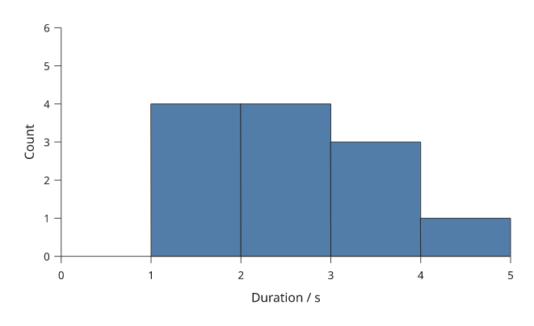
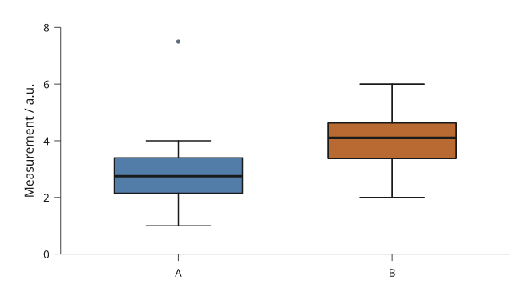
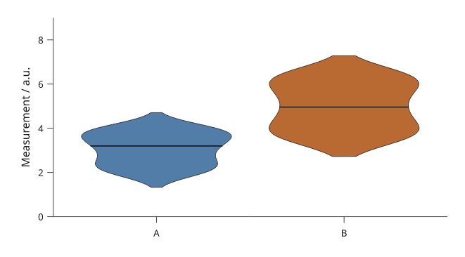
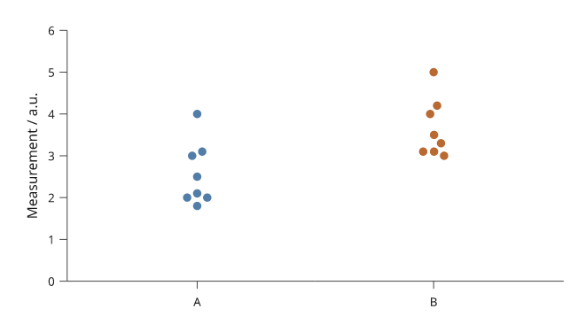

# Distributions and individual samples

A histogram groups observations into bins; boxplots summarize quartiles;
violins estimate a smooth density; swarms retain the individual values. State
the sample population and any grouping or smoothing used.

All values below are illustrative. Each snippet can be run independently with
core Inklet; PNG preview generation additionally uses the `render` extra.

## Histograms

Histograms count observations within explicit bins.
`density=True` divides by sample size and bin width so the bar area integrates
to one. Use `inklet.plot.histogram` first when the counts should determine the
y domain.

```python
import inklet as i
values = [1, 1.2, 1.4, 1.9, 2.1, 2.4, 2.4, 2.8, 3, 3.2, 3.5, 4]
p = i.plot_spec(x=(0, 5), y=(0, 6), height=45)
p.hist(values, bins=[0, 1, 2, 3, 4, 5], colors='#527da8')
p.axes(x='Duration / s', y='Count')
doc = i.document(width=105)
doc.add('hist', p)
doc.save('hist.svg', 'hist.pdf')
```



*Rendered from the code above.*

## Boxplots

Boxplots show the median, quartiles and Tukey whiskers.
Whiskers stop at the furthest observation within `whisker` times the interquartile
range. More distant observations are shown separately by default.

```python
import inklet as i
samples = {'A': [1, 2, 2.2, 2.5, 3, 3.2, 4, 7.5],
           'B': [2, 3, 3.5, 4, 4.2, 4.5, 5, 6]}
p = i.plot_spec(x=['A', 'B'], y=(0, 8), height=45)
p.boxplot(samples, colors=['#527da8', '#b96932'])
p.axes(y='Measurement / a.u.')
doc = i.document(width=105)
doc.add('boxplot', p)
doc.save('boxplot.svg', 'boxplot.pdf')
```



*Rendered from the code above.*

## Violins

Violins show a kernel-smoothed sample distribution.
The default bandwidth follows Silverman’s robust rule; `bandwidth`, `cut` and
`samples` control smoothing and drawing extent. For small groups, showing the
individual observations can reveal more than a smooth outline.

```python
import inklet as i
import math
samples = {'A': [3 + math.sin(k * .6) + .2 * math.cos(k) for k in range(48)],
           'B': [5 + 1.5 * math.sin(k * .8) for k in range(48)]}
p = i.plot_spec(x=['A', 'B'], y=(0, 9), height=45)
p.violin(samples, colors=['#527da8', '#b96932'], cut=1.5)
p.axes(y='Measurement / a.u.')
doc = i.document(width=105)
doc.add('violin', p)
doc.save('violin.svg', 'violin.pdf')
```



*Rendered from the code above.*

## Swarms

Swarms show every observation, including repeated values.
Only the sideways placement changes to separate markers. The measured value
stays fixed. `size` is marker diameter in millimetres; crowded groups may need
more panel width or smaller markers.

```python
import inklet as i
samples = {'A': [1.8, 2, 2, 2.1, 2.5, 3, 3.1, 4],
           'B': [3, 3.1, 3.1, 3.3, 3.5, 4, 4.2, 5]}
p = i.plot_spec(x=['A', 'B'], y=(0, 6), height=45)
p.swarm(samples, size=1.5, colors=['#527da8', '#b96932'])
p.axes(y='Measurement / a.u.')
doc = i.document(width=105)
doc.add('swarm', p)
doc.save('swarm.svg', 'swarm.pdf')
```



*Rendered from the code above.*

## Next steps

[Compare plot types](plot-types.md), configure [axes and scales](axes-and-scales.md),
or [arrange several panels](layout.md). For exact options, see the [API](api.md).
