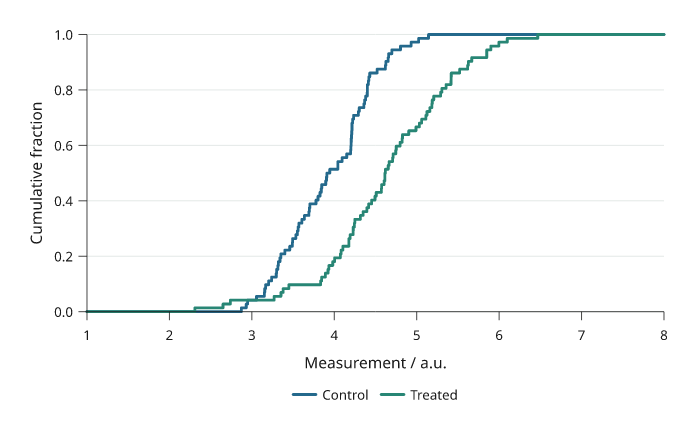
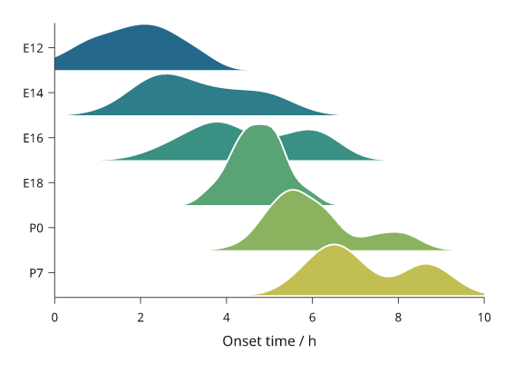

# Distributions and individual samples

A histogram groups observations into bins; boxplots summarize quartiles;
violins estimate a smooth density; swarms retain the individual values. State
the sample population and any grouping or smoothing used.

All values below are illustrative simulated observations. Each snippet can be run independently with
core Inklet; PNG preview generation additionally uses the `render` extra.
Run a block from the repository root with `.venv/bin/python`; each block writes
an SVG and PDF. These methods summarize the values you pass and do not perform
a statistical test.

Choose a display from the question: a histogram shows bin counts, a boxplot
shows robust summaries, a violin shows a smoothed shape, and a swarm shows
individual observations. Keep group sample sizes visible in the caption.

## Histograms

Histograms count observations within explicit bins.
`density=True` divides by sample size and bin width so the bar area integrates
to one. Use `inklet.plot.histogram` first when the counts should determine the
y domain.
Bin edges affect the displayed distribution, so report them or the rule used to choose them.
Unequal bin widths need particular care when comparing bar heights.

```python
import inklet as i
import random
rng = random.Random(401)
values = [rng.gauss(3.0, .62) for _ in range(96)]
from inklet.plot import histogram
edges, counts = histogram(values, bins=[n / 2 for n in range(13)])
p = i.plot_spec(x=(0, 6), y=(0, max(counts) + 4), height=44)
p.hist(values, bins=edges, colors='#24698c', stroke='white', stroke_width=.15)
p.grid(x=False, y=True, count=5, stroke='#e1e7e4', stroke_width=.15)
p.axes(x='Duration / s', y='Count')
doc = i.document(width=110)
doc.add('hist', p)
doc.save('hist.svg', 'hist.pdf')
```


*Rendered from the code above. Ninety-six simulated durations are grouped into
12 half-second bins; the bars show counts, not a fitted distribution.*

## Boxplots

Boxplots show the median, quartiles and Tukey whiskers.
Whiskers stop at the furthest observation within `whisker` times the interquartile
range. More distant observations are shown separately by default.
The box does not show sample size or the full distribution. Overlay a swarm for
small groups, and do not interpret whisker points as automatically erroneous.

```python
import inklet as i
import random
rng = random.Random(402)
samples = {'Control': [rng.gauss(4.1, .62) for _ in range(72)],
           'Treated': [rng.gauss(4.65, .78) for _ in range(72)]}
p = i.plot_spec(x=['Control', 'Treated'], y=(1, 8), height=44)
p.boxplot(samples, colors=['#24698c', '#288675'])
p.grid(x=False, y=True, count=5, stroke='#e1e7e4', stroke_width=.15)
p.axes(y='Measurement / a.u.')
doc = i.document(width=110)
doc.add('boxplot', p)
doc.save('boxplot.svg', 'boxplot.pdf')
```


*Rendered from the code above. The same 72 simulated observations per group
are reduced to quartiles and Tukey whiskers; sample size is not encoded by box
width.*

## Violins

Violins show a kernel-smoothed sample distribution.
The default bandwidth follows Silverman’s robust rule; `bandwidth`, `cut` and
`samples` control smoothing and drawing extent. For small groups, showing the
individual observations can reveal more than a smooth outline.
The density is an estimate, so bandwidth can create or remove apparent modes;
report the selected bandwidth when the shape supports a substantive claim.

```python
import inklet as i
import random
rng = random.Random(402)
samples = {'Control': [rng.gauss(4.1, .62) for _ in range(72)],
           'Treated': [rng.gauss(4.65, .78) for _ in range(72)]}
p = i.plot_spec(x=['Control', 'Treated'], y=(1, 8), height=44)
p.violin(samples, colors=['#24698c', '#288675'], cut=1.5)
p.grid(x=False, y=True, count=5, stroke='#e1e7e4', stroke_width=.15)
p.axes(y='Measurement / a.u.')
doc = i.document(width=110)
doc.add('violin', p)
doc.save('violin.svg', 'violin.pdf')
```


*Rendered from the code above. These violins use the same 72 observations as
the boxplots; their outlines are bandwidth-dependent density estimates.*

## Swarms

Swarms show every observation, including repeated values.
Only the sideways placement changes to separate markers. The measured value
stays fixed. `size` is marker diameter in millimetres; crowded groups may need
more panel width or smaller markers.

```python
import inklet as i
import random
rng = random.Random(402)
samples = {'Control': [rng.gauss(4.1, .62) for _ in range(72)],
           'Treated': [rng.gauss(4.65, .78) for _ in range(72)]}
p = i.plot_spec(x=['Control', 'Treated'], y=(1, 8), height=44)
p.swarm(samples, size=1.0, colors=['#24698c', '#288675'])
p.grid(x=False, y=True, count=5, stroke='#e1e7e4', stroke_width=.15)
p.axes(y='Measurement / a.u.')
doc = i.document(width=110)
doc.add('swarm', p)
doc.save('swarm.svg', 'swarm.pdf')
```


*Rendered from the code above. Every point is one of the same 72 observations
per group used above; only its horizontal position is adjusted to separate overlapping points.*

## Cumulative distributions

`ecdf` draws the empirical cumulative distribution: the fraction of
observations at or below each value, as a step line. Every observation is
shown and no bin width or bandwidth is chosen. `complementary=True` draws
the fraction above each value instead. `normalize=False` draws counts.
`inklet.plot.ecdf(values)` returns the steps without drawing them.

```python
import inklet as i
import random

rng = random.Random(402)
control = [rng.gauss(4.1, .62) for _ in range(72)]
treated = [rng.gauss(4.65, .78) for _ in range(72)]
p = i.plot_spec(x=(1, 8), y=(0, 1), height=44)
p.grid(x=False, count=4, stroke='#e1e7e4', stroke_width=.15)
p.ecdf(control, name='Control', stroke='#24698c', stroke_width=.45)
p.ecdf(treated, name='Treated', stroke='#288675', stroke_width=.45)
p.axes(x='Measurement / a.u.', y='Cumulative fraction').legend(side='bottom')
doc = i.document(width=110)
doc.add('ecdf', p)
doc.save('ecdf.svg', 'ecdf.pdf')
```



*Rendered from the code above, with the same 72 observations per group used
above. The curves run flat to both ends of the x axis.*

## Ridgelines

`ridgeline` draws one kernel density per category on a shared x scale, with
the categories on a band y scale. Each ridge stands on the lower edge of its
category's row, and `overlap` is the height of the tallest ridge in rows, so
values above 1 let a ridge rise into the rows above it. Ridges are filled
with an opaque colour and drawn from the top down, so lower ridges cover the
ones behind them.

`scale='shared'` (default) uses one height scale for all ridges, so their
areas compare; `scale='each'` gives every ridge the same peak height. By
default all ridges are scaled down by one factor if the top ones would rise
above the plot area, so `overlap` is a maximum; `fit=False` keeps it and
lets them rise above. The bandwidth follows the same rule as `violin`.

```python
import inklet as i
import random

rng = random.Random(403)
stages = ['E12', 'E14', 'E16', 'E18', 'P0', 'P7']
onsets = {s: [rng.gauss(2 + k * .9, .9 - .08 * k) for _ in range(80)]
          + [rng.gauss(4.2 + k * .9, .4) for _ in range(20 * (k % 3))]
          for k, s in enumerate(stages)}
p = i.plot_spec(x=(0, 10), y=stages[::-1], height=48)
p.ridgeline(onsets, overlap=1.8,
            colors=['#24698c', '#2d7d8a', '#3a9083', '#5aa374', '#8bb35f', '#c2bf52'],
            stroke='white', stroke_width=.3)
p.axes(x='Onset time / h')
doc = i.document(width=90)
doc.add('ridgeline', p)
doc.save('ridgeline.svg', 'ridgeline.pdf')
```



*Rendered from the code above. Each ridge is a kernel density of 80 to 120
simulated onset times; heights share one scale.*

## Next steps

[Compare plot types](plot-types.md), configure [axes and scales](axes-and-scales.md),
or [arrange several panels](layout.md). For exact options, see the [API](api.md).
