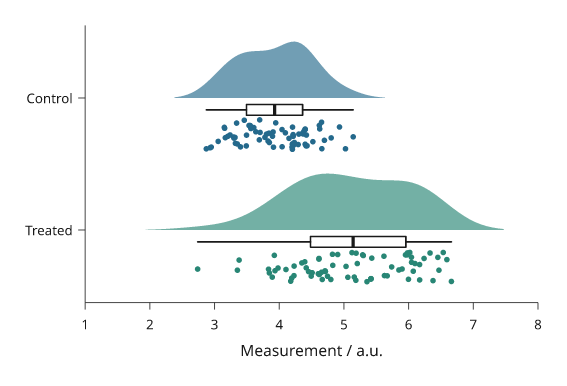
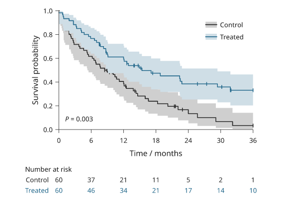
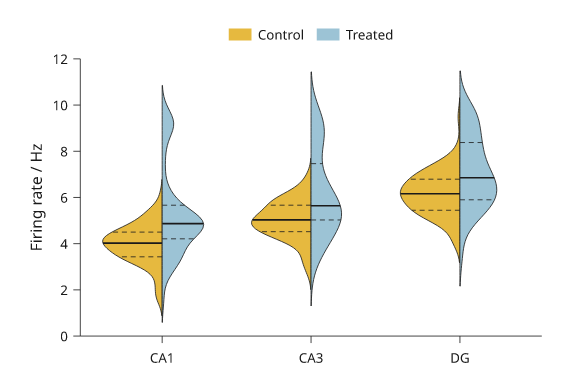
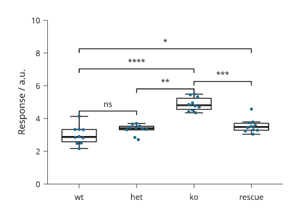
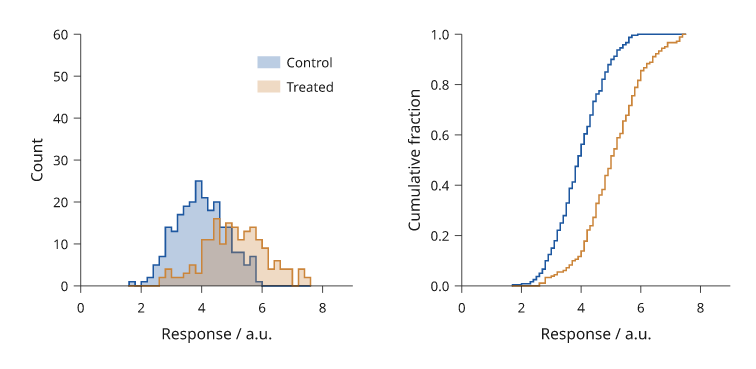
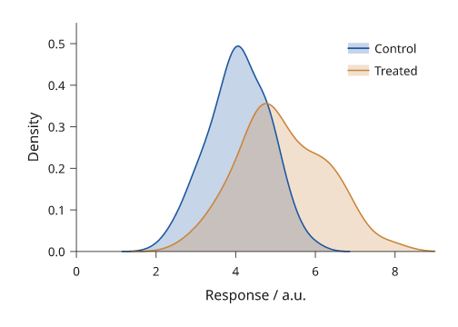
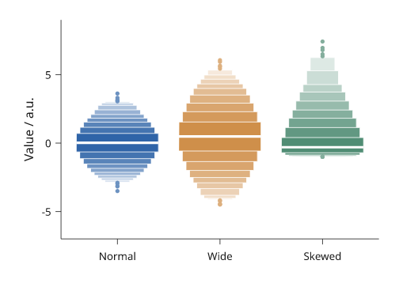
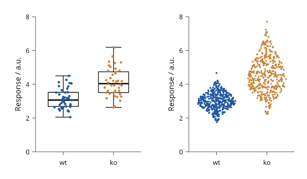
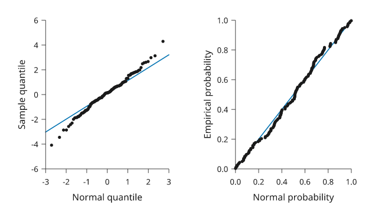

# Distributions and individual samples

A histogram groups observations into bins; boxplots summarize quartiles;
violins estimate a smooth density; swarms retain the individual values. State
the sample population and any grouping or smoothing used.

All values below are illustrative simulated observations. Each snippet can be run independently with
core Inklet; PNG preview generation additionally uses the `render` extra.
Run a block from the repository root with `.venv/bin/python`; each block writes
an SVG and PDF. These methods summarize the values you pass and do not perform
a statistical test.

Choose a display from the question: a histogram shows bin counts, a boxplot
shows robust summaries, a violin shows a smoothed shape, and a swarm shows
individual observations. Keep group sample sizes visible in the caption.

## Histograms

Histograms count observations within explicit bins.
`density=True` divides by sample size and bin width so the bar area integrates
to one. Use `inklet.plot.histogram` first when the counts should determine the
y domain.
Bin edges affect the displayed distribution, so report them or the rule used to choose them.
Unequal bin widths need particular care when comparing bar heights.

```python
import inklet as i
import random
rng = random.Random(401)
values = [rng.gauss(3.0, .62) for _ in range(96)]
from inklet.plot import histogram
edges, counts = histogram(values, bins=[n / 2 for n in range(13)])
p = i.plot_spec(x=(0, 6), y=(0, max(counts) + 4), height=44)
p.hist(values, bins=edges, color='#24698c', stroke='white', stroke_width=.15)
p.grid(x=False, y=True, count=5, stroke='#e1e7e4', stroke_width=.15)
p.axes(x='Duration / s', y='Count')
doc = i.document(width=110)
doc.add('hist', p)
doc.save('hist.svg', 'hist.pdf')
```


*Rendered from the code above. Ninety-six simulated durations are grouped into
12 half-second bins; the bars show counts, not a fitted distribution.*

## Boxplots

Boxplots show the median, quartiles and Tukey whiskers.
Whiskers stop at the furthest observation within `whisker` times the interquartile
range. More distant observations are shown separately by default.
The box does not show sample size or the full distribution. Overlay a swarm for
small groups, and do not interpret whisker points as automatically erroneous.

```python
import inklet as i
import random
rng = random.Random(402)
samples = {'Control': [rng.gauss(4.1, .62) for _ in range(72)],
           'Treated': [rng.gauss(4.65, .78) for _ in range(72)]}
p = i.plot_spec(x=['Control', 'Treated'], y=(1, 8), height=44)
p.boxplot(samples, color=['#24698c', '#288675'])
p.grid(x=False, y=True, count=5, stroke='#e1e7e4', stroke_width=.15)
p.axes(y='Measurement / a.u.')
doc = i.document(width=110)
doc.add('boxplot', p)
doc.save('boxplot.svg', 'boxplot.pdf')
```


*Rendered from the code above. The same 72 simulated observations per group
are reduced to quartiles and Tukey whiskers; sample size is not encoded by box
width.*

## Violins

Violins show a kernel-smoothed sample distribution.
The default bandwidth follows Silverman’s robust rule; `bandwidth`, `cut` and
`samples` control smoothing and drawing extent. For small groups, showing the
individual observations can reveal more than a smooth outline.
The density is an estimate, so bandwidth can create or remove apparent modes;
report the selected bandwidth when the shape supports a substantive claim.

```python
import inklet as i
import random
rng = random.Random(402)
samples = {'Control': [rng.gauss(4.1, .62) for _ in range(72)],
           'Treated': [rng.gauss(4.65, .78) for _ in range(72)]}
p = i.plot_spec(x=['Control', 'Treated'], y=(1, 8), height=44)
p.violin(samples, color=['#24698c', '#288675'], cut=1.5)
p.grid(x=False, y=True, count=5, stroke='#e1e7e4', stroke_width=.15)
p.axes(y='Measurement / a.u.')
doc = i.document(width=110)
doc.add('violin', p)
doc.save('violin.svg', 'violin.pdf')
```


*Rendered from the code above. These violins use the same 72 observations as
the boxplots; their outlines are bandwidth-dependent density estimates.*

## Swarms

Swarms show every observation, including repeated values.
Only the sideways placement changes to separate markers. The measured value
stays fixed. `size` is marker diameter in millimetres; crowded groups may need
more panel width or smaller markers.

```python
import inklet as i
import random
rng = random.Random(402)
samples = {'Control': [rng.gauss(4.1, .62) for _ in range(72)],
           'Treated': [rng.gauss(4.65, .78) for _ in range(72)]}
p = i.plot_spec(x=['Control', 'Treated'], y=(1, 8), height=44)
p.swarm(samples, size=1.0, color=['#24698c', '#288675'])
p.grid(x=False, y=True, count=5, stroke='#e1e7e4', stroke_width=.15)
p.axes(y='Measurement / a.u.')
doc = i.document(width=110)
doc.add('swarm', p)
doc.save('swarm.svg', 'swarm.pdf')
```


*Rendered from the code above. Every point is one of the same 72 observations
per group used above; only its horizontal position is adjusted to separate overlapping points.*

## Cumulative distributions

`ecdf` draws the empirical cumulative distribution: the fraction of
observations at or below each value, as a step line. Every observation is
shown and no bin width or bandwidth is chosen. `complementary=True` draws
the fraction above each value instead. `normalize=False` draws counts.
`inklet.plot.ecdf(values)` returns the steps without drawing them.

```python
import inklet as i
import random

rng = random.Random(402)
control = [rng.gauss(4.1, .62) for _ in range(72)]
treated = [rng.gauss(4.65, .78) for _ in range(72)]
p = i.plot_spec(x=(1, 8), y=(0, 1), height=44)
p.grid(x=False, count=4, stroke='#e1e7e4', stroke_width=.15)
p.ecdf(control, name='Control', stroke='#24698c', stroke_width=.45)
p.ecdf(treated, name='Treated', stroke='#288675', stroke_width=.45)
p.axes(x='Measurement / a.u.', y='Cumulative fraction').legend(side='bottom')
doc = i.document(width=110)
doc.add('ecdf', p)
doc.save('ecdf.svg', 'ecdf.pdf')
```


*Rendered from the code above, with the same 72 observations per group used
above. The curves run flat to both ends of the x axis.*

## Ridgelines

`ridgeline` draws one kernel density per category on a shared x scale, with
the categories on a band y scale. Each ridge stands on the lower edge of its
category's row, and `overlap` is the height of the tallest ridge in rows, so
values above 1 let a ridge rise into the rows above it. Ridges are filled
with an opaque colour and drawn from the top down, so lower ridges cover the
ones behind them.

`scale='shared'` (default) uses one height scale for all ridges, so their
areas compare; `scale='each'` gives every ridge the same peak height. By
default all ridges are scaled down by one factor if the top ones would rise
above the plot area, so `overlap` is a maximum; `fit=False` keeps it and
lets them rise above. The bandwidth follows the same rule as `violin`.

```python
import inklet as i
import random

rng = random.Random(403)
stages = ['E12', 'E14', 'E16', 'E18', 'P0', 'P7']
onsets = {s: [rng.gauss(2 + k * .9, .9 - .08 * k) for _ in range(80)]
          + [rng.gauss(4.2 + k * .9, .4) for _ in range(20 * (k % 3))]
          for k, s in enumerate(stages)}
p = i.plot_spec(x=(0, 10), y=stages[::-1], height=48)
p.ridgeline(onsets, overlap=1.8,
            color=['#24698c', '#2d7d8a', '#3a9083', '#5aa374', '#8bb35f', '#c2bf52'],
            stroke='white', stroke_width=.3)
p.axes(x='Onset time / h')
doc = i.document(width=90)
doc.add('ridgeline', p)
doc.save('ridgeline.svg', 'ridgeline.pdf')
```


*Rendered from the code above. Each ridge is a kernel density of 80 to 120
simulated onset times; heights share one scale.*

## Rainclouds

`raincloud` draws, for each group, a half violin, a narrow box and every
observation. It takes the same groups as `violin` and `swarm`. Each group's
slot is split into three lanes: the half violin stands on the category's
centre line, the box sits just beside it, and the observations fill the far
half of the slot. With `orient='h'` (default) the groups are on the y axis
and the half violin rises up the page; with `orient='v'` it extends to the
right.

The half violin uses the `violin` bandwidth rule. The box shows the
quartiles, the median and whiskers to the furthest observations within 1.5
interquartile ranges, without caps; outliers are not drawn separately
because every observation is shown. `points='jitter'` (default) moves each
observation sideways by a random offset from a generator seeded by `seed`,
so the figure is the same on every run. `points='swarm'` packs them as
`swarm` does, and `points=None` leaves them out. `box=False` leaves out the
box. The points use each group's colour and the half violin a paler blend
of it.

```python
import inklet as i
import random

rng = random.Random(402)
samples = {'Control': [rng.gauss(4.1, .62) for _ in range(72)],
           'Treated': [rng.gauss(4.65, .78) for _ in range(52)]
           + [rng.gauss(6.2, .3) for _ in range(20)]}
p = i.plot_spec(x=(1, 8), y=['Treated', 'Control'], height=44)
p.raincloud(samples, color=['#24698c', '#288675'], size=.9)
p.axes(x='Measurement / a.u.')
doc = i.document(width=90)
doc.add('raincloud', p)
doc.save('raincloud.svg', 'raincloud.pdf')
```



*Rendered from the code above. The treated group has a second mode near 6,
which the half violin and the points show and the box does not.*

## Survival curves

`kaplan_meier` draws Kaplan–Meier survival curves. Pass a mapping of group
name to `(durations, events)`, where `events` is true for an observed event
and false for a censored subject. Each curve is a step line from 1 at time 0
to the last observed time. A short vertical tick marks each censoring time.

The estimate is the product-limit estimate with Greenwood's variance. The
shaded band is a 95% log-log confidence interval, which stays between 0 and 1.
`band='linear'` gives the plain Greenwood interval, and `band=None` leaves the
band out. `inklet.plot.kaplan_meier(durations, events)` returns the estimate
without drawing it: times, survival, numbers at risk, variance, band and
median.

`at_risk()` adds the number-at-risk table below everything already drawn, so
call it after `axes()`. Each column sits under an x tick, and each row is
set in its curve's colour. Inklet does not run a log-rank test. To annotate a
p-value computed elsewhere, pass `pvalue=`.

```python
import inklet as i
import random

rng = random.Random(7)

def arm(rate, n=60):
    durations, events = [], []
    for _ in range(n):
        event, dropout = rng.expovariate(rate), rng.uniform(6, 60)
        durations.append(round(min(event, dropout, 36), 1))
        events.append(event <= min(dropout, 36))
    return durations, events

p = i.panel(62, 38, x=(0, 36), y=(0, 1))
p.kaplan_meier({'Control': arm(1 / 14), 'Treated': arm(1 / 30)},
               color=['#262626', '#24698c'], pvalue=0.003)
p.axes(x='Time / months', y='Survival probability',
       x_options={'ticks': [0, 6, 12, 18, 24, 30, 36]})
p.legend(corner='ne')
p.at_risk(ticks=[0, 6, 12, 18, 24, 30, 36])
fig = i.figure(width=90)
fig.add(p.build())
fig.save('survival.svg', 'survival.pdf')
```



*Rendered from the code above with simulated follow-up of 60 subjects per
group. The p-value is illustrative and was not computed from these data.*

## Split violins

`split_violin` compares two conditions per category: the first is the left
half of each violin and the second the right half (with `orient='h'`, the
upper and lower halves). The groups are spelled as for `violin`, and each
half is the `violin` kernel density with the same bandwidth rule, `cut` and
`samples`. By default both halves of a category share one width scale, so
their areas are equal; `scale='each'` gives each half the full width.
`median=True` (default) draws each half's median as a solid line and
`quartiles=True` its quartiles as dashed lines. `name=` puts both
conditions in the legend.

```python
import inklet as i
import random

rng = random.Random(404)
regions = ['CA1', 'CA3', 'DG']
control = {r: [rng.gauss(4 + 1.2 * k, .9) for _ in range(80)] for k, r in enumerate(regions)}
treated = {r: [rng.gauss(4.6 + .8 * k, 1.1) for _ in range(60)]
           + [rng.gauss(9, .5) for _ in range(12 + 6 * k)] for k, r in enumerate(regions)}
p = i.plot_spec(x=regions, y=(0, 12), height=44)
p.split_violin(control, treated, name=['Control', 'Treated'], quartiles=True,
               color=['#e6b93f', '#9cc3d5'])
p.axes(y='Firing rate / Hz').legend(side='top')
doc = i.document(width=90)
doc.add('split-violin', p)
doc.save('split-violin.svg', 'split-violin.pdf')
```



*Simulated data. The treated half shows a second mode near 9 Hz.*

## Significance brackets

`brackets` draws many significance brackets in one call. It takes a list of
`(group_a, group_b, value)`, where the value is a p-value or the text to
write, and draws them with `bracket`, shortest span first. Each bracket
clears the data between its ends and the brackets already drawn there, so
nested comparisons stack upward and a short one sits just over its own data.

`format='stars'` (default) writes `****`, `***`, `**` or `*` for p below
0.0001, 0.001, 0.01 and 0.05, and `ns` otherwise; `format='p'` writes
"P = 0.004" or "P < 0.001". `hide_ns=True` leaves out comparisons that are
not significant. No test is run: the p-values are yours.
`inklet.plot.format_p` formats one p-value.

```python
import inklet as i
import random

rng = random.Random(405)
genotypes = ['wt', 'het', 'ko', 'rescue']
response = {g: [rng.gauss(m, .45) for _ in range(10)]
            for g, m in zip(genotypes, (3.0, 3.4, 5.0, 3.6))}
p = i.plot_spec(x=genotypes, y=(0, 10), height=44)
p.boxplot(response, outliers=False)
p.swarm(response, color=['#24698c'] * 4)
p.brackets([('wt', 'het', .21), ('wt', 'ko', 2e-5), ('het', 'ko', .004),
            ('ko', 'rescue', 7e-4), ('wt', 'rescue', .031)])
p.axes(y='Response / a.u.')
doc = i.document(width=80)
doc.add('brackets', p)
doc.save('brackets.svg', 'brackets.pdf')
```



*Simulated data with made-up p-values.*

## Histogram outlines, groups and cumulative counts

`hist` takes a mapping of group name to values and bins every group on the
same edges, taken from all the groups together, so the bars line up and the
heights compare. Groups are drawn as translucent filled outlines in the ink
palette and named for `legend()`. `histtype='step'` draws the outline alone,
`'stepfilled'` fills it without edges between bins, and the default for one
sample stays touching bars. `cumulative=True` draws running totals; with
`density=True` they end at one, the empirical distribution function on the
bins' upper edges.

```python
import inklet as i
import random
rng = random.Random(406)
groups = {'Control': [rng.gauss(4.0, .8) for _ in range(240)],
          'Treated': [rng.gauss(5.1, 1.1) for _ in range(180)]}
counts = i.plot_spec(x=(0, 9), y=(0, 60), height=40)
counts.hist(groups, 24)
counts.axes(x='Response / a.u.', y='Count')
counts.legend(corner='ne')
running = i.plot_spec(x=(0, 9), y=(0, 1), height=40)
running.hist(groups, 40, density=True, cumulative=True, histtype='step')
running.axes(x='Response / a.u.', y='Cumulative fraction')
doc = i.document(width=120, columns=[1, 1], gap=8)
doc.add('counts', counts, row=0, column=0)
doc.add('running', running, row=0, column=1)
doc.save('hist-groups.svg', 'hist-groups.pdf')
```



*Rendered from the code above. Both groups share one set of bin edges; the
right panel shows the fraction of each group at or below each bin's upper
edge.*

## Kernel density curves

`kde` draws a Gaussian kernel density of one sample or of each group in a
mapping, in stdlib Python. `bandwidth='scott'` (default) is R's `bw.nrd`,
`1.06 min(sd, IQR/1.34) n^-1/5`; `'silverman'` is `bw.nrd0`, with 0.9 in
place of 1.06; a number sets it in data units, and `adjust` scales any of
them. `fill=True` shades under each curve at 25% opacity so groups stay
visible through each other. `stat='count'` multiplies by the sample size,
so the areas compare group sizes. On a log axis the density is estimated in
log units. `inklet.plot.kde_curve` returns the curve without drawing it.
The bandwidth is a smoothing choice; report it with the figure.

```python
import inklet as i
import random
rng = random.Random(407)
groups = {'Control': [rng.gauss(4.0, .8) for _ in range(240)],
          'Treated': [rng.gauss(5.1, 1.1) for _ in range(180)]}
p = i.plot_spec(x=(0, 9), y=(0, .55), height=40)
p.kde(groups, fill=True)
p.axes(x='Response / a.u.', y='Density')
p.legend(corner='ne')
doc = i.document(width=80)
doc.add('kde', p)
doc.save('kde.svg', 'kde.pdf')
```



*Rendered from the code above, with Scott's rule chosen separately for each
group.*

## Letter-value plots

A box plot of 5,000 observations marks hundreds of ordinary tail values as
outliers. `boxen` (a letter-value plot) keeps going out into the tails: the
inner box spans the quartiles, the next the eighths, then the sixteenths,
each narrower and paler than the one inside. `depth='tukey'` (default) draws
`floor(log2 n) - 3` boxes; `'trustworthy'` draws as many as have
non-overlapping 95% intervals. The median is a paper-coloured line. Values
beyond the outermost box are dots. `inklet.plot.letter_values` returns the
boxes.

```python
import inklet as i
import random
rng = random.Random(408)
samples = {'Normal': [rng.gauss(0, 1) for _ in range(5000)],
           'Wide': [rng.gauss(.5, 1.6) for _ in range(5000)],
           'Skewed': [rng.expovariate(1) - 1 for _ in range(5000)]}
p = i.plot_spec(x=list(samples), y=(-7, 9), height=44)
p.boxen(samples)
p.axes(y='Value / a.u.')
doc = i.document(width=80)
doc.add('boxen', p)
doc.save('boxen.svg', 'boxen.pdf')
```



*Rendered from the code above: 5,000 simulated values per group, seven
letter values each.*

## Strip and sina plots

`strip` draws every observation, jittered across its group's slot by a
seeded random generator: the same call draws the same figure, and `seed=`
changes the draw. Over `boxplot(..., outliers=False)` it shows the summary and
the points together. `sina` spreads each point by at most the group's kernel
density at its value, so the points take a violin's outline and every value
stays visible. Only the sideways position is random; values are exact.

```python
import inklet as i
import random
rng = random.Random(409)
small = {'wt': [rng.gauss(3.0, .5) for _ in range(40)],
         'ko': [rng.gauss(4.2, .8) for _ in range(40)]}
large = {'wt': [rng.gauss(3.0, .5) for _ in range(400)],
         'ko': [rng.gauss(4.2, .8) + (1.2 if rng.random() < .3 else 0)
                for _ in range(400)]}
strip = i.plot_spec(x=['wt', 'ko'], y=(0, 8), height=44)
strip.boxplot(small, outliers=False)
strip.strip(small, size=.8)
strip.axes(y='Response / a.u.')
sina = i.plot_spec(x=['wt', 'ko'], y=(0, 8), height=44)
sina.sina(large, size=.6)
sina.axes(y='Response / a.u.')
doc = i.document(width=100, columns=[1, 1], gap=8)
doc.add('strip', strip, row=0, column=0)
doc.add('sina', sina, row=0, column=1)
doc.save('strip-sina.svg', 'strip-sina.pdf')
```



*Rendered from the code above. Left, 40 observations per group over their
boxes; right, 400 per group spread by their densities.*

## Quantile-quantile and probability plots

`qq` plots each sorted value against the standard normal quantile at its
plotting position (R's `ppoints`), with a reference line through the first
and third quartiles, as R's `qqline` draws. A normal sample follows the line;
heavy tails bend away from it at both ends. `line='fit'` uses the mean and
standard deviation instead. `pp` plots the fitted normal CDF against the
empirical probabilities, with the diagonal. A PP plot is most sensitive in the
middle of the distribution, a QQ plot in the tails. `dist=` takes another
`statistics.NormalDist` or any quantile function (for `pp`, any CDF).

```python
import inklet as i
import random
rng = random.Random(410)
heavy = [rng.gauss(0, 1) / max(.25, abs(rng.gauss(0, 1))) ** .5
         for _ in range(150)]
qq = i.plot_spec(x=(-3, 3), y=(-6, 6), height=40)
qq.qq(heavy)
qq.axes(x='Normal quantile', y='Sample quantile')
pp = i.plot_spec(x=(0, 1), y=(0, 1), height=40)
pp.pp(heavy)
pp.axes(x='Normal probability', y='Empirical probability')
doc = i.document(width=100, columns=[1, 1], gap=8)
doc.add('qq', qq, row=0, column=0)
doc.add('pp', pp, row=0, column=1)
doc.save('qq.svg', 'qq.pdf')
```



*Rendered from the code above. The sample is heavy-tailed by construction, so
its extreme values bend away from the QQ reference line.*

## Next steps

[Relationships between variables](relationships.md) covers 2D densities,
regression, agreement plots and pair plots.

[Compare plot types](plot-types.md), configure [axes and scales](axes-and-scales.md),
or [arrange several panels](layout.md). For exact options, see the [API](api.md).
