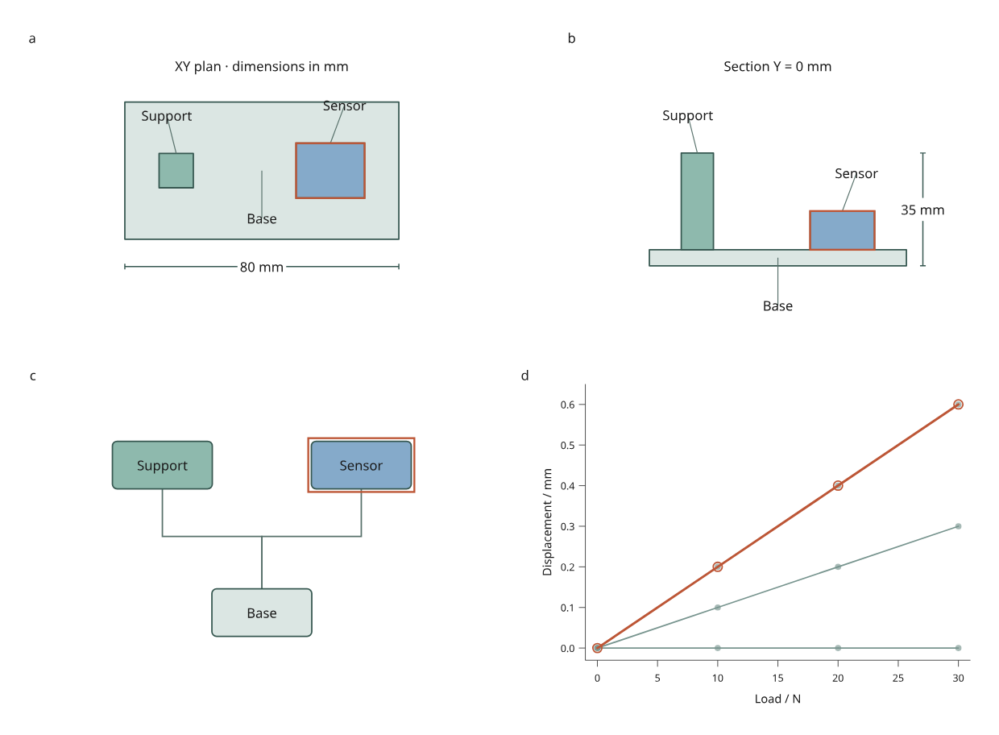

# Linked engineering report

Connect native Inklet drawings to table rows: a component selection reaches a
dimensioned plan, an authored section, a system diagram and supplied response
curves. Save the selected state, replace geometry, retain label offsets and
export the report at two physical widths.

These are development APIs under `inklet.experimental`, **not part of PyPI
3.1.0**. This starts the mixed-content engineering work in Phase C of the
[4.0 roadmap](roadmap.md). Numbered 4.0 development releases have not been issued.



[Open the interactive report](assets/v4/engineering-report.html) ·
[Complete Python recipe](../examples/v4/engineering_report.py) ·
[170 mm version](assets/v4/engineering-report-170mm.png)

The original assembly has an 80 × 40 mm base and an overall height of 35 mm.
Panel **a** shows its XY plan; **b** is a zero-thickness Y = 0 mm section;
**c** shows authored attachment relationships; **d** shows supplied simulated
response values. Orange outlines identify the selected sensor in every view.
Geometry and response values are original MIT fixtures by Mark Marosi.

The response is illustrative, not a mechanical simulation. The base has zero
displacement, the support uses half the fixture's response and the sensor uses
the fixture's response. Changing geometry **does not solve or update these
supplied curves**. Replace analysis values explicitly when a solver supplies new
results. Dimensions describe the complete assembly, independently of filtering.

## Run, select and revise

```sh
python examples/v4/engineering_report.py --render --output out/engineering
```

Select a component in any drawing, along its response curve, or through the
keyboard-accessible data table. Filter by ID to hide other components; labels
and connectors associated with hidden components disappear too. A connector
requires both endpoints to remain visible. SVG, canvas and hybrid display use
the same IDs and measured geometry.

Expand **Data revision** to choose:

| Revision | Geometry change | What remains explicit |
| --- | --- | --- |
| Original | Three boxes; 35 mm total height | Supplied response and authored labels |
| Resized | Support becomes 36 mm tall; sensor widens to 26 mm and moves to X = 24 mm | Total height becomes 41 mm; curves remain supplied values |
| Removed | Support is removed from the original assembly | Its node, label and attachment disappear; removed selected/visible IDs require a drop policy |

Each alternative is compiled in Python and packaged into the offline page.
Switching does not run Python, download assets or mutate the old scene. Native
artwork finishes loading before a replacement becomes the active document.

Choose **Save view**, then reopen that JSON in the browser or reproduce it:

```sh
# A state from the original report.
python examples/v4/engineering_report.py --state /path/to/view.json --render --output out/reopened

# A state saved after switching to Resized.
python examples/v4/engineering_report.py --revision resized --state /path/to/resized-view.json --render --output out/resized

# Apply an ORIGINAL state to a different geometry revision.
python examples/v4/engineering_report.py --revision removed --rebase-state /path/to/view.json --missing drop --render --output out/removed
```

`figure.svg` reproduces the exact saved viewport. The 210 mm and 170 mm exports
recompile the full page while retaining visible and selected IDs. Label text
and stroke sizes stay authored in physical units. `--render` adds PNG and vector
PDF using Chrome/Chromium and Pillow. Outlined native drawing assets remain
vector content in SVG and PDF; canvas affects browser display only.

## Associate native drawings with data

`DrawingView` calls a Python builder with the immutable table and the measured
panel width and height. Return `DrawingItem` objects in paint order. Coordinates
and hit boxes are **panel-local millimetres**, with X rightward and Y downward.

```python
import inklet as i
from inklet.experimental.browser import BrowserFigure, DrawingItem, DrawingView
from inklet.experimental.selection import KeyedTable


def draw_sensor(table, width, height):
    sensor = i.box("Sensor", width=24, height=12).translated(width/2, height/2)
    return [DrawingItem(("sensor",), sensor,
                        description="Sensor module; supplied dimensions in table")]


table = KeyedTable("assembly", {"id": ["sensor"], "width_mm": [20]})
figure = BrowserFigure(table, [DrawingView("sensor", draw_sensor)])
```

The native theme and paint resolver are applied before producing self-contained
outlined SVG assets. Stable drawing IDs make repeated builds reproduce the same
scene digest. The browser never receives the builder callback.

Each item accepts these options:

| Field | Meaning |
| --- | --- |
| `ids` | Associated table IDs; empty means an unpickable reference |
| `diagram` | A native `Diagram`, positioned in the panel's local coordinates |
| `hit_box` | Optional `(x, y, width, height)` rectangle in panel mm; defaults to the padded layout/paint bounds |
| `description` | Human-readable hover description |
| `pickable` | Set false for labels and connectors that should not intercept pointer selection |
| `highlight` | Set false to suppress an extra selection rectangle around a label or connector |

All supplied IDs must exist in the table. A view may omit components, for example
when a section misses them; inspect `layer["drawing"]["omitted_ids"]`. With
multiple IDs, all must be visible for an item to appear; picking selects the
first associated ID. The example makes attachment connectors unpickable.

Picking uses **rectangular targets**, not arbitrary path silhouettes or hidden
3D surfaces. Later painted targets win ties. Selection outlines the target
rectangle while retaining the artwork's authored colors. Text and strokes are
not silently shrunk to fit: drawings or targets outside their panel raise a
layout error. Snapshots include conservative painted bounds for strokes and halos, plus a
0.5 mm margin. Those bounds must also fit the panel.

## Explicit box geometry and sections

`BoxComponent(id, size, center)` and `BoxAssembly(components, unit)` snapshot
axis-aligned boxes. `unit` must explicitly be `"mm"` or `"m"`; there is no
implicit unit conversion. The example imports `fixtures/assembly.json` through
`BoxAssembly.from_dict()`.

```python
from inklet.experimental.engineering import BoxAssembly, BoxComponent

assembly = BoxAssembly((
    BoxComponent("base", (80, 40, 5), (0, 0, 2.5)),
    BoxComponent("sensor", (20, 16, 12), (20, 0, 11)),
), unit="mm")

print(assembly.size)                  # (80, 40, 17)
print(assembly.section("y", 0))       # Component IDs and XZ rectangles
print(assembly.distance("base", "sensor"))  # Center distance in mm
```

Sizes must be positive and representable at their centers. Duplicate IDs,
nonfinite inputs and unsupported shapes fail. `section(axis, position)` returns
closed-box intersections with a zero-thickness plane, including a box face at
an exact boundary. Coordinates follow the remaining XYZ axes in order. Empty
sections return an empty tuple. These are geometric measurements, not contact,
volume-union or mechanical calculations.

## Preserve label decisions

The recipe writes `labels.json`: per-component `(dx, dy)` offsets in panel mm.
Edit this file and pass `--labels` when building a report. Offsets attach to
component anchors, so geometry revisions move the anchor while preserving the
authored offset. Keep the same labels file when reopening a saved view.

```sh
python examples/v4/engineering_report.py --labels /path/to/labels.json --render --output out/labelled
```

`assembly.json` records the geometry digest, measurements and `orphaned_labels`
for removed components. `revision.json` records table and selection changes.
Invalid IDs or offsets fail; a label that no longer fits requires an authored
layout correction. This is file-based authoring, not the planned browser editor
with undo/redo or an automatic collision-resolution system.

The bounded box workflow now covers connected drawings, geometry replacement,
labels, saved selection and exports. Arbitrary mesh sections, precise silhouette
picking, camera interaction and general layout constraints remain future work.
