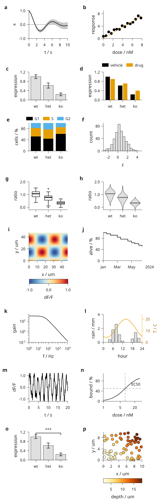
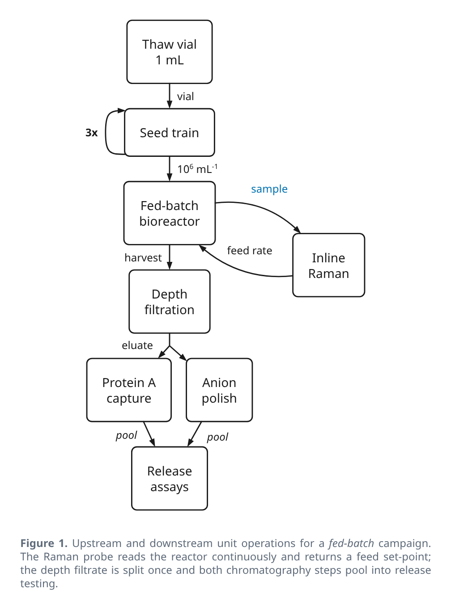
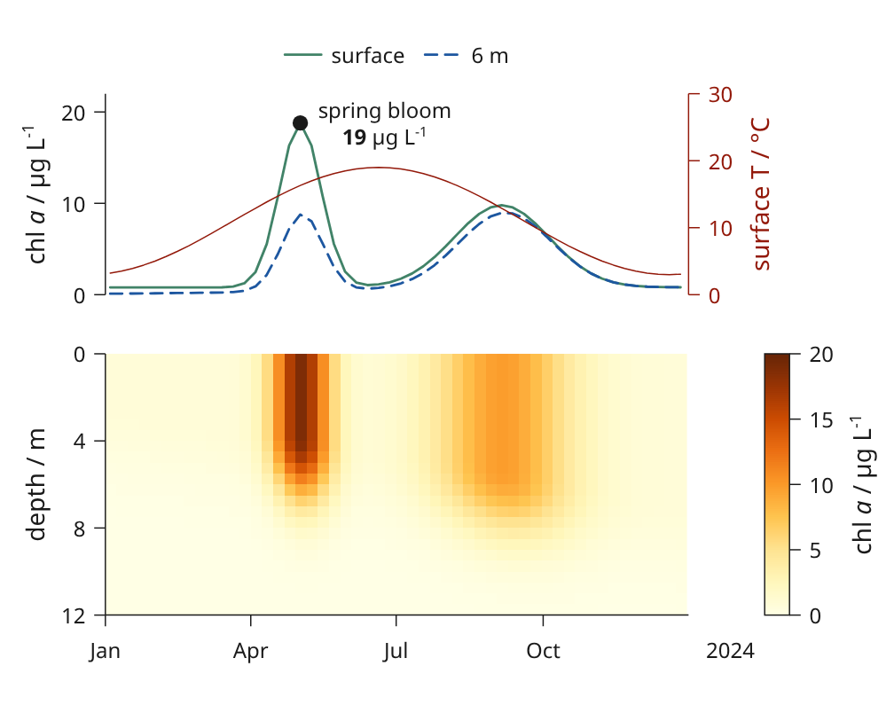
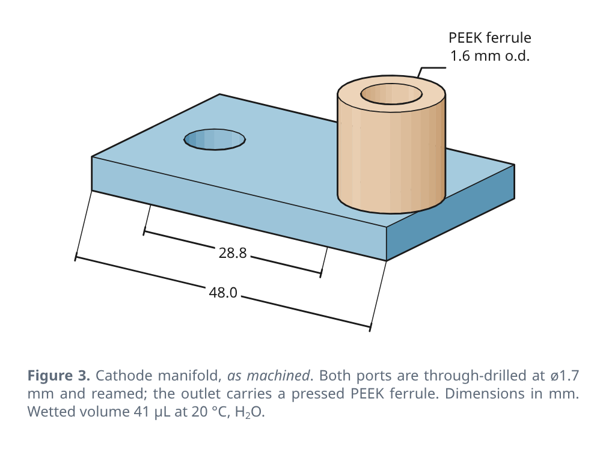
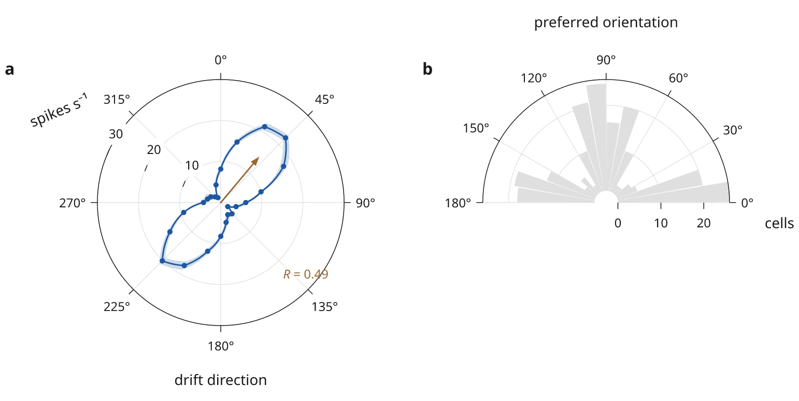

# More example recipes

Browse the [figure gallery](examples.md) for previews. For step-by-step
instructions, start with [your first figure](quickstart.md) or
[a figure from CSV](csv-figure.md). This page lists standalone scripts.

These figures link to executable source in the repository. Commands below run
from a checkout with Inklet installed. Review bundles need the
[preview dependencies](installation.md#visual-review); add `--vectors-only`
where supported to save only SVG/PDF.

## Related studies and variants

The main [figure gallery](examples.md) keeps one card for each distinct goal.
These source routes remain available here as focused variants and recorded
studies; they are grouped to keep the page useful as a source index.

**Layout and rendering studies:** [save and restore layouts](layout-overrides.md),
[local layout editor](layout-editor.md), [reusable plot compositions](plot-recipes.md),
[dense plot engine review](plotting-engine.md),
[rendering and nested layout](rendering-engine.md), [render jobs](render-jobs.md),
and the [twenty-panel stress test](stress20.md).

**Microscopy variants:** [fluorescence channels](fluorescence-biology.md),
[slab projections](slab-biology.md) and [oblique sections](oblique-biology.md).

**Anatomy variants:** [label an open anatomy model](open-anatomy.md) and the
[community connectivity plate](scientific-gallery.md#community-structure-from-anatomy-to-connectivity).

**3D scene studies:** [scene templates](scene-templates.md),
[scene annotations](scene-annotations.md), [scene paths](scene-paths.md),
[label movement revision](research-revision.md), [label crossing study](research-study.md),
and the [figure planner study](research-preview.md).

**Showcase and configuration variants:** [architectural sketch](recipes/architecture-sketch.md),
[direct plot collection](#plot-collection), and [presets](presets.md).

## A complete live document

The [v2.5 example](../examples/v25_document.py) combines nested grids, measured
architecture modules, plots, publication defaults and live data.

```sh
inklet build examples/v25_document.py --output out/v25 --name document
```

Start here when adapting Inklet for your own multi-panel figure. The smaller
[v2 example](../examples/v2_document.py) focuses on datasets and shared scales.

## Twenty-panel stress test


Native 3D, a measured architecture, network, dense scatter, statistical charts,
polar response, Sankey flow and vector events share one page. The data are
simulated and the meshes are generated locally.

```sh
python tools/stress20.py
```

[Source](../examples/stress20.py) · [Workload, checks and findings](stress20.md)

This command also exercises edits, cached compilation, provenance, resizing
and independent SVG/PDF rendering. It takes longer than the small examples.

## Direct drawing examples

| Figure | Source | Run |
|---|---|---|
| Plot collection | [gallery.py](../examples/gallery.py) | `python examples/gallery.py` |
| Methods flow | [showcase_process.py](../figures/showcase_process.py) | `python figures/showcase_process.py` |
| Time series and heatmap | [showcase_season.py](../figures/showcase_season.py) | `python figures/showcase_season.py` |
| Labelled 3D part | [showcase_part.py](../figures/showcase_part.py) | `python figures/showcase_part.py` |
| Polar response | [polar.py](../examples/polar.py) | `python examples/polar.py` |

These use the direct API and may save next to their source scripts. Their
output paths are defined in the scripts; they are not all CLI factory modules.
The [repository gallery](../gallery/README.md) lists additional figures and assets.

## Scientific examples

The [neural-activity example](../figures/neural_activity.py) combines learning
curves, a spike raster, a peri-event histogram and endpoint statistics. All
observations are simulated from fixed seeds.

```sh
python figures/neural_activity.py
```

The [structure figure](../figures/structure.py) draws the EGFR kinase from PDB
1M17 beside explicitly simulated assay data. See the
[third-party notices](../THIRD_PARTY_NOTICES.md) for the structure data and meshes.

## Plot collection



Run `python examples/gallery.py` from a checkout. [Source](../examples/gallery.py).

## Methods flow



Run `python figures/showcase_process.py`. [Source](../figures/showcase_process.py).

## Time series and heatmap



Run `python figures/showcase_season.py`. [Source](../figures/showcase_season.py).

## Labelled 3D part



Run `python figures/showcase_part.py`. [Source](../figures/showcase_part.py).

## Polar response



Run `python examples/polar.py`. [Source](../examples/polar.py).
