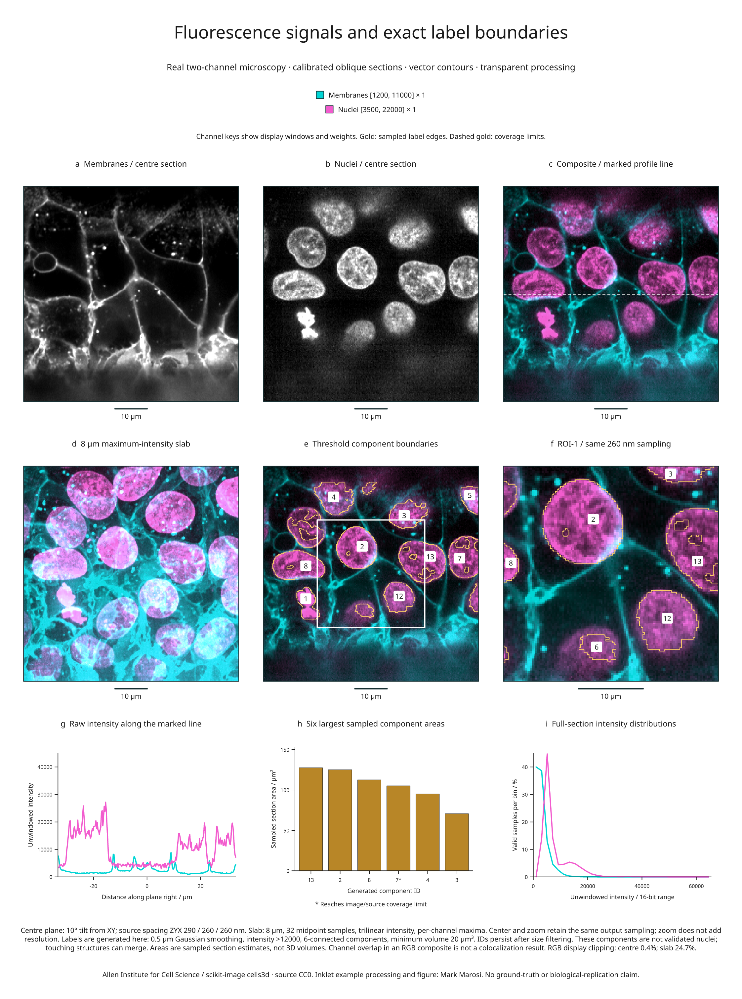

# Fluorescence channels and vector contours

This nine-panel example combines real two-channel fluorescence microscopy with
registered composites, an oblique slab projection, exact sampled-label contours,
a region zoom, intensity profiles and area measurements. It uses data from the
**Allen Institute for Cell Science**, distributed as scikit-image's `cells3d`.

[Full-size figure](../gallery/fluorescence-biology.png) ·
[Executable recipe](../examples/fluorescence_biology.py) ·
[Source, display and measurement evidence](assets/research-preview/fluorescence-biology.json)



## Reproduce it

Use the development branch and the volume/render extras. Blender is not required
for this example.

```bash
git clone https://github.com/Mapika/inklet.git
cd inklet
python -m pip install -e '.[volume,render]'
python examples/fluorescence_biology.py
```

The first run downloads an **11,414,936-byte TIFF** from a pinned scikit-image
data commit and verifies its SHA-256. Later runs reuse only verified bytes. The
TIFF's ZCYX axes, shape and dtype are checked before creating the two volumes.
The download is an example operation; the core channel API does not access the
network.

Outputs in `out/fluorescence-biology/` include the SVG/PDF/PNG figure, an HTML
review, `channels.json`, and `sampled-arrays.npz`. The NPZ preserves unwindowed
centre-section intensities, sampled generated labels and their validity mask.
The JSON records the source lock, calibration, display windows, clipping,
segmentation settings, component identities, contour statistics, profiles and
histogram bin counts. Raw TIFF data are cached locally and are not bundled in
the repository or wheel.

## Read the panels

- **a–b:** Separate grayscale membrane and nuclear signals sampled on the same
  plane, tilted 10° from XY. Display windows are `[1200, 11000]` and
  `[3500, 22000]`, respectively. The calibrated source spacing is
  **290 / 260 / 260 nm in ZYX**; output pixels are 260 nm.
- **c:** Additive display RGB, with membranes in cyan and nuclei in magenta.
  Both windows and weights are recorded in the vector legend. The dashed white
  line marks the profile in panel g.
- **d:** Each channel is separately projected through an **8 µm slab**, using
  32 equally spaced bin-midpoint samples and a maximum-intensity reduction.
  Channels share the same sampling geometry. A per-channel maximum can come
  from different depths, so color overlap does not establish 3D colocalization.
- **e:** Gold vector edges trace generated threshold-component masks on the
  centre plane. Gold dashes mark coverage limits, including the image edge.
  Numeric badges identify components where the label fits within the mask.
  The white box marks the exact field shown in f.
- **f:** A central 128 × 128 sample field enlarged from the 256 × 256 overview.
  Sampling stays at 260 nm; enlargement does not add spatial resolution.
  IDs persist between the overview, zoom and measurements.
- **g:** Original interpolated intensities along the marked centre-section row.
  Display windows do not clip these plotted values.
- **h:** Areas of the six largest sampled components in the full section,
  calculated from the selected label pixels and their physical area.
  An asterisk marks a component reaching the image/source-coverage limit.
  These are section estimates, not 3D volumes or complete-organism measurements.
- **i:** Histograms over all valid centre-section samples, using 32 equal-width
  bins spanning the full 16-bit intensity range. Each channel is normalized
  by its own valid-sample count. Source counts and bin edges are in the evidence.

| Display | Available output pixels | Pixels with RGB display clipping |
| --- | ---: | ---: |
| Centre composite | 65,536 / 65,536 | 272 (0.4%) |
| Slab composite | 65,536 / 65,536 | 16,205 (24.7%) |
| Zoom composite | 16,384 / 16,384 | 124 (0.8%) |

RGB clipping describes the final display sum, independently of each channel's
window clipping. The same windows are retained for centre and slab comparisons.
A slab pixel is available when at least one sample contributes; inspect the
per-channel projection counts in the report for depth coverage. A visible
composite pixel does not prove complete slab coverage.

## What the generated labels mean

The source provides fluorescence signals, not reference segmentation labels.
The recipe smooths the nuclear channel with a 0.5 µm Gaussian, applies a fixed
intensity threshold greater than 12,000, labels 6-connected components, and
retains components of at least 20 µm³ on the supplied source grid. It retains
17 generated component IDs after filtering; 11 intersect the centre section.
IDs keep their original SciPy scan order after size filtering.

This is **illustrative processing, without a reference segmentation or accuracy
assessment**. Touching structures can merge, dim structures can be missed, and
threshold holes are retained. These are not validated nucleus counts. Contours
preserve the sampled pixel boundaries rather than smoothing away these details.
Area and boundary-length estimates depend on the chosen output grid; no
biological replication, statistical uncertainty or colocalization is inferred.

The [channel and contour API guide](channels-and-contours.md) documents blending,
registration requirements, missing-channel policies and vector edge semantics.

## Source and reuse

The original data are **CC0**, as recorded in the
[pinned scikit-image data notice](https://gitlab.com/scikit-image/data/-/raw/5c090b56df3988d988ff97928e2ef2d2cbe38e1b/README.md).
The [scikit-image 3D microscopy tutorial](https://scikit-image.org/docs/stable/auto_examples/applications/plot_3d_image_processing.html)
documents the microscope spacing and fourfold XY downsampling, giving the
spacing used here. This older TIFF's ImageJ header supplies axes but not the
physical spacing; calibration is recorded explicitly from that documentation.
The first voxel centre is chosen as the local origin, without claiming a
microscope stage position.

Recipe and derived figure: **MIT**, Mark Marosi. Source attribution, object
hashes and processing details are also recorded in the
[third-party notices](../THIRD_PARTY_NOTICES.md) and
[source lock](../examples/biology/cells3d.lock.json).
