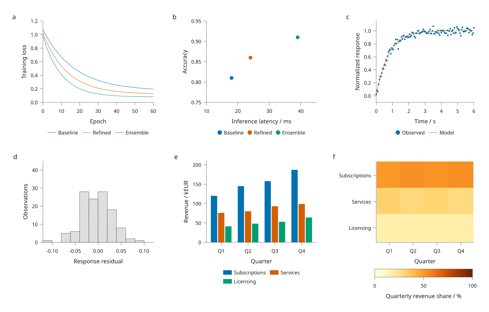
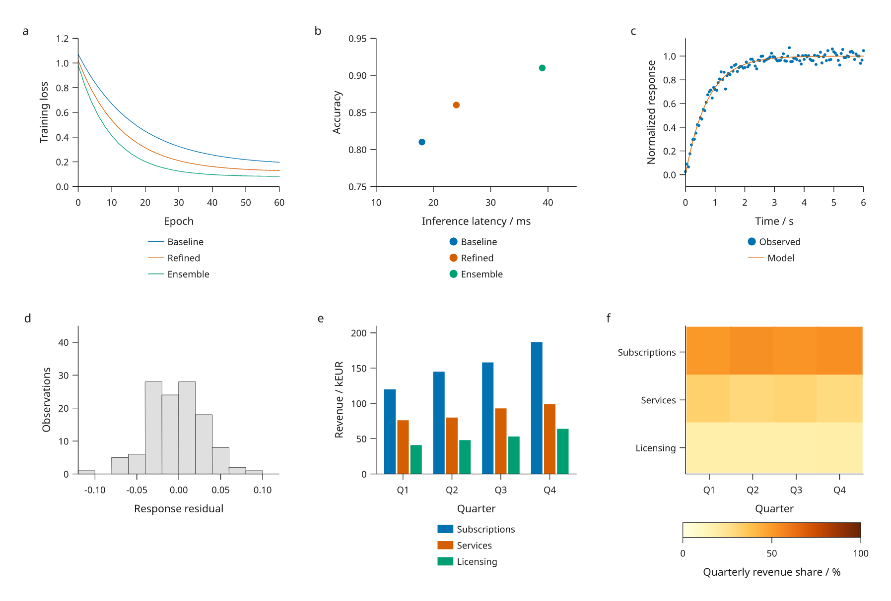

# Everyday plots from CSV tables

This development preview combines six common plots from machine learning,
engineering and business: training curves, benchmark points, a sensor response,
residuals, grouped revenue bars and a composition heatmap. All inputs are original
**simulated data**, supplied as small typed CSV files. SVG/PDF authoring uses only
Inklet's core dependencies; PNG export adds the render extra.

[Full-size figure](../gallery/general-plots.png) ·
[Executable recipe](../examples/general_plots.py) ·
[Data and source hashes](assets/research-preview/general-plots.json) ·
[LaTeX caption](assets/research-preview/general-plots-caption.tex)



## Reproduce it

These changes are in the development branch, outside the stable 3.0 package.

```bash
git clone https://github.com/Mapika/inklet.git
cd inklet
python -m pip install -e '.[render]'
python examples/general_plots.py
```

Outputs in `out/general-plots/` include SVG/PDF/PNG, an HTML review, `data.json`,
`caption.txt` and `caption.tex`. The input files are in
`examples/data/general-plots/`; nothing is downloaded. In a LaTeX figure
environment, place the PDF and then use `\input{caption.tex}`. Figure titles,
panel descriptions and methods stay in the external caption.

The example reads explicit numeric types with `inklet.read_csv`, shares model
colors between a and b, and uses live dataset references for plots. Revenue
shares are derived from the same columns used for the grouped bars. Updating
those columns updates both panels when the document is compiled again.
The [data guide](data.md#typed-csv-input) explains source hashes and parsing rules.

## Plot appearance changes

Axes now use the theme's hairline weight, leaving the normal stroke weight for
data and other artwork. This applies to the built-in print, notebook and slide
themes. Explicit axis `stroke_width` options still take precedence. Typography,
scale domains and the established categorical palettes retain their existing
conventions.

Top and bottom legends now choose the largest measured column count that fits
the plot width. Short entries can share a row; longer entries move onto more
rows, in their original order. Text is not shrunk or clipped to fit. If even one
entry or a title exceeds the requested width, the error reports the required
space. Choose `columns=1` for explicit stacking, or set `max_width` when the
legend is allowed more space than the data region. Corner and left/right legends
retain their one-column default.

`legend(font_size=...)` now shapes labels at the requested size before measuring
the layout. Increasing type size can therefore change the number of columns
without invalidating the measured bounds. Use a theme or preset for figure-wide
typography.

## Compare the previous styling

[Comparison figure](../gallery/general-plots-before.png)



Generate this controlled comparison with:

```bash
python examples/general_plots.py --legacy-look --output out/general-plots/before
```

It uses the current renderer and identical data, fonts, palette and page width,
with the previous Cartesian axis weights and one-column legends explicitly
requested. It demonstrates those styling choices, not a byte-for-byte rebuild
of a historical Inklet release. Automatic figure height can differ because the
legends require different amounts of space. The current figure is 240 mm wide;
choose physical dimensions and type sizes for the intended destination rather
than shrinking a finished figure indiscriminately.

## Read the plots

- **a–b:** Simulated loss curves and benchmark points share model names and colors.
  No actual model training, held-out evaluation or inference timing was performed.
- **c–d:** A simulated first-order response has Gaussian noise with standard
  deviation 0.03 and seed 2026. Residuals are supplied in the CSV and histogram
  bins are fixed at width 0.02. Inklet does not fit the response model.
- **e–f:** Simulated revenue in thousands of euros, and each product's percentage
  of the total for that quarter. The color scale spans 0–100%; the table provides
  the unnormalized inputs.

All data, processing, figure artwork and captions are MIT, Mark Marosi.
