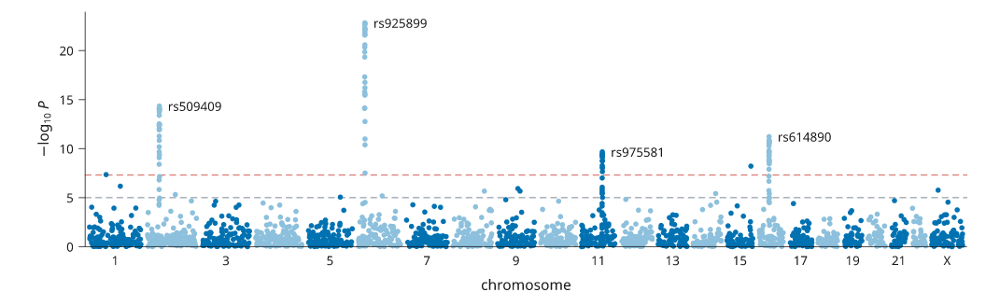
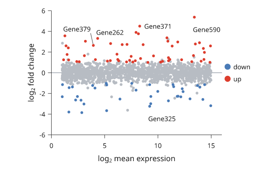
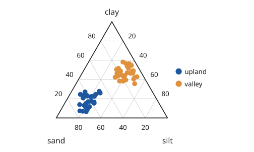

# Genomics and ternary plots

Three specialist plots: the Manhattan plot of a genome-wide association
study, the MA plot of a differential-expression test, and the ternary plot of
three-part compositions. For the volcano plot, see
[Lines and points](lines-and-points.md#volcano-plots).

## Manhattan plots

`inklet.manhattan(chromosome, position, p)` returns a panel with its axes,
ready for more layers or for `fig.add`. Chromosomes are laid end to end in
natural order (1, 2, ..., 10, ..., X, Y, MT; a `chr` prefix is fine), or
in `order=`. Points alternate between two shades per chromosome, and
`bands=True` also shades every other chromosome's span.

`threshold` draws the genome-wide significance line (5e-8, red) and
`suggestive` a grey one (1e-5); either can be `None`. With `labels=`, the
`top` lead hits are named: a lead hit is the variant below `threshold` with the
smallest p within `window` base pairs (1 Mb). `highlight=` draws chosen
variants in red. For a million variants, pass `raster=True` to rasterise
the points.

`inklet.plot.manhattan_layout` returns the same positions, chromosome spans
and lead hits without drawing anything.

```python
import inklet as i
import math
import random

rng = random.Random(11)
peaks = {'2': (60e6, 14), '6': (32e6, 22), '11': (100e6, 9), '16': (50e6, 10.5)}
chrom, pos, pvalues, ids = [], [], [], []
for number in list(range(1, 23)) + ['X']:
    c = str(number)
    length = 155e6 if c == 'X' else 250e6 * (1 - 0.035 * (int(c) - 1))
    for k in range(int(length / 2e6)):
        x = rng.uniform(0, length)
        y = rng.expovariate(1.0)
        if c in peaks and abs(x - peaks[c][0]) < 3e6:
            y = max(y, peaks[c][1] * math.exp(-((x - peaks[c][0]) / 1e6) ** 2))
        chrom.append('chr' + c); pos.append(x); pvalues.append(10 ** -y)
        ids.append(f'rs{rng.randint(1000, 999999)}')
    if c in peaks:
        for _ in range(30):
            x = peaks[c][0] + rng.gauss(0, 0.6e6)
            y = peaks[c][1] * math.exp(-((x - peaks[c][0]) / 1e6) ** 2) + rng.uniform(0, 1)
            chrom.append('chr' + c); pos.append(x); pvalues.append(10 ** -y)
            ids.append(f'rs{rng.randint(1000, 999999)}')
gwas = i.manhattan(chrom, pos, pvalues, labels=ids, top=4, width=150, height=40)
fig = i.figure(width=170)
fig.add(gwas.build())
fig.save('manhattan.svg', 'manhattan.pdf')
```



*Simulated association results with four loci above genome-wide
significance.*

## MA plots

`Panel.ma(mean, fold, p)` plots each feature's log2 fold change against its
mean expression. The mean is drawn as log2(mean + 1) unless `log=False`.
Points are classified as `volcano` classifies them: "up" and "down" need p
below `p_threshold` and |fold| of at least `fold_threshold`. Without `p`,
fold change alone decides. Non-significant points are pale grey and drawn first,
and a hairline marks a fold change of 0. `labels=` names the `top` most
significant points.

```python
import inklet as i
import math
import random

rng = random.Random(4)
mean = [2 ** rng.uniform(0, 15) for _ in range(1500)]
fold = [rng.gauss(0, 0.5) + (rng.random() < 0.05) * rng.choice([-1, 1]) * rng.uniform(1, 4)
        for _ in range(1500)]
padj = [min(1.0, 2 * math.exp(-abs(f) * 4 * rng.uniform(0.2, 1.5))) for f in fold]
genes = [f'Gene{k}' for k in range(1500)]
ma = i.panel(55, 40, x=(0, 16), y=(-6, 6))
ma.ma(mean, fold, padj, labels=genes, top=5, name=['down', None, 'up'])
ma.axes(x='log_{2} mean expression', y='log_{2} fold change').legend(side='right')
fig = i.figure(width=89)
fig.add(ma.build())
fig.save('ma.svg', 'ma.pdf')
```



*Simulated expression. About one gene in twenty is differentially expressed.*

## Ternary plots

`Panel.ternary(points)` draws three-part compositions in an equilateral
triangle fitted into the plot area. Each `(a, b, c)` point is normalised to
fractions of its sum. The first call draws the triangle with `labels[0]` at
the top vertex, `labels[1]` bottom left and `labels[2]` bottom right, a
pale grid and tick labels as parts of `total` (100). Later calls add points to
the same triangle. The points are an ordinary `scatter`, so `name=`,
`color=`, `size=` and ramps work, and `legend()` names the series.

```python
import inklet as i
import random

rng = random.Random(2)
upland = [(rng.uniform(5, 30), rng.uniform(40, 80), rng.uniform(10, 30)) for _ in range(30)]
valley = [(rng.uniform(30, 60), rng.uniform(5, 25), rng.uniform(25, 50)) for _ in range(30)]
soil = i.panel(50, 45)
soil.ternary(upland, labels=('clay', 'sand', 'silt'), name='upland')
soil.ternary(valley, name='valley').legend(side='right')
fig = i.figure(width=80)
fig.add(soil.build())
fig.save('ternary.svg', 'ternary.pdf')
```



*Illustrative soil samples. Upland soils are sandy and valley soils richer
in clay and silt.*

## Next steps

Compare [plot types](plot-types.md), see [volcano plots](lines-and-points.md#volcano-plots),
or [arrange several panels](layout.md). For exact options, see the
[API](api.md).
