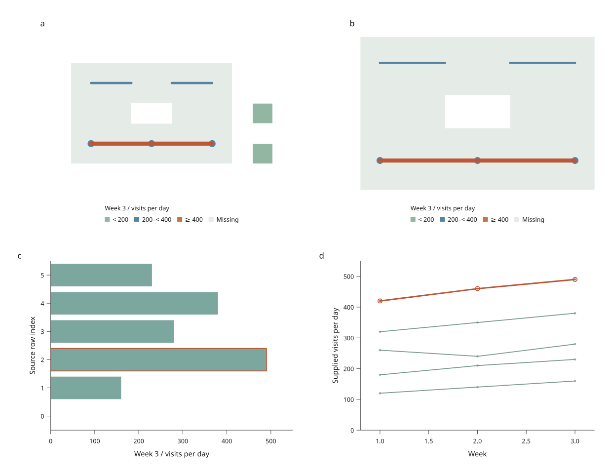

# GeoJSON points, routes and regions

Available in **4.0.0.dev5**, under `inklet.experimental`. See the
[development-preview installation guide](development-preview.md).

`GeoFeatures` snapshots mixed GeoJSON geometries. `MapView` joins each feature
to one keyed table row, so a point, an entire route or all parts of an island
group can share selection with ordinary plots.



[Open the offline report](assets/v4/transport-map.html) ·
[Complete Python recipe](../examples/v4/transport_map.py) ·
[Original GeoJSON fixture](../examples/v4/fixtures/transport.geojson)

The geography is invented and the activity values are illustrative. The map
contains a district with a hole, two islands, a main route, disjoint branches,
a terminal and a pair of stops. Asset populations overlap: their activity
values should not be summed. The two maps use the same fixed colour bins.

## Start with keyed geometry

This example needs only core Inklet:

```python
from inklet.experimental.browser import BrowserFigure, GeoFeatures, MapView, BarView
from inklet.experimental.selection import KeyedTable

geo = GeoFeatures.from_geojson({
    'type': 'FeatureCollection',
    'features': [
        {'type': 'Feature', 'id': 'route', 'properties': {},
         'geometry': {'type': 'LineString', 'coordinates': [[0, 0], [1, 1], [2, 0]]}},
        {'type': 'Feature', 'id': 'stop', 'properties': {},
         'geometry': {'type': 'Point', 'coordinates': [1, 1]}},
    ],
}, source_name='Original example', attribution='Illustrative geometry; MIT')
rows = KeyedTable('assets', {'id': ['route', 'stop'], 'index': [0, 1], 'visits': [40, 25]})
figure = BrowserFigure(rows, [
    MapView('map', geo, (-.5, -.5, 2.5, 1.5), value='visits', breaks=(30,),
            colors=('#5783a2', '#bd7748'), radius_mm=1.2, line_width_mm=.8),
    BarView('activity', 'index', 'visits', (-.5, 1.5), (0, 50), y_label='Visits / day'),
])
with open('assets.html', 'w', encoding='utf-8') as output:
    output.write(figure.to_html(renderer='compiled'))
with open('assets.svg', 'w', encoding='utf-8') as output:
    output.write(figure.to_svg())
```

Feature IDs must be unique nonempty strings and must match the table IDs
exactly. Properties in the GeoJSON are not imported as measurements: provide
values and units explicitly in the table and axis/legend labels.
`GeoFeatures.read(path, source_name=..., attribution=...)` reads UTF-8 GeoJSON.
The snapshot copies coordinates and retains provenance; later edits to the
input dictionary do not change an existing figure.

## Geometry and picking rules

| Geometry | What appears | Selection unit |
| --- | --- | --- |
| Point / MultiPoint | Circular markers with radius in millimetres | All points in that feature |
| LineString / MultiLineString | Straight segments with width in millimetres | The complete feature, including disjoint parts |
| Polygon / MultiPolygon | Filled regions with even-odd holes | Every polygon in that feature |

Paint follows **table row order**, then geometry part order. Put regions before
routes and points when they should form the background. Picking in a mixed map
chooses the topmost visible feature within the pointer tolerance. A route's
vertices are not separate observations, and separate route parts are never
connected. Filtering one row removes all of its geometry.

`extent=(west, south, east, north)` sets a flat longitude/latitude view with
north up, east right and equal physical scales per degree. Coordinates outside
the extent are clipped. This is **plate carrée**, not a distance- or area-preserving
projection; route segments are not geodesics. Radii and widths are physical
page sizes, while page zoom scales the whole figure.

Value colours use the same fixed half-open bins as [region maps](linked-maps.md).
Missing values use `missing_color`. Neither the bins nor the reference legend
change when filtering. Source and attribution appear in **Map sources and
projection** in the HTML; retain the recipe's `sources.json` with static exports.

## Edit geometry and reproduce a saved view

```bash
python examples/v4/transport_map.py --render --output out/transport
python examples/v4/transport_map.py --state out/transport/view.json --output out/reopened
python examples/v4/transport_map.py --revision rerouted --rebase out/transport/view.json --render --output out/rerouted
```

Open the first report and select a route or stop. Both maps, the activity bars,
the history markers and the accessible source table share that selection.
Search by asset name or geometry type, save the view, and reopen it with the
same source revision. The recipe exports SVG at 210 and 170 mm and, with
`--render`, matching PNG and PDF files.

The **Rerouted** alternative changes the main route's coordinates while keeping
its identity. **Removed** deletes the branch feature. Selecting branches and
then switching to Removed fails until the user explicitly chooses to drop
removed state IDs. Python has the same `missing='error'` / `'drop'` policy through
`BrowserFigure.replace_data()`. Supply new `MapView` definitions when geometry
changes. Old snapshots remain usable; changed geometry gets a new scene digest.

## Supported subset

Coordinates need exactly two finite longitude/latitude values in the ranges
−180…180 and −90…90 degrees. Lines need two distinct positions. Polygon rings
must be explicitly closed and nondegenerate. Provide simple rings, contained
holes and nonoverlapping polygon parts; there is no topology repair.

Null/empty geometries, GeometryCollection, altitude and legacy CRS fields are
rejected. Cut antimeridian-crossing lines and polygon rings before import.
There are no map services, raster tiles, reprojection, routing or geometric
measurement calculations. This view is not part of the style inspector yet.
For a polygon-only workflow, the existing `GeoRegions` and `RegionView` APIs
remain supported.
