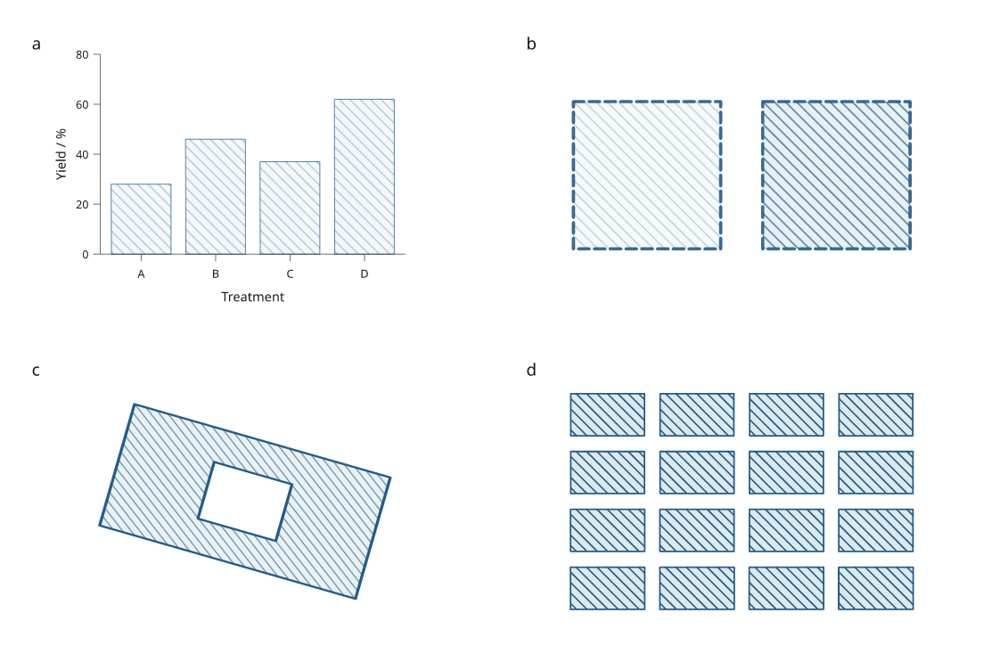
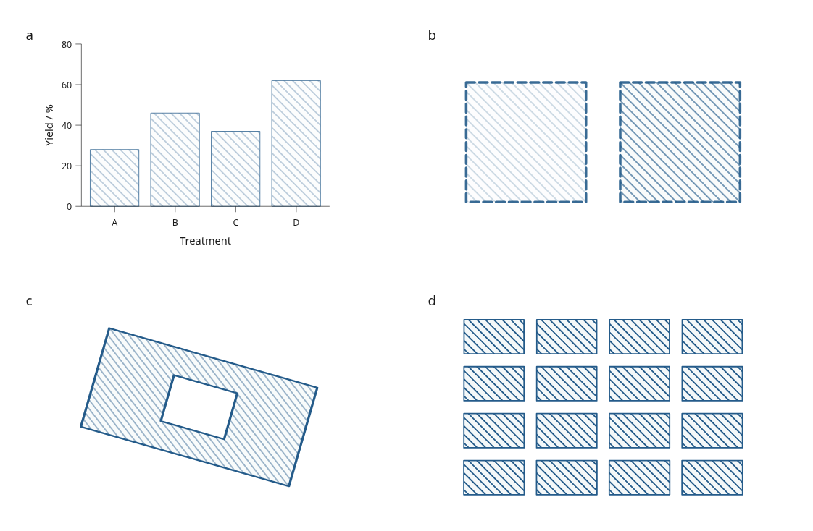
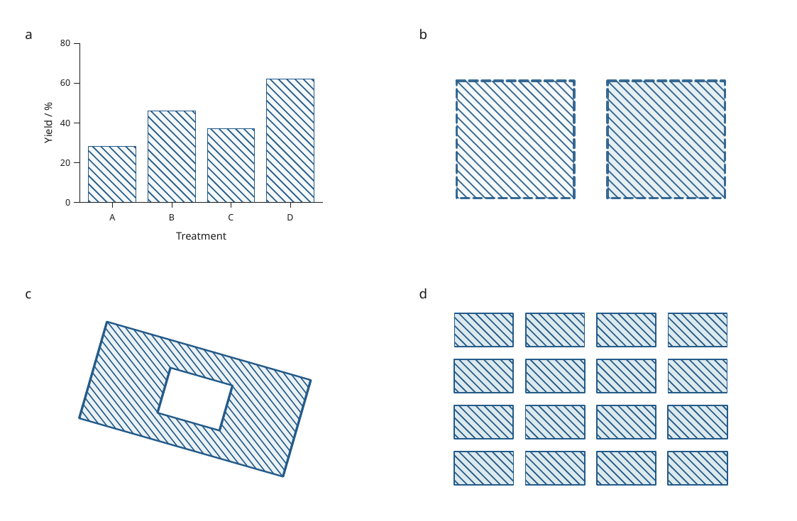
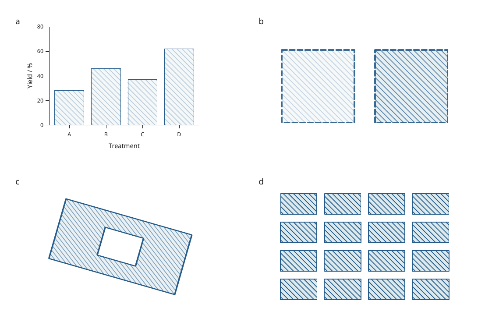

# Reusable vector hatching

These engine changes are included in **4.0.0.dev2**. They extend the
[compositing improvements](compositing.md) to patterned fills in plots,
technical sections and repeated shapes.

[Executable recipe](../examples/hatch_review.py) ·
[Full-size figure](../gallery/hatch-review.png) ·
[LaTeX caption](assets/research-preview/hatch-caption.tex)



Panel a contains original simulated yields. Panels b–d are original test
artwork. All hatches, borders, axes and text remain vector; the figure contains
no raster image layers. Methods and descriptions are in the separate caption.

## Fill and border semantics

`Hatch` supplies the line color, background, spacing, width and angle. A shape's
`fill_opacity` fades the completed hatch artwork, including its background.
`stroke_opacity`, dash pattern and cap style affect the shape's border.
Group `opacity` then fades the combined fill and border.

```python
import inklet as i

shape = i.box('', width=35, height=22, stroke='#245b8a',
              stroke_width=.6, stroke_dash=(2, 1),
              stroke_opacity=.9, fill_opacity=.3)
hatched = i.paint(shape, i.Hatch(color='#245b8a', background='#dce9ed',
                               spacing=1.5, stroke=.3, angle=45))
i.save_svg(hatched, 'hatched.svg', margin=3)
i.save_pdf(hatched, 'hatched.pdf', margin=3)
```

Previously, SVG pattern contents could inherit paint settings from the first
placement that defined their resource. PDF drew hatch lines using the border's
stroke alpha. This made fills depend on unrelated border styling and could
make later uses of the same brush depend on their export order.

**Previous SVG:** the background and hatch intensity in panel b depend on the
resource's inherited settings. Transformed periodic tiles can also show seams.



**Previous PDF:** panel a's hatch lines take the solid border alpha; the two
different fill opacities in panel b do not correctly fade their hatch lines.



**Current PDF:** the independently rasterized PDF agrees with the intended
fill opacity, border styling and geometry shown at the top of this page.



The previous previews use commit `86413c7`. Chrome and Poppler render the
before/after files at 150 dpi with the same recipe and fonts.

## Shared geometry and exact clipping

Both exporters now obtain hatch lines from the same physical geometry routine.
SVG reuses vector groups; PDF reuses vector Form XObjects. Each shape retains
its own exact clip, including rounded corners and even-odd/nonzero holes.
Placement transforms preserve local hatch phase, spacing and width through
rotation, reflection, shear and nonuniform scaling.

Reusable coverage bounds are rounded outward on a grid of 32 hatch periods,
capped at 8 mm per grid cell. Nearby shape sizes can therefore share artwork
without rounding their visible boundaries or changing layout envelopes.
PDF's existing per-fill work limit now applies to both exporters. Near that limit, exact
coverage bounds are retained if rounding would require too many lines.

Resources are scoped to one export. PDF pages can share them; no persistent
cache is added. Border styles and fill opacity are applied at each placement.

Explicit vector paths avoid interior seams introduced by some renderers when
they rasterize periodic tiles. This choice can increase SVG size and export
time. It does not rasterize the hatch or reduce its geometric accuracy.

## Performance and file size

Median of three fresh Python 3.12.3 processes on the same Linux WSL2 workstation.
The dense hatch uses 0.08 mm spacing and 0.015 mm lines; the second case changes
every box's width by a further 0.001 mm.

| Workload | Previous / current PDF export | Previous / current PDF bytes | Previous / current SVG bytes |
| --- | ---: | ---: | ---: |
| 64 equal-size fills | 0.2462 / 0.0141 s | 18,438 / 8,130 | 41,047 / 70,883 |
| 64 slightly different sizes | 0.3317 / 0.0085 s | 139,799 / 8,521 | 41,535 / 86,853 |
| 64 ordinary plots | 0.0852 / 0.0811 s | 28,382 / 28,382 | 1,386,357 / 1,386,357 |

The two hatch workloads export to PDF about **17× and 39× faster** in these
runs. SVG export increases from approximately 1.7–1.8 ms to 5.9–7.2 ms.
Peak process memory for the hatch workloads decreases from approximately
45 MiB to 36 MiB. These are workload-specific measurements, not general speed
guarantees. Widely differing coverage bounds require separate resources.

[Previous measurements](assets/research-preview/hatch-before.json) ·
[Current measurements](assets/research-preview/hatch-after.json)

```sh
python -m pip install -e '.[render]'
python examples/hatch_review.py --output out/hatch-review
python tools/benchmark_engine.py --case hatches64 --case hatches64_unique \
  --case grid64 --repeat 3 --output out/hatch-benchmark.json
```

Use a checkout containing these changes; the published dev1 package predates
them. The recipe writes SVG/PDF/PNG and separate captions. Regression checks
compare interior colors against analytic alpha values, test transformed line
phase and holes, reverse placement order, and verify reuse across PDF pages.
The standard 26 SVG/PDF visual baselines pass without replacement.
