# How do I…

Short answers to the questions people ask most, each with a complete snippet
for the one-call API described in [Charts in one call](quick-charts.md). The
snippets run as written, and each figure they draw lints clean.

## Draw a correlation matrix with a centred colour scale

Pass a diverging palette, `center=0` and `colorbar_title=` to `i.heatmap`.

```python
import inklet as i

genes = ['A', 'B', 'C', 'D']
r = [
    [1.00, 0.62, -0.31, 0.08],
    [0.62, 1.00, -0.45, 0.12],
    [-0.31, -0.45, 1.00, -0.70],
    [0.08, 0.12, -0.70, 1.00],
]
chart = i.heatmap(r, x=genes, y=genes, palette='RdBu', center=0, colorbar_title='r')
chart.save('correlation.pdf')
```

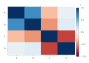

`center=0` puts the neutral colour at zero, so positive and negative values
get equal weight. Without it the scale runs from the smallest value to the
largest. The first row is drawn at the top.

## Plot two quantities in different units on one chart

Name the series in `secondary_y=`, and it is drawn against a right-hand axis
titled with its column.

```python
import inklet as i

table = {
    'month': ['Jan', 'Feb', 'Mar', 'Apr', 'May', 'Jun'],
    'rain (mm)': [62, 48, 55, 41, 38, 30],
    'temp (°C)': [4.1, 5.0, 8.2, 12.5, 16.9, 20.3],
}
chart = i.bar(table, x='month', y='rain (mm)')
chart.line(table, x='month', y='temp (°C)', secondary_y='temp (°C)')
chart.labels(x='Month', y='Rain / mm', y2='Mean temperature / °C')
chart.save('rain-temperature.pdf')
```

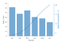

A second y scale invites misreading: the two lines can cross, or look alike,
for no reason in the data. Two panels that share an x axis are often clearer.
Stack them with `/`, as in `i.line(...) / i.bar(...)`. Use `secondary_y=` when
the quantities must share one x axis, as they do here. `chart.twin_y()` is
refused on a quick chart; `secondary_y=` replaces it.

## Label only the top N points of a scatter

Give `text=` a column that holds a label for the points you want and `None` for
the others. Rows with no label get no label and no leader line.

```python
import inklet as i

table = {
    'gene': ['Tnf', 'Il6', 'Cxcl10', 'Nos2', 'Ifit1', 'Actb', 'Gapdh', 'Myc'],
    'fold': [2.6, -3.4, 4.1, 3.5, -5.1, 0.1, -0.2, 1.2],
    'signal': [7.1, 6.8, 8.2, 6.0, 7.9, 9.5, 9.7, 5.4],
}
# The three genes with the largest fold change, up or down.
n = 3
biggest = sorted(range(len(table['gene'])), key=lambda k: abs(table['fold'][k]), reverse=True)[:n]
table['label'] = [gene if k in biggest else None for k, gene in enumerate(table['gene'])]

chart = i.scatter(table, x='fold', y='signal', text='label')
chart.save('top-genes.pdf')
```

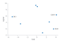

With pandas, the same column is one line:
`df['label'] = df['gene'].where(df['fold'].abs().rank(ascending=False) <= 3)`.
Missing values count as None.

## Show means with SEM error bars and the raw points

Use `agg='mean'`, `error_y='sem'` and `points=True` on `i.bar`.

```python
import inklet as i

table = {
    'group': ['control'] * 8 + ['low dose'] * 8 + ['high dose'] * 8,
    'response': [
        1.12, 0.67, 1.45, 1.05, 0.92, 1.66, 1.36, 0.91,
        1.41, 1.62, 1.07, 1.28, 1.79, 1.38, 1.65, 1.06,
        1.61, 2.10, 2.01, 1.99, 1.64, 1.56, 1.63, 1.52,
    ],
}
chart = i.bar(table, x='group', y='response', agg='mean', error_y='sem', points=True)
chart.save('response.pdf')
```

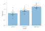

Without `agg=`, `bar` sums the rows that share a category. Eight measurements
per group would draw a bar about eight times the mean, so lint reports
`ROWS_COMBINED` for any category with more than one row. Pass `agg='sum'` when
the rows really are parts of a total. `error_y` also takes `'sd'` and `'ci95'`.

## Draw horizontal bars

Pass `orient='h'`. The category column (`x=`) runs down the left, and the values
(`y=`) run along the bottom. The rows are drawn from the bottom up, so the first
row is at the bottom; list them in reverse to read the table from the top.

```python
import inklet as i

table = {
    'pathway': ['Autophagy', 'Apoptosis', 'Cell cycle', 'Glycolysis'],
    'score': [0.9, 1.7, 2.4, 3.1],
}
chart = i.bar(table, x='pathway', y='score', orient='h',
              xlabel='Enrichment score', ylabel='Pathway')
chart.save('pathways.pdf')
```

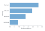

`xlabel` always titles the horizontal axis and `ylabel` the vertical one, whatever
the orientation. So with `orient='h'` the value name goes in `xlabel`. Without
them, the column names are used, and they land on the same axes.

## Add a labelled reference line

Call `chart.hline(y, label=...)` or `chart.vline(x, label=...)`. The label is
placed clear of the data. If it crowds the data, give the plot headroom with
`ylim=` and keep the label to one side with `label_side=`: `'n'` or `'s'` for an
`hline`, `'e'` or `'w'` for a `vline`.

```python
import inklet as i

table = {
    'dose': [1, 2, 3, 4, 5, 6, 7, 8],
    'response': [2.1, 3.9, 6.2, 7.8, 8.1, 9.5, 9.7, 9.9],
}
chart = i.scatter(table, x='dose', y='response', ylim=(0, 12))
chart.hline(5.0, label='half max', label_side='n')
chart.vline(4.0, label='EC50', label_side='e')
chart.save('reference-lines.pdf')
```

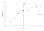

A labelled line is drawn in front of the data, so it shows even under a bar chart.

## Write subscripts, superscripts and Greek in labels

Write `_{...}` for a subscript and `^{...}` for a superscript. Type Greek letters
as characters: α, β, µ. Matplotlib's `$...$` mathtext is not read. It prints as
typed, dollar signs and backslashes included, so `$\alpha$` shows as written.

```python
import inklet as i

table = {'dose': [1, 2, 4, 8, 16], 'uptake': [1.2, 2.1, 3.4, 3.9, 4.0]}
chart = i.scatter(
    table, x='dose', y='uptake',
    title='CO_{2} uptake, α = 0.05',
    xlabel='Dose / mg kg^{-1}',
    ylabel='Uptake / µmol m^{-2} s^{-1}',
)
chart.save('uptake.pdf')
```

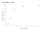

The same markup works in titles and axis labels. Other markup: `**bold**`,
`//italic//` and `{#c1121f|coloured}`. A backslash makes a markup character
literal, as in `\_` or `\{`.

## Mark significant differences between groups

Call `chart.brackets([(a, b, p), ...])` on a chart with categories. Each triple
is two group names and a p-value, drawn as stars by default. The p-values are
yours: `brackets` runs no test. Leave headroom above the data with `ylim=`, so
the stacked brackets fit inside the plot.

```python
import inklet as i

table = {
    'group': ['control'] * 6 + ['low dose'] * 6 + ['high dose'] * 6,
    'value': [
        1.00, 1.10, 1.30, 1.20, 1.00, 1.40,
        0.90, 1.20, 1.50, 1.10, 1.30, 1.60,
        1.00, 1.00, 1.40, 1.30, 1.10, 1.20,
    ],
}
chart = i.boxplot(table, x='group', y='value', ylim=(0.5, 2.0))
chart.brackets([
    ('control', 'low dose', 0.03),
    ('control', 'high dose', 0.0004),
    ('low dose', 'high dose', 0.2),
])
chart.save('comparisons.pdf')
```

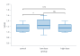

`format='p'` writes the P value instead of stars, and `hide_ns=True` leaves out
the pairs that are not significant.

## Label the panels of a figure

Do not put "a" or "b" in a title. A layout with `|` or `/` adds the letters a,
b, c… in order, so a title with its own letter shows it twice. To turn the
letters off, pass `letters=False` to the layout.

```python
import inklet as i

control = i.line(x=[0, 1, 2, 3], y=[1.0, 1.2, 1.5, 1.6],
                 title='Control', xlabel='Time (h)', ylabel='Signal (a.u.)')
treated = i.line(x=[0, 1, 2, 3], y=[1.0, 1.8, 2.6, 3.1],
                 title='Treated', xlabel='Time (h)', ylabel='Signal (a.u.)')
figure = control | treated
figure.save('panels.pdf')
```

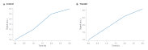

Without letters, the same figure is:

```python
import inklet as i

control = i.line(x=[0, 1, 2, 3], y=[1.0, 1.2, 1.5, 1.6],
                 title='Control', xlabel='Time (h)', ylabel='Signal (a.u.)')
treated = i.line(x=[0, 1, 2, 3], y=[1.0, 1.8, 2.6, 3.1],
                 title='Treated', xlabel='Time (h)', ylabel='Signal (a.u.)')
figure = (control | treated).options(letters=False)
figure.save('panels-unlettered.pdf')
```

## Layer, annotate and refine a chart

Chart methods change the chart in place and return it, so calls chain. Some
are defined on `Chart`; the rest are the plot's own methods, forwarded from
the chart to `chart.spec`. The call is the same either way.

```python
import inklet as i

table = {
    'dose': [1, 2, 3, 4, 5, 6, 7, 8],
    'response': [2.1, 3.9, 6.2, 7.8, 8.1, 9.5, 9.7, 9.9],
}
chart = (
    i.scatter(table, x='dose', y='response', ylim=(0, 12))
    .annotate(6, 9.5, 'plateau')
    .hline(5.0, label='half max', label_side='n')
    .labels(x='Dose / mg kg^{-1}', y='Response', title='Dose response')
    .size(width='single')
)
chart.save('chained.pdf')
```

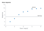

<!-- chart-methods:start -->
| Method | Returns | What it does |
|---|---|---|
| `chart.labels(...)` | the chart | Axis titles and the chart title. `y2=` titles the right-hand axis. |
| `chart.vline(x, ...)` | the chart | A vertical reference line at x. `label=` names it, clear of the data. |
| `chart.hline(y, ...)` | the chart | A horizontal reference line at y. `label=` names it, clear of the data. |
| `chart.annotate(x, y, text, ...)` | the chart | A callout on one data point, with a leader line. |
| `chart.brackets(comparisons, ...)` | the chart | Significance brackets between pairs of groups, from `(a, b, p)` triples. |
| `chart.colorbar(...)` | the chart | The colour bar, or the one already drawn. Takes `title=`, `side=` and so on. |
| `chart.legend(...)` | the chart | The key, or the one already drawn. Takes `side=`, `corner=`, `title=` and so on. |
| `chart.size(width, height)` | the chart | The width (`single`, `double`, `slide` or millimetres) and the height in millimetres. |
<!-- chart-methods:end -->

## Plot large data

Nothing needs setting. A scatter panel with more than 20,000 points is drawn
as one image of its markers, so the file stays small and the axes, labels and
key stay vector. A line thins itself with `simplify='auto'`, the default. It
drops points that stay within 0.02 mm of the line through the kept points,
which is invisible in print. Pass `raster=False` to keep every scatter point as vector, or
`simplify=None` to keep every line point.

```python
import math
import random
import inklet as i

rng = random.Random(7)
cloud = {'x': [], 'y': [], 'group': []}
for k in range(30_000):
    group = 'treated' if k % 2 else 'control'
    cloud['x'].append(rng.gauss(0, 1))
    cloud['y'].append(rng.gauss(0.5 if group == 'treated' else -0.5, 1))
    cloud['group'].append(group)

trace = {'t': [k * 0.001 for k in range(100_000)]}
trace['signal'] = [math.sin(t) + 0.1 * math.sin(7 * t) for t in trace['t']]

figure = (i.scatter(cloud, x='x', y='y', color='group', title='30,000 points')
          | i.line(trace, x='t', y='signal', title='100,000 samples'))
figure.save('large-data.pdf')
```

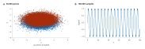

## Save a figure for a journal

Pass `width='single'` (89 mm) or `width='double'` (183 mm), choose the journal's
style preset, and save a PDF. Then check the figure before you submit it.

```python
import inklet as i

table = {
    'time (h)': [0, 2, 4, 6, 8, 10, 12, 0, 2, 4, 6, 8, 10, 12],
    'signal (a.u.)': [0.0, 0.4, 0.8, 1.0, 1.1, 1.15, 1.2, 0.0, 0.7, 1.3, 1.8, 2.1, 2.3, 2.4],
    'condition': ['control'] * 7 + ['treated'] * 7,
}
chart = i.line(table, x='time (h)', y='signal (a.u.)', color='condition',
               width='single', style='scientific.nature')
chart.save('figure1.pdf')
```

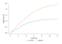

`save()` writes the file and returns the compiled figure, whose `report()` lists
overlapping or clipped text and type that is too small. From a shell, the same
check runs on the script:

```bash
inklet check figure1.py --png preview.png
```

It prints the report and exits with 1 on errors. Add `--strict` to fail on
warnings too. The script must leave its figure at module level, under the name
`chart` or `figure`.
