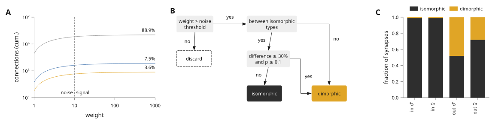
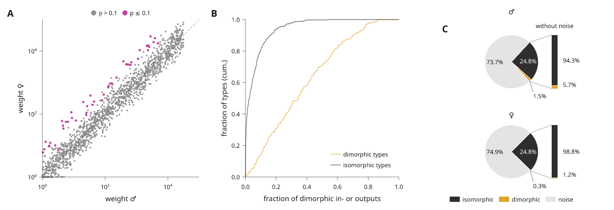
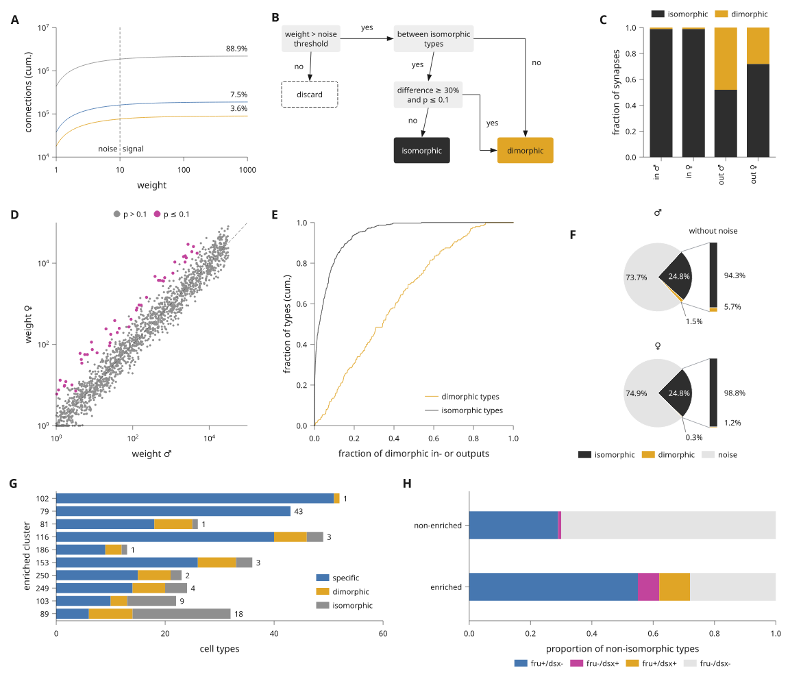

# Rebuild a journal figure

This page rebuilds a published figure page step by step. The model is a Cell
figure on sexual dimorphism in a fly connectome. It has eight plot and diagram
panels around its microscopy panels: cumulative counts on log axes, a decision
flowchart, stacked fractions, a weight scatter, cumulative distributions, two
pies with breakout bars, stacked bars with counts and proportion bars. The
microscopy panels are left out. All data here are simulated or illustrative.


The complete script is
[`examples/journal_figure.py`](../examples/journal_figure.py). The blocks below
are the same code, in the order the page is built. Each block runs after the
ones before it.

## Read the page as a grid

Start by reading the original page as rows and columns. It is a 183 mm double
column page with three rows of panels:

| Row | Panels | Columns of 12 |
| --- | --- | --- |
| 1 | a counts, b flowchart, c fractions | 4, 5, 3 |
| 2 | d scatter, e distributions, f pies | 4, 4, 4 |
| 3 | g stacked bars, h proportion bars | 6, 6 |

Each panel becomes one item in a 12-column document. Row heights follow the
tallest panel in the row. With `share_plot_margins=True` the data areas in a
row share their top and bottom edges, whatever their tick labels.

## Start from the preset

`scientific.cell` sets 6 pt text, 5 pt tick labels, bold panel letters and
0.25 pt hairlines, with a 183 mm page. The theme's palette gives the colours
that the panels share.

```python
import math
import random

import inklet as i

style = i.preset('scientific.cell')
blue, amber, magenta, grey, green, ink = style.theme.palette
pale = '#e4e4e4'
rng = random.Random(5)
```

## Row one: counts, flowchart and fractions

Panel a draws three cumulative curves on log axes. Each share is a text
anchored at the right end of its curve. A dashed `vline` marks the noise
threshold, with a short text on each side of it.

```python
growth = i.plot_spec(height=30, x=i.log((1, 1000)), y=i.log((1e4, 1e7)))
for total, share, color in [(2.2e6, '88.9%', grey), (1.9e5, '7.5%', blue), (9e4, '3.6%', amber)]:
    curve = [(10 ** (t / 20), total * (1 - .8 * math.exp(-t / 12))) for t in range(61)]
    growth.line(curve, stroke=color)
    growth.text(1000, total, share, anchor='se', offset=(0, -.6))
growth.vline(10, stroke=ink, stroke_dash=(.5, .5), stroke_width=style.theme.hairline)
growth.text(10, 1.2e4, 'noise', anchor='se', offset=(-.6, 0))
growth.text(10, 1.2e4, 'signal', anchor='sw', offset=(.6, 0))
growth.axes(x='weight', y='connections (cum.)')
```

Panel b is a diagram, not a plot. A composition places measured modules in
millimetres, and each link names its ports. `route='orthogonal'` draws the two
links into the result box with right angles. See
[measured connections](diagrams.md) for ports and routes.

```python
def flowchart():
    scene = i.composition(64, 34)
    words = {'size': i.pt(5)}
    grey_box = {'fill': '#eeeeee', 'stroke': 'none', 'corner_radius': .5}
    steps = [('weight', 'weight > noise\nthreshold', 0, 0, grey_box, words),
             ('between', 'between isomorphic\ntypes', 26, 0, grey_box, words),
             ('test', 'difference ≥ 30%\nand p ≤ 0.1', 26, 13, grey_box, words),
             ('discard', 'discard', 0, 13,
              {'fill': 'none', 'stroke': ink, 'stroke_dash': (.6, .4), 'corner_radius': .5}, words),
             ('iso', 'isomorphic', 26, 26, {'fill': ink, 'stroke': 'none', 'corner_radius': .5},
              dict(words, text_fill='#ffffff')),
             ('dimo', 'dimorphic', 50, 26, {'fill': amber, 'stroke': 'none', 'corner_radius': .5},
              words)]
    for name, label, x, y, look, text in steps:
        scene.add(name, i.module(label, min_width=13, min_height=6, pad=.8,
                                 text_style=text, box_style=look), x=x, y=y)
    scene.link('weight:out', 'between:in', label='yes')
    scene.link('weight:s', 'discard:n', label='no')
    scene.link('between:s', 'test:n', label='yes')
    scene.link('between:out', 'dimo:n', label='no', route='orthogonal')
    scene.link('test:s', 'iso:n', label='no')
    scene.link('test:out', 'dimo:in', label='yes', route='orthogonal')
    return scene
```

Panel c stacks two fractions per group. The legend goes above the bars, and
the group names are turned upright as in the original.

```python
groups = ['in ♂', 'in ♀', 'out ♂', 'out ♀']
fractions = i.plot_spec(height=30, x=groups, y=(0, 1))
fractions.bars(groups, [[.99, .99, .52, .72], [.01, .01, .48, .28]], stacked=True,
               color=[ink, amber], name=['isomorphic', 'dimorphic'], width=.7)
fractions.axes(y='fraction of synapses', x_options={'rotate': 90})
fractions.legend(side='top')
```

Place the three panels to check the first row. Spans are 4, 5 and 3 columns.
`align='nw'` keeps the flowchart at its drawn size in the top left of its
cell.

```python
row_one = style.document(columns=12, share_plot_margins=True).letters()
row_one.add('growth', growth, row=0, column=0, colspan=4)
row_one.add('flowchart', flowchart(), row=0, column=4, colspan=5, align='nw')
row_one.add('fractions', fractions, row=0, column=9, colspan=3)
```



## Row two: scatter, distributions and pies

Panel d compares weights on two log axes. The dimorphic pairs are drawn over
the rest, and a dashed diagonal marks equal weights.

```python
pairs = []
for _ in range(1500):
    male = 10 ** rng.uniform(0, 4.5)
    pairs.append((male, max(1., male * 10 ** rng.gauss(0, .25))))
dimorphic = [(m, f * 6) for m, f in pairs[:60] if f * 6 < 3e4]
weights = i.plot_spec(height=30, x=i.log((1, 1e5)), y=i.log((1, 1e5)))
weights.scatter(pairs, size=.5, color=grey, name='p > 0.1')
weights.scatter(dimorphic, size=.7, color=magenta, name='p ≤ 0.1')
weights.line([(1, 1), (1e5, 1e5)], stroke=ink, stroke_dash=(.6, .5),
             stroke_width=style.theme.hairline)
weights.axes(x='weight ♂', y='weight ♀')
weights.legend()
```

Panel e is two cumulative distributions; `ecdf` sorts the samples and steps
through them. See [cumulative distributions](distributions.md#cumulative-distributions).

```python
shares = i.plot_spec(height=30, x=(0, 1), y=(0, 1))
shares.ecdf([rng.betavariate(1.3, 2.5) for _ in range(200)], name='dimorphic types', stroke=amber)
shares.ecdf([rng.betavariate(.35, 6) for _ in range(400)], name='isomorphic types', stroke=ink)
shares.axes(x='fraction of dimorphic in- or outputs', y='fraction of types (cum.)')
shares.legend(corner='se')
```

Panel f is two small pies, one per sex. `breakout` turns each pie so that the
two signal slices face a bar that shows them without the noise slice. A slice
label that does not fit inside its slice moves outside the rim, onto a short
leader when it has to leave its slice. See
[pie breakout bars](polar-plots.md#pie-breakout-bars).

```python
def pies():
    rows = []
    for sex, iso, dimo, noise in [('♂', 24.8, 1.5, 73.7), ('♀', 24.8, .3, 74.9)]:
        p = i.polar(8)
        p.pie([iso, dimo, noise], color=[ink, amber, pale],
              labels=[f'{iso}%', f'{dimo}%', f'{noise}%'],
              name=['isomorphic', 'dimorphic', 'noise'] if sex == '♀' else None)
        p.breakout([0, 1], labels='{share:.1%}', gap=4,
                   title='without noise' if sex == '♂' else None)
        p.title(sex)
        if sex == '♀':
            p.legend(side='bottom', columns=3)
        rows.append(p.build())
    return i.column(rows, gap=3, align='left')
```

A polar panel is built at a fixed radius, so the pies go in as a component
that is built when the page is compiled.

```python
row_two = style.document(columns=12, share_plot_margins=True).letters()
row_two.add('weights', weights, row=0, column=0, colspan=4)
row_two.add('shares', shares, row=0, column=4, colspan=4)
row_two.add('pies', i.component(pies), row=0, column=8, colspan=4, align='n')
```



## Row three: bars with counts and proportions

Panel g stacks three counts per cluster. `labels=True` writes each segment's
count where it fits, and the last segment's count at the free end of the bar.
See [bar value labels](bars-and-areas.md#bar-value-labels).

```python
clusters = ['102', '79', '81', '116', '186', '153', '250', '249', '103', '89']
specific = [51, 43, 18, 40, 9, 26, 15, 14, 10, 6]
dimorphic_types = [1, 0, 7, 6, 3, 7, 6, 6, 3, 8]
isomorphic = [0, 0, 1, 3, 1, 3, 2, 4, 9, 18]
counts = i.plot_spec(height=30, x=(0, 60), y=clusters[::-1])
counts.bars(clusters, [specific, dimorphic_types, isomorphic], stacked=True, orient='h',
            width=.78, color=[blue, amber, grey], name=['specific', 'dimorphic', 'isomorphic'],
            labels=True, stroke='none')
counts.axes(x='cell types', y='enriched cluster')
counts.legend()
```

Panel h shows proportions as two stacked horizontal bars, with a legend in
four columns under the axis.

```python
kinds = ['fru+/dsx-', 'fru-/dsx+', 'fru+/dsx+', 'fru-/dsx-']
proportion = i.plot_spec(height=14, x=(0, 1), y=['enriched', 'non-enriched'])
proportion.bars(['non-enriched', 'enriched'], [[.29, .55], [.01, .07], [0, .1], [.7, .28]],
                stacked=True, orient='h', width=.45, color=[blue, magenta, amber, pale],
                name=kinds, stroke='none')
proportion.axes(x='proportion of non-isomorphic types')
proportion.legend(side='bottom', columns=4)
```

## Put the page together

The whole page is one document with three rows. `.letters()` adds the panel
letters in the order the items are added, in the preset's style. There is no
title row and no caption block: the caption belongs in the manuscript.

```python
doc = style.document(columns=12, share_plot_margins=True).letters()
doc.add('growth', growth, row=0, column=0, colspan=4)
doc.add('flowchart', flowchart(), row=0, column=4, colspan=5, align='nw')
doc.add('fractions', fractions, row=0, column=9, colspan=3)
doc.add('weights', weights, row=1, column=0, colspan=4)
doc.add('shares', shares, row=1, column=4, colspan=4)
doc.add('pies', i.component(pies), row=1, column=8, colspan=4, align='n')
doc.add('counts', counts, row=2, column=0, colspan=6)
doc.add('proportion', proportion, row=2, column=6, colspan=6)
```



## Lint the page

`compile()` measures and places everything once. `lint()` then checks the
compiled page against the preset's limits: text size, stroke width, contrast,
clipping, and labels that overlap or come too close. `report()` gives the same
findings as text.

```python
figure = doc.compile()
problems = [d for d in figure.lint() if d.severity != 'info']
assert not problems, figure.report()
print(figure.report())
```

The page has no warnings or errors. It reports a few infos: some bar-end
counts in panel g sit just under 1 mm from the next bar. See
[export and review](export-review.md#inspect-diagnostics) for what each
finding means.

## Export

Save the vector files from the same compiled page, and a PNG for review.

```python
figure.save('journal-figure.svg', 'journal-figure.pdf')
png = figure.to_png(dpi=300)
```

To run the complete example from a repository checkout:

```sh
python examples/journal_figure.py
```

It writes `out/journal-figure/figure.svg`, `.pdf` and `.png` and prints the
report. For a page with more panel types, see
[dense figure pages](dense-figures.md).
