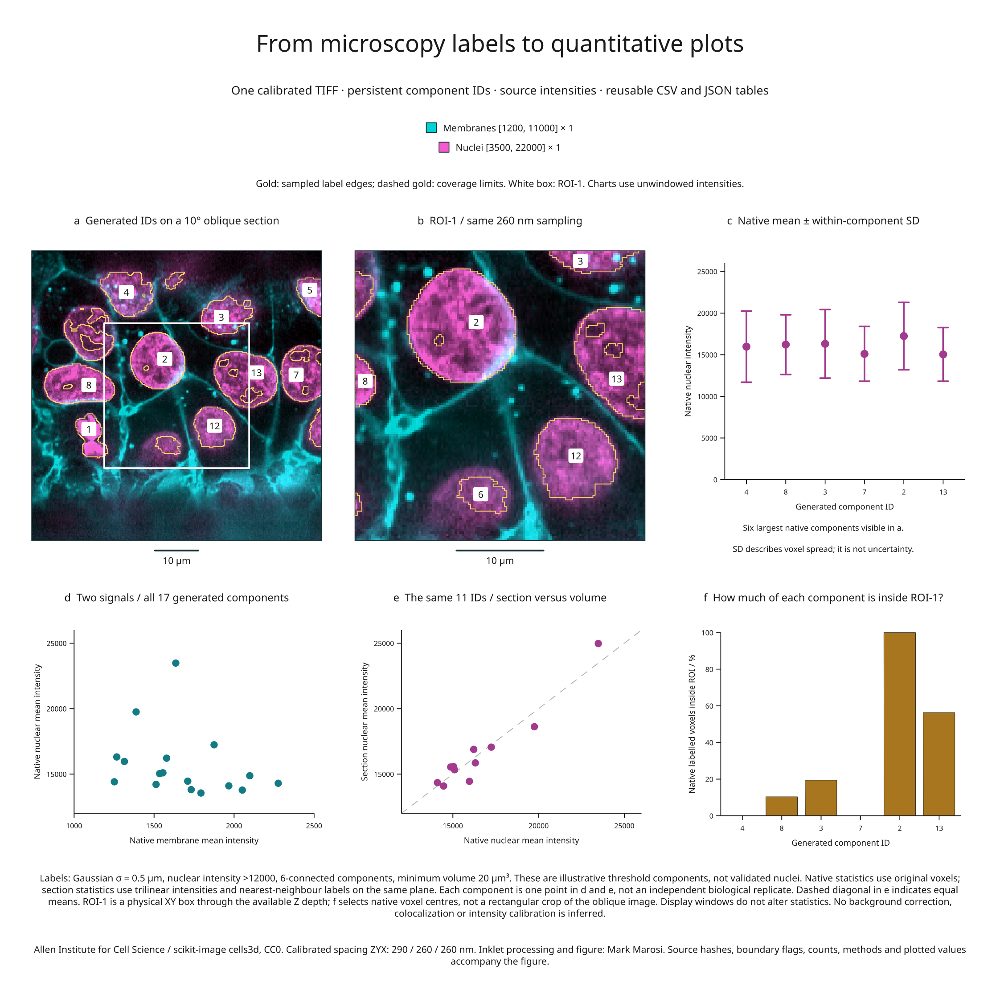

# From microscopy labels to intensity plots

This six-panel figure connects real two-channel fluorescence images to native
voxel, oblique-section and region measurements. The same generated component IDs
identify masks and table rows. It uses the Allen Institute for Cell Science
`cells3d` image from the [fluorescence example](fluorescence-biology.md).

[Full-size figure](../gallery/label-intensities.png) ·
[Executable recipe](../examples/label_intensities.py) ·
[Source, measurements and plotted values](assets/research-preview/label-intensities.json) ·
[Native CSV table](assets/research-preview/label-intensities-native.csv)



## Reproduce it

Use the development checkout; these APIs are outside stable 3.0. Blender is not
required.

```bash
git clone https://github.com/Mapika/inklet.git
cd inklet
python -m pip install -e '.[volume,render]'
python examples/label_intensities.py
```

The source helper verifies the pinned TIFF's size and SHA-256, then uses the
[new microscopy TIFF importer](microscopy-tiff.md). A verified source cache from
the fluorescence example is reused. The first download is 11,414,936 bytes.
Native ZYX spacing is 290 / 260 / 260 nm. Channel identity, TIFF axes, supplied
calibration, source hash and reader version accompany the output.

`out/label-intensities/` contains the SVG/PDF/PNG figure, HTML review,
`measurements.json`, `sampled-arrays.npz`, and separate `native`, `section` and
`roi` tables in both CSV and JSON. The section archive contains the unwindowed
channel values, integer labels and validity mask. The main evidence file includes
all tables and plotted coordinates; export hashes identify the CSV and archive
bytes. Import CSV `label_id` as text to preserve arbitrary-size identities.

## Read the panels

- **a:** The original two-channel data on a plane tilted 10° from XY. Gold vector
  contours follow sampled generated labels; dashed edges indicate source/image
  coverage limits. White marks the intersection of ROI-1 with the plane.
- **b:** A central 128 × 128 zoom, retaining the overview's 260 nm sampling.
  Enlargement does not increase resolution. Numeric badges retain original IDs.
- **c:** Native nuclear mean intensity with **population SD of voxel values** for
  the six largest native components that intersect the section. These whiskers
  describe within-component spread, not standard errors or confidence intervals.
- **d:** Native mean membrane versus nuclear intensity, one point for each of
  the 17 generated components. Both values use the same labelled voxels. Colors
  in the microscopy display and its intensity windows do not affect these means.
- **e:** Nuclear mean intensity on the section versus the native volume for the
  same 11 visible IDs. The dashed diagonal indicates equal means. Section means
  use trilinear intensity interpolation and nearest-neighbour label sampling;
  native means use original voxels. They describe different spatial samples.
- **f:** The percentage of native labelled voxels inside ROI-1, in the same
  six-ID order as c. ROI-1 spans the available Z depth. Native voxel centres are
  selected using a half-open physical box; this is not a rectangular crop of
  the oblique image. A zero means that component has no native centres in the ROI.

| Generated ID | Native nuclear mean | Within-component SD | Native labelled voxels inside ROI-1 |
| --- | ---: | ---: | ---: |
| 4 | 15964.97 | 4278.56 | 0.00% |
| 8 | 16215.53 | 3582.76 | 10.38% |
| 3 | 16309.13 | 4120.03 | 19.42% |
| 7 | 15099.31 | 3288.26 | 0.00% |
| 2 | 17239.47 | 4039.58 | 100.00% |
| 13 | 15036.94 | 3225.15 | 56.32% |

Values above are rounded for reading; the CSV and JSON retain float64 results.
The [measurement API guide](label-measurements.md) defines counts, coverage,
physical integrals and empty rows.

## Processing and interpretation

The recipe generates illustrative labels from the nuclear channel using a
0.5 µm Gaussian, intensity >12,000, 6-connected components and a 20 µm³ minimum
volume. Original scan-order IDs persist after filtering. These are **not validated
nuclei**: touching structures can merge, threshold holes persist and dim structures
can be missed. Native boundary flags and sampled contour coverage edges are
retained in the evidence; a component touching the source boundary may be
truncated. Region selection does not establish that an object is complete.

All measurements describe this one image and this processing recipe. Component
counts are not independent biological replicates. No background correction,
fluorescence intensity calibration, segmentation accuracy, statistical inference
or colocalization result is implied by the plots. Means from different channel
assays are not calibrated molecular abundance comparisons.

## Source and reuse

The source data are **CC0**, documented in the
[pinned scikit-image data notice](https://gitlab.com/scikit-image/data/-/raw/5c090b56df3988d988ff97928e2ef2d2cbe38e1b/README.md).
The [scikit-image microscopy tutorial](https://scikit-image.org/docs/stable/auto_examples/applications/plot_3d_image_processing.html)
provides calibration and the fourfold XY downsampling history. The TIFF's ImageJ
header does not supply physical spacing, so the importer receives the documented
values explicitly. Zero origin is a chosen local frame, not a microscope stage
position. Source bytes and metadata are locked in
`examples/biology/cells3d.lock.json`; raw TIFF data are not bundled in the repo.
The derived figure, processing recipe and documentation are MIT, Mark Marosi.
