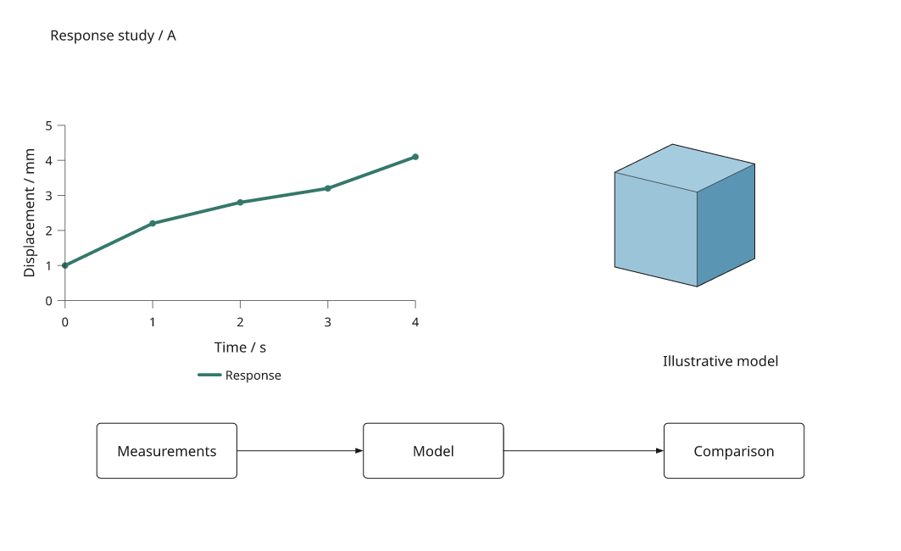

# Save and restore layout choices

Available since **4.0.0.dev7**; uniform artwork scale is added in **dev9**, named text and callout decisions in **dev10**, and supported appearance fields in **dev11**. Save placement and dimension edits separately from
a [composition recipe](composition-recipes.md), then restore those choices
when its data, labels or content change. The saved JSON records only differences
from a reference recipe. Unedited source decisions remain in control.



This example makes the chart narrower and shorter, moves the model and workflow,
and adjusts one nested module. Saving and reopening the overrides reproduces
the edited SVG at both 180 and 150 mm. The [complete example](../examples/composition_recipes.py)
uses live illustrative data and generated geometry.

[Open the restored figure viewer](assets/guides/layout-restored.html).
The viewer supports zoom, pan and vector export. Edit layouts through the
Python APIs below or the [local inspector](layout-editor.md) in dev8. This format is separate from the experimental linked-table
[plot-style overrides](visual-editing.md).

## Capture changes against a reference

Keep a reference recipe, copy it, then edit placements. The reference and edited
recipe must have the same named composition structure when capturing changes.
Supported named label differences are captured too. Supported named style differences are captured too; other content is not serialized into the layout file.

```python
import json
from pathlib import Path
import inklet as i

base = i.composition(120, 70)
base.add('plot', i.plot_spec(x=(0, 2), y=(0, 4)).line([(0, 1), (1, 2), (2, 3)]).axes(),
         x=13, y=8, anchor='area-nw', width=base.page_width - 26, height=30)
base.add('caption', i.module('Response'), x=13, y=55)

edited = base.copy()
edited.place('plot', width=edited.page_width - 35, height=35)
edited.place('caption', x=18)
state = edited.layout_overrides(base)
Path('layout.json').write_text(json.dumps(state, indent=2, allow_nan=False))
```

`layout_overrides(reference)` captures changed `x`, `y`, `anchor`, `width` and
`height` and uniform `scale` fields on children, plus `width`, `height`, `unit` and `fit_top` on
compositions. It visits nested compositions through their named children.
Measured expressions remain expressions, so page resizing and dependent
content measurements still work after reopening.

A path such as `/workflow/model` names the `model` child of the root's
`workflow` composition; `/` names the root composition itself. Names provide
identity within the recipe hierarchy. Renaming or moving a target changes its
identity. Definitions hidden inside component factories or other BuildSpecs
are not traversed.

## Named label decisions

Changed string module captions and text components are captured alongside layout.
Plot titles, text and annotations require explicit string instruction keys;
composition annotations require unique names. See the [label editor](layout-editor.md#edit-labels-and-callouts)
for controls, identity rules and an executable example. Captures compare only
matching label keys and kinds; they do not serialize added or removed content.

A saved label entry includes its kind and only the fields that changed:

```json
{"schema":"inklet.composition-layout/0.4","targets":{"/caption":{"labels":{"label":{"kind":"module-label","text":"Reviewed response"}}}}}
```

Readers accept legacy schemas 0.1, 0.2 and 0.3. New captures use 0.4; older readers
must be upgraded before opening them. Label fields are rejected under older
schema identifiers. Removed/incompatible labels appear as `path#key` in the
orphan report. Explicit `missing='drop'` retains compatible edits on that path.

## Named appearance decisions

Schema 0.4 adds a `styles` group beside `placement`, `page` and `labels`.
Each named style contains its `kind` and changed fields. The [appearance guide](layout-editor.md#edit-appearance-alongside-layout)
lists supported controls, units, data-mapping exclusions and a combined edit.
A `null` style value removes an explicit keyword; unedited source fields stay
live. Capturing changes compares compatible named style keys and kinds, not
arbitrary renderer nodes or paint objects.

Source revisions that remove a style key, change its kind or replace a constant
with a data mapping produce a `path#style:key` orphan. With explicit discard,
compatible layout and label edits on the same path survive. The separate
linked-table visual-override format is not converted by this loader.

## Restore on the current recipe

```python
loaded = json.loads(Path('layout.json').read_text())
restored, report = base.with_layout_overrides(loaded)
assert report['orphaned_targets'] == []

def render(recipe, width=120):
    doc = i.document(width=width, height=75, margin=0)
    doc.add('report', recipe)
    return doc.compile()

assert render(restored).to_svg() == render(edited).to_svg()
assert render(restored, 140).to_svg() == render(edited, 140).to_svg()
render(restored).save('restored.svg', 'restored.pdf')
```

`with_layout_overrides()` returns an independent recipe and a reconciliation
report. It leaves the supplied recipe and JSON unchanged. As with composition
copies, explicit live data dependencies stay shared. New children and unedited
fields use the current Python definition. Saved decisions intentionally replace
current values for the fields they contain.

```python
revised = base.copy()
revised['caption'].configure('Updated source label')
revised.place('plot', y=12)  # This field was not edited in the saved file.
updated, report = revised.with_layout_overrides(loaded)
assert updated['caption'].label == 'Updated source label'
updated_figure = render(updated)
updated_figure.save('updated.svg')
```

The file stores layout, supported labels and styles, not datasets,
links, ports, constraints, factories or camera parameters. Keep the Python
recipe and its assets alongside it. The containing document can supply its own
render dimensions; restoring authored page dimensions does not override that
parent layout contract.

## Reconcile removed targets explicitly

Removed paths, page edits aimed at content that is no longer a composition,
and measured expressions referring to removed siblings are incompatible.
The default raises `LayoutError` and identifies the affected target paths.
Use `missing='drop'` only when discarding those entries is intended, and review
the returned report. An incompatible entry is dropped as a whole.

```python
nested = i.composition(60, 20)
nested.add('label', i.module('Nested label'), x=5, y=4)
original = i.composition(100, 30)
original.add('group', nested)
variant = original.copy()
variant['group'].place('label', x=10)
saved = variant.layout_overrides(original)

new_source = original.copy()
new_source.replace('group', i.module('Replacement content'))
rebuilt, report = new_source.with_layout_overrides(saved, missing='drop')
assert report['orphaned_targets'] == ['/group/label']
```

Changing a child from one content type to another can retain its placement.
It must still support any requested placement anchor. Anchor availability,
geometry feasibility, division by zero and cyclic measured dependencies are
checked during compilation. Saved expressions support page dimensions,
measured child dimensions, child points and arithmetic, with a maximum nesting
of 32 operations. Malformed files, nonfinite numbers, invalid properties and
contradictory edits to a shared nested definition are rejected, including when
`missing='drop'` is used.

New files use `inklet.composition-layout/0.4`, adding named appearance decisions.
The loader also accepts 0.1 files from dev7/dev8 (without scale), 0.2 files from
dev9 (without labels) and 0.3 files from dev10 (without styles). Unknown schemas
are rejected. Upgrade older readers before opening a 0.4 file. The JSON object
contains `schema` and `targets`; each target has changed `placement`, `page`,
`labels` and/or `styles` fields. This development-preview format is not a general
Python object serializer or an asset manifest.

## Review revised content


The same saved layout applies to new measurements, a replacement 3D object and
a revised module label. Run
`python examples/composition_recipes.py --render --saved-layout` to generate
the comparison files, `layout-overrides.json` and `layout-reconciliation.json`
in `out/composition-recipes/`. PNG generation requires the render extras.

In dev8, the [local layout editor](layout-editor.md) provides browser controls,
undo/redo and Python-compiled previews using this saved format.
