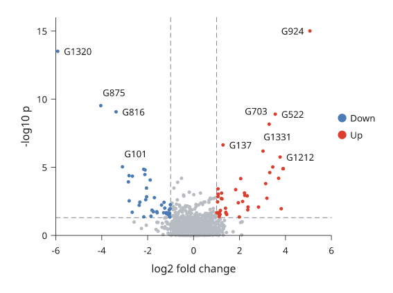
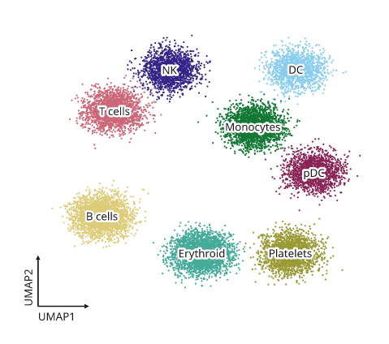
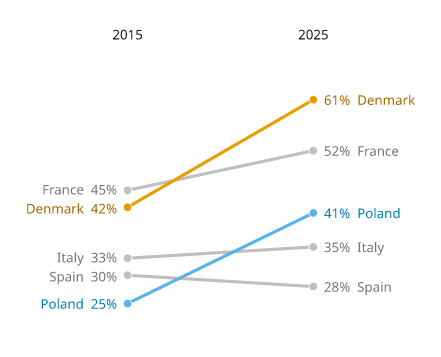
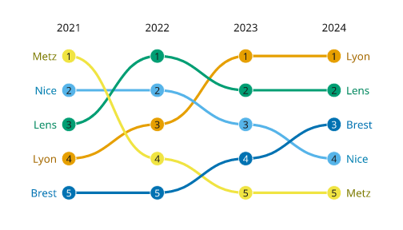
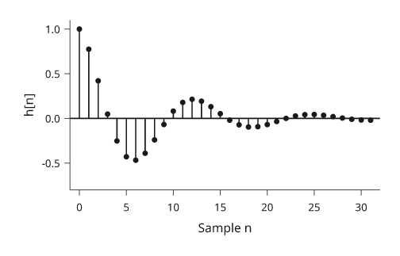
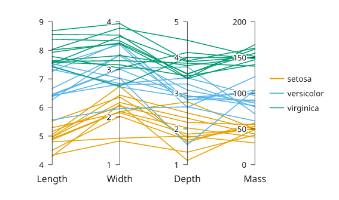

# Lines and points

Use a line when point order matters, a step for discrete changes, and scatter
when the observations should stand independently. Inklet connects line points
in supplied order; sort your data explicitly when necessary.

All values below are illustrative. Each snippet can be run independently with
core Inklet; PNG preview generation additionally uses the `render` extra.
Run a block from the repository root with `.venv/bin/python`; each block writes
an SVG and PDF. Keep x values sorted for a time or numeric trajectory. A line
connects observations in the order supplied and does not fit a model.

## Lines

A continuous response connects the supplied observations in order.

```python
import math
import inklet as i

time = [n / 4 for n in range(49)]
p = i.plot_spec(x=(0, 12), y=(0, 1.15), height=45)
p.grid(x=False, count=4, stroke='#e1e7e4', stroke_width=.15)
for name, rate, colour in [('Control', .24, '#24698c'),
                           ('Treated', .48, '#288675')]:
    response = [(t, 1 - math.exp(-rate * t)) for t in time]
    p.line(response, name=name, stroke=colour, stroke_width=.45)
p.axes(x='Time / s', y='Normalized response')
p.legend(side='bottom')
doc = i.document(width=110)
doc.add('line', p)
doc.save('line.svg', 'line.pdf')
```


*Illustrative first-order responses sampled every 0.25 s. Control and Treated use the same axes and distinct, named colours.*

## Steps

A step holds a value until the next observation.
`where="post"` holds forward, `"pre"` changes at the preceding x, and `"mid"`
changes halfway between samples. These are supplied values, not a fitted model.
Use a step only when the value is held or changes at known transitions; use a
line when interpolation between observations is meaningful.

```python
import inklet as i

commands = [(0, 10), (2, 10), (4, 40), (6, 40), (8, 70),
            (10, 70), (12, 30), (14, 30), (16, 55)]
value, response = 10, []
for n in range(65):
    t = n / 4
    target = commands[min(int(t // 2), 8)][1]
    value += .22 * (target - value)
    response.append((t, value))
p = i.plot_spec(x=(0, 16), y=(0, 85), height=45)
p.grid(x=False, count=4, stroke='#e1e7e4', stroke_width=.15)
p.step(commands, where='post', name='Command',
       stroke='#b86443', stroke_width=.45)
p.line(response, name='Simulated response', stroke='#24698c', stroke_width=.45)
p.axes(x='Time / s', y='Output / %').legend(side='bottom')
doc = i.document(width=115)
doc.add('step', p)
doc.save('step.svg', 'step.pdf')
```


*The rust command stays fixed between transitions. The blue simulated response updates every 0.25 s and approaches each new command.*

## Scatter

Scatter shows individual observations without connecting them.
`size` is marker diameter in millimetres, not marker area or a data-coordinate
radius. A sequence supplies one size or colour per point; choose the mapping
explicitly when encoding another measurement.
Avoid encoding a second variable with both size and colour unless a legend makes
the mappings unambiguous; overlapping points can hide observations.

```python
import random
import inklet as i

rng = random.Random(28)
points = [(x := rng.uniform(1, 9), 1.2 + .7 * x + rng.gauss(0, .65))
          for _ in range(60)]
p = i.plot_spec(x=(0, 10), y=(0, 9), height=45)
p.grid(x=False, count=4, stroke='#e1e7e4', stroke_width=.15)
p.scatter(points, size=1.3, color='#24698c', name='Samples', fill_opacity=.65)
reference = i.marker('diamond', 2.6).styled(fill='#b86443', stroke='none')
p.marks(reference, [(2, 2.6), (5, 4.7), (8, 6.8)], name='Reference')
p.axes(x='Input / V', y='Response / mV').legend(side='bottom')
doc = i.document(width=110)
doc.add('scatter', p)
doc.save('scatter.svg', 'scatter.pdf')
```


*Sixty simulated samples and three explicit reference points. Shape and colour distinguish the references without changing marker size to imply another variable.*

## Custom markers

A reusable drawing can mark each observation.
`marks()` positions the same glyph at data coordinates; its dimensions remain
physical. Use the standard `scatter(marker=...)` options for ordinary symbols.

```python
import math
import inklet as i

points = [(x, 5 * (1 - math.exp(-x / 3))) for x in range(1, 11)]
p = i.plot_spec(x=(0, 11), y=(0, 5.5), height=45)
p.grid(x=False, count=4, stroke='#e1e7e4', stroke_width=.15)
p.line(points, stroke='#b9ceca', stroke_width=.3)
glyph = i.marker('diamond', 2.3).styled(fill='#288675', stroke='none')
p.marks(glyph, points, name='Calibration samples')
p.axes(x='Input / V', y='Output / V').legend(side='bottom')
doc = i.document(width=110)
doc.add('markers', p)
doc.save('markers.svg', 'markers.pdf')
```


*Ten illustrative calibration values use the same diamond glyph. The connecting line follows the supplied values; no model is fitted.*

## Dumbbells

A dumbbell compares two or more values per category. Each series is a dot on
the category line, and a grey connector runs from the smallest to the largest
value. `values` has one list per series, in the same shape as grouped bars.
`None` marks a missing value; a category with one value has no connector.

```python
import inklet as i

genes = ['Gad1', 'Slc17a7', 'Pvalb', 'Sst', 'Vip', 'Olig2']
before = [2.1, 3.4, 1.2, 4.0, 2.6, 0.8]
after = [3.9, 2.0, 1.9, 5.2, 3.4, 0.9]
p = i.plot_spec(x=(0, 6), y=genes, height=44)
p.grid(y=False, count=4, stroke='#e1e7e4', stroke_width=.15)
p.dumbbell(genes, [before, after], orient='h', names=['Before', 'After'],
           colors=['#24698c', '#b86443'])
p.axes(x='Expression / log CPM').legend(side='top')
doc = i.document(width=100)
doc.add('dumbbell', p)
doc.save('dumbbell.svg', 'dumbbell.pdf')
```


*Illustrative expression before and after treatment. The connector length is
the change; its direction is read from the dot colours.*

## Lollipops

A lollipop is one value per category: a stem from `baseline` and a dot at the
value. Use it in place of bars when there are many categories.

```python
import inklet as i

pathways = ['Synapse', 'Axon', 'Myelin', 'Immune', 'Vascular', 'Cilia', 'Ribosome']
scores = [2.8, 2.1, 1.4, -0.9, -1.6, 0.6, -2.3]
p = i.plot_spec(x=(-3, 3), y=pathways, height=48)
p.vline(0, stroke='#5f6b7a', stroke_width=.2)
p.lollipop(pathways, scores, orient='h', color='#24698c')
p.axes(x='Enrichment score')
doc = i.document(width=100)
doc.add('lollipop', p)
doc.save('lollipop.svg', 'lollipop.pdf')
```


*Illustrative enrichment scores. Stems start at the baseline of 0.*

## Labelled points

`label_points` names many points in one call. Each label is placed at the
nearest free position around its point, clear of the marks and of the other
labels. A label that has to move further out gets a thin leader line back to
its point. Placement happens when the panel is built, so the labels also avoid
marks drawn after the call. The placement is deterministic.

```python
import inklet as i
import random

rng = random.Random(7)
genes = [(rng.gauss(0, 1.2), abs(rng.gauss(0, 1.3)) * 1.6) for _ in range(400)]
hits = sorted(genes, key=lambda g: -(g[1] + abs(g[0])))[:8]
names = ['Fos', 'Arc', 'Egr1', 'Npas4', 'Junb', 'Nr4a1', 'Bdnf', 'Homer1']
p = i.plot_spec(x=(-4, 4), y=(0, 8), height=50)
p.scatter(genes, size=.7, color='#c4c9cf')
p.scatter(hits, size=1.0, color='#b86443')
p.label_points(hits, names)
p.axes(x='log2 fold change', y='-log10 p')
doc = i.document(width=90)
doc.add('labelled-points', p)
doc.save('labelled-points.svg', 'labelled-points.pdf')
```


*Simulated data. Labels that could not be placed without overlap are listed
in the label node's `point_labels` note under `unresolved`.*

## Volcano plots

`volcano` takes log2 fold changes and p-values, one per feature, and draws
each feature at `(log2 fold change, -log10 p)`. A point with p below
`p_threshold` (default 0.05) and a fold change of at least `fold_threshold`
(default 1) is "up", one with a fold change of at most `-fold_threshold` is
"down", and every other point is "ns". The "ns" points are drawn first in a
pale grey; "up" points are red and "down" points blue. Dashed rules mark the
three thresholds; `thresholds=False` leaves them out.

With `labels=` (one name per feature), the `top` significant points with the
smallest p-values are named with `label_points`. Points outside the plot area
are not labelled. `names=` gives legend names for the classes, in the order
down, ns, up; `None` leaves a class out of the legend. A p-value of 0 is
drawn at the smallest positive p-value in the data.
`inklet.plot.volcano_points` returns the classes and the ranking without
drawing.

```python
import inklet as i
import math
import random

rng = random.Random(11)
fold, pvalues = [], []
for _ in range(1500):
    effect = rng.gauss(0, .5) if rng.random() < .9 else rng.gauss(0, 1.8)
    fold.append(effect)
    pvalues.append(math.erfc(abs(effect * 1.3 + rng.gauss(0, 1)) / math.sqrt(2)))
genes = [f'G{k}' for k in range(1500)]
p = i.plot_spec(x=(-6, 6), y=(0, 16), height=50)
p.volcano(fold, pvalues, labels=genes, top=10, names=('Down', None, 'Up'), size=.8)
p.axes(x='log2 fold change', y='-log10 p').legend(side='right')
doc = i.document(width=90)
doc.add('volcano', p)
doc.save('volcano.svg', 'volcano.pdf')
```



*Simulated data. The dashed rules are at a fold change of ±1 and at p = 0.05.*

## Embedding scatters

`embedding` draws a UMAP or t-SNE style scatter coloured by cluster. It takes
`(x, y)` points and one cluster name per point, and draws them with one
`scatter` call, so from 256 points up they are a single packed marker batch.
The points are drawn in a seeded random order, so a cluster listed last does
not cover the others; `shuffle=False` keeps the input order.

Each cluster's name is written at its centre on a paper halo. The centre lies
on the data: the member point nearest the cluster's median, which stays on a
curved cluster where the mean would not. `centre='medoid'` or `'mean'` choose
another rule, and `inklet.plot.cluster_centres` returns the centres without
drawing. A name that would overlap a name already placed, or the points of
another cluster, moves to the nearest free spot. A name may cover its own
cluster. Names that could not clear another cluster's points are listed under
`covering` in the `embedding` note. `arrows='UMAP'` draws two short arrows
labelled UMAP1 and UMAP2 in the lower-left corner instead of axes. The default
colours are Paul Tol's qualitative palettes, and every cluster is recorded for
`legend()`.

`outline='line'` draws a smooth outline round each cluster's core, thin and in
the cluster's colour. `outline='fill'` draws the core as a light tint under the
points instead. The core is the region holding the densest `outline_core`
share of the cluster's points (default 0.8). It is found as a threshold on a
smoothed density, so it follows a curved cluster, and stray points neither
enlarge it nor add islands. A cluster name keeps off other clusters'
outlines. It may cross its own outline line, but not the edge of its own
tint: a name wider than its core then sits beside the cluster.

```python
import inklet as i
import math
import random

rng = random.Random(5)
centres = {'T cells': (-4.2, 2.6), 'NK': (-1.4, 4.6), 'B cells': (-4.8, -2.6),
           'Monocytes': (2.8, 1.8), 'DC': (4.9, 4.6), 'pDC': (5.8, -.4),
           'Erythroid': (.2, -4.4), 'Platelets': (4.6, -4.4)}
points, clusters = [], []
for name, (cx, cy) in centres.items():
    for _ in range(rng.randint(900, 3200)):
        turn = rng.uniform(0, 2 * math.pi)
        points.append((cx + .55 * math.cos(turn) + rng.gauss(0, .6),
                       cy + .35 * math.sin(turn) + rng.gauss(0, .45)))
        clusters.append(name)
p = i.plot_spec(x=(-8, 8.5), y=(-7, 7), width=60, height=56)
p.embedding(points, clusters, arrows='UMAP', size=.2, outline='line')
doc = i.document(width=76)
doc.add('embedding', p)
doc.save('embedding.svg', 'embedding.pdf')
```



*Simulated data. The points are one marker batch; `raster=True` embeds them
as an image instead.*

## Slope charts

A slope chart joins each series' value at two (or a few) positions with a
line, and names the series at the ends with its value. `highlight=` keeps the
named series in colour and greys the rest. End labels are spread apart so
that they never overlap.

```python
import inklet as i

shares = {'Denmark': [42, 61], 'Spain': [30, 28], 'Italy': [33, 35],
          'France': [45, 52], 'Poland': [25, 41]}
p = i.plot_spec(x=['2015', '2025'], y=(20, 70), height=45, width=26)
p.slope(shares, format='{:.0f}%', highlight=['Denmark', 'Poland'])
p.axis('top', spine=False, tick_size=0)
doc = i.document(width=70)
doc.add('slope', p)
doc.save('slope.svg', 'slope.pdf')
```



*Illustrative shares. The labels are placed outside the plot area.*

## Bump charts

A bump chart follows each series' rank over time. `bump` ranks the values at
each position (largest first) and joins the ranks with smooth S-curves; give
`ranked=True` if the values already are ranks. Use a y scale that runs from
the lowest rank at the bottom to rank 1 at the top. `numbers=True` writes the
rank in each dot.

```python
import inklet as i

points = {'Lyon': [3, 5, 8, 9], 'Nice': [8, 6, 5, 3], 'Lens': [5, 9, 7, 8],
          'Metz': [9, 3, 2, 1], 'Brest': [1, 2, 4, 6]}
p = i.plot_spec(x=['2021', '2022', '2023', '2024'], y=(5.5, .5), height=34, width=50)
p.bump(points, numbers=True)
p.axis('top', spine=False, tick_size=0)
doc = i.document(width=80)
doc.add('bump', p)
doc.save('bump.svg', 'bump.pdf')
```



*Illustrative scores. `inklet.plot.ranks` returns the rank table.*

## Stem plots

A stem plot draws a stem from a baseline to a dot at each sample, for a
sampled signal on a continuous scale. For one value per category, use
`lollipop`.

```python
import inklet as i
import math

response = [(n, math.exp(-n / 8) * math.cos(n / 2)) for n in range(32)]
p = i.plot_spec(x=(-1, 32), y=(-.8, 1.1), height=34)
p.stem(response)
p.axes(x='Sample n', y='h[n]')
doc = i.document(width=80)
doc.add('stem', p)
doc.save('stem.svg', 'stem.pdf')
```



*A damped cosine. `rule=False` leaves out the baseline across the panel.*

## Parallel coordinates

Parallel coordinates give each variable its own vertical axis and draw each
record as a line across them. Each axis is scaled to its variable's range.
`groups=` colours the records by group.

```python
import inklet as i
import random

rng = random.Random(3)
records, species = [], []
for s, (length, scale) in enumerate([(5, 1.0), (6.5, 1.4), (8, 1.9)]):
    for _ in range(12):
        l = length + rng.gauss(0, .5)
        records.append([l, l * .45 + rng.gauss(0, .3), 2 + s + rng.gauss(0, .4),
                        scale * l * 10 + rng.gauss(0, 8)])
        species.append(['setosa', 'versicolor', 'virginica'][s])
p = i.plot_spec(x=['Length', 'Width', 'Depth', 'Mass'], height=38, width=62)
p.parallel(records, groups=species)
p.legend(side='right')
doc = i.document(width=90)
doc.add('parallel', p)
doc.save('parallel.svg', 'parallel.pdf')
```



*Simulated measurements. A missing value breaks the record's line.*

## Next steps

[Compare plot types](plot-types.md), configure [axes and scales](axes-and-scales.md),
or [arrange several panels](layout.md). For exact options, see the [API](api.md).
