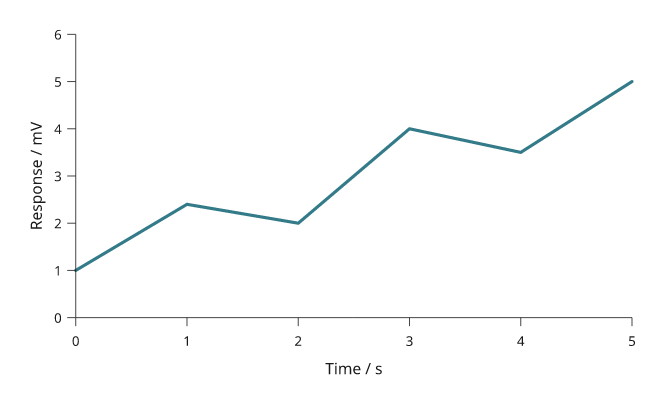
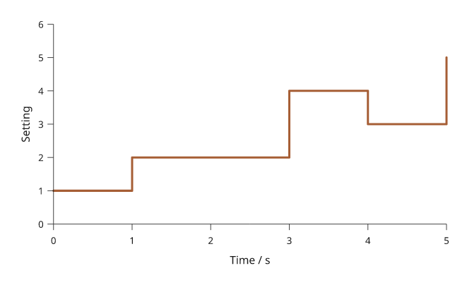
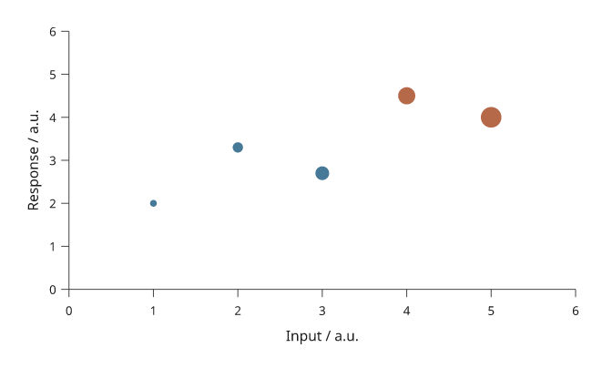
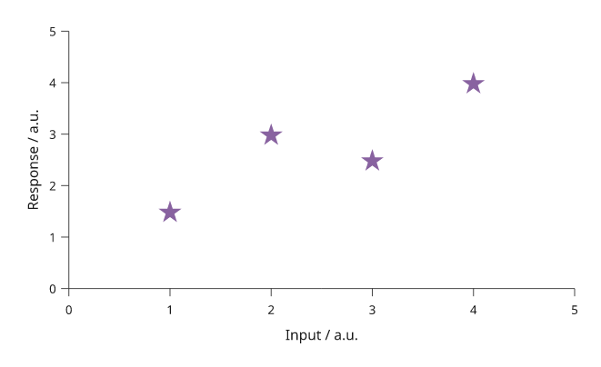

# Lines and points

Use a line when point order matters, a step for discrete changes, and scatter
when the observations should stand independently. Inklet connects line points
in supplied order; sort your data explicitly when necessary.

All values below are illustrative. Each snippet can be run independently with
core Inklet; PNG preview generation additionally uses the `render` extra.

## Lines

A continuous response connects the supplied observations in order.

```python
import inklet as i
p = i.plot_spec(x=(0, 5), y=(0, 6), height=45)
p.line([(0, 1), (1, 2.4), (2, 2), (3, 4), (4, 3.5), (5, 5)],
       stroke='#347b8a', stroke_width=.5)
p.axes(x='Time / s', y='Response / mV')
doc = i.document(width=105)
doc.add('line', p)
doc.save('line.svg', 'line.pdf')
```



*Rendered from the code above.*

## Steps

A step holds a value until the next observation.
`where="post"` holds forward, `"pre"` changes at the preceding x, and `"mid"`
changes halfway between samples. These are supplied values, not a fitted model.

```python
import inklet as i
p = i.plot_spec(x=(0, 5), y=(0, 6), height=45)
p.step([(0, 1), (1, 2), (2, 2), (3, 4), (4, 3), (5, 5)],
       where='post', stroke='#a65e35', stroke_width=.5)
p.axes(x='Time / s', y='Setting')
doc = i.document(width=105)
doc.add('step', p)
doc.save('step.svg', 'step.pdf')
```



*Rendered from the code above.*

## Scatter

Scatter shows individual observations without connecting them.
`size` is marker diameter in millimetres, not marker area or a data-coordinate
radius. A sequence supplies one size or colour per point; choose the mapping
explicitly when encoding another measurement.

```python
import inklet as i
p = i.plot_spec(x=(0, 6), y=(0, 6), height=45)
p.scatter([(1, 2), (2, 3.3), (3, 2.7), (4, 4.5), (5, 4)],
          size=[1.2, 1.8, 2.4, 3, 3.6],
          color=['#467897', '#467897', '#467897', '#b56948', '#b56948'])
p.axes(x='Input / a.u.', y='Response / a.u.')
doc = i.document(width=105)
doc.add('scatter', p)
doc.save('scatter.svg', 'scatter.pdf')
```



*Rendered from the code above.*

## Custom markers

A reusable drawing can mark each observation.
`marks()` positions the same glyph at data coordinates; its dimensions remain
physical. Use the standard `scatter(marker=...)` options for ordinary symbols.

```python
import inklet as i
p = i.plot_spec(x=(0, 5), y=(0, 5), height=45)
glyph = i.marker('star', 2.5).styled(fill='#8862a0', stroke='none')
p.marks(glyph, [(1, 1.5), (2, 3), (3, 2.5), (4, 4)])
p.axes(x='Input / a.u.', y='Response / a.u.')
doc = i.document(width=105)
doc.add('markers', p)
doc.save('markers.svg', 'markers.pdf')
```



*Rendered from the code above.*

## Next steps

[Compare plot types](plot-types.md), configure [axes and scales](axes-and-scales.md),
or [arrange several panels](layout.md). For exact options, see the [API](api.md).
