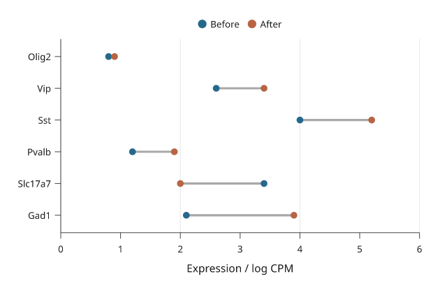
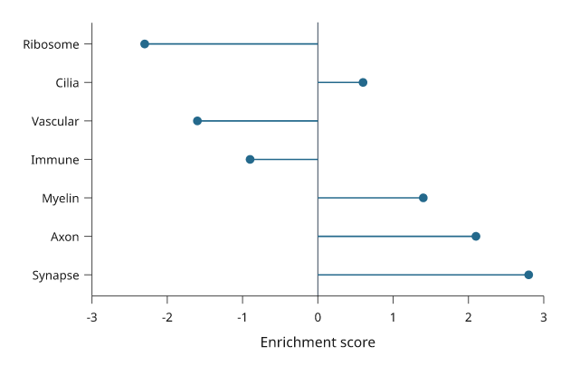
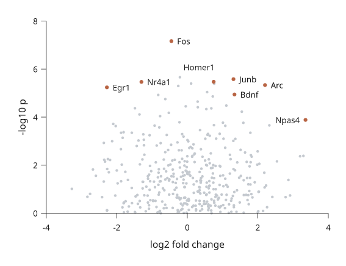

# Lines and points

Use a line when point order matters, a step for discrete changes, and scatter
when the observations should stand independently. Inklet connects line points
in supplied order; sort your data explicitly when necessary.

All values below are illustrative. Each snippet can be run independently with
core Inklet; PNG preview generation additionally uses the `render` extra.
Run a block from the repository root with `.venv/bin/python`; each block writes
an SVG and PDF. Keep x values sorted for a time or numeric trajectory. A line
connects observations in the order supplied and does not fit a model.

## Lines

A continuous response connects the supplied observations in order.

```python
import math
import inklet as i

time = [n / 4 for n in range(49)]
p = i.plot_spec(x=(0, 12), y=(0, 1.15), height=45)
p.grid(x=False, count=4, stroke='#e1e7e4', stroke_width=.15)
for name, rate, colour in [('Control', .24, '#24698c'),
                           ('Treated', .48, '#288675')]:
    response = [(t, 1 - math.exp(-rate * t)) for t in time]
    p.line(response, name=name, stroke=colour, stroke_width=.45)
p.axes(x='Time / s', y='Normalized response')
p.legend(side='bottom')
doc = i.document(width=110)
doc.add('line', p)
doc.save('line.svg', 'line.pdf')
```


*Illustrative first-order responses sampled every 0.25 s. Control and Treated use the same axes and distinct, named colours.*

## Steps

A step holds a value until the next observation.
`where="post"` holds forward, `"pre"` changes at the preceding x, and `"mid"`
changes halfway between samples. These are supplied values, not a fitted model.
Use a step only when the value is held or changes at known transitions; use a
line when interpolation between observations is meaningful.

```python
import inklet as i

commands = [(0, 10), (2, 10), (4, 40), (6, 40), (8, 70),
            (10, 70), (12, 30), (14, 30), (16, 55)]
value, response = 10, []
for n in range(65):
    t = n / 4
    target = commands[min(int(t // 2), 8)][1]
    value += .22 * (target - value)
    response.append((t, value))
p = i.plot_spec(x=(0, 16), y=(0, 85), height=45)
p.grid(x=False, count=4, stroke='#e1e7e4', stroke_width=.15)
p.step(commands, where='post', name='Command',
       stroke='#b86443', stroke_width=.45)
p.line(response, name='Simulated response', stroke='#24698c', stroke_width=.45)
p.axes(x='Time / s', y='Output / %').legend(side='bottom')
doc = i.document(width=115)
doc.add('step', p)
doc.save('step.svg', 'step.pdf')
```


*The rust command stays fixed between transitions. The blue simulated response updates every 0.25 s and approaches each new command.*

## Scatter

Scatter shows individual observations without connecting them.
`size` is marker diameter in millimetres, not marker area or a data-coordinate
radius. A sequence supplies one size or colour per point; choose the mapping
explicitly when encoding another measurement.
Avoid encoding a second variable with both size and colour unless a legend makes
the mappings unambiguous; overlapping points can hide observations.

```python
import random
import inklet as i

rng = random.Random(28)
points = [(x := rng.uniform(1, 9), 1.2 + .7 * x + rng.gauss(0, .65))
          for _ in range(60)]
p = i.plot_spec(x=(0, 10), y=(0, 9), height=45)
p.grid(x=False, count=4, stroke='#e1e7e4', stroke_width=.15)
p.scatter(points, size=1.3, color='#24698c', name='Samples', fill_opacity=.65)
reference = i.marker('diamond', 2.6).styled(fill='#b86443', stroke='none')
p.marks(reference, [(2, 2.6), (5, 4.7), (8, 6.8)], name='Reference')
p.axes(x='Input / V', y='Response / mV').legend(side='bottom')
doc = i.document(width=110)
doc.add('scatter', p)
doc.save('scatter.svg', 'scatter.pdf')
```


*Sixty simulated samples and three explicit reference points. Shape and colour distinguish the references without changing marker size to imply another variable.*

## Custom markers

A reusable drawing can mark each observation.
`marks()` positions the same glyph at data coordinates; its dimensions remain
physical. Use the standard `scatter(marker=...)` options for ordinary symbols.

```python
import math
import inklet as i

points = [(x, 5 * (1 - math.exp(-x / 3))) for x in range(1, 11)]
p = i.plot_spec(x=(0, 11), y=(0, 5.5), height=45)
p.grid(x=False, count=4, stroke='#e1e7e4', stroke_width=.15)
p.line(points, stroke='#b9ceca', stroke_width=.3)
glyph = i.marker('diamond', 2.3).styled(fill='#288675', stroke='none')
p.marks(glyph, points, name='Calibration samples')
p.axes(x='Input / V', y='Output / V').legend(side='bottom')
doc = i.document(width=110)
doc.add('markers', p)
doc.save('markers.svg', 'markers.pdf')
```


*Ten illustrative calibration values use the same diamond glyph. The connecting line follows the supplied values; no model is fitted.*

## Dumbbells

A dumbbell compares two or more values per category. Each series is a dot on
the category line, and a grey connector runs from the smallest to the largest
value. `values` has one list per series, in the same shape as grouped bars.
`None` marks a missing value; a category with one value has no connector.

```python
import inklet as i

genes = ['Gad1', 'Slc17a7', 'Pvalb', 'Sst', 'Vip', 'Olig2']
before = [2.1, 3.4, 1.2, 4.0, 2.6, 0.8]
after = [3.9, 2.0, 1.9, 5.2, 3.4, 0.9]
p = i.plot_spec(x=(0, 6), y=genes, height=44)
p.grid(y=False, count=4, stroke='#e1e7e4', stroke_width=.15)
p.dumbbell(genes, [before, after], orient='h', names=['Before', 'After'],
           colors=['#24698c', '#b86443'])
p.axes(x='Expression / log CPM').legend(side='top')
doc = i.document(width=100)
doc.add('dumbbell', p)
doc.save('dumbbell.svg', 'dumbbell.pdf')
```



*Illustrative expression before and after treatment. The connector length is
the change; its direction is read from the dot colours.*

## Lollipops

A lollipop is one value per category: a stem from `baseline` and a dot at the
value. Use it in place of bars when there are many categories.

```python
import inklet as i

pathways = ['Synapse', 'Axon', 'Myelin', 'Immune', 'Vascular', 'Cilia', 'Ribosome']
scores = [2.8, 2.1, 1.4, -0.9, -1.6, 0.6, -2.3]
p = i.plot_spec(x=(-3, 3), y=pathways, height=48)
p.vline(0, stroke='#5f6b7a', stroke_width=.2)
p.lollipop(pathways, scores, orient='h', color='#24698c')
p.axes(x='Enrichment score')
doc = i.document(width=100)
doc.add('lollipop', p)
doc.save('lollipop.svg', 'lollipop.pdf')
```



*Illustrative enrichment scores. Stems start at the baseline of 0.*

## Labelled points

`label_points` names many points in one call. Each label is placed at the
nearest free position around its point, clear of the marks already drawn and
of the other labels. A label that has to move further out gets a thin leader
line back to its point. Draw the marks first and call `label_points` last.
The placement is deterministic.

```python
import inklet as i
import random

rng = random.Random(7)
genes = [(rng.gauss(0, 1.2), abs(rng.gauss(0, 1.3)) * 1.6) for _ in range(400)]
hits = sorted(genes, key=lambda g: -(g[1] + abs(g[0])))[:8]
names = ['Fos', 'Arc', 'Egr1', 'Npas4', 'Junb', 'Nr4a1', 'Bdnf', 'Homer1']
p = i.plot_spec(x=(-4, 4), y=(0, 8), height=50)
p.scatter(genes, size=.7, color='#c4c9cf')
p.scatter(hits, size=1.0, color='#b86443')
p.label_points(hits, names)
p.axes(x='log2 fold change', y='-log10 p')
doc = i.document(width=90)
doc.add('labelled-points', p)
doc.save('labelled-points.svg', 'labelled-points.pdf')
```



*Simulated data. Labels that could not be placed without overlap are listed
in the label node's `point_labels` note under `unresolved`.*

## Next steps

[Compare plot types](plot-types.md), configure [axes and scales](axes-and-scales.md),
or [arrange several panels](layout.md). For exact options, see the [API](api.md).
