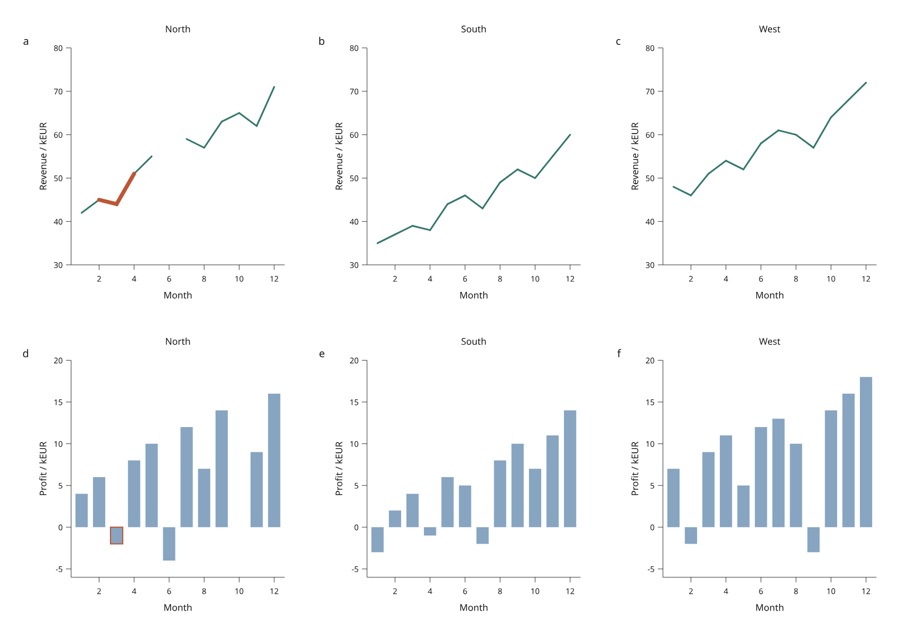

# Linked category panels

Split a line, bar or scatter view into ordered category panels while keeping
selection linked by row ID. `FacetView` is available in the development checkout
under `inklet.experimental.browser`; it is **not in PyPI 3.1.0**.



[Open the interactive figure](assets/v4/faceted-operations.html) ·
[Complete Python recipe](../examples/v4/faceted_operations.py)

The recipe uses 36 original simulated monthly rows, with three invented business
categories. The first row of panels shows revenue; the second shows signed
profit. Every category uses the same revenue domain and the same profit domain;
month positions align across both rows of panels.
North has missing revenue in June and zero profit in October. These are
illustrative values, not company accounts. Category labels identify the panels;
the explanation stays outside the artwork.

## Explore the figure

1. Click North's negative March profit bar. The incident revenue segments in
   North's panel highlight the same `north-03` row. Other categories stay separate.
2. Search for `North`. The South and West panels retain their axes and category
   labels, so filtering does not move the remaining panels. Clear the search.
3. Switch between SVG, canvas and hybrid display, then download vector SVG.
   All three use the same compiled geometry and row selection.
4. Expand **Data revision** and apply **North and South only**. West's panels
   remain present and empty. If you selected a West row, the default missing-ID
   policy rejects its removal; choose **Drop removed IDs** to transfer the view
   and inspect the report. Retained revenue and profit values do not change.

Selecting a line chooses an endpoint row. A valid row with no neighboring valid
observation has no line segment but remains available in its bar panel or table.
The [linked plot guide](linked-plots.md) documents picking and filtering details.

## Define categories explicitly

```python
from inklet.experimental.browser import BrowserFigure, FacetView, LineView
from inklet.experimental.selection import KeyedTable

table = KeyedTable("observations", {
    "id": ["n1", "s1", "n2", "s2"],
    "region": ["North", "South", "North", "South"],
    "month": [1, 1, 2, 2],
    "revenue": [42, 35, 45, 37],
})
figure = BrowserFigure(table, [
    FacetView(
        LineView("revenue", "month", "revenue", (1, 12), (30, 80),
                 x_label="Month", y_label="Revenue / kEUR"),
        column="region",
        values=("North", "South", "West"),
    ),
], width=240, columns=3)
```

`values` supplies the exact category order. Each value must be a unique nonempty
string. Optional `labels=(...)` provides display labels in the same order and
with the same length; omitting labels displays the values themselves. The
underlying category column contains strings or `None`. Category labels are
measured with the figure's text layout; they are included in vector export.

Empty categories retain their panels. Null categories and strings absent from
`values` remain in the global keyed table but produce no marks in that facet
group. They can still be selected through the table or another view. Inspect
`figure.payload()["facet_groups"]`: each entry reports its `name`, `column`,
ordered `values` and `unassigned_ids`. These rows are not silently reassigned to
an automatic “Other” category.

The browser lists unassigned source IDs under **Rows outside facet categories**.
This diagnostic updates when switching data revisions. It describes the source
table, independently of the current visibility filter.

Facet figures share measured plot margins, so equal domains also have equal
physical scales across their panels. Empty panels reserve the same space.
Ordinary documents can opt into the same fitting rule with
`document(..., share_plot_margins=True)` or
`subfigure(..., share_plot_margins=True)`. It reserves the largest plot furniture
on every plot and combines the tallest natural data region with shared top and
bottom margins for automatic heights. Equal tracks and unspanned cells give
equal data areas; unequal track weights, spans or larger cell minimum sizes can
still produce different areas. Fixed artwork retains its authored size. This
option is new in the development checkout and defaults to `False`.

The wrapped view supplies fixed domains, axis labels, color and mark settings.
Line adjacency follows source order **within each category**, so interleaving
North and South rows does not join their lines or break either series. Null x/y
pairs break a category's line. Filtering removes segments incident to hidden
rows; it never reconnects surviving observations across a removed row. Inklet
does not sort, aggregate or interpolate the table.

The [statistical preview](statistical-views.md) also supports faceted ECDF and
interval views. ECDF populations are calculated per category and remain fixed
during filtering; supplied interval bounds are not recalculated.

`BrowserFigure` accepts one to four view definitions, expanding to at most
twelve panels. Plain views and facets can share a figure. The default layout
uses at most two columns; set `columns=1` through `4` explicitly to control the
grid. Facets wrap `ScatterView`, `LineView`, `BarView`, `ECDFView` or `IntervalView`; geographic region
facets, nested facets and automatic category discovery are outside this preview.

## Save, replace and reconstruct

```sh
python examples/v4/faceted_operations.py --output out/v4-facets

# Reopen a view saved while all three regions were active.
python examples/v4/faceted_operations.py --state /path/to/view.json \
  --output out/v4-restored

# Reopen a view saved after switching to North and South only.
python examples/v4/faceted_operations.py --without-west \
  --state /path/to/revised-view.json --output out/v4-restored
```

The script writes an offline `index.html`, vector `figure.svg` and `view.json`.
The HTML opens with the saved selection, filter and page viewport applied;
the SVG reconstructs the same state in Python. Saved-state loading requires
the exact data and measured scene revision.

Use `replace_data()` or an embedded `RevisionOption` to transfer selections to
revised data explicitly. Facet definitions are retained, including categories
that lose all their rows. The [data replacement guide](data-revisions.md)
explains removed-ID handling and viewport policies. This example embeds both
cohorts, requires no external requests and credits its simulated data in the
page footer.
