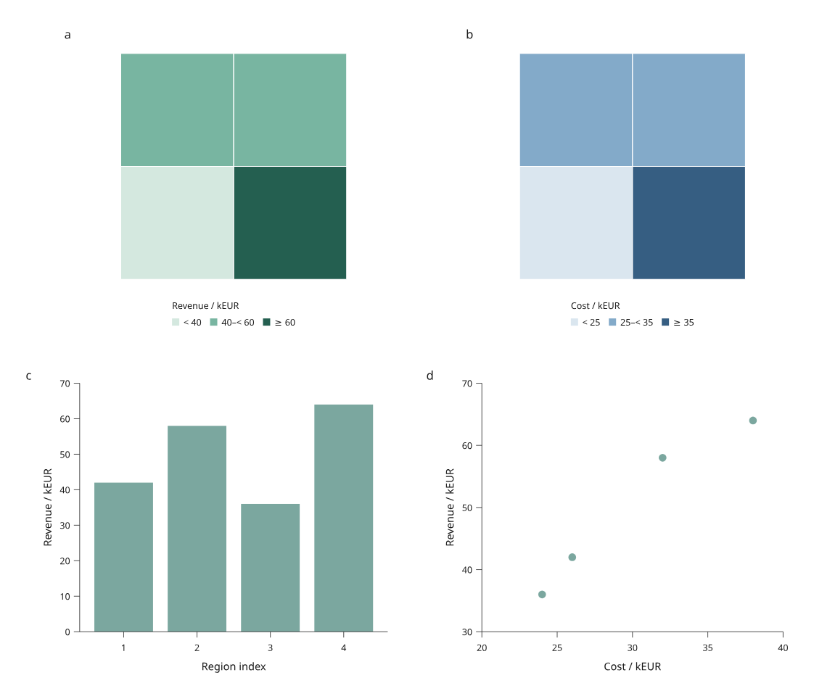
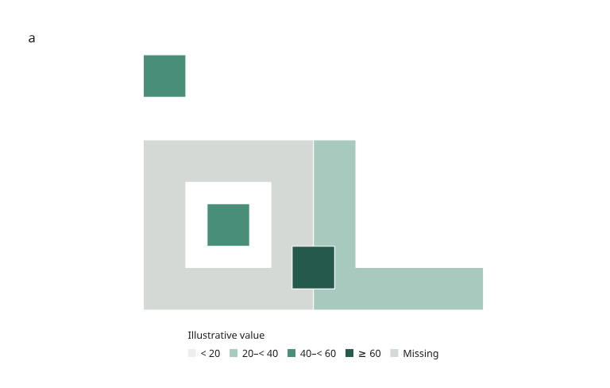

# Linked region maps

Available in **4.0.0.dev1**. See the [development-preview installation guide](development-preview.md).

The development preview now joins GeoJSON regions to the same keyed table used
by linked bars and scatter plots. Select a region in either map to select its
row across all panels, filter regions, save the view, and reconstruct it in
Python. This is an experimental preview feature, **not part of PyPI 3.1.0**.


[Open the real world and Europe maps](assets/v4/world-population.html) ·
[Source data, provenance and recipe](world-map.md)

The main example uses real public-domain Natural Earth boundaries and its
historical population estimates, mostly dated 2019. Country selection links the
world and Europe views. Search by country name or continent; the source year
is retained for every row. See the [real-map guide](world-map.md) for details.

## Small regression example

The four-region figure below is a deliberately simple test fixture. It remains
useful for checking expected totals, joins and selection behavior.



[Open the regional analysis](assets/v4/regional-analysis.html) ·
[Python example](../examples/v4/regional_analysis.py) ·
[Original CSV](../examples/v4/fixtures/regions.csv) ·
[Original GeoJSON](../examples/v4/fixtures/regions.geojson)

These four regions are invented rectangles, not administrative boundaries.
North is up and east is right. Bar indices 1–4 correspond to Northwest,
Northeast, Southwest and Southeast. Total illustrative revenue is 200 kEUR and
cost is 120 kEUR. Each North/South group has revenue of 100 kEUR.

## A complete linked view

1. Click Southeast in either map. Its revenue bar and cost/revenue point share
   the selection. Hover shows its row ID and the map's joined value.
2. Enter `north` or `south` in the ID filter. Hidden selections remain saved and
   counted; map color bins and legends stay fixed.
3. Pan or zoom the page, then choose **Save view**. **Open saved view** restores
   visibility, selection and viewport.
4. Download vector SVG, or reconstruct the saved view in Python:

```sh
python examples/v4/regional_analysis.py --output out/v4-regions
python examples/v4/regional_analysis.py --state /path/to/view.json --output out/v4-restored
# Start with one group visible:
python examples/v4/regional_analysis.py --group North --output out/v4-north
```

Restored HTML applies the saved state on opening. SVG, Canvas 2D and hybrid
backends share the same polygon geometry, clipping, color bins and row identities.
Their vector export preserves polygon holes and selection outlines.

## Input and projection contract

`GeoRegions.read(path)` reads UTF-8 GeoJSON; `GeoRegions.from_geojson(mapping)`
accepts an already parsed object. Input must be a nonempty FeatureCollection of
Polygon or MultiPolygon features with unique, nonempty **string feature IDs**.
Feature IDs must exactly match the table's row IDs. Missing or unmatched geometry
fails with the corresponding IDs; no positional join or silent drop occurs.
The table supplies values and labels; GeoJSON properties are not used for joins.

The supported coordinate subset follows GeoJSON's longitude/latitude order in
decimal degrees. The first polygon ring is the exterior and subsequent rings
are holes. See [RFC 7946](https://www.rfc-editor.org/rfc/rfc7946) for the format.
This preview accepts two-coordinate positions only, finite longitude in
−180…180 and latitude in −90…90, explicit ring closure, at least three distinct
vertices and nonzero signed ring area. Either ring orientation is accepted.

Altitude coordinates, null/other geometry types, legacy CRS fields and edges
crossing the antimeridian are rejected. Cut crossing polygons before import.
Validation checks structure and coordinate bounds; it does **not** validate or
repair self-intersections, hole containment or overlaps between multipolygon
parts. Supply valid simple rings, contained holes and nonoverlapping parts.
Distinct features may overlap; their picking order is described below.

`RegionView` uses a fixed flat longitude/latitude view (*Plate Carrée*) with
one physical scale for both degree axes. The map fits inside its measured panel
without stretching to the panel's aspect ratio. `extent=(west, south, east,
north)` controls the visible bounds; regions are clipped to that extent.
The frame reserves the map area even when it has no axes. Legends are measured
and outlined in Python, outside the map area.

This is a geographic display, not an equal-area projection, geodesic measurement
or map service. There are no tiles, remote fonts, external network requests or
optional GIS dependencies. Other projections and antimeridian/polar handling
remain future work. Page zoom changes the viewport, not the geographic extent.

## Author a map and scatter panel

```python
from pathlib import Path
from inklet.experimental.browser import BrowserFigure, GeoRegions, RegionView, ScatterView
from inklet.experimental.selection import KeyedTable

# Use IDs present in your GeoJSON file.
table = KeyedTable("regions", {
    "id": ["west", "east"],
    "revenue": [42, 64],
    "cost": [26, 38],
})
regions = GeoRegions.read("regions.geojson")
figure = BrowserFigure(table, [
    RegionView("map", regions, (0, 0, 2, 1), value="revenue",
               breaks=(40, 60), colors=("#d4e8df", "#78b5a1", "#245f50"),
               value_label="Revenue / kEUR"),
    ScatterView("comparison", "cost", "revenue", (20, 40), (30, 70),
                x_label="Cost / kEUR", y_label="Revenue / kEUR"),
], width=190)
Path("regions.html").write_text(figure.to_html(), encoding="utf-8")
Path("regions.svg").write_text(figure.to_svg(), encoding="utf-8")
```

Breaks are strictly increasing. Values below the first break use the first
color; values equal to a break enter the next bin. A missing/null value keeps
its polygon with `missing_color` and adds a **Missing** legend entry. A view
without `value` uses one fixed color and no value legend. Filtering changes
visibility, never the color scale or legend.

Geometry is copied into immutable tuples. Scene state includes a digest of the
source geometry, so changing a hole or boundary invalidates an old scene view
even if the table stays the same. Custom table key column names work too.

To export the same row selection at another physical width, explicitly construct
that figure and call `new_figure.state(selection)` using the existing
`SelectionState`. Its viewport starts fitted to the new page. Loading the old
page's full browser state into a different scene remains an error.

## Holes, islands and boundary picking



[Open the geometry review](assets/v4/region-shapes.html) ·
[Recipe](../examples/v4/region_shapes.py) ·
[Original geometry fixture](../examples/v4/fixtures/region-shapes.geojson)

The gray reserve has a hole. A separate island occupies part of that hole, and
another island above the reserve shares its ID. The region to the right is
concave. A fourth feature overlaps the reserve and eastern region. All shapes
are original simulated test geometry.

Polygons use even-odd filling within each polygon. Their holes remain empty;
multipolygon parts share one row ID and highlight together. Picking uses the
filled area and includes its boundaries, with a 1e-10 mm numerical boundary
tolerance. Shared boundaries and overlapping features choose the later row in
the **table's source order**. Filtering that row exposes the underlying region.
Projected physical vertices are rounded to 1e-6 mm; boundary tests use those
exported coordinates. Polygon picking deliberately ignores pointer proximity tolerance: a point in a
hole or outside a region should not acquire a nearby region. Selection outlines
do not enlarge hit areas. All queries remain inside the map clip.

## Verification and next work

The region regression compares 16,200 indexed queries with the browser's native
[even-odd point-in-path test](https://developer.mozilla.org/en-US/docs/Web/API/CanvasRenderingContext2D/isPointInPath),
across three backends, visible/filtered/empty states, two page widths and device
pixel ratios 1/2. Analytical cases check holes, concavity, shared boundaries,
overlap, clipped geometry and multipolygon identity. Browser and Python vector
marks match in the tested states; independent 150 dpi rendering of the saved
zoomed geometry review matches pixel for pixel.

The regional example also passes direct browser selection, page navigation and
saved HTML reopening. This does not complete the regional 4.0 acceptance project:
time series, distribution/facet views, explicit table replacement and richer
format/projection adapters still need implementation. The previous scatter
benchmark does not measure map performance.
