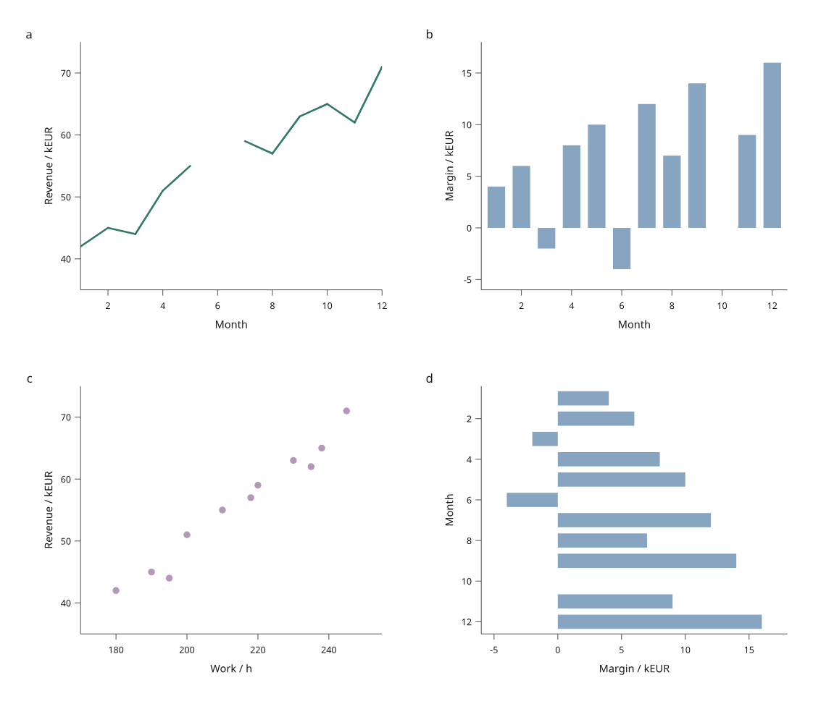

# Linked lines, bars and scatter

The development preview now connects different plot types through the same row
IDs. `BrowserFigure` combines measured scatter, line and bar views, while
`BrowserScatter` keeps the earlier scatter-only entry point. These APIs live in
`inklet.experimental.browser`; they are **not in PyPI 3.1.0**.



[Open the interactive figure](assets/v4/linked-dashboard.html) ·
[Complete Python example](../examples/v4/linked_dashboard.py)

The example uses twelve original simulated months. Panel **a** connects monthly
revenue, **b** shows positive and negative margins, **c** relates work to revenue,
and **d** shows the same margins horizontally with a reversed month axis. June's
missing revenue breaks the line and omits its scatter point. October's zero
margin has no bar, but its row remains selectable from the table and other views.
Captions and descriptions remain outside the artwork.

## Select across different shapes

Click a negative bar in March: the revenue line, scatter point and horizontal
bar identify the same month. Shift-click to add months. Hover shows the chosen
row's values; the table provides exact row identities and keyboard controls.

| Mark | Picking rule | Selection display | Filtering rule |
| --- | --- | --- | --- |
| Scatter point | Nearest eligible center within its radius and pointer tolerance | Orange ring | Hide when its row is filtered |
| Line segment | Nearest eligible segment, then its nearer endpoint row | Highlight incident visible segments once | Both endpoint rows must be visible; never bridge a gap |
| Bar | Inside the rectangle, or within pointer tolerance of its edge | Orange outline | Hide when its row is filtered |

Picking respects each measured plot clip. Bars that overlap at a point use the
later source-painted bar. Equal-distance line/point candidates also prefer later
paint order, with a 1e-10 mm numerical tie tolerance. A segment midpoint selects
the later endpoint; positions within 1e-12 of halfway along the segment count as
a midpoint. Coincident line endpoints form a round dot and select the later row.
Pointer tolerance adds four CSS pixels; selection outlines do not enlarge hit
areas. A line represents connections between observations, not an interpolated
new row.

Line order comes from the input table, with no implicit x sorting. Null x/y
pairs break it. An isolated valid row has no line segment, though it can still
appear in a linked scatter panel or the table. Filtering preserves hidden
selections; it does not reconnect surviving points across removed rows.

## Build and reopen the figure

```sh
python examples/v4/linked_dashboard.py --output out/v4-dashboard
# Open index.html; select, filter, pan or zoom, then Save view.
python examples/v4/linked_dashboard.py --state /path/to/view.json --output out/v4-restored
```

The restored HTML opens with the saved selection, visibility and page viewport
already applied. `figure.svg` reconstructs that same view in Python. The saved
state must match both the table revision and measured scene; invalid state fails
before the example creates output files.

**Download vector SVG** works with SVG, canvas and hybrid display modes. The
canvas option rasterizes the outlined axis frame on screen; all three still
export vector circles, lines and rectangles. Zoom navigates the existing page
without recalculating data domains or ticks. Clicking a tall figure preserves
the page's scroll position when keyboard focus moves to the plot.

## Author mixed views

```python
from pathlib import Path
from inklet.experimental.selection import KeyedTable, SelectionState
from inklet.experimental.browser import BrowserFigure, LineView, BarView

table = KeyedTable("trial", {
    "id": ["a", "b", "c", "d"],
    "step": [1, 2, 3, 4],
    "value": [3, -1, None, 5],
})
figure = BrowserFigure(table, [
    LineView("trend", "step", "value", (1, 4), (-2, 6),
             x_label="Step", y_label="Value", line_width_mm=0.45),
    BarView("values", "step", "value", (0.5, 4.5), (-2, 6),
            x_label="Step", y_label="Value", bar_width=0.7, baseline=0),
], width=190, columns=2)
state = figure.state(SelectionState.for_table(table, selected=["b"]))
Path("linked.html").write_text(figure.to_html(state=state), encoding="utf-8")
Path("linked.svg").write_text(figure.to_svg(state), encoding="utf-8")
```

`BrowserFigure` accepts one to four views; it defaults to at most two columns.
View names must be unique. All axes use explicit finite linear domains, including
reversed domains. Each bar's width is in position-axis data units: x for vertical
bars, y for horizontal bars. Its baseline is in the value-axis units. Rectangle
bounds are normalized after projection, so signed values and reversed axes use
the same drawing and picking geometry. Zero-area bars produce no visible mark.
Line widths and scatter radii are in millimetres.

## Checks and remaining scope

The mixed-geometry regression compares indexed picking with an independent
exhaustive reference for more than 23,000 queries across three backends, filtered
and empty views, normal/reversed domains, and device pixel ratios 1/2. It checks
missing data, coincident line endpoints, overlapping bars, zero-area bars,
nonzero baselines, initial state and deduplicated selection highlights. Generated
browser SVG geometry matches Python for all tested backend/filter states.

A real browser click on a negative bar, followed by zoom, pan, save and Python
reconstruction, preserved the selected row and viewport. Rendering the two
exported SVGs at 150 dpi produced identical pixels for that checked state.
The earlier [scatter timing study](design/browser-backends.md) is historical;
it does not measure the new line/bar workload or establish a universal renderer
threshold.

This preview still uses one immutable table, one mark type per panel, fixed
linear axes and solid colors. It does not yet implement categorical axes,
multiple line groups, curves, stacked bars, brushes, data updates, map regions
or domain rescaling. The next step is region geometry and the regional analysis
workflow, followed by explicit table adapters and updates.
