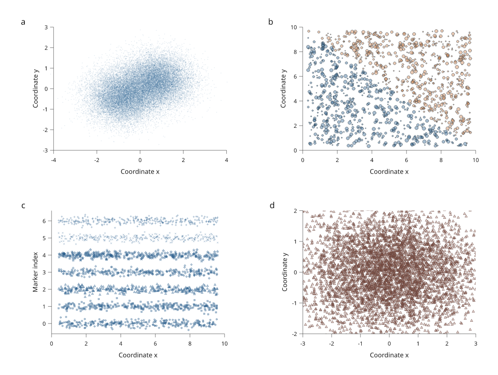

# Packed vector markers

Available in **4.0.0.dev3**. This engine increment stores dense vector
scatter layers as immutable marker records. It reduces Python object overhead
without removing observations or rasterizing the layer.



[Complete recipe](../examples/dense_scatter_review.py) ·
[Separate LaTeX caption](assets/research-preview/dense-scatter-caption.tex) ·
[Raw benchmark results](assets/research-preview/marker-batches.json)

The figure contains **38,300 packed markers in 10 batches**, with 301 compiled
scene nodes including axes and labels. It exports to SVG, PDF and PNG, and
passes the figure diagnostics. The inputs are deterministic simulated data.

## Use ordinary scatter calls

```python
import inklet as i

p = i.panel(80, 50, x=(0, 1), y=(0, 1))
p.scatter([((k * 0.61803398875) % 1, (k * 0.41421356237) % 1)
           for k in range(10_000)],
          size=0.4, color="#245b8a", fill_opacity=0.35)
p.axes(x="Coordinate x", y="Coordinate y")
f = i.figure(width=100)
f.add(p.build())
f.save("cloud.svg", "cloud.pdf")
```

Vector scatter uses packed records automatically at **256 points**. All seven
marker shapes support per-point diameters and colours. Stroke widths, dashes
and corner radii remain in physical units; changing a diameter does not scale
its outline width. Polar scatter uses the same representation.

Small series, explicit `anchor`/`origin` placement, and axes with breaks keep
individual drawing nodes. `raster=True` retains the existing explicit raster
path. Batching does not choose an image representation on your behalf.

## Geometry, paint and clipping

Each record stores two coordinates and a diameter as 64-bit floats, a 32-bit
palette index and a 64-bit original source index: **36 bytes per marker**.
The records are little-endian immutable bytes; the palette and unit marker
shape are shared. Buffers copy mutable input, reject non-finite coordinates
and invalid sizes, and participate in compiled-scene reuse by identity.

Markers remain in source order and paint separately. Overlapping translucent
markers accumulate correctly; series opacity composites the completed series
once. The backends cache at most 128 temporary sized prototypes or palette
styles during a batch export.

`clip()` filters off-region records. Where the existing geometric clip contract
cuts a polygonal marker, the boundary geometry is rewritten in order between
compact runs. Original source indices remain in retained records and in the
`source_index` note of rewritten boundary nodes. `window()` retains the source
buffer and clips the complete paint, including outlines, in each backend.

Layout support and connector traces use the individual marker shapes. Colour
key diagnostics count the palette entries actually used. Text overlap checks
inspect individual footprints rather than treating empty space inside the
cloud's bounding box as occupied.

## Inspection and revisions

```python
from inklet.core import MarkerBatchPrim

scene = i.compile_scene(p.build())
print(scene.stats["marker_instances"])
print(scene.stats["marker_buffer_bytes"])
for node in scene.walk():
    if isinstance(node.prim, MarkerBatchPrim):
        first = next(node.prim.records())
        # (x_mm, y_mm, diameter_mm, palette_index, original_source_index)
        print(first)
```

`marker_instances` counts placed records; `marker_buffer_bytes` counts unique
retained buffers once even if placed repeatedly. Geometry reuse keeps a buffer
when inherited paint or placement changes. Editing the data currently replaces
the complete affected buffer.

**Inspection change:** dense scatter has one drawing handle per batch, instead
of one handle per point. `resolve()` and `flatten()` expose that batch.
Retained SVG marker elements carry `data-source-index`; combine this with the
containing batch node to identify a source record. This is an inspection
contract, not an interactive picking API or a spatial index.

## Measurements

A 10,000-point, single-colour vector layer, using the median of three fresh
Python processes per source revision on Linux/WSL, Python 3.12.3:

| Work or storage | Before batching | Packed markers |
| --- | ---: | ---: |
| Authoring, theme and layout measurement | 0.640 s | 0.0201 s |
| Scene compilation | 0.208 s | 0.000108 s |
| SVG serialization | 0.0552 s | 0.0215 s |
| PDF serialization | 0.232 s | 0.226 s |
| Peak process memory | 113.8 MiB | 44.0 MiB |
| Scene nodes | 20,003 | 4 |
| SVG size | 1,630,518 bytes | 1,190,567 bytes |
| PDF size | 82,692 bytes | 82,719 bytes |

The largest gains are in authoring, compilation and memory. PDF still paints
every marker and has essentially unchanged serialization cost and file size.
The benchmark excludes imports from timings; peak process memory includes
imports, construction and native exports. It does not measure document-wide
layout, diagnostics or viewer rendering.

A separate **million-point construction and compilation** run took 1.89 s
for authoring, used a 36 MB buffer and peaked at 247.5 MiB for the process.
That run deliberately excludes export. It establishes storage and construction
capacity, not interactive or million-point vector-viewer performance.

Reproduce the measurements with [the benchmark tool](../tools/benchmark_batches.py):

```bash
python tools/benchmark_batches.py --count 10000
python tools/benchmark_batches.py --count 1000000 --compile-only
python tools/benchmark_batches.py --source /path/to/previous-checkout
```

## Remaining engine work

The subsequent [compiled-scene viewer](compiled-viewer.md) adds a WebGL2 filled-marker
path with Canvas fallback and native SVG artwork. Indexed picking, partial buffer updates, packed maps
and meshes, and finer document-layout invalidation remain separate stages.
Native vector output still contains one painted element per marker. Trace and
candidate overlap queries scan records; they do not yet use a spatial index.
