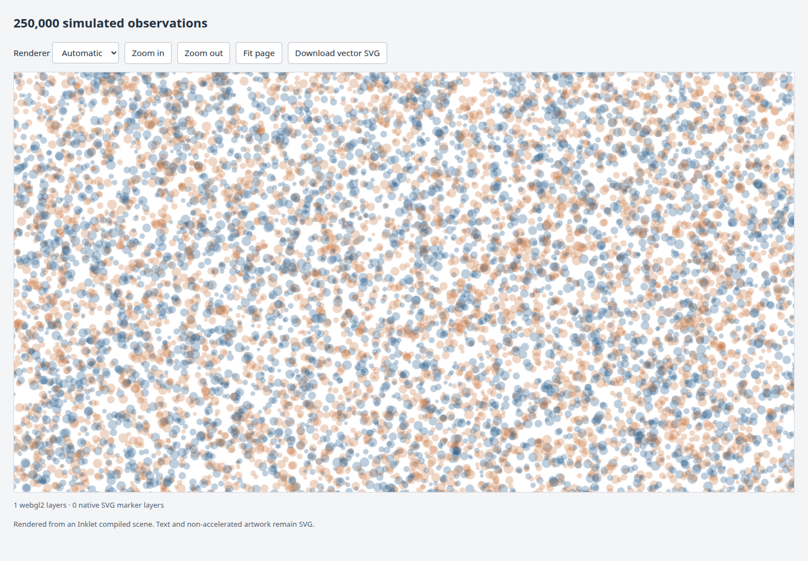

# Spatial marker culling

The [compiled-scene viewer](compiled-viewer.md) now queries individual marker
footprints before repainting a visible region. This reduces Canvas work and GPU
vertex processing when a zoomed view contains a small part of a dense layer.
It applies automatically to eligible packed layers with at least 256 records.



[Create this figure](../tools/make_culling_review.py) ·
[Open the smaller five-panel example](assets/research-preview/compiled-marker-shapes.html)

The figure contains 250,000 independent, uniformly distributed simulated points
with varying marker sizes, alternating colours and fill opacity 0.3. An 8×
window in this example submits about 17,000 markers. Every observation remains
available when panning or exporting vector SVG.

## Geometry, order and resource ownership

A packed grid assigns each marker center to one cell. Each cell stores the
bounding box of its full marker footprints. Queries check those bounds and
then individual footprints, including large markers whose centers lie outside
the query. A one-backing-pixel margin retains antialiasing at the window edge.
A reusable bitmap marks selected source rows. Reading its set bits in row order
produces an exact-size `Uint32Array`, preserving translucent overlaps without a
temporary JavaScript result array or comparison sort. Cells wholly contained in
the query contribute all their rows without rereading individual footprints.
Returned selections own their storage, so subsequent queries cannot mutate an
array retained by another placement or GPU upload.

The index is built lazily, shared by placements with the same source buffer and
unit bounds, and retained across backend changes. Small batches and windows
covering the entire layer bypass it. Its grid has at most 128 × 128 cells;
markers are stored once even when their footprints span many cells. This is a
conservative bounding-box query, not an exact silhouette test or a guarantee
that every selected marker contributes visible ink.

Canvas paints only candidate rows. WebGL2 stores immutable geometry and colours
in a floating-point texture, then receives a compact buffer of candidate row
indices. Integer attributes and texture fetches preserve row identity without
re-uploading the source geometry. This uses the WebGL2
[integer-attribute interface](https://developer.mozilla.org/en-US/docs/Web/API/WebGL2RenderingContext/vertexAttribIPointer).
Native text, clipping, transforms, compositing and vector reconstruction keep
using the compiled scene.

This index supports display culling. Click picking, keyed-row selection and
partial data updates are separate work; the existing [linked-plot viewer](linked-plots.md)
continues to provide its own interaction API.

## Measurements and tradeoffs

The recorded study uses Chrome on an RTX 5090 Laptop GPU through WSL/D3D12,
a 1,392 × 750 pixel stage, DPR 1, and three passes through seven moving 8× windows.
The first query builds a fresh index for each backend. Later measurements
include candidate queries, sorting and any index uploads.

| Measurement | Previous viewer | Indexed viewer |
| --- | ---: | ---: |
| Median Canvas submission, later windows | 88.5 ms | 10.8 ms |
| Median WebGL2 submission, later windows | 0.9 ms | 2.2 ms |
| Median GPU instanced draw, separate timer study | 0.325 ms | 0.042 ms |
| Markers per representative draw | 250,000 | about 17,000 |

Canvas improves substantially. GPU draw work falls by about 7.7×, but CPU
submission becomes slower because it now queries, sorts and uploads indices.
Time through two frame callbacks remains about 33 ms for both WebGL versions;
this does not establish a frame-rate improvement. The first indexed WebGL
window took 98.8 ms versus 81.2 ms previously, including allocation and the new
index build. The first indexed Canvas window took 21.2 ms versus 94.7 ms.

GPU draw time comes from a separate nine-draw study using
[`EXT_disjoint_timer_query_webgl2`](https://registry.khronos.org/webgl/extensions/EXT_disjoint_timer_query_webgl2/),
with asynchronous result polling and rejection of disjoint results. It measures
the instanced draw, excluding candidate computation, uploads, clearing and
compositing. These results describe this workload and machine.

There is an explicit memory cost: GPU source records now use 32 bytes each plus
texture row padding, compared with the previous 28-byte attributes. The GPU
candidate buffer reserves another four bytes per record. For 250,000 markers,
the original shared CPU grid occupied 1,285,160 bytes; the query optimization
adds 31,252 bytes of reusable bitmap storage (1,316,412 bytes total); the GPU row-index capacity is
1,000,000 bytes. Typical windows upload roughly 68 KB of row indices. Original
36-byte packed records and native 64-bit source IDs remain unchanged.

[Before samples](assets/research-preview/viewer-culling-before.json) ·
[After samples](assets/research-preview/viewer-culling-after.json) ·
[GPU timer before](assets/research-preview/viewer-culling-gpu-before.json) ·
[GPU timer after](assets/research-preview/viewer-culling-gpu-after.json)

## Query optimization

The bitmap follow-up specifically reduces CPU query and ordering costs. A
standalone Node study uses deterministic uniform point clouds with varying
marker sizes, five warm-up queries and fifteen measured queries per case.
These measurements call the index directly; they exclude rendering, index
construction and GPU uploads.

| Dataset / query region | Previous median | Bitmap median |
| --- | ---: | ---: |
| 250,000 points / 50 × 50 of a 200 × 200 domain | 0.845 ms | 0.251 ms |
| 1,000,000 points / 50 × 50 | 5.253 ms | 0.629 ms |
| 1,000,000 points / 150 × 150 | 51.099 ms | 3.504 ms |
| 1,000,000 points / 1 × 1 | 0.023 ms | 0.042 ms |

Larger candidate sets benefit most. Tiny queries become slightly slower because
the bitmap is cleared and scanned. Retained bitmap storage is one bit per row,
rounded to a whole 32-bit word: 125 KB for one million points. This replaces
per-query temporary JavaScript result arrays; it does not remove the returned
row-index array. No cache of past queries is retained.

A separate Chrome comparison uses the same 250,000-point moving-window study
as above. Median WebGL submission falls from **3.2 to 1.4 ms** in this run;
Canvas submission changes from **11.7 to 11.05 ms**. These include query work
and rendering submission and are distinct from the Node timings. GPU geometry,
index-upload format and draw work are unchanged. Run-to-run variation means the
small Canvas difference should not be treated as a reliable speedup.

[Standalone before](assets/research-preview/marker-index-before.json) ·
[Standalone after](assets/research-preview/marker-index-after.json) ·
[Browser before](assets/research-preview/marker-index-browser-before.json) ·
[Browser after](assets/research-preview/marker-index-browser-after.json) ·
[Standalone benchmark](../tools/benchmark_marker_index.mjs)

```bash
node tools/benchmark_marker_index.mjs
# Compare a saved earlier index:
git show a6f1885:src/inklet/experimental/scene_viewer/spatial.js > out/previous-index.js
node tools/benchmark_marker_index.mjs out/previous-index.js
```

Regression checks cover source-row bits at 31/32 and 63/64, partial final words,
full and empty queries, and selections retained across subsequent queries.
The existing brute-force and rendered-image comparisons remain unchanged.

## Inspect and reproduce

`inkletScene.report()` now includes:

- `markersSubmitted`: cumulative candidate rows submitted on surface paints.
- `selectionUploadBytes`: cumulative successful GPU row-index uploads, separate
  from immutable source `uploadBytes`.
- `spatialIndexBytes` and `spatialIndexes`: retained CPU index storage and count.
- Per-layer `candidateCount`: rows at the last surface paint; offscreen layers
  retain their last count. SVG layers report `null`.
- Per-layer `selectionCapacityBytes`: current GPU row-index buffer capacity.

Disposal releases the textures, index buffers and shared CPU indexes. Context
loss falls back to Canvas with the same ordered candidate query. Exported SVG
reconstructs all records, including points outside the current display window.

```bash
python tools/make_culling_review.py --count 250000 --output out/culling-review
agent-browser open file://$PWD/out/culling-review/index.html
agent-browser eval --stdin < tools/benchmark_scene_culling.js
agent-browser eval --stdin < tools/benchmark_scene_gpu.js
```

For a reference figure, save the older runtime and pass it to the generator:

```bash
git show 4065309:src/inklet/experimental/scene_viewer/runtime.js > out/reference-runtime.js
python tools/make_culling_review.py --runtime out/reference-runtime.js --output out/culling-before
```

[CPU/submission benchmark](../tools/benchmark_scene_culling.js) ·
[GPU timer script](../tools/benchmark_scene_gpu.js)

Automated checks compare indexed results with a brute-force scan, exercise
large footprints, degenerate grid axes, shared placements and disposal, and
compare WebGL2 and Canvas screenshots with native SVG at DPR 1 and 2. Those
images include varying sizes, overlapping colours, transparency, rotated
clipping and markers centered outside the visible region.
