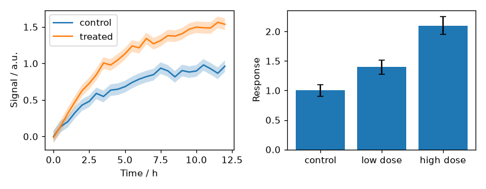
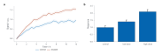

# Bring matplotlib figures

`i.from_matplotlib()` reads what a matplotlib figure plots and redraws it as
Inklet charts. Your plotting code stays as it is; the result gets Inklet's
print-sized type, measured layout, aligned panels and panel letters.

```python
import matplotlib.pyplot as plt
import inklet as i

fig, (left, right) = plt.subplots(1, 2, figsize=(7.2, 2.8))
left.plot(times, signal, label='treated')
left.fill_between(times, lower, upper, alpha=0.25)
right.bar(groups, means, yerr=errors)
...
i.from_matplotlib(fig).save('figure.pdf')
```

The matplotlib figure, as matplotlib draws it:



The same figure object after `i.from_matplotlib(fig)`:



The bridge reads data, not pixels. Every mark is vector output and the
result is an ordinary [chart](quick-charts.md) or layout. You can add marks,
change the preset or check the report like any other chart.

## What carries over

| matplotlib | Inklet |
|---|---|
| `plot` (lines, markers, `markevery`, dashes) | `line` and `scatter` |
| `scatter` (sizes, colours, `c=` with a colormap) | `scatter`, with a colour ramp and bar |
| `bar` / `barh` / `hist` | `bars` |
| `errorbar`, `bar(yerr=)` | `errorbars` with the series' line and markers |
| `fill_between` | `band` |
| `axhline` / `axvline` | `hline` / `vline` |
| `imshow` | `matrix` with a colour bar |
| `bar(color=[...])` | `bars`, one colour per bar |
| `bar(alpha=)`, `plot(mfc='none')`, `scatter(facecolors='none')` | Opacity, hollow markers |
| `errorbar(capsize=)`, `linewidth=` | Error-bar caps, line width |
| `text`, `annotate` (data coordinates) | `text`, `annotate` |
| `fig.colorbar(im, label=)`, `cb.set_label()` | The colour bar's title |
| `set_xticks(ticks, labels)`, `invert_yaxis()`, `grid(True)` | Ticks as placed, inverted axes, gridlines |
| Axis labels, title, log scales, explicit limits, categorical ticks, legend | Chart options |
| A grid of subplots | A layout with panel letters; a colour bar beside a panel keeps the grid |

matplotlib's automatic colour cycle (`C0`, `C1`, ...) maps onto the preset
palette slot by slot, so series that shared a colour still share one. Colours
you set explicitly are kept. Pass `keep_colors=True` to keep the cycle
colours as well.

The width follows the matplotlib figure, snapped to a single (89 mm) or
double (183 mm) column when it is close to one. Pass `width=` to override it,
and `style=` or `palette=` to choose a [preset](presets.md) or
[palette](palettes.md).

## What does not

Nothing is dropped silently. Each property the bridge does not carry is listed
in a `MatplotlibWarning` and on the chart's `skipped` list, so a figure that
loses something says what it lost. The cases:

- **Hatches** on bars and bands are drawn solid.
- **Outlines and fills**: bar and marker edges in their own colour are drawn
  without them, and bars with no fill are drawn in the default colour.
- **Images**: colour images (RGB or RGBA pixels) are not kept. Colour scales
  other than linear, such as `LogNorm`, are drawn linear, and a colour map
  Inklet does not know is drawn as viridis.
- **Markers**: shapes other than circle, square, triangle, diamond, cross and
  plus are drawn as circles. Hollow markers stay hollow.
- **Lines**: `drawstyle="steps"` is drawn as straight segments. Dashed lines
  from `hlines` and `vlines` are drawn solid, and a labelled set of lines in
  several colours loses its label.
- **Text**: rotated text is drawn level. Text placed in axes or figure
  coordinates is not converted, and neither is an annotation whose point is in
  axes coordinates (data coordinates are).
- **Axes**: `set_aspect` is not forced, so panels fill their space. The legend
  title and legend labels given by hand are not kept, since the key uses the
  artists' own labels. Inset axes are not drawn.
- **Twin axes** (`twinx`, `twiny`) are not drawn. The second axes is reported
  and left out, so its lines and bars are missing from the figure.
- **Figure level**: `suptitle`, `fig.text` and figure legends are not drawn.
- **Other artists**: patches other than bars (circles, polygons), contours,
  meshes, quivers, violins and collections that are not a band between two
  curves are reported by name.

Colour bars are recognised and replaced by Inklet colour bars, with the label
they were given as their title.
