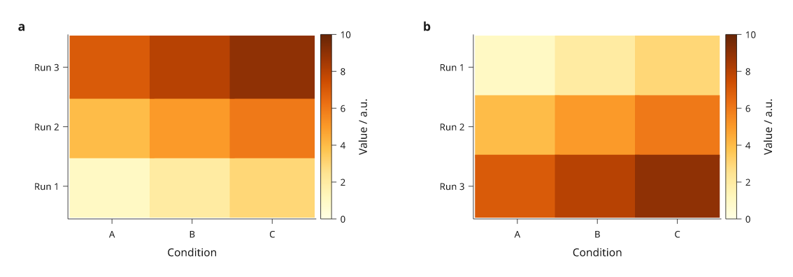
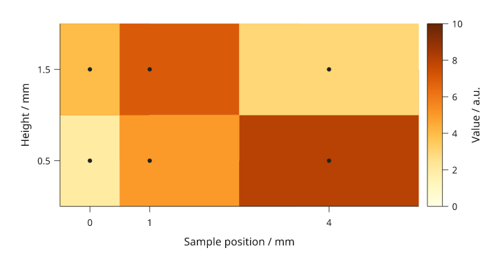
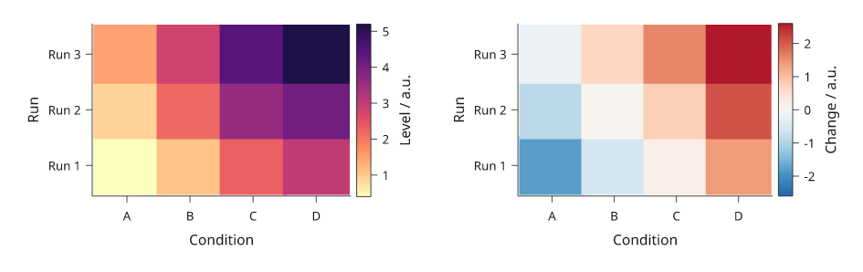
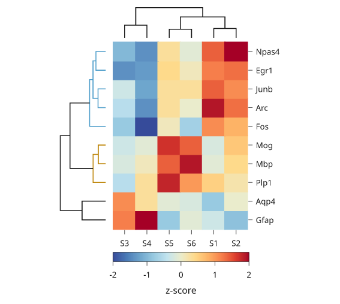
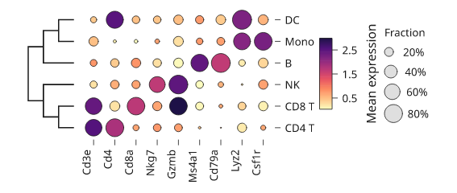

# Matrices and heatmaps

A matrix assigns a colour to each cell. Share the mapping with its colour
key, and state the units. A calibrated image or contour field has additional
coordinate semantics; see the [scientific report](scientific-report.md) and
[contour guide](contours-streamlines.md) for the experimental linked workflows.

All values below are illustrative. Each Python block is a complete example
using core Inklet. PNG previews additionally use the `render` extra; PDF export
of raster matrices needs Pillow (`images` or `render`).

## Heatmaps

A colour key describes the same mapping as the matrix.
`colorbar()` reuses the matrix ramp and scale. Pass explicit row coordinates
to associate each row with its y category. The first category is at the bottom;
the next section shows a top-first display. Missing cells use an explicit colour.

```python
import inklet as i
p = i.plot_spec(x=['A', 'B', 'C', 'D'], y=['Run 1', 'Run 2', 'Run 3'], height=45)
p.matrix([[2, 5, 7, 3], [4, None, 8, 5], [1, 3, 6, 9]],
         x=['A', 'B', 'C', 'D'], y=['Run 1', 'Run 2', 'Run 3'],
         ramp=i.ramp('tol-ylorbr'), scale=i.linear((0, 10)),
         missing='#e8e8e8', raster=False)
p.axes(x='Condition', y='Run')
p.colorbar(label='Value / a.u.')
doc = i.document(width=105)
doc.add('matrix', p)
doc.save('matrix.svg', 'matrix.pdf')
```


*Rendered from the code above. Grey means missing, not zero.*

Keep rows rectangular and supply `missing=` when any value is `None` or NaN.
The colourbar describes the numeric ramp; explain the missing-value colour in
the caption. Use the same ramp and scale for comparable panels instead of
normalizing each matrix independently.

On a panel with a matrix, an axis with no ticks (`ticks=[]`) or hidden ticks
(`labels=False` with `tick_size=0`) draws no spine, since the cells' edge is
already the boundary. The axis name is still drawn. Pass `spine=True` to keep
the line.

## Row order and comparisons

With explicit `y=` coordinates on `matrix()`, rows follow those coordinates
through the panel's y scale. To put the first named row at the top, reverse the
category order on the plot scale and keep the matrix's row coordinates paired
with their values. If you reorder the values themselves, reorder their
coordinates too.

Without `y=` on `matrix()`, row zero starts at the **top** of the plot area and
rows divide the height evenly, independently of the y scale. This differs from
the bottom-first categorical axis. Explicit coordinates avoid a silently
mislabelled heatmap.

```python
import inklet as i

conditions = ['A', 'B', 'C']
runs = ['Run 1', 'Run 2', 'Run 3']
values = [[1, 2, 3], [4, 5, 6], [7, 8, 9]]
shades, colour_scale = i.ramp('tol-ylorbr'), i.linear((0, 10))
doc = i.document(width=180, columns=2, gap=12,
                 share_plot_margins=True).letters()
for column, labels in enumerate((runs, runs[::-1])):
    p = i.plot_spec(x=conditions, y=labels, height=42)
    p.matrix(values, x=conditions, y=runs,
             ramp=shades, scale=colour_scale, raster=False)
    p.axes(x='Condition')
    p.colorbar(label='Value / a.u.')
    doc.add(f'order-{column}', p, row=0, column=column)
doc.save('matrix-order.svg', 'matrix-order.pdf')
```



*a, First y category at the bottom. b, The category scale is reversed; the input
rows and their coordinates stay together. Each named run keeps its values, and
both colourbars use the same 0–10 scale.*

## Numeric sample positions

Without `x=` and `y=` on `matrix()`, cells divide the plot area evenly.
For measurements at uneven numeric positions, pass sample centres explicitly.
Inklet maps those positions through the panel scales and places cell boundaries
halfway between neighbouring displayed samples. The outer cells extend by half
the adjacent gap. A category scale would give every sample an equal-width slot.

```python
import inklet as i

xs, ys = [0, 1, 4], [0.5, 1.5]
p = i.plot_spec(x=(-0.5, 5.5), y=(0, 2), height=42)
p.matrix([[2, 5, 8], [4, 7, 3]], x=xs, y=ys,
         ramp=i.ramp('tol-ylorbr'), scale=i.linear((0, 10)),
         vector='seamless')
p.scatter([(x, y) for y in ys for x in xs], color='#222222', size=1)
p.axes(x='Sample position / mm', y='Height / mm',
       x_options={'ticks': xs}, y_options={'ticks': ys, 'format': '{:.1f}'})
p.colorbar(label='Value / a.u.')
doc = i.document(width=115)
doc.add('samples', p)
doc.save('matrix-samples.svg', 'matrix-samples.pdf')
```



*Dots mark supplied sample centres; the colour between samples represents the
midpoint-based cell assignment. It does not represent extra observations.*

Numeric domains must include the intended cell edges. A singleton row or
column fills that panel dimension unless you provide a two-edge interval for
it. Uniform edge arrays with one more entry than the number of cells are also
accepted. For uneven sampling, supply centres and review the resulting cell
boundaries at the final scale.

## Default colour ramps

Omit `ramp=` to use the built-in ramps. `matrix()` chooses one from the data:

- Values on one side of zero use a sequential ramp: matplotlib's magma,
  reversed, so low values are pale yellow and high values are deep purple.
  Lightness falls at a steady perceived rate, so equal value steps look equal.
  The near-black end is omitted so the darkest cells stay distinct from black
  text and outlines.
- Values on both sides of zero use Paul Tol's blue-white-red diverging ramp
  (`tol-burd`), with white at zero.
- `center=` selects the diverging ramp and puts white at that value.

Without `scale=`, the colour scale spans the data. For a diverging ramp it is
made symmetric about the centre, so equal distances above and below the centre
get equally strong colours. `colorbar()` reads the same scale. An explicit
`scale=` is used as given; if its domain includes zero, the diverging ramp is
chosen. `center=` and `scale=` cannot be combined.

```python
import inklet as i

levels = [[0.4, 1.1, 2.3, 3.0], [0.9, 2.2, 3.6, 4.1], [1.5, 2.8, 4.4, 5.2]]
change = [[-1.8, -0.6, 0.2, 1.4], [-0.9, 0.1, 0.8, 2.1], [-0.2, 0.7, 1.6, 2.6]]
conditions = ['A', 'B', 'C', 'D']
runs = ['Run 1', 'Run 2', 'Run 3']
doc = i.document(width=150, columns=2)
panels = [('level', levels, 'Level / a.u.'), ('change', change, 'Change / a.u.')]
for column, (name, values, key) in enumerate(panels):
    p = i.plot_spec(x=conditions, y=runs, height=30)
    p.matrix(values, x=conditions, y=runs, raster=False)
    p.axes(x='Condition', y='Run')
    p.colorbar(label=key)
    doc.add(name, p, row=0, column=column)
doc.save('matrix-default-ramps.svg', 'matrix-default-ramps.pdf')
```



*Left: sequential default. Right: diverging default with white at zero.*

An explicit `ramp=` keeps its previous meaning. Without `scale=`, the values
are read as fractions of the ramp from 0 to 1. Pass `ramp=i.ramp('magma')` or
`ramp=i.ramp('tol-burd')` to use either palette with your own scale.

## Choose vector or raster cells

These options change the representation of the matrix layer. Axes, labels and
colourbars remain vector artwork.

| Option | Representation | Use and limits |
| --- | --- | --- |
| `raster='auto'` (default) | Individual vector cells up to 2,048 cells; an image above that when displayed spacing is uniform | Uneven spacing stays vector |
| `raster=False` | One vector rectangle per cell | Individual editing; larger files for dense matrices |
| `vector='batched'` | Exact same-colour cells grouped into vector paths | Forces vector output and zero overlap; viewers can show pale antialiasing joins |
| `vector='seamless'` | Batched vector cells with opaque underpaint | Suppresses pale joins while preserving foreground boundaries; requires opaque colours and zero overlap |
| `raster=True` | An embedded image, one pixel per cell by default | Requires uniform displayed spacing; cells cannot be selected individually |

Ordinary vector cells overlap slightly to hide antialiasing seams; set
`overlap=0` for exact abutting rectangles. Batched and seamless modes default
to zero overlap and reject a nonzero override. Raster colour mapping uses
256 ramp levels; batched vector colours are not quantized.

Nearest-cell rendering is the default. Explicit
`raster=True, interpolation='linear', samples=4` interpolates scalar values
before applying the colour ramp. `samples` must be an integer from 2 to 16;
linear interpolation requires uniform displayed spacing and the default
`vector='cells'`. Missing values affect the interpolation footprint instead of
being filled with zero. Use interpolation only when the figure should show a
continuous field, and describe that choice in the caption.

## Dendrograms

`dendrogram` draws the merge tree of a hierarchical clustering as elbows. It
takes a SciPy linkage matrix, one row `[a, b, distance, count]` per merge, or
a nested sequence of leaf names such as `(('a', 'b'), ('c', 'd'))`. A nested
tree has no distances, so each merge is drawn one unit above its tallest
child. `labels=` names the leaves of a linkage in their original order.

With `orient='v'` (default) the leaves run along x and the merge heights on
y. With `orient='h'` the leaves run along y and the heights on x. Reverse the
height domain to grow the tree the other way: `x=(height, 0)` puts the root on
the left and the leaves on the right, next to a heatmap.

To line the tree up with a heatmap, use the same band scale for both. The
band's categories must be in the dendrogram's leaf order, and `dendrogram`
raises an error when they are not. `inklet.plot.dendrogram_layout(tree,
labels=...)` returns that order in `leaves`; reorder the matrix rows and
columns to match. On a y band the first leaf is at the bottom. `row` and
`column` align the panels on their plot areas.

`threshold=` gives each subtree whose merges are all below that height its
own colour and draws the merges above it in the ink.

```python
import inklet as i
from inklet.plot import dendrogram_layout

genes = ['Fos', 'Arc', 'Egr1', 'Npas4', 'Junb', 'Gfap', 'Aqp4', 'Mbp', 'Plp1', 'Mog']
samples = ['S1', 'S2', 'S3', 'S4', 'S5', 'S6']
values = [[1.1, .8, -.8, -2, .1, -.7], [1.9, 1.3, -.5, -1.4, .3, 0],
          [1.2, 1.3, -1.4, -1.3, .4, .1], [1.4, 2, -1, -1.4, .3, -.1],
          [1.4, 1.1, -.3, -1.2, .3, .3], [-.3, -.9, 1.2, 2, -.8, -.1],
          [-.8, 0, 1.1, .3, -.1, -.2], [-.1, .4, -.2, .1, 1.4, 1.9],
          [.5, .2, -.5, .3, 1.8, 1], [-.2, .6, -.3, -.1, 1.7, 1.4]]
# Average-linkage Euclidean clustering of the rows and of the columns.
gene_tree = [[7, 9, .66, 2], [1, 4, .68, 2], [2, 3, .87, 2], [8, 10, 1.12, 3],
             [11, 12, 1.13, 4], [0, 14, 1.43, 5], [5, 6, 2.11, 2],
             [13, 15, 3.19, 8], [16, 17, 4.06, 10]]
sample_tree = [[4, 5, 1.57, 2], [0, 1, 1.7, 2], [2, 3, 2.3, 2], [6, 7, 3.82, 4],
               [8, 9, 5.51, 6]]
rows = list(dendrogram_layout(gene_tree, labels=genes).leaves)
cols = list(dendrogram_layout(sample_tree, labels=samples).leaves)
cells = [[values[genes.index(g)][samples.index(s)] for s in cols] for g in rows]

heat = i.panel(36, 50, x=cols, y=rows)
heat.matrix(cells, x=cols, y=rows, ramp=i.ramp('tol-sunset'),
            scale=i.linear((-2, 2)), raster=False)
heat.axis('bottom', spine=False).axis('right', spine=False)
heat.colorbar(label='z-score', side='bottom')
left = i.panel(12, 50, x=(4.06, 0), y=rows)
left.dendrogram(gene_tree, labels=genes, orient='h', threshold=2)
top = i.panel(36, 8, x=cols, y=(0, 5.51))
top.dendrogram(sample_tree, labels=samples)
fig = i.figure(width=90)
fig.add(i.column([top, i.row([left, heat], gap=1)], gap=1, align='right'))
fig.save('dendrogram.svg', 'dendrogram.pdf')
```



*Illustrative values. The gene tree is coloured below a height of 2, which
gives two coloured groups. The Gfap and Aqp4 merge, at 2.11, is above the
threshold and is drawn in the ink.*

## Dot plots

`dotplot` draws one circle per cell, with two values per cell. The circle's
area shows one value, such as the fraction of cells that express a gene. Its
colour shows another, such as the mean expression. Both axes are band scales,
and `sizes[r][c]` is drawn at the `r`th y category and the `c`th x category.
Colours use the default matrix ramps, or `ramp=`, `scale=` and `center=` as
`matrix` takes them. A cell whose value is `None` or NaN draws nothing.

The largest value gets a circle 0.9 of the band step across by default. Set
`top=` for the value drawn at full size and `diameter=` for its width. Area is
proportional to value, so a circle for half of `top` has half the area.
`colorbar()` explains the colours, and `size_key()` draws reference circles
with their values. `inklet.plot.area_scale(top, diameter)` gives the same
size mapping for a scatter: size the points with it and pass it to
`size_key(source)`.

A dendrogram on the same band categories lines up with the rows, as it does
with a heatmap.

```python
import inklet as i
import random

genes = ['Cd3e', 'Cd4', 'Cd8a', 'Nkg7', 'Gzmb', 'Ms4a1', 'Cd79a', 'Lyz2', 'Csf1r']
markers = {'CD4 T': {'Cd3e', 'Cd4'}, 'CD8 T': {'Cd3e', 'Cd8a', 'Gzmb'},
           'NK': {'Nkg7', 'Gzmb'}, 'B': {'Ms4a1', 'Cd79a'},
           'Mono': {'Lyz2', 'Csf1r'}, 'DC': {'Lyz2', 'Cd4'}}
tree = ((('CD4 T', 'CD8 T'), 'NK'), ('B', ('Mono', 'DC')))
order = list(i.plot.dendrogram_layout(tree).leaves)
rng = random.Random(3)
fraction = [[rng.uniform(.6, .95) if g in markers[c] else rng.uniform(0, .25)
             for g in genes] for c in order]
mean = [[rng.uniform(1.6, 3) if g in markers[c] else rng.uniform(0, .8)
         for g in genes] for c in order]

dots = i.panel(38, 26, x=genes, y=order)
dots.dotplot(fraction, mean)
dots.axis('bottom', rotate=90, spine=False).axis('right', spine=False)
dots.colorbar(label='Mean expression', length=14)
dots.size_key(title='Fraction', format='{:.0%}')
side = i.panel(9, 26, x=(3, 0), y=order)
side.dendrogram(tree, orient='h')
fig = i.figure(width=90)
fig.add(i.row([side, dots], gap=1))
fig.save('dotplot.svg', 'dotplot.pdf')
```



*Illustrative values. Each cluster has two or three marker genes with a high
fraction and a high mean. The cluster tree is a nested sequence, so its merge
heights are levels rather than distances.*

## Next steps

[Compare plot types](plot-types.md), configure [axes and scales](axes-and-scales.md),
or [arrange several panels](layout.md). For exact options, see the [API](api.md).
