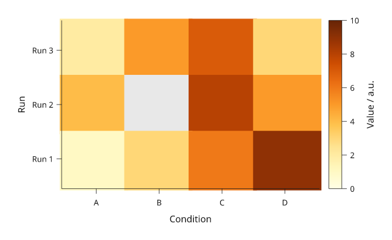

# Matrices and heatmaps

A matrix assigns a colour to each cell. Share the mapping with its colour
key, and state the units. A calibrated image or contour field has additional
coordinate semantics; see the [scientific report](scientific-report.md) and
[contour guide](contours-streamlines.md) for the experimental linked workflows.

All values below are illustrative. Each snippet can be run independently with
core Inklet; PNG preview generation additionally uses the `render` extra.

## Heatmaps

A colour key describes the same mapping as the matrix.
`colorbar()` reuses the matrix ramp and scale. Row zero follows the first y
category, at the bottom; reorder both values and categories for a table-like
top-first display. Missing cells use an explicit colour.

```python
import inklet as i
p = i.plot_spec(x=['A', 'B', 'C', 'D'], y=['Run 1', 'Run 2', 'Run 3'], height=45)
p.matrix([[2, 5, 7, 3], [4, None, 8, 5], [1, 3, 6, 9]],
         ramp=i.ramp('tol-ylorbr'), scale=i.linear((0, 10)),
         missing='#e8e8e8', raster=False)
p.axes(x='Condition', y='Run')
p.colorbar(label='Value / a.u.')
doc = i.document(width=105)
doc.add('matrix', p)
doc.save('matrix.svg', 'matrix.pdf')
```



*Rendered from the code above.*

## Next steps

[Compare plot types](plot-types.md), configure [axes and scales](axes-and-scales.md),
or [arrange several panels](layout.md). For exact options, see the [API](api.md).
