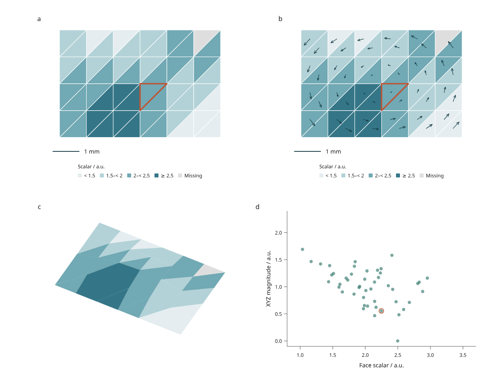

# Linked mesh fields

Compare scalar values, planar vector arrows, a fixed-camera 3D surface and a
linked scatter plot using one immutable triangle mesh with explicit face IDs.

These development APIs live under `inklet.experimental` and are **not included
in PyPI 3.1.0**. This is another bounded scientific workflow in Phase C of the
[4.0 roadmap](roadmap.md).



[Open the interactive report](assets/v4/mesh-fields.html) ·
[Complete Python recipe](../examples/v4/mesh_fields.py) ·
[170 mm version](assets/v4/mesh-fields-170mm.png)

Panel **a** colors each triangle by its supplied scalar. Panel **b** adds arrows
for the XY components of its supplied vector, with 0.22 mm of geometry per vector
unit. Both plans use an equal physical scale and a 1 mm scale bar. The arrowhead
size is capped for readability; the shaft length encodes the XY magnitude.
Panel **c** uses Inklet's native 3D renderer with exact face ordering. Lighting
modulation is disabled so its colors retain the scalar encoding. Panel **d**
compares scalar values with the full XYZ vector magnitude.

This 48-face surface and its values are original simulated MIT material by
Mark Marosi. They are not measured data or simulation results. Values are
constant within each face; there is no interpolation. The missing face remains
gray in the mesh and has no scatter point. A zero vector produces no arrow but
retains its zero magnitude; a purely Z-directed vector also has no XY arrow,
while its full magnitude can be positive.

## Run and interact

```sh
python examples/v4/mesh_fields.py --render --output out/mesh-fields
```

Click a triangle in either plan, a scatter point, or its table selection button.
Both plans and the scatter share stable face IDs. Picking tests actual triangle
interiors. If XY projections overlap, the last face in source order wins,
including shared edges. This is a plan projection, not a 3D visibility query.
Filtering hides triangles, arrows and scatter points without recomputing values.

The **3D panel remains an unpickable reference**, including filtered faces. It
has no browser camera control or selected-face overlay. The browser does not
execute Python or a 3D renderer when switching revisions: alternatives are
compiled beforehand and embedded in the standalone HTML.

| Revision | Change | Expected behavior |
| --- | --- | --- |
| Original | Supplied mesh and face fields | 48 linked faces, one missing scalar/vector and one zero vector |
| Deformed | Double vertex Z coordinates | 3D surface and actual triangle areas change; scalars and vector magnitudes stay fixed |
| Updated | Increase supplied values on the right | Colors, arrow lengths and scatter points update together |
| Removed | Remove face-19 | A plan hole appears; retaining its selection requires explicit missing-ID reconciliation |

## Save, replace and export

```sh
python examples/v4/mesh_fields.py --state /path/to/view.json --render --output out/reopened
python examples/v4/mesh_fields.py --revision deformed --state /path/to/deformed-view.json --render --output out/deformed
python examples/v4/mesh_fields.py --revision removed --rebase-state /path/to/original-view.json --missing drop --render --output out/removed
python examples/v4/mesh_fields.py --json out/mesh-fields/input.json --output out/replacement
```

The source JSON is also the replacement template. This recipe uses mm geometry,
fixed scalar bins and fixed scatter domains; adapt `make_views` for other units
or field ranges. Values outside a scatter domain are clipped, not changed.

Outputs include source geometry and fields, a source digest, measurements,
revision details and saved state. `figure.svg` preserves the saved viewport;
210 mm and 170 mm exports recompile the page while preserving selection and
visibility. `--render` adds PNG and PDF through Chrome/Chromium and Pillow.
Triangles, arrows, scales, 3D facets and text remain vector content in SVG/PDF.
HTML and SVG generation require no optional numerical or mesh import library.

## Supply face fields

```python
from inklet.experimental.fields import MeshField
from inklet.experimental.browser import BrowserFigure, MeshFieldView

field = MeshField(
    vertices=[(0, 0, 0), (2, 0, 0), (0, 2, 0)],
    faces=[(0, 1, 2)],
    ids=["triangle-a"],
    scalars=[1.5],
    vectors=[(3, 4, 12)],
    unit="mm", scalar_unit="a.u.", vector_unit="a.u.",
)
assert field.table().columns["area"] == (2.0,)
assert field.table().columns["magnitude"] == (13.0,)
view = MeshFieldView("plan", field, vectors=True, vector_scale=0.1)
figure = BrowserFigure(field.table(), [view])
```

`MeshField` copies Python lists/tuples into immutable snapshots. It accepts
3–12,288 finite XYZ vertices and 1–4,096 nondegenerate triangles, each with a
unique nonempty string ID, scalar or `None`, and XYZ vector or `None`. Geometry
units are `m`, `mm`, `um` or `nm`; field units are explicit strings. Vertex
indices must be integers in range. Face areas and vector magnitudes must be
finite and representable. Connectivity is supplied, not triangulated or repaired.

`table()` derives arithmetic face centroids, actual 3D triangle areas from cross
products, and full XYZ vector magnitudes. `mesh()` supplies a native Inklet mesh
with one group per face ID for matching colors. Face winding follows the native
renderer convention; the example renders both sides of its open surface.

`MeshFieldView` requires nondegenerate XY projections. Its join checks both the
face ID set and all derived measurement columns, so replacing geometry while
retaining stale areas or centroids fails. Table row reordering and extra columns
are allowed. Revisions use `replace_data(..., views=make_views(new_field))` to
rebuild source-dependent geometry. Old scenes and saved states retain their
original source digest.

To attach values to an imported OBJ, STL or PLY mesh, use the existing native
loader and supply the correspondence **after** loading:

```python
from inklet.three.parse import load

mesh = load("surface.obj")
field = MeshField.from_mesh(
    mesh, ids=face_ids, scalars=face_values, vectors=face_vectors,
    unit="mm", scalar_unit="a.u.", vector_unit="a.u.",
)
```

The three supplied arrays must follow the loaded triangle order. Importers can
triangulate polygons; repair can change topology. Group names are not assumed
to be unique face IDs, and Inklet cannot infer which external measurement
belongs to a newly triangulated or repaired face. Establish that mapping before
calling `from_mesh`. A direction-only vector revision may leave the measurement
table digest unchanged; the source and scene digests still change.

The separate [contour and streamline workflow](contours-streamlines.md) now
supports nodal rectilinear fields. This face-field API still does not interpolate
per-vertex values on arbitrary imported meshes or provide
general mesh topology validation, simulation file adapters or depth-aware 3D
selection. Those remain separate roadmap work.
