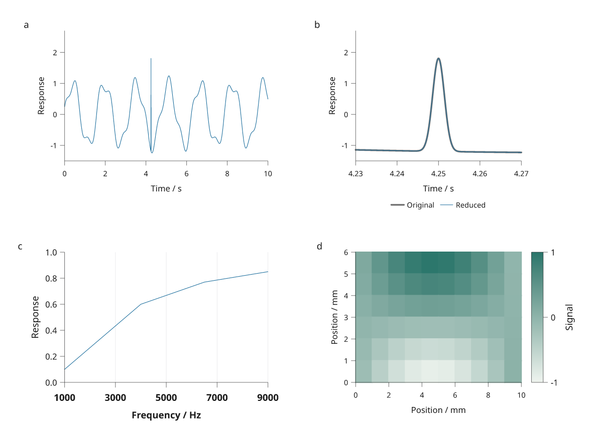

# Migrating to Inklet 3.1

## From 3.0 to 3.1

Existing 3.0 plotting, document, diagram, scene and export APIs remain supported.
Upgrade the core package with `python -m pip install --upgrade inklet`, or use
`python -m pip install --upgrade 'inklet[render]'` for PNG and raster layers.
Python 3.11 remains the minimum supported version.

The default axis rules are lighter, and top/bottom legends choose columns using
measured space. Axis font overrides now affect measurement and tick thinning.
These changes can alter an existing figure's appearance and panel margins.
Review regenerated artwork; preserve intentional choices with explicit stroke,
font and legend-column options rather than assuming pixel-identical defaults.

Dense raster scatter, repeated-image exports and fixed-component layout reuse
are improved. Vector lines keep every authored vertex by default. To opt into
physical-tolerance reduction, pass `simplify='0.02mm'` to a straight, open line;
see [dense data](dense-data.md) for the approximation's limits.

This example uses the new line and measured-axis controls:

```python
import math
import inklet as i

points = [(k / 1000, math.sin(k / 1000)) for k in range(6001)]
p = i.plot_spec(x=(0, 6), y=(-1.1, 1.1), height=35)
p.line(points, simplify='0.02mm', stroke='#176b9b')
p.axis('bottom', label='Time / s', tick_font_size='8pt', label_font_size='9pt')
p.axis('left', label='Response', tick_font_size='8pt', label_font_size='9pt')
doc = i.document(width=100)
doc.add('signal', p)
figure = doc.compile()
figure.save('migration-31.svg', 'migration-31.pdf')
assert not any(d.severity == 'error' for d in figure.diagnostics)
```



The [plot rendering review](plotting-engine.md) shows these controls in a complete
figure, with its source and separate manuscript caption.

NumPy array inputs are now copied when recorded, so later edits to the original
array do not change a pending recipe. Use datasets for live updates or explicitly
replace/configure the input. Component factories receive arrays with their shape
and dtype preserved, but must copy them before performing in-place operations.

`read_csv` adds typed tables without pandas. `module(max_width=...)` wraps
measured labels; document cell alignment supports compass positions such as
`align='nw'`. See [live data](data.md), [diagrams](diagrams.md) and [layout](layout.md).

The package also includes opt-in tools under `inklet.experimental`. Figure
planning, microscopy APIs and their report schemas remain experimental and may
change in later releases. Numerical microscopy requires `inklet[volume]`;
ordinary plots and native 3D do not acquire those optional dependencies.
See [the research preview](research-preview.md) before depending on these APIs.

## From 2.6 to 3.0

Upgrade the core package with `python -m pip install --upgrade inklet`, or include
rendering dependencies with `python -m pip install --upgrade 'inklet[render]'`.
See [installation](installation.md) and the [tested support matrix](compatibility.md).

Existing `figure()`, `document()`, plotting, layout, presets and vector export
APIs remain supported. There is no required rewrite of a 2.6 figure. The main
upgrade change is the **default PNG preview renderer**, now resvg instead of
Chromium. Install the `render` extra for PNG export, masks and rasterization:

```sh
python -m pip install --upgrade 'inklet[render]'
```

`images` supplies Pillow and NumPy, but does not supply resvg. Combine extras
as `inklet[render,images,three]`
when you also need image processing, numeric arrays or additional mesh formats.

| Operation | 2.6 | 3.0 |
| --- | --- | --- |
| Save SVG/PDF | Core package; Pillow for raster images | Same |
| Default review PNG | Chromium plus image support | `inklet[render]`, using resvg |
| Keep the Chromium preview | Default | `png_backend='chromium'` or CLI `--png-backend chromium` |
| Independent PDF preview | Poppler | Poppler; `compare_pdf=False` or `--no-pdf-preview` omits it |
| Review without Chrome or Poppler | Vector-only output | `render` extra plus `compare_pdf=False` |
| Blender for ordinary plots/native 3D | Optional | Still optional |

The existing figure below saves vectors with core dependencies:

```python
import inklet as i

doc = i.document(width=89)
doc.add('response', i.plot_spec(x=(0, 2), y=(0, 4))
        .line([(0, 1), (1, 3), (2, 2)]).axes(x='Time', y='Response'))
figure = doc.compile()
figure.save('response.svg', 'response.pdf')
```

With the `render` extra, the same compiled figure exports a review bundle:

<!-- Requires preview renderers. -->

```python
figure.export('review', compare_pdf=False)
```

Inspect PNG differences when upgrading: resvg rasterizes shaped glyph outlines,
and antialiasing can differ from Chromium even when vector geometry is unchanged.
Keep the same fonts, DPI and page size when comparing. Do not automatically
refresh visual baselines to remove differences. Use `inklet doctor` to inspect
the installed tools.

### New rendering behavior

- Cycles scenes default to an available GPU, with CPU fallback when discovery
  finds none. Use `device='CPU'` for an explicit CPU render. A GPU render error
  does not silently retry on CPU; the selected backend is recorded in provenance.
- Masks and `rasterize()` create explicit image layers in SVG and PDF. Keep
  editable annotations outside those layers. A Blender scene is also an image;
  its Inklet labels, paths and dimensions can remain vector.
- Projection and dimensions use Blender world coordinates. Set `scale=` and
  `unit=` explicitly when converting a dimension to physical units. Overlay
  scene annotations with `align='origin'`.
- Scene caches are derived outputs. Changed workers, assets, settings or Blender
  versions can trigger a fresh render. Keep source assets; do not depend on cache
  filenames or exact pixel equality across GPUs and Blender builds.

The original mesh-to-vector Blender backend requires **4.2 LTS**. Complete
scene rendering and templates are tested with both 4.2 and 4.5 LTS. You can keep
both installations and select one per call with `blender=`. See
[complete scenes](blender-scenes.md) and [render jobs](render-jobs.md).

## Historical package rename

The package and Python import are now `inklet`. The figure API is the same:

```python
import inklet

fig = inklet.figure(width="89mm")
fig.add(inklet.box("Hello, Inklet"))
fig.save("hello.svg")
```

For an existing development checkout, replace the old editable installation:

```bash
uv pip uninstall dgm
uv pip install -e ".[dev]"
```

Update `import dgm` and `from dgm...` to use `inklet`, along with qualified
calls such as `inklet.figure(...)`. There is no `dgm` compatibility package.

| Previous name | Inklet name |
| --- | --- |
| `DGM_CACHE_DIR` | `INKLET_CACHE_DIR` |
| `DGM_BLENDER` | `INKLET_BLENDER` |
| `mouse.dgm.json` asset sidecar | `mouse.inklet.json` |
| Default cache directory `$XDG_CACHE_HOME/dgm/assets` | `$XDG_CACHE_HOME/inklet/assets` |

Rename existing sidecars to keep their anchors and attribution available.
Derived assets rebuild in the new cache directory; `INKLET_CACHE_DIR` can point
to an existing cache if you want to reuse it. When `XDG_CACHE_HOME` is unset,
the cache lives under `~/.cache`.

New SVG and PDF exports identify Inklet in their metadata. SVG background IDs
and generated font names also use the new prefix, so output bytes change even
when a figure's geometry is identical.

## V2 documents

Existing `inklet.figure()`, `panel()`, diagrams and SVG/PDF exports remain
supported. The live document API was introduced in 2.0 and extended in 2.5.

| Existing authoring | Live v2 equivalent |
|---|---|
| `p = inklet.panel(40, 30, ...)` | `p = inklet.plot_spec(40, 30, ...)` |
| `fig.add(p.build())` | `doc.add('panel', p)` |
| Recreate a panel after changing data | Keep data in `Dataset`; call `update()` |
| Add axes before outside keys/insets | Record instructions in any order; compilation resolves phases |
| Manually repeat colours and legend names | Use `Series` or `CategoryEncoding` |
| `fig.save('f.svg', 'f.pdf')` | `doc.save('f.svg', 'f.pdf')` |
| Inspect separate files after every edit | `inklet watch author.py --output out/review` |

V2 documents default to embedded, searchable text in SVG and PDF. Legacy
`Figure.save()` keeps its existing defaults. A compiled document is a snapshot;
a later edit requires `doc.compile()` again and does not mutate prior output.
Use `key=` to name plot instructions you intend to revise. Calling a drawing
method again adds another instruction; `replace(key, ...)` revises one.

For a new project, start with the [quickstart](quickstart.md) and
[authoring model](concepts.md). The [v2.5 guide](v2.5.md) covers nested grids,
measured compositions, publication defaults and revision review.

The new layout preserves typography. It raises `LayoutError` when cells cannot
fit the requested page. Fixed Diagram and Panel inputs retain their original
size. See [the v2 guide](v2.md) for live plot and component definitions.
