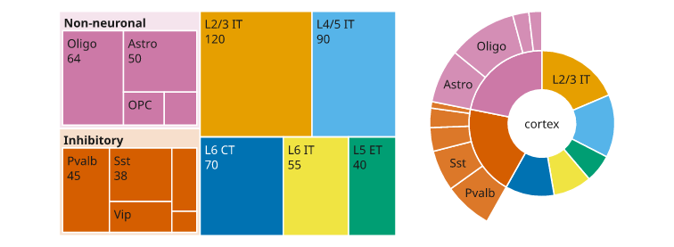
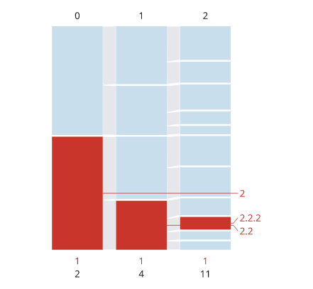
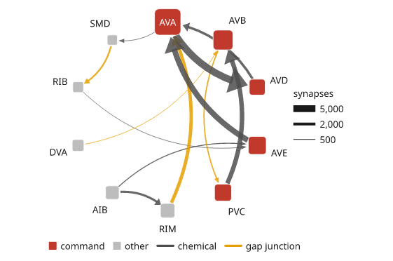
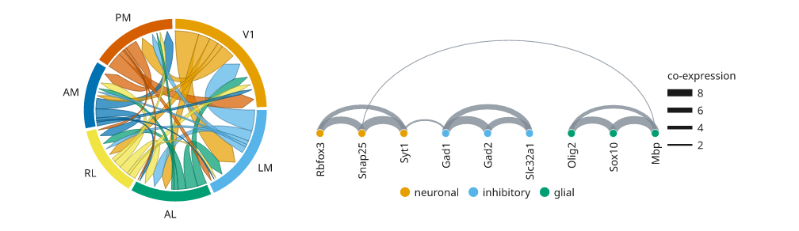

# Networks and hierarchies

These plots fill a panel's plot area with a structure rather than plotting
against its scales: a tree of nested groups, or nodes joined by weighted
edges. Sizes are in millimetres like everything else, and every plot here
leaves a note on its node with the geometry it drew, so a test can check
the picture against the numbers.

## Hierarchy input

`treemap`, `icicle` and `sunburst` take the same hierarchy, in any of three
spellings. `inklet.plot.hierarchy(data)` reads it and returns the tree, so
you can check what a plot will draw.

- A nested mapping: `{"cortex": {"L5": {"ET": 40, "IT": 65}, "L6": 80}}`.
  A leaf is a number; a list of names is leaves of 1 each. Several top-level
  keys share an unnamed root.
- `(name, children)` tuples: `("cortex", [("L5", [("ET", 40), ("IT", 65)]), ("L6", 80)])`.
- A table of `(name, parent[, value])` rows, with `None` as the root's parent.

A group's value is the sum of its children. Nodes are found by name, or by
path (a tuple of names from below the root) when names repeat.

## Treemaps and sunbursts

`treemap` tiles the plot area with one rectangle per leaf, its area
proportional to the value, using the squarified layout so the cells stay
close to square. Groups become pale plates with their name in a header strip.
`sunburst` draws the same tree as rings: the root in the middle, each level
one ring further out, and each node's angle proportional to its value.

Colours follow the branch: each child of the root gets a colour from the
theme's palette, lightened for deeper levels. `colors=` takes a list per
branch, a mapping of names to colours, or one colour. `highlight=` draws the
named nodes in red and everything else pale. Labels are written only where
they fit inside their cell.

```python
import inklet as i

cortex = {'cortex': {'L2/3 IT': 120, 'L4/5 IT': 90, 'L5 ET': 40, 'L6 IT': 55, 'L6 CT': 70,
          'Inhibitory': {'Pvalb': 45, 'Sst': 38, 'Vip': 22, 'Lamp5': 18, 'Sncg': 6},
          'Non-neuronal': {'Astro': 50, 'Oligo': 64, 'OPC': 15, 'Micro': 12}}}
tree = i.panel(60, 40).treemap(cortex, values='{:.0f}')
rings = i.panel(40, 40).sunburst(cortex)
fig = i.figure(width=120)
fig.add(i.row([tree, rings], gap=6))
fig.save('treemap.svg', 'treemap.pdf')
```



*Illustrative counts. The inhibitory and non-neuronal groups are plates with
their children inside; the sunburst's inner ring is the same groups.*

## Clustering levels

`icicle` draws each level of the tree as a row of bars whose widths are the
values. With `gap=` the levels separate and pale fans join each node to its
children, which is the usual way to show how clusters split from one level of
resolution to the next. `orient="h"` (default) runs the levels as columns
from left to right; `"v"` runs them as rows from the top.

`highlight=` marks a lineage in red. `labels="highlight"` names only the
highlighted nodes, or pass the names or paths to label. Long names go
outside the bars with a leader tick. `levels=True` numbers the levels on the
left and `counts=True` writes how many nodes each level has on the right, with
the number of highlighted nodes in red.

```python
import inklet as i

levels = {'1': {'1.1': {'1.1.1': 8, '1.1.2': 5}, '1.2': {'1.2.1': 6, '1.2.2': 3, '1.2.3': 2}},
          '2': {'2.1': {'2.1.1': 7, '2.1.2': 7},
                '2.2': {'2.2.1': 4, '2.2.2': 3, '2.2.3': 2, '2.2.4': 2}}}
lineage = [('2',), ('2', '2.2'), ('2', '2.2', '2.2.2')]
p = i.panel(40, 50)
p.icicle(levels, gap=3, highlight=lineage, labels='highlight', levels=True, counts=True)
fig = i.figure(width=70)
fig.add(p.build())
fig.save('icicle.svg', 'icicle.pdf')
```



*Illustrative clusters. The highlighted lineage is red at every level, and
the counts on the right give the number of clusters and highlighted clusters
per level.*

## Weighted networks

`network` draws nodes and weighted edges. `nodes` is a list of names or a
mapping of name to value; edges are `(source, target)`,
`(source, target, weight)` or `(source, target, weight, category)` rows.

- **Layout.** `layout="circular"` (default) puts the nodes on one ring from
  twelve o'clock, in input order or `order=`, and bows each edge towards the
  centre. `"force"`, `"layered"` and `"tree"` use the solvers of
  `inklet.graph`, stretched to fill the area, with straight edges.
- **Nodes.** A node's area is proportional to its value, with a floor so
  small nodes stay visible. `shape="square"` draws rounded squares. `groups=`
  colours nodes by category, and `legend()` names the groups.
- **Edges.** Width is proportional to weight, from a hairline floor up to
  `width` (1.6 mm). Lighter edges are drawn first. Edge categories get their
  own colours and legend entries. `arrows=True` adds heads, and two opposite
  edges bow to opposite sides.

`width_key()` explains the edge widths with reference lines, and
`size_key()` the node areas. Names are written inside a node when they fit
and outside it otherwise.

```python
import inklet as i

neurons = {'AVA': 60, 'AVB': 34, 'AVD': 22, 'AVE': 28, 'PVC': 25, 'RIM': 18,
           'AIB': 16, 'DVA': 12, 'RIB': 10, 'SMD': 9}
synapses = [('AVA', 'AVD', 5200, 'chemical'), ('AVD', 'AVA', 1800, 'chemical'),
            ('AVE', 'AVA', 4100, 'chemical'), ('AVB', 'PVC', 900, 'gap junction'),
            ('PVC', 'AVB', 3300, 'chemical'), ('RIM', 'AVA', 2500, 'gap junction'),
            ('AIB', 'RIM', 1600, 'chemical'), ('AIB', 'AVE', 700, 'chemical'),
            ('DVA', 'AVB', 450, 'gap junction'), ('RIB', 'AVE', 300, 'chemical'),
            ('SMD', 'RIB', 1200, 'gap junction'), ('AVA', 'SMD', 200, 'chemical')]
command = {n: 'command' for n in ('AVA', 'AVB', 'AVD', 'AVE', 'PVC')}
p = i.panel(55, 55)
p.network(neurons, synapses, shape='square', diameter=6, arrows=True,
          groups={n: command.get(n, 'other') for n in neurons},
          colors={'command': '#c0392b', 'other': '#bdbdbd'},
          edge_colors={'chemical': '#4d4d4d', 'gap junction': '#e69f00'})
p.width_key(title='synapses', values=[5000, 2000, 500], format='{:,.0f}')
p.legend(side='bottom')
fig = i.figure(width=89)
fig.add(p.build())
fig.save('network.svg', 'network.pdf')
```



*Illustrative weights. Command interneurons are red, and the width key reads
edge weight in synapses.*

## Chord and arc diagrams

`chord` puts groups on a ring as arcs proportional to their totals and joins
them with ribbons proportional to the flows. `matrix[i][j]` is the flow from
group i to group j. Undirected (the default), a ribbon is `matrix[i][j]` wide at
i and `matrix[j][i]` wide at j. `directed=True` counts each group's outgoing
and incoming flows and points each ribbon at its target.

`arc_diagram` puts the nodes in a row and draws each edge as a half-ellipse
above it, with the same node and edge encodings as `network`. With
`directed=True`, edges that run right to left hang below the row.

```python
import inklet as i

areas = ['V1', 'LM', 'AL', 'RL', 'AM', 'PM']
flows = [[0, 18, 9, 7, 4, 11], [16, 0, 8, 3, 2, 5], [7, 9, 0, 6, 3, 2],
         [5, 2, 7, 0, 6, 3], [3, 1, 2, 7, 0, 8], [12, 4, 1, 2, 9, 0]]
chords = i.panel(45, 45).chord(flows, areas, directed=True)
genes = ['Rbfox3', 'Snap25', 'Syt1', 'Gad1', 'Gad2', 'Slc32a1', 'Olig2', 'Sox10', 'Mbp']
pairs = [('Rbfox3', 'Snap25', 8), ('Snap25', 'Syt1', 9), ('Rbfox3', 'Syt1', 5),
         ('Gad1', 'Gad2', 9), ('Gad2', 'Slc32a1', 7), ('Gad1', 'Slc32a1', 6),
         ('Olig2', 'Sox10', 8), ('Sox10', 'Mbp', 9), ('Olig2', 'Mbp', 4),
         ('Syt1', 'Gad1', 2), ('Snap25', 'Mbp', 1)]
module = {g: 'neuronal' for g in genes[:3]}
module.update({g: 'inhibitory' for g in genes[3:6]}, **{g: 'glial' for g in genes[6:]})
arcs = i.panel(70, 28).arc_diagram(genes, pairs, groups=module)
arcs.width_key(title='co-expression').legend(side='bottom')
fig = i.figure(width=160)
fig.add(i.row([chords, arcs], gap=8))
fig.save('chord.svg', 'chord.pdf')
```



*Illustrative flows. In the chord diagram each ribbon is coloured by its
source and points at its target.*

## Next steps

[Cluster a matrix](matrices.md#clustered-matrices), compare
[plot types](plot-types.md), or [arrange several panels](layout.md). For
exact options, see the [API](api.md).
